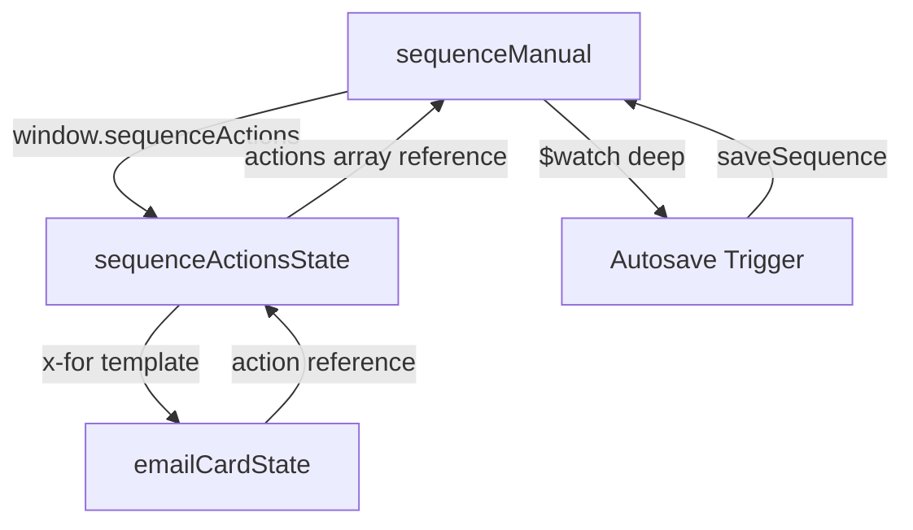

# Data Model des States Alpine.js Concernées

## 1. sequenceManual (Parent State)

**Fichier** : `app/static/js/alpines/sequenceManualState.js`

```javascript
{
  // Données principales de la séquence
  sequence: {
    objectId: String,          // ID de la séquence dans la base de données
    nom: String,               // Nom de la séquence
    description: String,      // Description de la séquence
    isActif: Boolean,          // Statut actif/inactif
    createdAt: String,         // Date de création (ISO format)
    updatedAt: String,         // Date de dernière mise à jour (ISO format)
    actions: Array<Action>,    // Tableau des actions/étapes de la séquence
  },

  // Gestion des impayés
  associatedImpayes: Array<Impaye>,      // Impayés associés à la séquence
  availableImpayes: Array<Impaye>,       // Impayés disponibles pour association
  filteredAvailableImpayes: Array<Impaye>, // Impayés filtrés
  selectedImpayes: Array<String>,         // IDs des impayés sélectionnés

  // Filtres de recherche
  impayeSearchTerm: String,
  selectedPayeurType: String,
  selectedCodePostal: String,

  // Gestion SMTP
  smtpProfiles: Array<SMTPProfile>,
  defaultSmtpProfileId: String,
  defaultSenderEmail: String,

  // États d'interface
  isLoading: Boolean,         // Indicateur de chargement
  isSaving: Boolean,          // Indicateur de sauvegarde en cours
  isAutosaving: Boolean,      // Indicateur d'autosave en cours
  autosaveTimeout: Timeout,   // Timeout pour l'autosave
  autosaveStatus: String,      // Statut de l'autosave
  error: String|null,         // Message d'erreur
  activeTab: String,          // Onglet actif ('actions' ou 'impayes')
  addImpayeDrawerOpen: Boolean,
  deleteConfirmOpen: Boolean,
  itemToDelete: Object|null,  // Élément à supprimer
  deleteType: String|null,    // Type d'élément à supprimer

  // Méthodes principales
  init(),
  loadSequenceData(),
  loadSequence(),
  loadAssociatedImpayes(),
  loadSmtpProfiles(),
  setupAutosave(),
  setupActionsDataSharing(),  // NOUVELLE MÉTHODE
  scheduleAutosave(),
  autosave(),
  saveSequence(),
  onActionDeleted(index),
  getSequenceDataForActions(),
  confirmDelete(),
  cancelDelete(),
  filterAvailableImpayes(),
  toggleSelectAllImpayes(event),
  addSelectedImpayes(),
  removeImpaye(impaye),
  getParseAxios(),
  showNotification(message, type),
  formatDate(dateString),
  formatCurrency(amount)
}
```

### Structure de l'objet Action

```javascript
{
  id: String,                // ID unique (généré avec Date.now())
  type: String,              // Type d'action ('email')
  smtpProfileId: String,     // ID du profil SMTP
  senderEmail: String,       // Email de l'expéditeur
  subject: String,          // Sujet de l'email
  bodyStart: String,         // Contenu principal de l'email
  bodyEnd: String,           // Contenu de fin de l'email
  delay: Number              // Délai en jours avant envoi
}
```

### Structure de l'objet Impaye

```javascript
{
  objectId: String,
  nfacture: String,
  payeur_nom: String,
  montant: Number,
  date: String
}
```

### Structure de l'objet SMTPProfile

```javascript
{
  objectId: String,
  name: String,
  email: String,
  server: String,
  port: String
}
```

## 2. sequenceActionsState (Child State)

**Fichier** : `app/static/js/alpines/sequenceActionsState.js`

```javascript
{
  actions: Array<Action>,    // Référence aux actions du parent (après la correction)
  deleteConfirmOpen: Boolean,
  actionToDelete: Object|null,
  smtpProfiles: Array<SMTPProfile>,

  // Méthodes principales
  init(),
  loadSmtpProfiles(),
  getParseAxios(),
  deleteActionByIndex(index),
  addAction(type),
  getDefaultEmailBody()
}
```

## 3. emailCardState (Component State)

**Fichier** : `app/templates/components/email_card.html` (script intégré)

```javascript
{
  action: Action,            // Référence à l'action spécifique
  index: Number,             // Index de l'action dans le tableau
  deleteConfirmOpen: Boolean,
  toastuiEditor: Object|null,
  syncInterval: Interval|null,

  // Méthodes principales
  init(),
  loadInitialContent(),
  watchActionContent(),
  setupEventListeners(),
  editAction(),
  deleteAction(),
  confirmDelete(),
  cancelDelete(),
  cleanup(),
  getToastUIContent(),
  syncToastUIToState(),
  syncContentBeforeSave()
}
```

## Relations entre les States



## Flux de Données Après la Correction

1. **Initialisation** :
   - `sequenceManual.init()` → Charge les données de la séquence
   - `sequenceManual.setupActionsDataSharing()` → Expose `window.sequenceActions`
   - `sequenceActionsState.init()` → Utilise `window.sequenceActions` comme référence

2. **Modifications UI** :
   - Utilisateur modifie un champ (delay, subject, etc.)
   - Alpine.js met à jour directement l'objet Action via x-model
   - Comme c'est une référence partagée, la modification est visible dans les deux states

3. **Détection des Changements** :
   - Le `$watch` dans `sequenceManual` détecte les modifications (deep: true)
   - Appelle `scheduleAutosave()` pour déclencher l'autosave

4. **Sauvegarde** :
   - `autosave()` est appelé après un délai de 2 secondes
   - Dispatch l'événement `before-save` pour synchroniser le contenu ToastUI
   - Appelle l'API pour sauvegarder `sequence.actions`

## Points Clés de la Solution

1. **Partage de Référence** : Les deux states utilisent la même référence d'objet, donc les modifications sont instantanément visibles
2. **Détection Automatique** : Le `$watch` avec `deep: true` détecte tous les changements, y compris dans les objets imbriqués
3. **Pas de Duplication** : Plus de duplication de données entre parent et enfant
4. **Compatibilité** : La solution fonctionne avec le système d'autosave existant

Cette architecture résout le problème initial tout en maintenant une structure de code propre et maintenable.