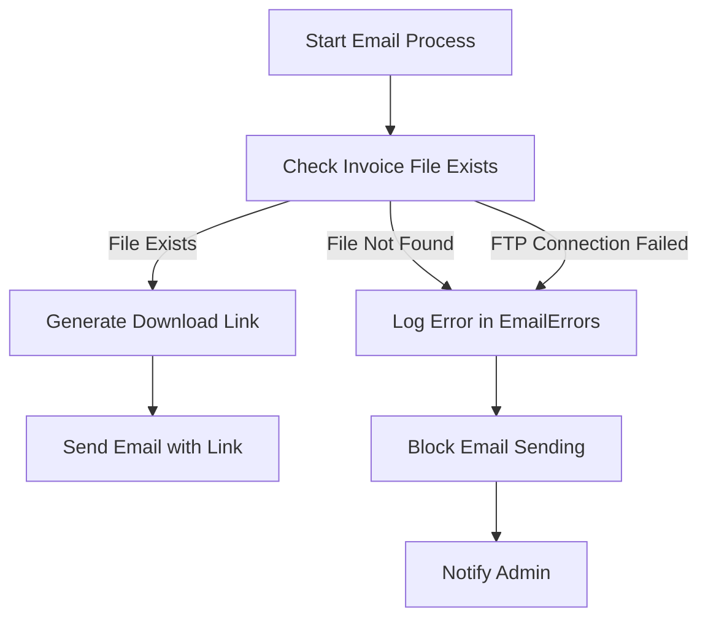

# FTP Invoice File Verification Implementation

## Overview

This implementation fulfills **US002 - Vérification de l'existence des fichiers de facture avant envoi email**. The system now verifies that invoice files exist on the FTP server before generating download links and sending emails, preventing invalid links from being sent to customers.

## Components

### 1. Parse Cloud Functions (`ftp-verification-cloud-code.js`)

#### `checkInvoiceFileExists(invoiceId, fileExtension)`
- **Purpose**: Checks if an invoice file exists on the FTP server
- **Parameters**:
  - `invoiceId` (String): Invoice identifier (e.g., "INV-2023-001")
  - `fileExtension` (String, optional): File extension (default: "pdf")
- **Returns**:
  ```json
  {
    "exists": true,
    "filePath": "/invoices/INV-2023-001.pdf"
  }
  ```
  or
  ```json
  {
    "exists": false,
    "filePath": "/invoices/INV-2023-999.pdf",
    "error": "File not found: ..."
  }
  ```

#### `generateDownloadLink(filePath)`
- **Purpose**: Generates a signed, time-limited download link for an invoice file
- **Parameters**:
  - `filePath` (String): Complete file path on FTP server
- **Returns**:
  ```json
  {
    "downloadLink": "/api/download?token=XYZ&file=INV-2023-001.pdf",
    "expiresAt": "2026-02-18T14:30:00.000Z"
  }
  ```
- **Storage**: Tokens are stored in the `DownloadTokens` Parse class with 24-hour expiration

#### `logEmailError(invoiceId, errorType, details)`
- **Purpose**: Logs email sending errors in Parse Server
- **Parameters**:
  - `invoiceId` (String): Invoice identifier
  - `errorType` (String): Error type (e.g., "FILE_NOT_FOUND", "FTP_CONNECTION_FAILED")
  - `details` (String): Detailed error information
- **Returns**:
  ```json
  {
    "success": true
  }
  ```
- **Storage**: Errors are stored in the `EmailErrors` Parse class

### 2. Parse Classes

#### `EmailErrors`
- **Fields**:
  - `invoiceId` (String): Invoice identifier
  - `errorType` (String): Type of error
  - `details` (String): Error details
  - `timestamp` (Date): When the error occurred
  - `status` (String): Error status (default: "BLOCKED")

#### `DownloadTokens`
- **Fields**:
  - `token` (String): Unique download token
  - `filePath` (String): File path on FTP server
  - `expiresAt` (Date): Token expiration date
  - `isUsed` (Boolean): Whether the token has been used

### 3. Integration Points

The implementation integrates with existing systems:

- **FTP/SFTP Configuration**: Uses existing environment variables (`FTP_HOST`, `FTP_PORT`, `FTP_USERNAME`, `FTP_PASSWORD`)
- **SFTP Client**: Uses the existing `ssh2-sftp-client` library already in the project
- **Parse Server**: Leverages existing Parse Server infrastructure

## Usage Examples

### Checking if a file exists before sending email

```javascript
// In your email sending logic
const fileCheck = await Parse.Cloud.run('checkInvoiceFileExists', {
  invoiceId: 'INV-2023-001',
  fileExtension: 'pdf'
});

if (fileCheck.exists) {
  // File exists, proceed with email sending
  const downloadLink = await Parse.Cloud.run('generateDownloadLink', {
    filePath: fileCheck.filePath
  });
  
  // Include downloadLink in your email
  await sendEmailWithAttachment(downloadLink.downloadLink);
} else {
  // File doesn't exist, log error and block email
  await Parse.Cloud.run('logEmailError', {
    invoiceId: 'INV-2023-001',
    errorType: 'FILE_NOT_FOUND',
    details: fileCheck.error || 'Invoice file not found on FTP server'
  });
  
  console.error('Email blocked: Invoice file not found');
}
```

### Error Handling Flow



## Configuration

### Environment Variables

Ensure these variables are set in your `.env` file:

```env
# FTP/SFTP Configuration
FTP_HOST=your_ftp_server.com
FTP_PORT=2222
FTP_USERNAME=your_username
FTP_PASSWORD=your_password
```

### Parse Server Setup

Run the setup script to create required Parse classes:

```bash
node setup-parse-classes.js
```

## Testing

### Unit Tests

Run the test suite:

```bash
node test-ftp-verification.js
```

### Test Scenarios Covered

1. **File Exists**: Verifies successful file detection
2. **File Not Found**: Verifies proper error handling for missing files
3. **Download Link Generation**: Tests token creation and URL generation
4. **Error Logging**: Verifies error recording in Parse Server

## Security Considerations

1. **FTP Credentials**: Never hardcode credentials, always use environment variables
2. **Download Tokens**: Time-limited (24 hours) and single-use
3. **Error Logging**: Sensitive information should not be logged in detail
4. **Connection Security**: Uses SFTP (SSH File Transfer Protocol) for encrypted transfers

## Performance

- **FTP Connection Pooling**: The SFTP client automatically manages connections
- **Caching**: Consider caching file existence checks for frequently accessed invoices
- **Timeouts**: Configured with reasonable timeouts (20s connection, 10s keepalive)

## Error Handling

The system handles various error scenarios:

- **File Not Found**: Returns `exists: false` with error details
- **FTP Connection Issues**: Returns connection error information
- **Invalid Parameters**: Throws appropriate validation errors
- **Parse Server Errors**: Logs errors and returns failure status

## Deployment

1. **Cloud Code**: Deploy `ftp-verification-cloud-code.js` to your Parse Cloud
2. **Parse Classes**: Run the setup script to create required classes
3. **Environment**: Ensure FTP configuration is properly set
4. **Integration**: Update email sending logic to use the new verification functions

## Monitoring

Monitor these aspects in production:

- **EmailErrors Class**: Track blocked emails and error patterns
- **DownloadTokens Class**: Monitor token usage and expiration
- **FTP Connection Logs**: Watch for connection issues or timeouts
- **Performance Metrics**: Track verification response times

## Future Enhancements

1. **Caching Layer**: Add Redis caching for file existence checks
2. **Retry Logic**: Implement automatic retries for transient FTP errors
3. **Notification System**: Alert admins when files are missing
4. **Analytics**: Track download link usage and success rates
5. **Batch Processing**: Add bulk file verification capabilities

## Troubleshooting

### Common Issues

**FTP Connection Failed**
- Verify FTP credentials in environment variables
- Check network connectivity to FTP server
- Ensure FTP server is running and accessible

**File Not Found Errors**
- Verify the invoice ID and file naming convention
- Check FTP server directory structure
- Confirm files are uploaded to the correct location

**Parse Class Creation Issues**
- Ensure Parse Server is running
- Verify master key permissions
- Check Parse Server logs for detailed errors

## Support

For issues or questions, refer to:
- Project documentation in `guides/`
- Parse Server official documentation
- SFTP client library documentation

## Changelog

### 1.0.0 (Initial Implementation)
- Added `checkInvoiceFileExists` function
- Added `generateDownloadLink` function  
- Added `logEmailError` function
- Created `EmailErrors` and `DownloadTokens` Parse classes
- Added comprehensive testing suite
- Implemented error handling and logging

## License

This implementation follows the existing project's licensing and coding standards.