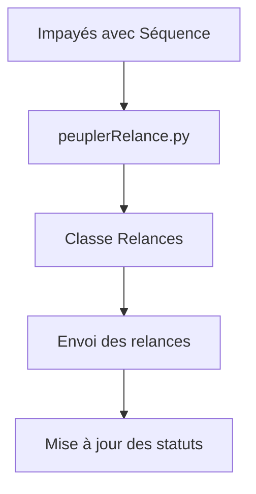

# Module de Génération des Relances

Ce module permet de générer automatiquement des relances pour les impayés qui ont été associés à des séquences automatiques.

## Architecture



## Composants

### 1. Script `peuplerRelance.py`

**Fonctionnalité principale** : Génère automatiquement des relances pour les impayés qui ont une séquence automatique mais pas encore de relances.

**Fonctionnement** :
1. Récupère les impayés avec séquence automatique
2. Pour chaque impayé, vérifie s'il a déjà des relances
3. Récupère les actions de la séquence
4. Pour chaque action, crée une relance avec :
   - Remplacement des variables `[[variable]]` par les valeurs réelles
   - Calcul de la date d'échéance
   - Détermination du destinataire approprié

### 2. Classe Parse `Relances`

**Structure** :
- `impaye` : Pointer vers Impayes
- `sequence` : Pointer vers Sequences  
- `actionId` : Identifiant de l'action dans la séquence
- `type` : Type de relance (email, sms, courrier, appel)
- `statut` : État de la relance (pending, sent, failed, completed)
- `contenu` : Contenu avec variables remplacées
- `sujet` : Sujet pour les emails
- `destinataire` : Email, téléphone ou adresse
- `dateEcheance` : Date d'échéance pour l'envoi
- `dateEnvoi` : Date effective d'envoi
- `essais` : Nombre de tentatives
- `resultat` : Résultat de l'envoi
- `variablesUtilisees` : Variables utilisées pour cette relance

### 3. Intégration avec le Scheduler

Le script est exécuté automatiquement toutes les heures à 00:15 via le scheduler.

## Installation

### 1. Créer la classe Relances dans Parse Server

Exécuter le script de création :
```bash
python create_relances_class.py
```

### 2. Configurer les permissions

Le script `create_relances_class.py` configure automatiquement les permissions par défaut.

### 3. Tester le fonctionnement

Exécuter les tests unitaires :
```bash
python test_peupler_relance.py
```

## Utilisation

### Exécution manuelle via API

```bash
POST /script/peuplerRelances
Content-Type: application/json

{}
```

Réponse attendue :
```json
{
    "status": "success",
    "message": "Relances générées avec succès",
    "timestamp": "2023-12-01T12:00:00.000000"
}
```

### Exécution via le scheduler

Le script est automatiquement exécuté toutes les heures à 00:15 par le scheduler.

## Variables Disponibles

Toutes les colonnes de la classe `Impayes` sont disponibles comme variables dans les templates. Voici quelques exemples couramment utilisés :

- `[[payeur_nom]]` : Nom du payeur
- `[[nfacture]]` : Numéro de facture
- `[[totalttcnet]]` : Montant TTC
- `[[reference]]` : Référence de la facture
- `[[datepiece]]` : Date de la facture
- `[[payeur_email]]` : Email du payeur
- `[[adresse]]` : Adresse complète
- `[[codePostal]]` : Code postal
- `[[ville]]` : Ville

### Variables imbriquées

Le système supporte également les variables imbriquées :
- `[[client.nom]]` : Nom du client
- `[[client.email]]` : Email du client

## Exemples de Templates

### Email de relance
```
Objet : Relance pour votre facture [[nfacture]]

Bonjour [[payeur_nom]],

Votre facture n°[[nfacture]] d'un montant de [[totalttcnet]] €, 
échéance le [[datepiece]], n'a pas encore été réglée.

Veuillez procéder au règlement dans les plus brefs délais.

Cordialement,
Votre service client
```

### SMS de relance
```
Rappel: Facture [[nfacture]] de [[totalttcnet]] € à régler avant le [[datepiece]].
Merci de régulariser votre situation.
```

### Lettre de relance
```
[[payeur_nom]]
[[adresse]]
[[codePostal]] [[ville]]

Objet : Relance pour la facture [[nfacture]]

Madame, Monsieur,

Nous vous rappelons que votre facture n°[[nfacture]] d'un montant de [[totalttcnet]] €,
date du [[datepiece]], n'a pas encore été réglée.

Veuillez trouver ci-joint une copie de votre facture.

Cordialement,
Le service comptabilité
```

## Gestion des Erreurs

Le script gère les erreurs suivantes :

1. **Impayés sans objectId** : Ignorés avec un avertissement
2. **Séquences invalides** : Ignorées avec un avertissement
3. **Actions inactives** : Non traitées
4. **Variables manquantes** : Conservées sous forme `[[variable]]`
5. **Échec de création** : Journalisé avec les détails

## Journalisation

Les logs sont disponibles dans :
- `peupler_relances.log` : Logs d'exécution du script
- `scheduler.log` : Logs du scheduler

## Déploiement

### Pré-requis

- Python 3.8+
- Bibliothèques : `requests`, `python-dotenv`
- Accès à Parse Server avec les droits appropriés

### Configuration

Vérifier que le fichier `.env` contient les variables nécessaires :
```
PARSE_SERVER_URL=https://votre-serveur-parse.com
PARSE_APP_ID=votre_app_id
PARSE_MASTER_KEY=votre_master_key
```

### Mise en production

1. Tester en environnement de développement
2. Exécuter le script de création de la classe
3. Tester avec quelques impayés réels
4. Vérifier les logs
5. Déployer en production

## Maintenance

### Surveillance

- Vérifier régulièrement les logs
- Surveiller le nombre de relances créées
- Vérifier les échecs de création

### Mises à jour

Pour ajouter de nouveaux types de relances :
1. Modifier la méthode `get_destinataire()`
2. Ajouter le nouveau type dans la classe Parse
3. Mettre à jour la documentation

## Support

Pour toute question ou problème, contacter l'équipe technique.

---

*Dernière mise à jour : 2023-12-01*
*Version : 1.0.0*