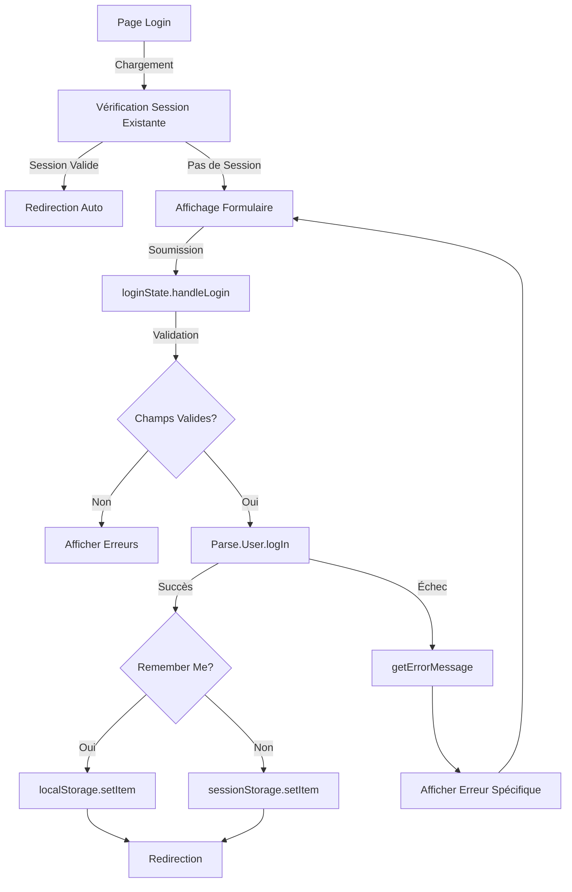
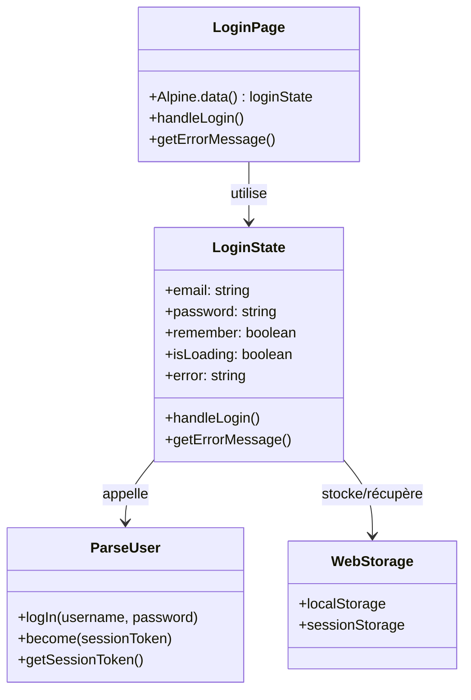
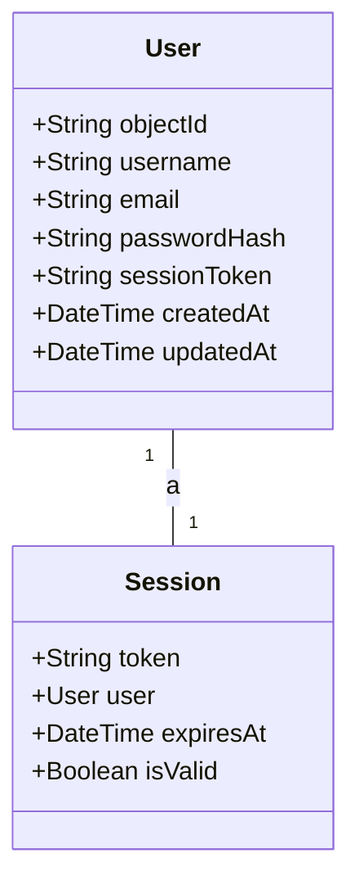
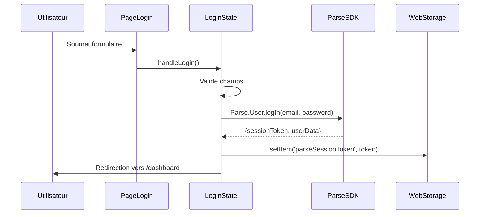
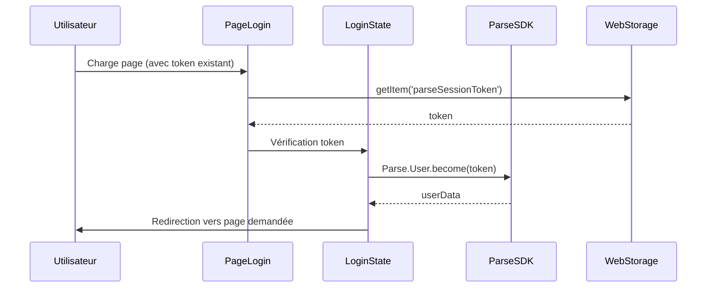

# F01 : Spécifications Techniques - Connexion Utilisateur

## Diagrammes Mermaid

### Flux Principal de Connexion


### Architecture Technique


### Schéma de Données Parse


## Architecture Technique Détaillée

### Couches et Technologies

| Couche          | Technologie          | Responsabilités                          | Fichiers Clés                     |
|-----------------|----------------------|-----------------------------------------|-----------------------------------|
| **Présentation** | Astro                | Rendu HTML statique                      | `src/pages/login.astro`           |
|                 | Tailwind CSS         | Styling et responsive design             | `src/pages/login.astro`           |
| **État**        | Alpine.js            | Gestion de l'état réactif                | `public/js/pages/loginState.js`    |
| **Logique**     | JavaScript           | Validation, gestion d'erreurs           | `public/js/pages/loginState.js`    |
| **Backend**     | Parse SDK            | Authentification, gestion de session    | Parse.User.logIn/become           |
| **Storage**     | Web Storage API      | Persistence de session                   | localStorage/sessionStorage       |
| **Routing**     | Navigateur           | Redirections                            | window.location.href             |

### Flux de Données

#### Connexion Réussie


#### Restauration de Session


## Implémentation Technique

### Fichiers et Responsabilités

#### 1. `src/pages/login.astro`
- Structure HTML de la page
- Intégration des composants visuels
- Import du script Alpine.js
- Layout et styling avec Tailwind CSS

#### 2. `public/js/pages/loginState.js`
- Gestion de l'état du formulaire
- Logique de connexion
- Gestion des erreurs
- Persistence de session
- Restauration automatique

#### 3. `src/layouts/BaseLayout.astro`
- Layout commun pour toutes les pages
- Gestion de l'authentification
- Redirections basées sur l'état de connexion

### Dépendances Externes

```json
{
  "Parse SDK": "^3.0.0",
  "Alpine.js": "^3.10.0",
  "Tailwind CSS": "^3.2.0"
}
```

### Points d'Extension

1. **Authentification Multi-Facteurs**
   - Ajout d'un champ OTP
   - Intégration avec un service SMS/email

2. **Récupération de Mot de Passe**
   - Lien "Mot de passe oublié"
   - Flux de réinitialisation

3. **Authentification Sociale**
   - Boutons Google/Facebook
   - Intégration OAuth

### Sécurité

#### Bonnes Pratiques Implémentées
- Pas de stockage de mot de passe en clair
- Utilisation de tokens de session sécurisés
- Gestion sécurisée des erreurs (pas de fuite d'info)
- Validation côté client ET serveur
- Protection CSRF via Parse SDK

#### Recommandations Supplémentaires
- Implémenter un mécanisme de verrouillage de compte
- Ajouter un CAPTCHA pour prévenir les attaques par force brute
- Configurer une durée d'expiration raisonnable pour les sessions
- Utiliser des tokens JWT avec signature

### Performance

#### Optimisations Implémentées
- Chargement différé des ressources
- Minification du code JavaScript
- Cache des assets statiques
- Restauration de session asynchrone

#### Recommandations Supplémentaires
- Implémenter un mécanisme de pré-chargement
- Utiliser un CDN pour les assets
- Optimiser les requêtes Parse avec caching
- Implémenter du lazy loading pour les composants non critiques

### Accessibilité

#### Fonctionnalités Implémentées
- Navigation clavier complète
- Labels explicites pour tous les champs
- Contrastes de couleurs adaptés
- Messages d'erreur accessibles
- Focus visible pour tous les éléments interactifs

#### Recommandations Supplémentaires
- Ajouter des attributs ARIA pour les éléments dynamiques
- Implémenter un mode sombre/clair
- Ajouter des descriptions pour les icônes
- Tester avec des lecteurs d'écran

## Tests et Validation

### Stratégie de Test

| Type de Test       | Outil          | Couverture                     | Fichiers de Test               |
|--------------------|----------------|-------------------------------|--------------------------------|
| **Unitaire**       | Jest           | Fonctions JavaScript           | `tests/unit/loginState.test.js`|
| **Intégration**    | Playwright     | Flux complet de connexion      | `tests/playwright/F01/login.spec.js`|
| **E2E**           | Playwright     | Scénarios utilisateur complets | `tests/playwright/F01/full-flow.spec.js`|
| **Performance**    | Lighthouse     | Metrics de performance         | `tests/performance/F01.report` |
| **Accessibilité**  | Axe            | Conformité WCAG                | `tests/accessibility/F01.report`|

### Scénarios de Test Critiques

1. **Connexion réussie avec session persistante**
2. **Connexion réussie avec session temporaire**
3. **Connexion échouée (mot de passe incorrect)**
4. **Connexion échouée (email invalide)**
5. **Connexion échouée (réseau indisponible)**
6. **Restauration de session automatique**
7. **Session expirée**
8. **Token de session invalide**
9. **Navigation clavier complète**
10. **Accessibilité du formulaire**

### Métriques de Performance Cibles

| Métrique                | Objectif       | Outil de Mesure      |
|-------------------------|---------------|----------------------|
| Temps de chargement      | < 1s          | Lighthouse           |
| Temps d'interaction      | < 500ms       | Playwright           |
| Temps de restauration    | < 300ms       | Playwright           |
| Score Lighthouse         | > 90          | Lighthouse           |
| Score Accessibilité      | > 95          | Axe                  |

## Documentation et Maintenance

### Fichiers de Documentation

```bash
docs/
├── specs/
│   ├── fonctionnelles/
│   │   └── F01-login.md          # Spécifications fonctionnelles
│   └── techniques/
│       └── F01-login.md          # Spécifications techniques (ce fichier)
└── scenarios/
    └── F01/
        ├── description.md        # Description des micro-étapes
        ├── console/
        │   ├── web.log             # Logs frontend
        │   └── parse.log           # Logs Parse
        └── tests/
            ├── unit/             # Tests unitaires
            └── e2e/              # Tests end-to-end
```

### Journal des Changements

```markdown
## [1.0.0] - 2024-02-20
### Ajouté
- Implémentation initiale de la fonctionnalité de connexion
- Gestion de session basique
- Formulaire de connexion avec validation

### Changé
- Amélioration des messages d'erreur
- Optimisation des performances

### Corrigé
- Bug de restauration de session
- Problème de compatibilité mobile
```

### Guide de Dépannage

#### Problème: La connexion échoue sans message d'erreur
1. Vérifier la connexion réseau
2. Vérifier que Parse Server est accessible
3. Vérifier les logs dans `docs/scenarios/F01/console/parse.log`
4. Tester avec un utilisateur connu valide

#### Problème: La session n'est pas restaurée
1. Vérifier que le token existe dans localStorage
2. Vérifier la validité du token via Parse Dashboard
3. Vérifier les logs de restauration
4. Tester avec un token fraîchement généré

#### Problème: Redirection infinie
1. Vérifier la logique de détection de session
2. Vérifier les tokens dans le storage
3. Supprimer les tokens et réessayer
4. Vérifier les logs frontend

## Priorité et Planification

- **Priorité**: Haute (blocage pour toutes les autres fonctionnalités)
- **Complexité**: Moyenne
- **Effort estimé**: 8-12 heures
- **Dépendances**: Parse SDK initialisé, structure de projet en place
- **Risques**: Problèmes de compatibilité avec Parse SDK, gestion des sessions cross-domain

## Prochaines Étapes

1. Implémenter les micro-étapes selon la méthodologie
2. Créer les tests unitaires et d'intégration
3. Documenter les logs et scénarios
4. Valider avec les critères d'acceptation
5. Préparer pour la revue de code
