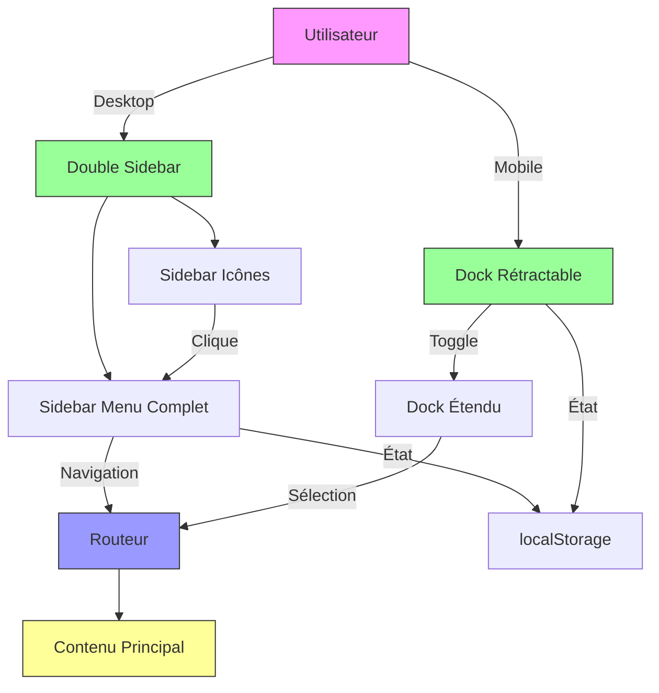

# F02 : Spécifications Techniques - Menu Latéral et Navigation

## Diagrammes Mermaid

### Architecture Globale


### Structure des Composants
```mermaid
classDiagram
    class SideMenu {
        +currentPath: string
        +isImpayesOpen: boolean
        +toggleImpayes()
        +initFromLocalStorage()
        +saveToLocalStorage()
    }
    
    class DockComponent {
        +isCollapsed: boolean
        +isAnimating: boolean
        +toggleDock()
        +initFromLocalStorage()
        +saveToLocalStorage()
    }
    
    class MenuItem {
        +id: string
        +label: string
        +icon: string
        +route: string
        +isActive: boolean
        +subItems: MenuItem[]
    }
    
    class BaseLayout {
        +currentPath: string
        +renderSideMenu()
        +renderDock()
    }
    
    SideMenu "1" -- "1" BaseLayout : utilisé par
    DockComponent "1" -- "1" BaseLayout : utilisé par
    MenuItem "1..*" -- "1" SideMenu : contient
