# F03 : Spécifications Techniques - Composant Dock Mobile

## Diagrammes Mermaid

### Architecture du Composant


### Machine d'États


### Flux de Navigation


## Architecture Technique

### Structure des Fichiers
```bash
src/
└── components/
    └── DockComponent.astro      # Composant principal
    
public/
└── js/
    └── components/
        └── dockState.js         # Logique d'état (si séparée)
```

### Couches et Responsabilités

| Couche          | Technologie      | Responsabilités                          | Fichiers Clés                     |
|-----------------|------------------|-----------------------------------------|-----------------------------------|
| **Présentation** | Astro            | Structure HTML/CSS                       | `DockComponent.astro`             |
| **État**        | Alpine.js        | Gestion de l'état réactif                | `DockComponent.astro` (inline)    |
| **Style**       | Tailwind CSS     | Animations et responsive                 | `DockComponent.astro` (style)     |
| **Icônes**      | Lucide Astro     | Icônes vectorielles                      | Import Lucide                     |
| **Storage**     | Web Storage      | Persistence de l'état                    | localStorage                      |
| **Événements**  | CustomEvent      | Communication avec le layout             | dispatchEvent                     |

### Props et État

#### Props
```typescript
interface DockProps {
  // Aucune prop requise - composant autonome
  // Peut accepter des items personnalisés si nécessaire
}
```

#### État Interne
```typescript
interface DockState {
  isCollapsed: boolean;      // État actuel du dock
  isAnimating: boolean;      // Empêche les interactions pendant l'animation
  items: DockItem[];         // Items de navigation
}
```

#### Item de Navigation
```typescript
interface DockItem {
  id: string;
  label: string;
  icon: LucideIcon;
  route: string;
  isActive: boolean;
}
```

## Implémentation Détaillée

### Cycle de Vie

```mermaid
flowchart TD
    A[Montage] --> B[Charger depuis localStorage]
    B --> C[Initialiser état]
    C --> D[Écouter les événements]
    D --> E[Rendre l'UI]
    
    E --> F[Interaction utilisateur]
    F --> G[Mettre à jour état]
    G --> H[Sauvegarder dans localStorage]
    H --> I[Dispatcher événement]
    I --> J[Mettre à jour UI]
    J --> E
    
    E --> K[Changement de page]
    K --> L[Maintenir état]
    L --> E
```



### Gestion des Animations

#### CSS Keyframes
```css
@keyframes slideUp {
  from { transform: translateY(100%); }
  to { transform: translateY(0); }
}

@keyframes slideDown {
  from { transform: translateY(0); }
  to { transform: translateY(100%); }
}

@keyframes pulse {
  0%, 100% { opacity: 0.5; }
  50% { opacity: 1; }
}
```

#### Classes Tailwind
```html
<div class="transition-all duration-300 ease-in-out"
     x-show="!isCollapsed"
     x-transition:enter="transition ease-out duration-300"
     x-transition:enter-start="opacity-0 transform translate-y-4"
     x-transition:enter-end="opacity-100 transform translate-y-0"
     x-transition:leave="transition ease-in duration-200"
     x-transition:leave-start="opacity-100 transform translate-y-0"
     x-transition:leave-end="opacity-0 transform translate-y-4">
</div>
```

### Intégration avec le Layout

#### Événement Personnalisé
```javascript
// Dans DockComponent
const event = new CustomEvent('dock-state-changed', {
  detail: { 
    collapsed: this.isCollapsed,
    timestamp: new Date().toISOString()
  }
});
document.dispatchEvent(event);
```

#### Écouteur dans BaseLayout
```javascript
// Dans BaseLayout
document.addEventListener('dock-state-changed', (e) => {
  const mainContent = document.querySelector('main');
  if (mainContent) {
    if (e.detail.collapsed) {
      mainContent.classList.add('pb-4');
      mainContent.classList.remove('pb-20');
    } else {
      mainContent.classList.remove('pb-4');
      mainContent.classList.add('pb-20');
    }
  }
});
```

### Accessibilité

#### Attributs ARIA
```html
<button
  @click="toggleDock()"
  @keydown.enter="toggleDock()"
  @keydown.space="toggleDock()"
  :aria-label="isCollapsed ? 'Ouvrir le menu' : 'Fermer le menu'"
  :aria-expanded="!isCollapsed"
  :disabled="isAnimating"
>
</button>
```

#### Navigation Clavier
```javascript
// Gestion des touches
@keydown.window.escape="if (!isCollapsed) isCollapsed = true"
@keydown.window.tab="handleTabNavigation($event)"
```

### Performance

#### Optimisations
- **CSS Containment**: `contain: strict` pour limiter les reflows
- **Will-Change**: `will-change: transform` pour les animations
- **Passive Event Listeners**: Pour le scroll
- **Debounce**: Pour les événements de redimensionnement

#### Bonnes Pratiques
```javascript
// Initialisation différée
x-init="() => {
  setTimeout(() => {
    // Chargement des items
  }, 100);
}"

// Événements passifs
@scroll.window.passive="handleScroll($event)"
```

## Tests et Validation

### Stratégie de Test

| Type           | Outil      | Couverture                     | Exemple de Test                  |
|----------------|------------|-------------------------------|----------------------------------|
| **Unitaire**   | Jest       | Fonctions d'état               | Toggle fonctionne correctement   |
| **Intégration**| Playwright | Interaction avec le layout     | Padding ajusté correctement      |
| **E2E**        | Playwright | Flux utilisateur complet       | Navigation et persistence        |
| **Accessibilité**| Axe      | Conformité WCAG                | Navigation clavier complète      |
| **Performance**| Lighthouse| Metrics de performance         | Temps d'animation < 300ms        |

### Scénarios Critiques

1. **Toggle du dock**
   - Vérifier l'état bascule correctement
   - Vérifier la persistence dans localStorage
   - Vérifier l'événement est dispatché

2. **Navigation entre pages**
   - Vérifier l'état est maintenu
   - Vérifier pas de saut de layout
   - Vérifier le padding est correct

3. **Accessibilité**
   - Vérifier navigation clavier
   - Vérifier tous les éléments ont des labels
   - Vérifier contraste des couleurs

4. **Performance**
   - Vérifier animations à 60 FPS
   - Vérifier pas de reflow layout
   - Vérifier impact mémoire minimal

### Métriques Cibles

| Métrique                | Objectif       |
|-------------------------|---------------|
| Temps d'animation        | < 300ms       |
| FPS                     | 60            |
| Impact mémoire           | < 2MB         |
| Score Lighthouse        | > 90          |
| Score Accessibilité     | > 95          |

## Documentation et Maintenance

### Fichiers de Documentation

```bash
docs/
├── specs/
│   ├── fonctionnelles/
│   │   └── F03-dock.md          # Spécifications fonctionnelles
│   └── techniques/
│       └── F03-dock.md          # Ce fichier
└── scenarios/
    └── F03/
        ├── description.md        # Micro-étapes
        ├── console/
        │   └── dock.log           # Logs spécifiques
        └── tests/
            ├── dock.spec.js      # Tests Playwright
            └── dock.test.js      # Tests unitaires
```

### Journal des Changements

```markdown
## [1.0.0] - 2024-02-20
### Ajouté
- Implémentation initiale du dock mobile
- Gestion d'état basique
- Persistence dans localStorage
- Intégration avec le layout

### Amélioré
- Animations plus fluides
- Accessibilité complète
- Performance optimisée

### Corrigé
- Bug de persistence entre pages
- Problème de padding sur certains devices
```

### Guide de Dépannage

#### Problème: Dock ne se rétracte pas
1. Vérifier l'état dans localStorage
2. Vérifier les logs pour les erreurs
3. Tester le toggle manuel
4. Vérifier les conflits CSS

#### Problème: Padding incorrect
1. Vérifier l'écouteur d'événement
2. Vérifier le sélecteur du contenu principal
3. Tester avec différents états
4. Vérifier les media queries

#### Problème: Animations saccadées
1. Vérifier les performances CPU/GPU
2. Simplifier les animations CSS
3. Utiliser will-change
4. Réduire le nombre d'éléments animés

## Points d'Extension

1. **Gestes tactiles**
   - Glisser pour étendre/rétracter
   - Integration Hammer.js ou équivalent

2. **Personnalisation**
   - Thèmes de couleurs
   - Ordre des items personnalisable

3. **Notifications**
   - Badges sur les items
   - Indicateurs de nouvelles fonctionnalités

4. **Recherche**
   - Barre de recherche intégrée
   - Filtre des items

## Priorité et Planification

- **Priorité**: Moyenne (amélioration UX mobile)
- **Complexité**: Faible à Moyenne
- **Effort estimé**: 6-8 heures
- **Dépendances**: Alpine.js, Tailwind CSS, Lucide Icons
- **Risques**: Conflits CSS, problèmes de performance sur anciens devices

## Prochaines Étapes

1. Implémenter les micro-étapes
2. Créer les tests unitaires et d'intégration
3. Valider les critères d'acceptation
4. Optimiser les performances
5. Documenter pour la revue de code
