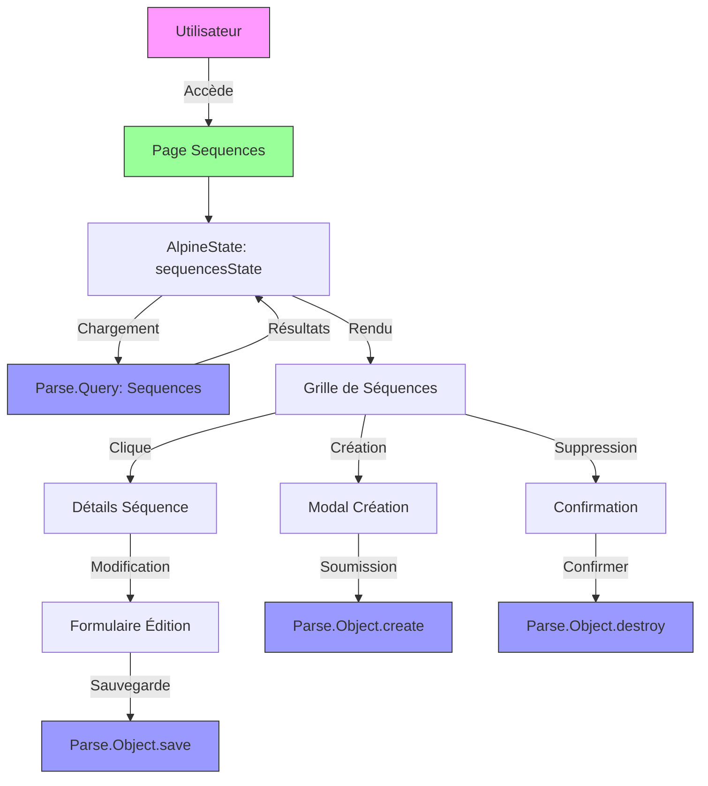
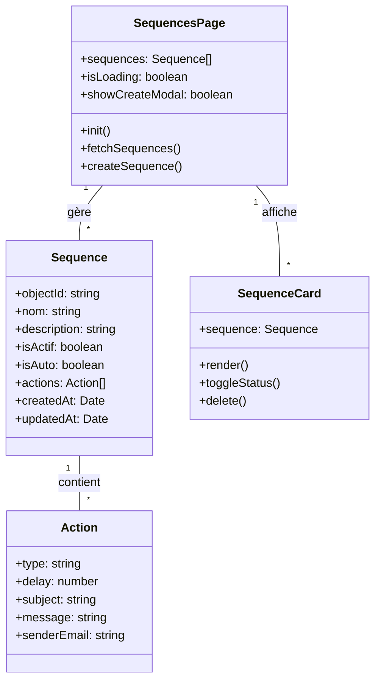
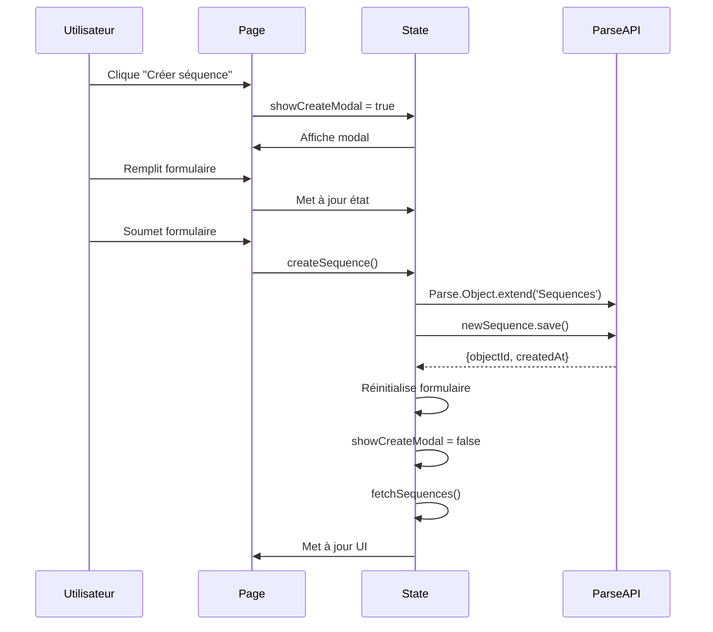
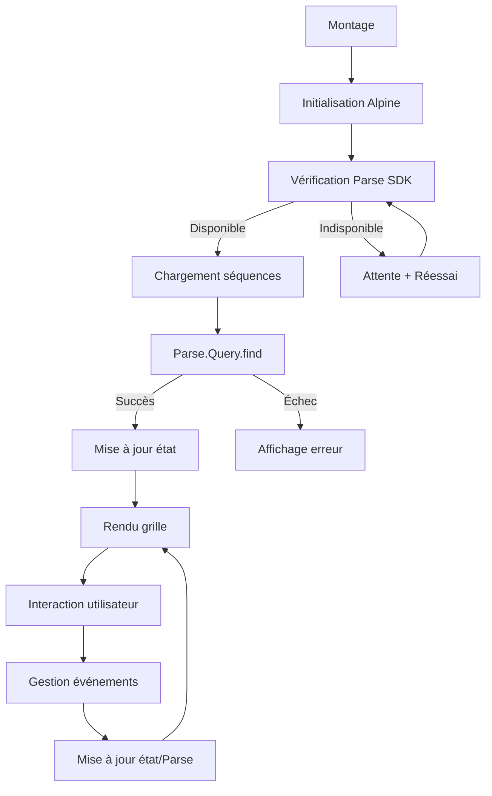

# F04 : Spécifications Techniques - Affichage et Gestion des Séquences

## Diagrammes Mermaid

### Architecture Globale


### Structure des Composants


### Flux de Création


## Architecture Technique

### Couches et Technologies

| Couche          | Technologie      | Responsabilités                          | Fichiers Clés                     |
|-----------------|------------------|-----------------------------------------|-----------------------------------|
| **Présentation** | Astro            | Structure HTML, layout                   | `src/pages/sequences.astro`       |
| **État**        | Alpine.js        | Gestion de l'état réactif                | `public/js/pages/sequencesState.js`|
| **Style**       | Tailwind CSS     | Grille responsive, animations            | `sequences.astro` (style)         |
| **Icônes**      | Lucide Astro     | Icônes vectorielles                      | Import Lucide                     |
| **Backend**     | Parse SDK        | CRUD des séquences                       | Parse.Object/Query                |
| **Routing**     | Navigateur       | Navigation entre pages                   | window.location                  |
| **Notifications**| Alpine.js       | Feedback utilisateur                     | Notifications inline              |

### Structure des Fichiers

```bash
src/
└── pages/
    └── sequences.astro          # Page principale
    
public/
└── js/
    └── pages/
        └── sequencesState.js     # Logique d'état
        
components/
└── sequences/
    ├── SequenceCard.astro       # Carte individuelle
    └── SequenceForm.astro        # Formulaire
```

### Props et État

#### Props de la Page
```typescript
interface SequencesPageProps {
    // Aucune prop - page autonome
}
```

#### État Principal
```typescript
interface SequencesState {
    sequences: Sequence[];
    isLoading: boolean;
    showCreateModal: boolean;
    showDeleteConfirmation: boolean;
    sequenceToDelete: Sequence | null;
    newSequenceName: string;
    newSequenceDescription: string;
    newSequenceType: 'normal' | 'automatique';
    isCreating: boolean;
}
```

#### Structure Sequence
```typescript
interface Sequence {
    objectId: string;
    nom: string;
    description: string;
    isActif: boolean;
    isAuto: boolean;
    actions: SequenceAction[];
    createdAt: Date | string;
    updatedAt: Date | string;
    lastRun: Date | string | null;
}
```

## Implémentation Détaillée

### Cycle de Vie



### Gestion des Séquences

#### Création
```javascript
async createSequence() {
    this.isCreating = true;
    try {
        const Sequences = Parse.Object.extend('Sequences');
        const newSequence = new Sequences();
        
        newSequence.set('nom', this.newSequenceName);
        newSequence.set('description', this.newSequenceDescription);
        newSequence.set('isAuto', this.newSequenceType === 'automatique');
        newSequence.set('isActif', true);
        newSequence.set('actions', []);
        
        await newSequence.save();
        
        // Réinitialisation et rechargement
        this.resetForm();
        await this.fetchSequences();
        
    } catch (error) {
        console.error('Erreur création:', error);
    } finally {
        this.isCreating = false;
    }
}
```

#### Suppression
```javascript
async deleteSequence() {
    if (!this.sequenceToDelete) return;
    
    try {
        const Sequences = Parse.Object.extend('Sequences');
        const sequenceToDelete = new Sequences();
        sequenceToDelete.id = this.sequenceToDelete.objectId;
        
        await sequenceToDelete.destroy();
        
        // Mise à jour locale
        this.sequences = this.sequences.filter(
            seq => seq.objectId !== this.sequenceToDelete.objectId
        );
        
        this.cancelDelete();
        
    } catch (error) {
        console.error('Erreur suppression:', error);
        this.cancelDelete();
    }
}
```

### Optimisations de Performance

#### Chargement Différé
```javascript
// Dans le template
<div x-show="!isLoading && sequences.length > 0">
    <!-- Grille complète -->
</div>

<div x-show="isLoading">
    <!-- État de chargement -->
</div>
```

#### Virtual Scrolling (Futur)
```javascript
// Pour les grandes listes
<div x-data="{
    visibleItems: 20,
    loadMore() {
        this.visibleItems += 20;
    }
}" @scroll.window="checkScroll()">
</div>
```

### Accessibilité

#### Navigation Clavier
```html
<!-- Bouton accessible -->
<button
    @click="createSequence()"
    @keydown.enter="createSequence()"
    @keydown.space="createSequence()"
    :disabled="isCreating"
    aria-label="Créer une nouvelle séquence"
    aria-busy="isCreating">
    <span x-show="!isCreating">Créer</span>
    <span x-show="isCreating">Chargement...</span>
</button>
```

#### ARIA Attributes
```html
<!-- Modal accessible -->
<div
    x-show="showCreateModal"
    x-trap="showCreateModal"
    role="dialog"
    aria-modal="true"
    aria-labelledby="create-sequence-title"
    @click.away="showCreateModal = false">
    <h2 id="create-sequence-title">Créer une séquence</h2>
    <!-- Contenu -->
</div>
```

### Gestion des Erreurs

#### Erreurs Parse
```javascript
getErrorMessage(error) {
    const errorMessages = {
        101: 'Non autorisé',
        119: 'Token invalide',
        120: 'Token expiré',
        139: 'Connexion requise',
        default: 'Erreur inconnue'
    };
    
    return errorMessages[error.code] || errorMessages.default;
}
```

#### Fallback UI
```html
<div x-show="error">
    <div class="bg-red-50 border-l-4 border-red-400 p-4">
        <div class="flex">
            <AlertTriangle class="w-5 h-5 text-red-400" />
            <div class="ml-3">
                <p class="text-sm text-red-700" x-text="error"></p>
            </div>
        </div>
    </div>
</div>
```

## Tests et Validation

### Stratégie de Test

| Type           | Outil      | Couverture                     | Exemples                          |
|----------------|------------|-------------------------------|-----------------------------------|
| **Unitaire**   | Jest       | Fonctions d'état               | createSequence, deleteSequence    |
| **Intégration**| Playwright | Interaction avec Parse         | Création et affichage            |
| **E2E**        | Playwright | Flux utilisateur complet       | Création → Liste → Détails       |
| **Performance**| Lighthouse| Metrics de performance         | Temps de chargement, FPS          |
| **Accessibilité**| Axe      | Conformité WCAG                | Navigation clavier, contraste     |

### Scénarios Critiques

1. **Création de séquence**
   - Vérifier validation des champs
   - Vérifier sauvegarde Parse
   - Vérifier mise à jour de la liste

2. **Suppression de séquence**
   - Vérifier confirmation
   - Vérifier suppression Parse
   - Vérifier mise à jour UI

3. **Chargement initial**
   - Vérifier état de chargement
   - Vérifier affichage correct
   - Vérifier gestion des erreurs

4. **Navigation**
   - Vérifier liens vers détails
   - Vérifier retour à la liste
   - Vérifier URL correctes

### Métriques Cibles

| Métrique                | Objectif       |
|-------------------------|---------------|
| Temps de chargement      | < 1s          |
| Création séquence       | < 500ms       |
| Suppression séquence     | < 300ms       |
| Score Lighthouse        | > 90          |
| Score Accessibilité     | > 95          |

## Documentation et Maintenance

### Fichiers de Documentation

```bash
docs/
├── specs/
│   ├── fonctionnelles/
│   │   └── F04-sequences-display.md  # Spécifications fonctionnelles
│   └── techniques/
│       └── F04-sequences-display.md  # Ce fichier
└── scenarios/
    └── F04/
        ├── description.md        # Micro-étapes
        ├── console/
        │   ├── web.log           # Logs frontend
        │   └── parse.log         # Logs Parse
        └── tests/
            ├── creation.spec.js  # Tests création
            ├── deletion.spec.js  # Tests suppression
            └── listing.spec.js   # Tests affichage
```

### Journal des Changements

```markdown
## [1.0.0] - 2024-02-20
### Ajouté
- Page de liste des séquences
- Fonctionnalités CRUD basiques
- Grille responsive
- Modal de création

### Amélioré
- Performances de chargement
- Accessibilité complète
- Gestion des erreurs

### Corrigé
- Bug d'affichage des séquences vides
- Problème de synchronisation
```

### Guide de Dépannage

#### Problème: Séquences non affichées
1. Vérifier la connexion Parse
2. Vérifier les logs Parse
3. Tester avec des données mock
4. Vérifier les permissions

#### Problème: Création échoue
1. Vérifier la validation
2. Vérifier les logs d'erreur
3. Tester l'API Parse directement
4. Vérifier les champs obligatoires

#### Problème: Performances lentes
1. Vérifier la taille des données
2. Optimiser les requêtes Parse
3. Implémenter le chargement différé
4. Vérifier les animations

## Points d'Extension

1. **Import/Export**
   - Format JSON/CSV
   - Templates prédéfinis

2. **Collaboration**
   - Partage de séquences
   - Commentaires

3. **Analytique**
   - Statistiques d'utilisation
   - Taux de succès

4. **Automatisation**
   - Déclenchement automatique
   - Intégration AI

## Priorité et Planification

- **Priorité**: Haute (fonctionnalité core)
- **Complexité**: Moyenne à Élevée
- **Effort estimé**: 20-24 heures
- **Dépendances**: Parse SDK, Alpine.js, Tailwind CSS
- **Risques**: Complexité des requêtes Parse, synchronisation état

## Prochaines Étapes

1. Implémenter les micro-étapes
2. Créer les tests unitaires et d'intégration
3. Valider les critères d'acceptation
4. Optimiser les performances
5. Documenter pour la revue de code
