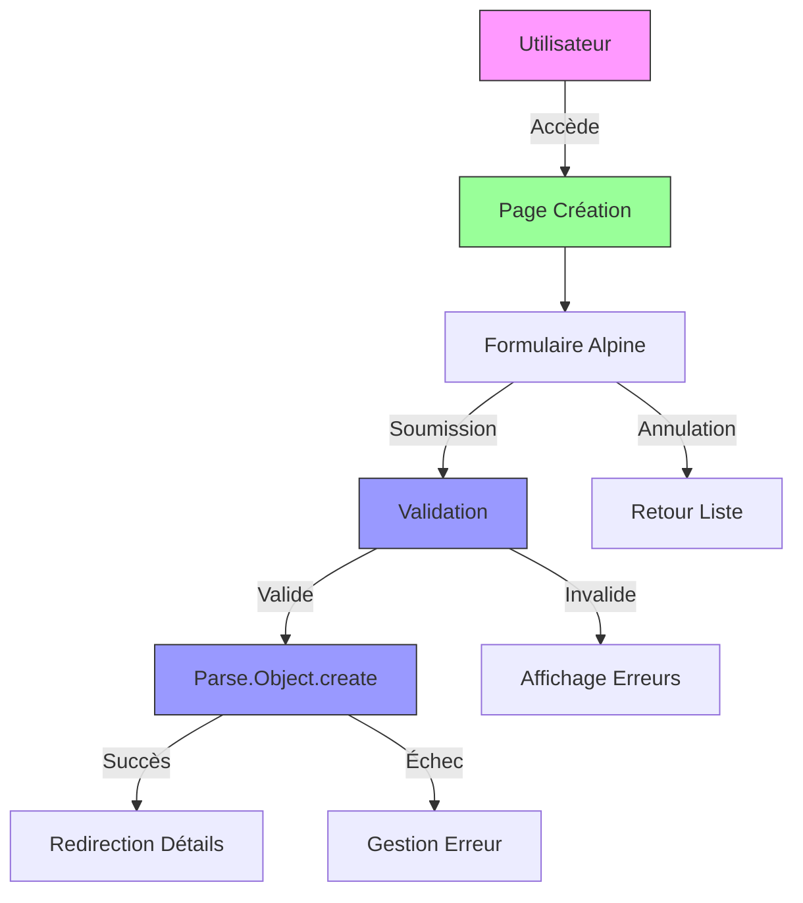
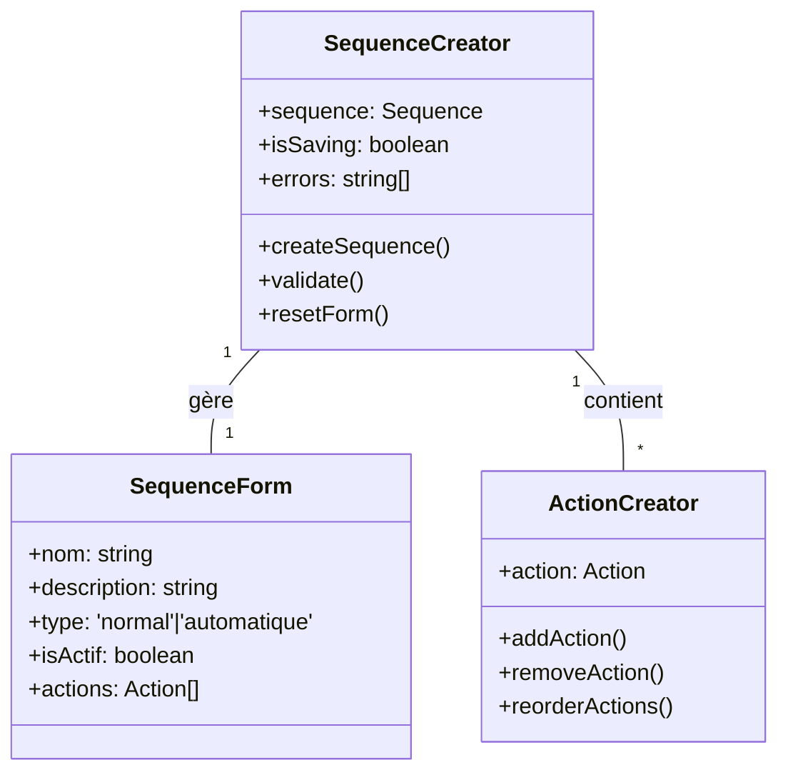
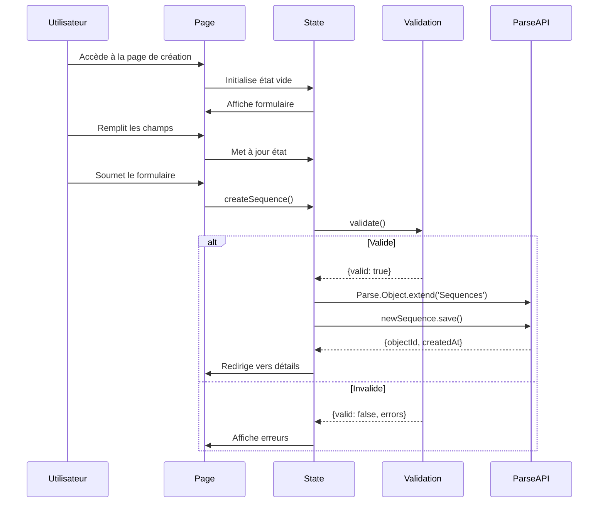
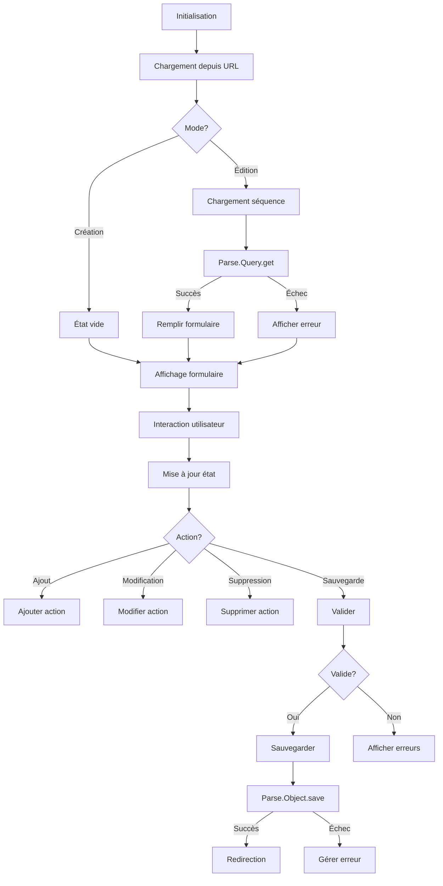

# F05 : Spécifications Techniques - Création de Séquences de Relance

## Diagrammes Mermaid

### Architecture Globale


### Structure des Composants


### Flux de Création


## Architecture Technique

### Couches et Technologies

| Couche          | Technologie      | Responsabilités                          | Fichiers Clés                     |
|-----------------|------------------|-----------------------------------------|-----------------------------------|
| **Présentation** | Astro            | Structure HTML, layout                   | `sequence-detail.astro`           |
| **État**        | Alpine.js        | Gestion de l'état réactif                | Inline dans le composant          |
| **Validation**  | JavaScript       | Validation des données                   | Fonctions dédiées                |
| **Backend**     | Parse SDK        | Création et sauvegarde                   | Parse.Object.create/save          |
| **Routing**     | Navigateur       | Navigation                              | window.location                  |
| **Notifications**| Alpine.js       | Feedback utilisateur                     | Notifications inline              |

### Structure des Fichiers

```bash
src/
└── pages/
    └── sequence-detail.astro      # Page de création/détails
    
public/
└── js/
    └── pages/
        └── sequenceDetailState.js  # Logique d'état complète
```

### Props et État

#### Props de la Page
```typescript
interface SequenceDetailProps {
    sequenceId?: string  // Pour l'édition
}
```

#### État de Création
```typescript
interface SequenceCreationState {
    // Informations de base
    nom: string;
    description: string;
    type: 'normal' | 'automatique';
    isActif: boolean;
    
    // Actions
    actions: SequenceAction[];
    newAction: Partial<SequenceAction>;
    editingAction: Partial<SequenceAction> | null;
    
    // État UI
    isSaving: boolean;
    errors: Record<string, string>;
    showSuccess: boolean;
    
    // Méthodes
    validate(): boolean;
    createSequence(): Promise<void>;
    addAction(): void;
    updateAction(index: number): void;
    removeAction(index: number): void;
}
```

#### Structure Action
```typescript
interface SequenceAction {
    type: 'email' | 'sms' | 'notification';
    delay: number;  // Jours après le début
    subject: string;
    message: string;
    sender: string;
    template?: string;
    isMultipleImpayes: boolean;
}
```

## Implémentation Détaillée

### Cycle de Vie



### Validation

#### Règles de Validation
```javascript
validate() {
    const errors = {};
    
    // Nom requis
    if (!this.nom || this.nom.trim().length < 3) {
        errors.nom = 'Le nom doit faire au moins 3 caractères';
    }
    
    // Type requis
    if (!this.type) {
        errors.type = 'Le type est obligatoire';
    }
    
    // Actions valides
    if (this.actions.length === 0) {
        errors.actions = 'Au moins une action est requise';
    } else {
        this.actions.forEach((action, index) => {
            if (!action.subject || action.subject.length < 5) {
                errors[`actions.${index}.subject`] = 'Sujet trop court';
            }
            if (!action.message || action.message.length < 10) {
                errors[`actions.${index}.message`] = 'Message trop court';
            }
        });
    }
    
    this.errors = errors;
    return Object.keys(errors).length === 0;
}
```

### Création/Sauvegarde

#### Nouvelle Séquence
```javascript
async createSequence() {
    if (!this.validate()) return;
    
    this.isSaving = true;
    try {
        const Sequences = Parse.Object.extend('Sequences');
        const newSequence = new Sequences();
        
        // Informations de base
        newSequence.set('nom', this.nom);
        newSequence.set('description', this.description);
        newSequence.set('type', this.type);
        newSequence.set('isActif', this.isActif);
        
        // Actions
        newSequence.set('actions', this.actions.map(a => ({
            type: a.type,
            delay: a.delay,
            subject: a.subject,
            message: a.message,
            sender: a.sender,
            isMultipleImpayes: a.isMultipleImpayes
        })));
        
        await newSequence.save();
        
        // Redirection vers les détails
        window.location.href = `/sequence-detail?id=${newSequence.id}`;
        
    } catch (error) {
        console.error('Erreur création:', error);
        this.errors.general = 'Erreur lors de la sauvegarde';
    } finally {
        this.isSaving = false;
    }
}
```

### Gestion des Actions

#### Ajout d'Action
```javascript
addAction() {
    // Validation basique
    if (!this.newAction.subject || !this.newAction.message) {
        this.errors.newAction = 'Sujet et message requis';
        return;
    }
    
    // Ajout à la liste
    this.actions.push({
        type: this.newAction.type || 'email',
        delay: this.newAction.delay || 0,
        subject: this.newAction.subject,
        message: this.newAction.message,
        sender: this.newAction.sender || 'default@example.com',
        isMultipleImpayes: this.newAction.isMultipleImpayes || false
    });
    
    // Réinitialisation
    this.newAction = {
        type: 'email',
        delay: 0,
        subject: '',
        message: '',
        sender: 'default@example.com',
        isMultipleImpayes: false
    };
    
    // Tri par délai
    this.actions.sort((a, b) => a.delay - b.delay);
}
```

#### Réorganisation
```javascript
reorderActions(oldIndex, newIndex) {
    // Déplacement dans le tableau
    const [moved] = this.actions.splice(oldIndex, 1);
    this.actions.splice(newIndex, 0, moved);
    
    // Mise à jour des délais si nécessaire
    this.actions.forEach((action, index) => {
        // Logique de réajustement des délais
    });
}
```

### Optimisations

#### Performance
```javascript
// Chargement différé des templates
x-init="() => {
    setTimeout(() => {
        // Chargement des données supplémentaires
    }, 100);
}"

// Mémoization des calculs
get sortedActions() {
    return [...this.actions].sort((a, b) => a.delay - b.delay);
}
```

#### Accessibilité
```html
<!-- Champ accessible -->
<div>
    <label for="sequence-name" class="block text-sm font-medium">Nom</label>
    <input
        type="text"
        id="sequence-name"
        x-model="nom"
        @blur="validate()"
        aria-required="true"
        aria-invalid="!!errors.nom"
        aria-describedby="name-error"
        class="w-full border rounded-md px-3 py-2"
        required
    >
    <p id="name-error" class="text-red-600 text-sm mt-1" x-text="errors.nom" x-show="errors.nom"></p>
</div>
```

### Intégration AI

#### Génération Automatique
```javascript
async generateWithAI(params) {
    this.isSaving = true;
    try {
        // Appel au service AI
        const result = await Parse.Cloud.run('generateSequenceWithAI', params);
        
        if (result.success) {
            // Application des suggestions
            this.nom = result.sequence.nom;
            this.description = result.sequence.description;
            this.actions = result.sequence.actions;
            
            this.showSuccess = true;
        } else {
            this.errors.ai = result.message;
        }
        
    } catch (error) {
        console.error('Erreur AI:', error);
        this.errors.ai = 'Erreur de génération AI';
    } finally {
        this.isSaving = false;
    }
}
```

## Tests et Validation

### Stratégie de Test

| Type           | Outil      | Couverture                     | Exemples                          |
|----------------|------------|-------------------------------|-----------------------------------|
| **Unitaire**   | Jest       | Fonctions de validation        | validate(), addAction()           |
| **Intégration**| Playwright | Interaction avec Parse         | Création et sauvegarde            |
| **E2E**        | Playwright | Flux complet                   | Création → Liste → Détails       |
| **Performance**| Lighthouse| Metrics                        | Temps de chargement               |
| **Accessibilité**| Axe      | Conformité WCAG                | Navigation clavier                |

### Scénarios Critiques

1. **Création valide**
   - Tous les champs remplis correctement
   - Validation réussie
   - Sauvegarde Parse réussie
   - Redirection vers les détails

2. **Création invalide**
   - Champs manquants
   - Validation échoue
   - Messages d'erreur affichés
   - Pas de sauvegarde

3. **Génération AI**
   - Paramètres valides
   - Appel AI réussi
   - Application des suggestions
   - Feedback utilisateur

4. **Gestion des actions**
   - Ajout/suppression d'actions
   - Réorganisation
   - Validation des actions

### Métriques Cibles

| Métrique                | Objectif       |
|-------------------------|---------------|
| Temps de validation      | < 100ms       |
| Temps de sauvegarde      | < 500ms       |
| Temps de génération AI   | < 2s         |
| Score Lighthouse        | > 90          |
| Score Accessibilité     | > 95          |

## Documentation et Maintenance

### Fichiers de Documentation

```bash
docs/
├── specs/
│   ├── fonctionnelles/
│   │   └── F05-sequence-creation.md  # Spécifications fonctionnelles
│   └── techniques/
│       └── F05-sequence-creation.md  # Ce fichier
└── scenarios/
    └── F05/
        ├── description.md        # Micro-étapes
        ├── console/
        │   ├── creation.log       # Logs de création
        │   └── ai.log             # Logs AI
        └── tests/
            ├── validation.test.js # Tests validation
            ├── creation.test.js   # Tests création
            └── actions.test.js    # Tests actions
```

### Journal des Changements

```markdown
## [1.0.0] - 2024-02-20
### Ajouté
- Formulaire de création de séquences
- Validation complète
- Gestion des actions
- Intégration AI basique

### Amélioré
- Performances de validation
- Accessibilité du formulaire
- Messages d'erreur

### Corrigé
- Bug de sauvegarde des actions
- Problème de réorganisation
```

### Guide de Dépannage

#### Problème: Validation échoue sans raison
1. Vérifier les logs de validation
2. Tester chaque champ individuellement
3. Vérifier les règles de validation
4. Tester avec des données connues valides

#### Problème: Sauvegarde échoue
1. Vérifier la connexion Parse
2. Vérifier les permissions
3. Tester l'API Parse directement
4. Vérifier les logs d'erreur

#### Problème: Actions non sauvegardées
1. Vérifier la structure des données
2. Vérifier la validation des actions
3. Tester avec une seule action
4. Vérifier les logs Parse

## Points d'Extension

1. **Templates Prédéfini**
   - Bibliothèque de templates
   - Personnalisation des templates

2. **Collaboration**
   - Partage de séquences
   - Commentaires et révisions

3. **Versioning**
   - Historique des versions
   - Restauration de versions

4. **Intégrations**
   - CRM et ERP
   - Outils de communication

## Priorité et Planification

- **Priorité**: Haute (fonctionnalité core)
- **Complexité**: Moyenne
- **Effort estimé**: 12-16 heures
- **Dépendances**: Parse SDK, Alpine.js, AI Service
- **Risques**: Complexité de la validation, intégration AI

## Prochaines Étapes

1. Implémenter les micro-étapes
2. Créer les tests unitaires
3. Valider l'intégration AI
4. Optimiser les performances
5. Documenter pour la revue
