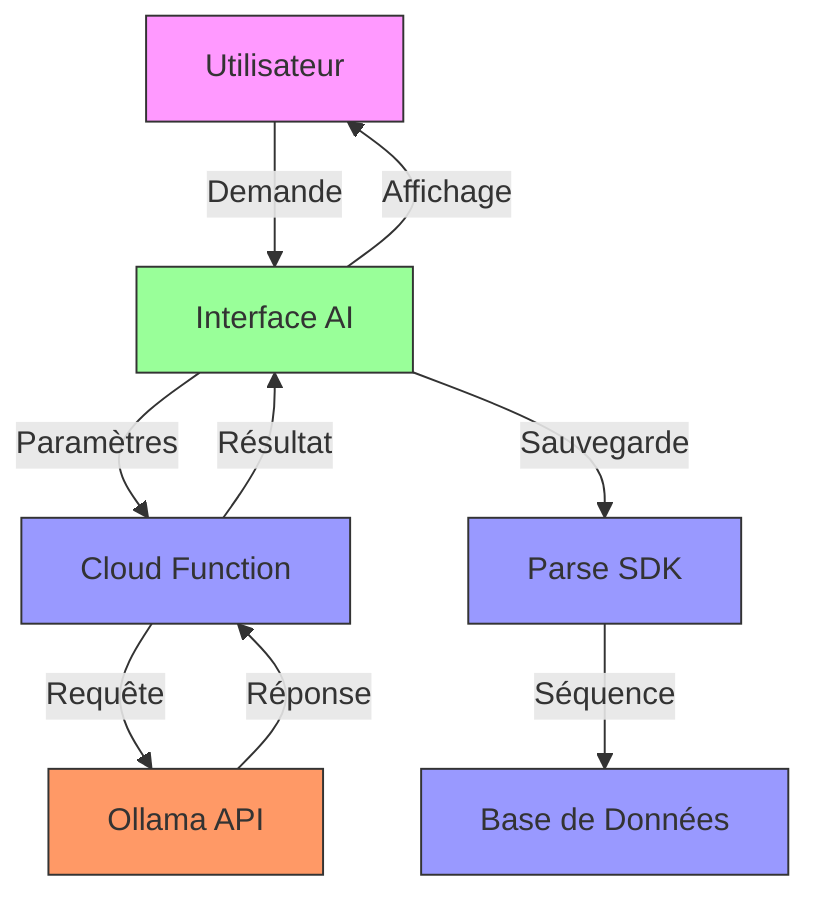
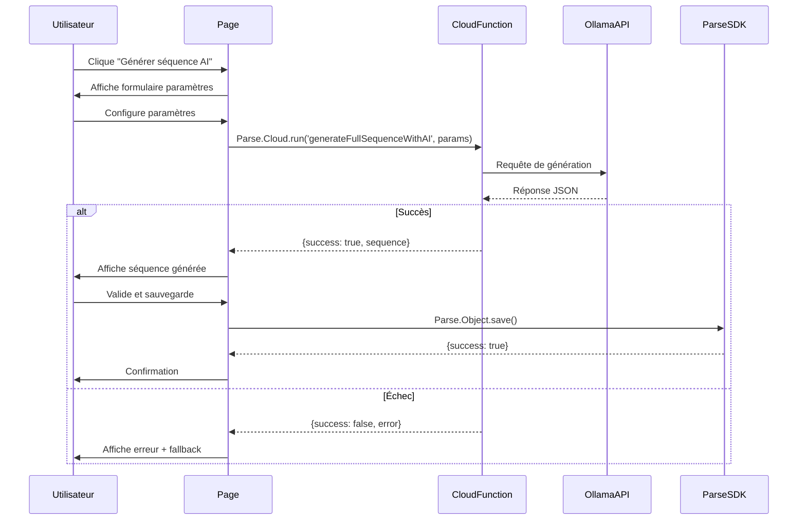
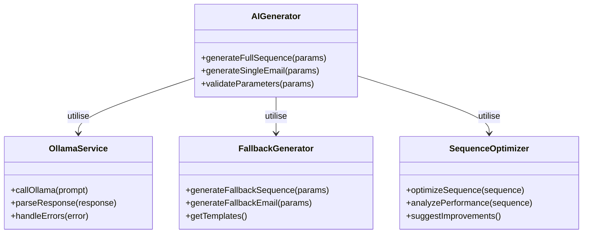

# F06 : Spécifications Techniques - Création Automatique de Séquences avec IA

## Diagrammes Mermaid

### Architecture Globale


### Flux de Génération Complète


### Structure des Services


## Architecture Technique

### Couches et Technologies

| Couche          | Technologie      | Responsabilités                          | Fichiers Clés                     |
|-----------------|------------------|-----------------------------------------|-----------------------------------|
| **Présentation** | Astro/Alpine     | Interface utilisateur                   | `sequence-detail.astro`           |
| **Logique**     | JavaScript       | Gestion des paramètres                    | Cloud functions                   |
| **AI**         | Ollama API       | Génération de contenu                    | Service externe                   |
| **Backend**     | Parse Cloud      | Intégration et sauvegarde                | Cloud functions                   |
| **Fallback**   | JavaScript       | Génération de secours                    | Modules locaux                    |
| **Optimisation**| JavaScript       | Analyse et suggestions                   | Modules d'analyse                  |

### Structure des Fichiers

```bash
parse-server/
└── cloud/
    ├── generateFullSequenceWithAI.js  # Génération complète
    ├── generateSingleEmailWithAI.js   # Génération email unique
    ├── generateEmailWithOllama.js     # Service Ollama
    └── sequenceOptimizer.js           # Optimisation
    
public/
└── js/
    └── services/
        └── aiService.js               # Intégration frontend
```

### Interfaces et Types

#### Paramètres de Génération Complète
```typescript
interface FullSequenceParams {
    sequenceId: string;
    target: 'particulier' | 'professionnel' | 'syndic' | 'locataire' | 'proprietaire';
    multipleImpayes: boolean;
    startTone: 'professionnel' | 'amiable' | 'formel';
    endTone: 'ferme' | 'urgent' | 'juridique';
    huissierThreshold: number; // 1-10
}
```

#### Résultat de Génération
```typescript
interface GenerationResult {
    success: boolean;
    sequence?: {
        nom: string;
        description: string;
        actions: SequenceAction[];
    };
    error?: string;
    fallback?: {
        nom: string;
        description: string;
        actions: SequenceAction[];
    };
}
```

#### Action Générée
```typescript
interface SequenceAction {
    type: 'email';
    delay: number; // Jours
    subject: string;
    senderEmail: string;
    message: string;
    isMultipleImpayes: boolean;
    multipleSubject?: string;
    multipleMessage?: string;
}
```

## Implémentation Détaillée

### Génération Complète de Séquence

#### Cloud Function
```javascript
// generateFullSequenceWithAI.js
Parse.Cloud.define('generateFullSequenceWithAI', async (request) => {
    const { sequenceId, target, multipleImpayes, startTone, endTone, huissierThreshold } = request.params;
    
    // Validation
    if (!sequenceId || !target) {
        return { success: false, error: 'Paramètres manquants' };
    }
    
    try {
        // Vérifier la séquence
        const sequence = await getSequence(sequenceId);
        if (!sequence) return { success: false, error: 'Séquence introuvable' };
        
        // Générer la séquence
        const actions = await generateCompleteSequence(target, multipleImpayes, startTone, endTone, huissierThreshold);
        
        // Mettre à jour
        sequence.set('actions', actions);
        await sequence.save();
        
        return { success: true, actionsGenerated: actions.length };
        
    } catch (error) {
        console.error('Erreur:', error);
        return { success: false, error: error.message };
    }
});
```

#### Génération des Étapes
```javascript
async function generateCompleteSequence(target, multipleImpayes, startTone, endTone, huissierThreshold) {
    const actions = [];
    const steps = getSequenceSteps(startTone, endTone, huissierThreshold);
    
    for (const step of steps) {
        const action = await generateSequenceAction(target, multipleImpayes, step);
        actions.push(action);
    }
    
    return actions;
}

function getSequenceSteps(startTone, endTone, huissierThreshold) {
    const steps = [
        { delay: 0, type: 'email', tone: startTone, purpose: 'premier_rappel' },
        { delay: 7, type: 'email', tone: 'amiable', purpose: 'rappel_amiable' },
        { delay: 14, type: 'email', tone: 'professionnel', purpose: 'rappel_professionnel' },
        { delay: 21, type: 'email', tone: 'ferme', purpose: 'rappel_ferme' },
        { delay: 28, type: 'email', tone: endTone, purpose: 'dernier_rappel' }
    ];
    
    if (huissierThreshold <= 5) {
        steps.push({ delay: 35, type: 'email', tone: 'juridique', purpose: 'preparation_huissier' });
    }
    
    return steps;
}
```

### Génération d'Email Unique

#### Cloud Function
```javascript
// generateSingleEmailWithAI.js
Parse.Cloud.define('generateSingleEmailWithAI', async (request) => {
    const { sequenceId, target, tone, delay } = request.params;
    
    // Validation
    if (!sequenceId || !target || !tone) {
        return { success: false, error: 'Paramètres manquants' };
    }
    
    try {
        // Vérifier la séquence
        const sequence = await getSequence(sequenceId);
        if (!sequence) return { success: false, error: 'Séquence introuvable' };
        
        // Générer l'email
        const action = await generateSingleEmailAction(target, tone, delay);
        
        // Ajouter à la séquence
        const currentActions = sequence.get('actions') || [];
        currentActions.push(action);
        sequence.set('actions', currentActions);
        await sequence.save();
        
        return { success: true, actionGenerated: action };
        
    } catch (error) {
        console.error('Erreur:', error);
        return { success: false, error: error.message };
    }
});
```

### Intégration avec Ollama

#### Service de Génération
```javascript
// generateEmailWithOllama.js
async function generateEmailWithOllama(impayeData, sequenceName, actionType, isMultiple, template) {
    try {
        // Construire le prompt
        const prompt = buildPrompt(impayeData, sequenceName, actionType, isMultiple, template);
        
        // Appel à Ollama
        const response = await callOllamaAPI(prompt);
        
        // Parser la réponse
        const parsed = parseOllamaResponse(response);
        
        if (parsed.success) {
            return {
                success: true,
                subject: parsed.subject,
                body: parsed.body
            };
        } else {
            // Utiliser le fallback
            return getFallbackContent(impayeData, actionType, isMultiple);
        }
        
    } catch (error) {
        console.error('Erreur Ollama:', error);
        return getFallbackContent(impayeData, actionType, isMultiple);
    }
}
```

### Gestion des Erreurs et Fallback

#### Système de Fallback
```javascript
function getFallbackContent(impayeData, actionType, isMultiple) {
    if (isMultiple) {
        return getMultipleFallback(impayeData, actionType);
    } else {
        return getSingleFallback(impayeData, actionType);
    }
}

function getSingleFallback(impayeData, actionType) {
    const templates = {
        premier_rappel: {
            subject: 'Rappel courtois - Facture [[nfacture]] impayée',
            body: 'Bonjour [[payeur_nom]],\n\nVotre facture...'
        },
        rappel_ferme: {
            subject: 'Dernier rappel - Facture [[nfacture]]',
            body: 'Bonjour [[payeur_nom]],\n\nMalgré nos rappels...'
        }
    };
    
    return templates[actionType] || templates.premier_rappel;
}
```

### Optimisation des Séquences

#### Analyse et Suggestions
```javascript
// sequenceOptimizer.js
async function optimizeSequence(sequenceId) {
    try {
        const sequence = await getSequence(sequenceId);
        if (!sequence) throw new Error('Séquence introuvable');
        
        const actions = sequence.get('actions') || [];
        const suggestions = [];
        
        // Analyser les délais
        suggestions.push(...analyzeDelays(actions));
        
        // Analyser le contenu
        suggestions.push(...analyzeContent(actions));
        
        // Analyser la structure
        suggestions.push(...analyzeStructure(actions));
        
        return { success: true, suggestions };
        
    } catch (error) {
        console.error('Erreur optimisation:', error);
        return { success: false, error: error.message };
    }
}

function analyzeDelays(actions) {
    const suggestions = [];
    
    // Vérifier les écarts
    for (let i = 1; i < actions.length; i++) {
        const gap = actions[i].delay - actions[i-1].delay;
        if (gap < 3) {
            suggestions.push({
                type: 'warning',
                message: `L'écart entre l'action ${i} et ${i+1} est trop court (${gap} jours)`,
                suggestion: 'Considérer un écart minimum de 3-5 jours'
            });
        }
    }
    
    return suggestions;
}
```

### Intégration Frontend

#### Appel depuis l'Interface
```javascript
// Dans sequenceDetailState.js
async function createFullSequenceWithAI() {
    this.isGeneratingWithAI = true;
    
    try {
        const result = await Parse.Cloud.run('generateFullSequenceWithAI', {
            sequenceId: this.sequenceId,
            target: this.iaSequenceTarget,
            multipleImpayes: this.iaSequenceMultipleImpayes,
            startTone: this.iaSequenceStartTone,
            endTone: this.iaSequenceEndTone,
            huissierThreshold: this.iaSequenceHuissierThreshold
        });
        
        if (result.success) {
            this.showNotification('Succès', 'Séquence générée avec succès', 'success');
            await this.loadSequence(); // Recharger
        } else {
            this.showNotification('Erreur', result.error || 'Génération échouée', 'error');
        }
        
    } catch (error) {
        console.error('Erreur:', error);
        this.showNotification('Erreur', 'Erreur lors de la génération', 'error');
    } finally {
        this.isGeneratingWithAI = false;
    }
}
```

## Tests et Validation

### Stratégie de Test

| Type           | Outil      | Couverture                     | Exemples                          |
|----------------|------------|-------------------------------|-----------------------------------|
| **Unitaire**   | Jest       | Fonctions de génération        | generateSequenceAction()          |
| **Intégration**| MCP        | Cloud functions                | Appels Parse et Ollama            |
| **E2E**        | Playwright | Flux utilisateur complet       | Génération → Sauvegarde           |
| **Performance**| LoadTest   | Charge et réponse              | Temps de réponse sous charge      |
| **Sécurité**   | OWASP ZAP  | Vulnérabilités                | Injection et validation           |

### Scénarios Critiques

1. **Génération complète réussie**
   - Paramètres valides
   - Appel Ollama réussi
   - Sauvegarde Parse réussie
   - Notification utilisateur

2. **Échec de l'AI avec fallback**
   - Appel Ollama échoue
   - Fallback activé
   - Sauvegarde réussie
   - Notification appropriée

3. **Paramètres invalides**
   - Validation échoue
   - Message d'erreur clair
   - Pas d'appel API
   - État inchangé

4. **Génération d'email unique**
   - Contexte spécifique
   - Ton adapté
   - Intégration dans séquence
   - Validation du résultat

### Métriques Cibles

| Métrique                | Objectif       |
|-------------------------|---------------|
| Temps de génération      | < 3s          |
| Temps de fallback        | < 500ms       |
| Taux de succès           | > 95%         |
| Score qualité           | > 0.85        |
| Temps de réponse API     | < 1s          |

## Documentation et Maintenance

### Fichiers de Documentation

```bash
docs/
├── specs/
│   ├── fonctionnelles/
│   │   └── F06-automatic-sequence.md  # Spécifications fonctionnelles
│   └── techniques/
│       └── F06-automatic-sequence.md  # Ce fichier
└── scenarios/
    └── F06/
        ├── description.md        # Micro-étapes
        ├── console/
        │   ├── ai.log             # Logs AI
        │   └── fallback.log       # Logs fallback
        └── tests/
            ├── generation.test.js # Tests génération
            ├── integration.test.js # Tests intégration
            └── optimization.test.js # Tests optimisation
```

### Journal des Changements

```markdown
## [1.0.0] - 2024-02-20
### Ajouté
- Génération complète de séquences avec AI
- Génération d'emails individuels
- Système de fallback complet
- Optimisation des séquences

### Amélioré
- Intégration avec Ollama
- Gestion des erreurs
- Performance des générations

### Corrigé
- Bugs de parsing des réponses
- Problèmes de fallback
```

### Guide de Dépannage

#### Problème: Génération échoue sans erreur
1. Vérifier les logs cloud
2. Tester l'API Ollama directement
3. Vérifier les paramètres d'entrée
4. Tester avec des paramètres connus

#### Problème: Fallback toujours utilisé
1. Vérifier la connexion à Ollama
2. Tester l'API Ollama
3. Vérifier le parsing des réponses
4. Tester avec une réponse mock

#### Problème: Performances lentes
1. Vérifier la taille des prompts
2. Optimiser les appels API
3. Implémenter du caching
4. Analyser les logs de performance

## Points d'Extension

1. **Modèles Personnalisés**
   - Entraînement sur données spécifiques
   - Fine-tuning des modèles

2. **Analyse Avancée**
   - Prédiction des taux de succès
   - Recommandations contextuelles

3. **Intégrations**
   - Autres services AI
   - Outils d'analyse externe

4. **Collaboration**
   - Partage des générations
   - Feedback utilisateur

## Priorité et Planification

- **Priorité**: Moyenne à Élevée
- **Complexité**: Élevée
- **Effort estimé**: 16-20 heures
- **Dépendances**: Parse SDK, Ollama API, Alpine.js
- **Risques**: Complexité de l'intégration AI, gestion des erreurs

## Prochaines Étapes

1. Implémenter les micro-étapes
2. Tester l'intégration AI
3. Valider les performances
4. Documenter les cas d'usage
5. Préparer le déploiement
