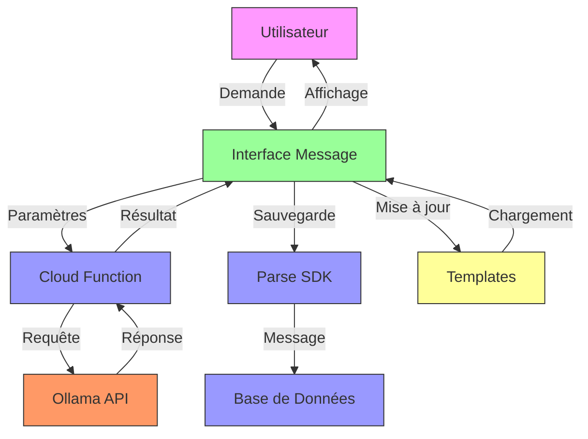
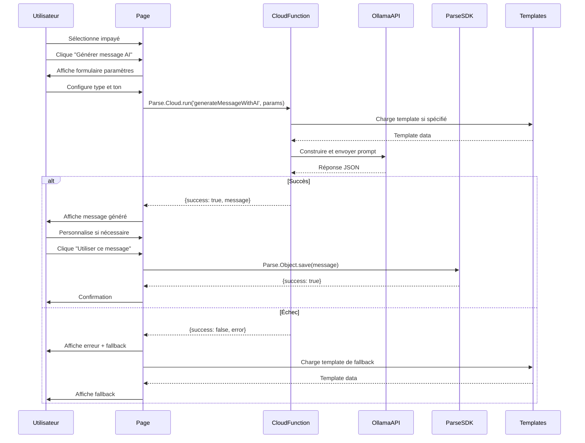
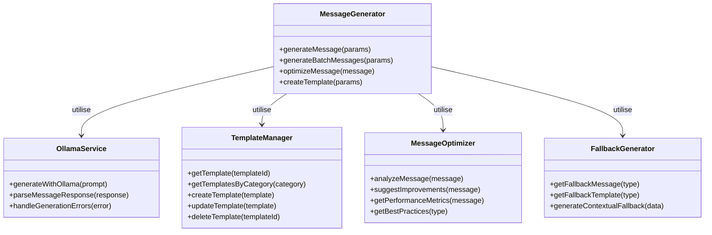

# F07 : Spécifications Techniques - Génération de Messages avec IA

## Diagrammes Mermaid

### Architecture Globale


### Flux de Génération de Message


### Structure des Services


## Architecture Technique

### Couches et Technologies

| Couche          | Technologie      | Responsabilités                          | Fichiers Clés                     |
|-----------------|------------------|-----------------------------------------|-----------------------------------|
| **Présentation** | Astro/Alpine     | Interface utilisateur                   | `sequence-detail.astro`           |
| **Gestion**     | JavaScript       | Gestion des messages                     | Cloud functions                   |
| **AI**         | Ollama API       | Génération de contenu                    | Service externe                   |
| **Templates**   | Parse SDK        | Gestion des templates                    | Parse Objects                     |
| **Optimisation**| JavaScript       | Analyse et suggestions                   | Modules locaux                    |
| **Fallback**   | JavaScript       | Génération de secours                    | Modules locaux                    |

### Structure des Fichiers

```bash
parse-server/
└── cloud/
    ├── generateMessageWithAI.js      # Génération de messages
    ├── generateBatchMessages.js      # Génération batch
    ├── optimizeMessage.js            # Optimisation
    ├── templateManager.js            # Gestion templates
    └── messageFallback.js            # Fallback
    
public/
└── js/
    └── services/
        └── messageService.js          # Intégration frontend
```

### Interfaces et Types

#### Paramètres de Génération
```typescript
interface MessageGenerationParams {
    impayeId: string;
    type: 'premier_rappel' | 'second_rappel' | 'rappel_ferme' | 'dernier_rappel' | 'custom';
    ton: 'professionnel' | 'amiable' | 'ferme' | 'urgent';
    contexte?: {
        montant: number;
        devise: string;
        dateEcheance: string;
        joursRetard: number;
        nfacture: string;
        payeurNom: string;
        payeurEmail: string;
    };
    format: 'email' | 'sms' | 'notification';
    langue: string;
    templateId?: string;
    includeDetails: boolean;
}
```

#### Résultat de Génération
```typescript
interface MessageGenerationResult {
    success: boolean;
    message?: {
        subject: string;
        body: string;
        format: string;
        variables: string[];
        metadata: {
            confidence: number;
            ton: string;
            estimatedResponseRate: number;
            generatedAt: string;
        };
    };
    error?: string;
    fallback?: {
        subject: string;
        body: string;
    };
}
```

#### Template de Message
```typescript
interface MessageTemplate {
    id: string;
    nom: string;
    description: string;
    categorie: string;
    contenu: {
        subject: string;
        body: string;
    };
    variables: string[];
    usageCount: number;
    successRate: number;
    createdAt: string;
    createdBy: string;
}
```

## Implémentation Détaillée

### Génération de Messages

#### Cloud Function Principale
```javascript
// generateMessageWithAI.js
Parse.Cloud.define('generateMessageWithAI', async (request) => {
    const params = request.params;
    
    // Validation
    if (!params.impayeId || !params.type) {
        return { success: false, error: 'Paramètres manquants' };
    }
    
    try {
        // Charger les données de l'impayé
        const impaye = await getImpayeData(params.impayeId);
        if (!impaye) return { success: false, error: 'Impayé introuvable' };
        
        // Charger le template si spécifié
        let template = null;
        if (params.templateId) {
            template = await getTemplate(params.templateId);
        }
        
        // Générer le message
        const result = await generateMessageContent(impaye, params, template);
        
        if (result.success) {
            // Sauvegarder si demandé
            if (params.save) {
                await saveGeneratedMessage(result.message, params.impayeId);
            }
            return result;
        } else {
            // Utiliser le fallback
            const fallback = getMessageFallback(params.type, impaye);
            return { success: true, message: fallback, fallback: true };
        }
        
    } catch (error) {
        console.error('Erreur génération message:', error);
        const fallback = getMessageFallback(params.type, await getImpayeData(params.impayeId));
        return { success: false, error: error.message, fallback };
    }
});
```

#### Génération avec Ollama
```javascript
async function generateMessageContent(impaye, params, template) {
    try {
        // Construire le prompt
        const prompt = buildMessagePrompt(impaye, params, template);
        
        // Appel à Ollama
        const response = await callOllamaAPI(prompt);
        
        // Parser la réponse
        const parsed = parseMessageResponse(response);
        
        if (parsed.success) {
            // Appliquer le template si nécessaire
            const finalMessage = applyTemplate(parsed, template);
            
            // Valider le message
            const validation = validateMessage(finalMessage);
            
            if (validation.valid) {
                return { success: true, message: finalMessage };
            } else {
                return { success: false, error: 'Message invalide', validationErrors: validation.errors };
            }
        } else {
            return { success: false, error: 'Génération échouée' };
        }
        
    } catch (error) {
        console.error('Erreur Ollama:', error);
        return { success: false, error: error.message };
    }
}
```

### Gestion des Templates

#### Création de Template
```javascript
// templateManager.js
async function createTemplate(templateData) {
    try {
        // Validation
        if (!templateData.nom || !templateData.contenu) {
            throw new Error('Données de template incomplètes');
        }
        
        // Créer l'objet Parse
        const Template = Parse.Object.extend('MessageTemplates');
        const newTemplate = new Template();
        
        // Définir les propriétés
        newTemplate.set('nom', templateData.nom);
        newTemplate.set('description', templateData.description || '');
        newTemplate.set('categorie', templateData.categorie || 'general');
        newTemplate.set('contenu', templateData.contenu);
        newTemplate.set('variables', templateData.variables || []);
        newTemplate.set('usageCount', 0);
        newTemplate.set('successRate', 0);
        newTemplate.set('createdBy', request.user.id);
        
        // Sauvegarder
        await newTemplate.save();
        
        return { success: true, templateId: newTemplate.id };
        
    } catch (error) {
        console.error('Erreur création template:', error);
        return { success: false, error: error.message };
    }
}
```

### Optimisation des Messages

#### Analyse et Suggestions
```javascript
// optimizeMessage.js
async function optimizeMessage(messageId) {
    try {
        // Charger le message
        const message = await getMessage(messageId);
        if (!message) throw new Error('Message introuvable');
        
        // Analyser le contenu
        const analysis = analyzeMessageContent(message);
        
        // Suggérer des améliorations
        const suggestions = generateSuggestions(analysis);
        
        // Récupérer les meilleures pratiques
        const bestPractices = getBestPractices(message.type);
        
        return {
            success: true,
            analysis,
            suggestions,
            bestPractices
        };
        
    } catch (error) {
        console.error('Erreur optimisation:', error);
        return { success: false, error: error.message };
    }
}

function analyzeMessageContent(message) {
    const analysis = {
        length: message.body.length,
        readability: calculateReadability(message.body),
        sentiment: analyzeSentiment(message.body),
        variables: extractVariables(message.body),
        structure: analyzeStructure(message.body)
    };
    
    return analysis;
}
```

### Intégration Frontend

#### Génération depuis l'Interface
```javascript
// Dans sequenceDetailState.js
async function generateSingleEmailWithAI() {
    this.isGeneratingWithAI = true;
    
    try {
        const result = await Parse.Cloud.run('generateSingleEmailWithAI', {
            sequenceId: this.sequenceId,
            target: this.iaEmailTarget,
            tone: this.iaEmailTone,
            delay: this.iaEmailDelay
        });
        
        if (result.success) {
            // Ajouter l'action à la séquence
            this.sequence.actions.push({
                type: 'email',
                delay: this.iaEmailDelay,
                subject: result.actionGenerated.subject,
                senderEmail: 'default@example.com',
                message: result.actionGenerated.message,
                isMultipleImpayes: false
            });
            
            // Sauvegarder
            await this.saveActions();
            
            this.showNotification('Succès', 'Email généré et ajouté', 'success');
            this.showCreateSingleEmailDrawer = false;
            this.resetAIEmailForm();
            
        } else {
            this.showNotification('Erreur', result.error || 'Génération échouée', 'error');
        }
        
    } catch (error) {
        console.error('Erreur:', error);
        this.showNotification('Erreur', 'Erreur lors de la génération', 'error');
    } finally {
        this.isGeneratingWithAI = false;
    }
}
```

### Gestion des Erreurs et Fallback

#### Système de Fallback Avancé
```javascript
// messageFallback.js
function getMessageFallback(type, impayeData) {
    const fallbacks = {
        premier_rappel: {
            subject: 'Rappel courtois - Facture [[nfacture]] impayée',
            body: `Bonjour [[payeurNom]],

Nous vous rappelons que votre facture n°[[nfacture]] d'un montant de [[montant]] € est actuellement impayée.

Merci de procéder au règlement dans les plus brefs délais.

Cordialement,
Votre service comptable`
        },
        rappel_ferme: {
            subject: 'Dernier rappel - Facture [[nfacture]] impayée',
            body: `Bonjour [[payeurNom]],

Malgré nos précédents rappels, votre facture n°[[nfacture]] reste impayée.

Nous vous demandons de régulariser cette situation sous 48h.

Cordialement,
Votre service comptable`
        }
    };
    
    // Appliquer les données de l'impayé
    const fallback = fallbacks[type] || fallbacks.premier_rappel;
    return applyImpayeData(fallback, impayeData);
}

function applyImpayeData(template, impaye) {
    let result = { ...template };
    
    // Remplacer les variables
    result.subject = template.subject
        .replace('[[payeurNom]]', impaye.payeur_nom)
        .replace('[[nfacture]]', impaye.nfacture)
        .replace('[[montant]]', formatCurrency(impaye.resteapayer));
    
    result.body = template.body
        .replace('[[payeurNom]]', impaye.payeur_nom)
        .replace('[[nfacture]]', impaye.nfacture)
        .replace('[[montant]]', formatCurrency(impaye.resteapayer))
        .replace('[[dateEcheance]]', formatDate(impaye.datepiece))
        .replace('[[joursRetard]]', calculateDaysOverdue(impaye.datepiece));
    
    return result;
}
```

## Tests et Validation

### Stratégie de Test

| Type           | Outil      | Couverture                     | Exemples                          |
|----------------|------------|-------------------------------|-----------------------------------|
| **Unitaire**   | Jest       | Fonctions de génération        | generateMessageContent()          |
| **Intégration**| MCP        | Cloud functions                | Appels Parse et Ollama            |
| **E2E**        | Playwright | Flux utilisateur complet       | Génération → Utilisation          |
| **Performance**| LoadTest   | Charge et réponse              | Temps de réponse sous charge      |
| **Qualité**    | Custom     | Analyse de contenu             | Score de qualité des messages     |

### Scénarios Critiques

1. **Génération réussie avec template**
   - Template spécifié
   - Génération AI réussie
   - Application du template
   - Validation réussie

2. **Génération avec fallback**
   - Échec de l'AI
   - Fallback activé
   - Application des données
   - Message utilisable

3. **Génération batch**
   - Plusieurs impayés
   - Génération individuelle
   - Personnalisation
   - Sauvegarde batch

4. **Optimisation de message**
   - Analyse complète
   - Suggestions pertinentes
   - Best practices
   - Amélioration mesurable

### Métriques Cibles

| Métrique                | Objectif       |
|-------------------------|---------------|
| Temps de génération      | < 2s          |
| Temps de fallback        | < 300ms       |
| Taux de succès           | > 95%         |
| Score qualité           | > 0.85        |
| Temps de réponse API     | < 800ms       |

## Documentation et Maintenance

### Fichiers de Documentation

```bash
docs/
├── specs/
│   ├── fonctionnelles/
│   │   └── F07-ai-message.md      # Spécifications fonctionnelles
│   └── techniques/
│       └── F07-ai-message.md      # Ce fichier
└── scenarios/
    └── F07/
        ├── description.md        # Micro-étapes
        ├── console/
        │   ├── generation.log     # Logs de génération
        │   └── optimization.log    # Logs d'optimisation
        └── tests/
            ├── generation.test.js # Tests génération
            ├── batch.test.js      # Tests batch
            └── templates.test.js  # Tests templates
```

### Journal des Changements

```markdown
## [1.0.0] - 2024-02-20
### Ajouté
- Génération de messages avec AI
- Gestion des templates
- Optimisation des messages
- Génération batch

### Amélioré
- Intégration avec Ollama
- Gestion des erreurs
- Performance

### Corrigé
- Bugs de parsing
- Problèmes de fallback
```

### Guide de Dépannage

#### Problème: Génération échoue sans erreur
1. Vérifier les logs cloud
2. Tester l'API Ollama
3. Vérifier les paramètres
4. Tester avec des données connues

#### Problème: Messages génériques
1. Vérifier les données d'entrée
2. Tester avec différents templates
3. Analyser les prompts
4. Vérifier les variables

#### Problème: Performances lentes
1. Vérifier la taille des prompts
2. Optimiser les appels
3. Implémenter du caching
4. Analyser les logs

## Points d'Extension

1. **Analyse Avancée**
   - Prédiction des taux de réponse
   - Recommandations contextuelles

2. **Intégrations**
   - Autres services AI
   - Outils d'analyse externe

3. **Collaboration**
   - Partage des messages
   - Feedback utilisateur

4. **Automatisation**
   - Génération automatique
   - Déclenchement basé sur règles

## Priorité et Planification

- **Priorité**: Moyenne
- **Complexité**: Moyenne
- **Effort estimé**: 8-12 heures
- **Dépendances**: Parse SDK, Ollama API, Alpine.js
- **Risques**: Complexité de l'intégration, gestion des templates

## Prochaines Étapes

1. Implémenter les micro-étapes
2. Tester l'intégration AI
3. Valider les performances
4. Documenter les cas d'usage
5. Préparer le déploiement
