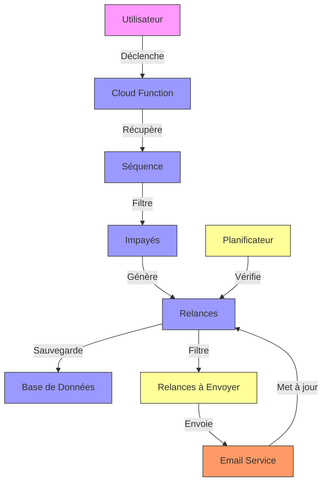
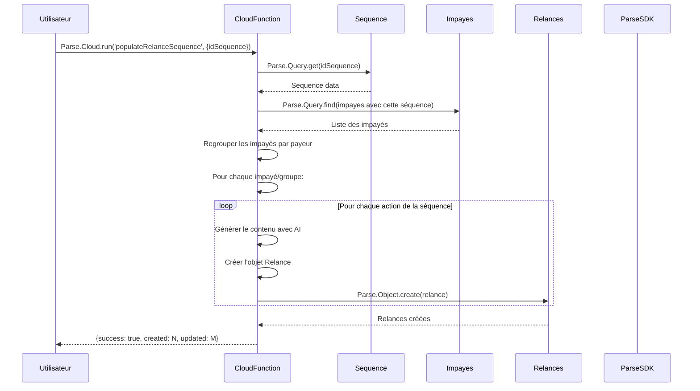
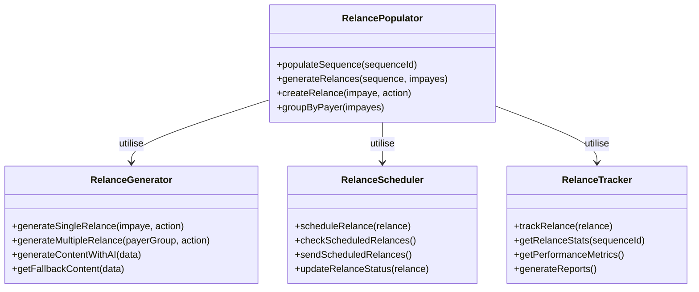

# F08 : Spécifications Techniques - Peuplement des Relances

## Diagrammes Mermaid

### Architecture Globale


### Flux Principal de Peuplement


### Structure des Composants


## Architecture Technique

### Couches et Technologies

| Couche          | Technologie      | Responsabilités                          | Fichiers Clés                     |
|-----------------|------------------|-----------------------------------------|-----------------------------------|
| **Déclenchement** | Parse Cloud     | Point d'entrée                           | `populateRelanceSequence.js`      |
| **Récupération** | Parse SDK       | Chargement des données                   | Parse.Query                       |
| **Génération**  | JavaScript       | Création des relances                    | Fonctions de génération           |
| **AI**         | Ollama API       | Génération de contenu                    | Service externe                   |
| **Persistance** | Parse SDK        | Sauvegarde des relances                  | Parse.Object.create/save          |
| **Planification**| Parse Cloud     | Exécution des relances                   | Fonctions de scheduling            |
| **Suivi**      | Parse SDK        | Reporting et analyse                     | Parse.Query.aggregate             |

### Structure des Fichiers

```bash
parse-server/
└── cloud/
    ├── populateRelanceSequence.js      # Fonction principale
    ├── relanceGenerator.js             # Génération des relances
    ├── relanceScheduler.js             # Planification et envoi
    ├── relanceTracker.js               # Suivi et reporting
    └── relanceUtils.js                 # Utilitaires
    
public/
└── js/
    └── services/
        └── relanceService.js            # Intégration frontend
```

### Interfaces et Types

#### Paramètres de Peuplement
```typescript
interface PopulateRelanceParams {
    idSequence: string;  // ID de la séquence
    forceRegenerate?: boolean; // Forcer la régénération
    dryRun?: boolean; // Mode test sans sauvegarde
}
```

#### Résultat de Peuplement
```typescript
interface PopulateRelanceResult {
    success: boolean;
    processed: number; // Impayés traités
    created: number; // Nouvelles relances créées
    updated: number; // Relances existantes mises à jour
    deleted: number; // Relances supprimées
    error?: string;
}
```

#### Structure d'une Relance
```typescript
interface Relance {
    objectId: string;
    impaye: Parse.Object; // Pointer
    sequence: Parse.Object; // Pointer
    actionIndex: number;
    emailSubject: string;
    emailBody: string;
    emailTo: string;
    emailCc?: string;
    sendDate: Date;
    isSent: boolean;
    sentAt?: Date;
    isMultiple: boolean;
    multipleImpayesCount?: number;
    multipleImpayesIds?: string;
    smtpProfile?: Parse.Object; // Pointer
    generatedBy: 'system' | 'user' | 'ai';
}
```

## Implémentation Détaillée

### Fonction Principale de Peuplement

#### Cloud Function
```javascript
// populateRelanceSequence.js
Parse.Cloud.define('populateRelanceSequence', async (request) => {
    const { idSequence, forceRegenerate = false, dryRun = false } = request.params;
    
    // Validation
    if (!idSequence) {
        throw new Error('Le paramètre idSequence est requis');
    }
    
    let processedCount = 0;
    let createdCount = 0;
    let updatedCount = 0;
    let deletedCount = 0;
    
    try {
        // Charger la séquence
        const sequence = await getSequence(idSequence);
        if (!sequence) {
            throw new Error('Séquence introuvable');
        }
        
        // Charger les impayés associés
        const impayes = await getImpayesForSequence(sequence);
        
        // Regrouper les impayés par payeur
        const impayesByPayer = groupImpayesByPayer(impayes);
        
        // Traiter chaque impayé/groupe
        for (const impaye of impayes) {
            processedCount++;
            
            // Supprimer les relances non envoyées existantes
            deletedCount += await cleanupUnsentRelances(impaye, sequence);
            
            // Générer de nouvelles relances
            const newRelances = await generateRelancesForImpaye(impaye, sequence, impayesByPayer);
            
            if (!dryRun && newRelances.length > 0) {
                // Sauvegarder les nouvelles relances
                createdCount += newRelances.length;
                if (!dryRun) {
                    await Parse.Object.saveAll(newRelances);
                }
            }
        }
        
        return {
            success: true,
            message: 'Relances peuplées avec succès',
            processed: processedCount,
            created: createdCount,
            updated: updatedCount,
            deleted: deletedCount
        };
        
    } catch (error) {
        console.error('Erreur lors du peuplement:', error);
        throw error;
    }
});
```

### Génération des Relances

#### Relances Simples
```javascript
// relanceGenerator.js
async function generateRelancesForImpaye(impaye, sequence, impayesByPayer) {
    const actions = sequence.get('actions') || [];
    const relances = [];
    
    // Filtrer les actions non multiples
    const singleActions = actions.filter(action => !action.isMultipleImpayes);
    
    for (let i = 0; i < singleActions.length; i++) {
        const action = singleActions[i];
        
        // Générer le contenu avec AI
        const content = await generateRelanceContent(impaye, sequence, action);
        
        // Créer la relance
        const relance = createRelanceObject(impaye, sequence, action, content, i);
        relances.push(relance);
    }
    
    return relances;
}

async function generateRelanceContent(impaye, sequence, action) {
    try {
        // Utiliser l'AI pour générer le contenu
        const result = await Parse.Cloud.run('generateEmailWithOllama', {
            impayeData: impaye.toJSON(),
            sequenceName: sequence.get('nom'),
            actionType: 'normal',
            isMultiple: false,
            template: action.template
        });
        
        if (result.success) {
            return {
                subject: result.subject,
                body: result.body
            };
        } else {
            // Utiliser le fallback
            return getFallbackContent(impaye, action);
        }
        
    } catch (error) {
        console.error('Erreur génération contenu:', error);
        return getFallbackContent(impaye, action);
    }
}
```

#### Relances Groupées
```javascript
async function generateMultipleRelances(payerGroup, sequence, impayesByPayer) {
    const actions = sequence.get('actions') || [];
    const relances = [];
    
    // Filtrer les actions multiples
    const multipleActions = actions.filter(action => action.isMultipleImpayes);
    
    for (let i = 0; i < multipleActions.length; i++) {
        const action = multipleActions[i];
        
        // Générer le contenu pour le groupe
        const content = await generateMultipleRelanceContent(payerGroup, sequence, action);
        
        // Créer la relance groupée
        const relance = createMultipleRelanceObject(payerGroup, sequence, action, content, i);
        relances.push(relance);
    }
    
    return relances;
}

async function generateMultipleRelanceContent(payerGroup, sequence, action) {
    try {
        // Préparer les données pour l'AI
        const impayesData = payerGroup.map(i => i.toJSON());
        
        // Générer avec AI
        const result = await Parse.Cloud.run('generateEmailWithOllama', {
            impayeData: impayesData,
            sequenceName: sequence.get('nom'),
            actionType: 'multiple',
            isMultiple: true,
            template: action.template
        });
        
        if (result.success) {
            return {
                subject: result.subject,
                body: result.body
            };
        } else {
            return getMultipleFallbackContent(payerGroup, action);
        }
        
    } catch (error) {
        console.error('Erreur génération groupe:', error);
        return getMultipleFallbackContent(payerGroup, action);
    }
}
```

### Planification et Exécution

#### Vérification des Relances Planifiées
```javascript
// relanceScheduler.js
async function checkScheduledRelances() {
    try {
        const now = new Date();
        
        // Trouver les relances à envoyer
        const Relances = Parse.Object.extend('Relances');
        const query = new Parse.Query(Relances);
        
        query.equalTo('isSent', false);
        query.lessThanOrEqualTo('sendDate', now);
        query.limit(1000);
        
        const relances = await query.find();
        
        // Envoyer chaque relance
        for (const relance of relances) {
            await sendRelance(relance);
        }
        
        return { success: true, sent: relances.length };
        
    } catch (error) {
        console.error('Erreur planification:', error);
        return { success: false, error: error.message };
    }
}

async function sendRelance(relance) {
    try {
        // Vérifier que la relance n'a pas déjà été envoyée
        if (relance.get('isSent')) return;
        
        // Préparer les données d'envoi
        const emailData = {
            to: relance.get('emailTo'),
            cc: relance.get('emailCc'),
            subject: relance.get('emailSubject'),
            body: relance.get('emailBody')
        };
        
        // Envoyer l'email
        const result = await sendEmail(emailData);
        
        if (result.success) {
            // Marquer comme envoyé
            relance.set('isSent', true);
            relance.set('sentAt', new Date());
            await relance.save();
            
            return { success: true };
        } else {
            // Loguer l'erreur
            console.error('Échec envoi email:', result.error);
            return { success: false, error: result.error };
        }
        
    } catch (error) {
        console.error('Erreur envoi relance:', error);
        return { success: false, error: error.message };
    }
}
```

### Suivi et Reporting

#### Génération de Rapports
```javascript
// relanceTracker.js
async function getRelanceStatistics(sequenceId) {
    try {
        const Relances = Parse.Object.extend('Relances');
        const query = new Parse.Query(Relances);
        
        if (sequenceId) {
            const Sequence = Parse.Object.extend('Sequences');
            const sequence = new Sequence();
            sequence.id = sequenceId;
            query.equalTo('sequence', sequence);
        }
        
        // Compter les relances
        const total = await query.count();
        
        // Compter les relances envoyées
        const sentQuery = new Parse.Query(Relances);
        sentQuery.equalTo('isSent', true);
        if (sequenceId) sentQuery.equalTo('sequence', sequence);
        const sent = await sentQuery.count();
        
        // Calculer le taux de succès
        const successRate = total > 0 ? sent / total : 0;
        
        return {
            success: true,
            totalRelances: total,
            sentRelances: sent,
            successRate: successRate,
            pendingRelances: total - sent
        };
        
    } catch (error) {
        console.error('Erreur statistiques:', error);
        return { success: false, error: error.message };
    }
}

async function getPerformanceBySequence() {
    try {
        const pipeline = [
            { match: { isSent: true } },
            { group: {
                _id: '$sequence',
                count: { $sum: 1 },
                avgResponseTime: { $avg: '$responseTime' }
            } },
            { sort: { count: -1 } }
        ];
        
        const result = await Parse.Cloud.run('aggregate', { pipeline });
        return { success: true, data: result };
        
    } catch (error) {
        console.error('Erreur performance:', error);
        return { success: false, error: error.message };
    }
}
```

### Gestion des Erreurs et Fallback

#### Système de Fallback Complet
```javascript
// relanceUtils.js
function getFallbackContent(impaye, action) {
    const impayeData = impaye.toJSON();
    
    const fallbacks = {
        premier_rappel: {
            subject: `Rappel courtois - Facture ${impayeData.nfacture} impayée`,
            body: `Bonjour ${impayeData.payeur_nom},

Nous vous rappelons que votre facture n°${impayeData.nfacture} d'un montant de ${formatCurrency(impayeData.resteapayer)} € est actuellement impayée.

Merci de procéder au règlement dans les plus brefs délais.

Cordialement,
Votre service comptable`
        },
        rappel_ferme: {
            subject: `Dernier rappel - Facture ${impayeData.nfacture} impayée`,
            body: `Bonjour ${impayeData.payeur_nom},

Malgré nos précédents rappels, votre facture n°${impayeData.nfacture} reste impayée.

Nous vous demandons de régulariser cette situation sous 48h.

Cordialement,
Votre service comptable`
        }
    };
    
    return fallbacks[action.purpose] || fallbacks.premier_rappel;
}

function getMultipleFallbackContent(payerGroup, action) {
    const firstImpaye = payerGroup[0].toJSON();
    const totalAmount = payerGroup.reduce((sum, i) => sum + parseFloat(i.get('resteapayer') || 0), 0);
    const factures = payerGroup.map(i => i.get('nfacture')).join(', ');
    
    const fallbacks = {
        rappel_grouped: {
            subject: `Rappel - ${payerGroup.length} factures impayées`,
            body: `Bonjour ${firstImpaye.payeur_nom},

Nous vous rappelons que ${payerGroup.length} de vos factures sont impayées:

${factures}

Montant total: ${formatCurrency(totalAmount)} €

Merci de régulariser cette situation.

Cordialement,
Votre service comptable`
        }
    };
    
    return fallbacks[action.purpose] || fallbacks.rappel_grouped;
}

function formatCurrency(value) {
    return new Intl.NumberFormat('fr-FR', {
        style: 'currency',
        currency: 'EUR'
    }).format(value);
}
```

## Tests et Validation

### Stratégie de Test

| Type           | Outil      | Couverture                     | Exemples                          |
|----------------|------------|-------------------------------|-----------------------------------|
| **Unitaire**   | Jest       | Fonctions de génération        | generateRelancesForImpaye()       |
| **Intégration**| MCP        | Cloud functions                | Appels Parse et AI                |
| **E2E**        | Playwright | Flux complet                   | Génération → Envoi                |
| **Performance**| LoadTest   | Charge et réponse              | 1000 relances en < 10s            |
| **Batch**      | Custom     | Traitement par lots            | Traitement de 500 impayés         |

### Scénarios Critiques

1. **Génération complète réussie**
   - Séquence avec 5 actions
   - 100 impayés associés
   - Génération AI réussie
   - Sauvegarde réussie
   - Statistiques mises à jour

2. **Génération avec fallback**
   - Échec de l'AI
   - Fallback activé
   - Relances créées
   - Notification appropriée

3. **Relances groupées**
   - 5 impayés pour un payeur
   - Action multiple
   - Génération groupée
   - Contenu personnalisé

4. **Planification et envoi**
   - 50 relances planifiées
   - Vérification des dates
   - Envoi réussi
   - Mise à jour des états

### Métriques Cibles

| Métrique                | Objectif       |
|-------------------------|---------------|
| Temps de génération      | < 10s/100      |
| Temps de fallback        | < 500ms        |
| Taux de succès           | > 98%          |
| Temps d'envoi           | < 5s/email     |
| Mémoire utilisée         | < 500MB        |

## Documentation et Maintenance

### Fichiers de Documentation

```bash
docs/
├── specs/
│   ├── fonctionnelles/
│   │   └── F08-followups.md        # Spécifications fonctionnelles
│   └── techniques/
│       └── F08-followups.md        # Ce fichier
└── scenarios/
    └── F08/
        ├── description.md            # Micro-étapes
        ├── console/
        │   ├── generation.log         # Logs de génération
        │   ├── scheduling.log         # Logs de planification
        │   └── sending.log            # Logs d'envoi
        └── tests/
            ├── generation.test.js     # Tests génération
            ├── scheduling.test.js     # Tests planification
            └── batch.test.js          # Tests batch
```

### Journal des Changements

```markdown
## [1.0.0] - 2024-02-20
### Ajouté
- Génération automatique des relances
- Planification et envoi
- Suivi et reporting
- Gestion des erreurs

### Amélioré
- Performance de génération
- Intégration avec l'AI
- Gestion des relances groupées

### Corrigé
- Bugs de synchronisation
- Problèmes de planification
```

### Guide de Dépannage

#### Problème: Relances non générées
1. Vérifier l'état de la séquence
2. Vérifier les logs de génération
3. Tester avec une séquence simple
4. Vérifier les permissions

#### Problème: Relances non envoyées
1. Vérifier les dates planifiées
2. Vérifier le service d'email
3. Tester l'envoi manuel
4. Vérifier les logs d'envoi

#### Problème: Performances lentes
1. Vérifier la taille des batches
2. Optimiser les requêtes
3. Analyser les logs
4. Tester avec des données réduites

## Points d'Extension

1. **Intégrations Avancées**
   - SMS et notifications push
   - Appels vocaux automatisés

2. **Optimisation**
   - Machine learning pour les délais
   - Analyse prédictive

3. **Automatisation**
   - Déclenchement basé sur événements
   - Workflows complexes

4. **Collaboration**
   - Partage des relances
   - Feedback utilisateur

## Priorité et Planification

- **Priorité**: Élevée
- **Complexité**: Élevée
- **Effort estimé**: 24-32 heures
- **Dépendances**: Parse SDK, Email Service, AI Service
- **Risques**: Complexité de la synchronisation, gestion des erreurs

## Prochaines Étapes

1. Implémenter les micro-étapes
2. Tester l'intégration complète
3. Valider les performances
4. Documenter les workflows
5. Préparer le déploiement
