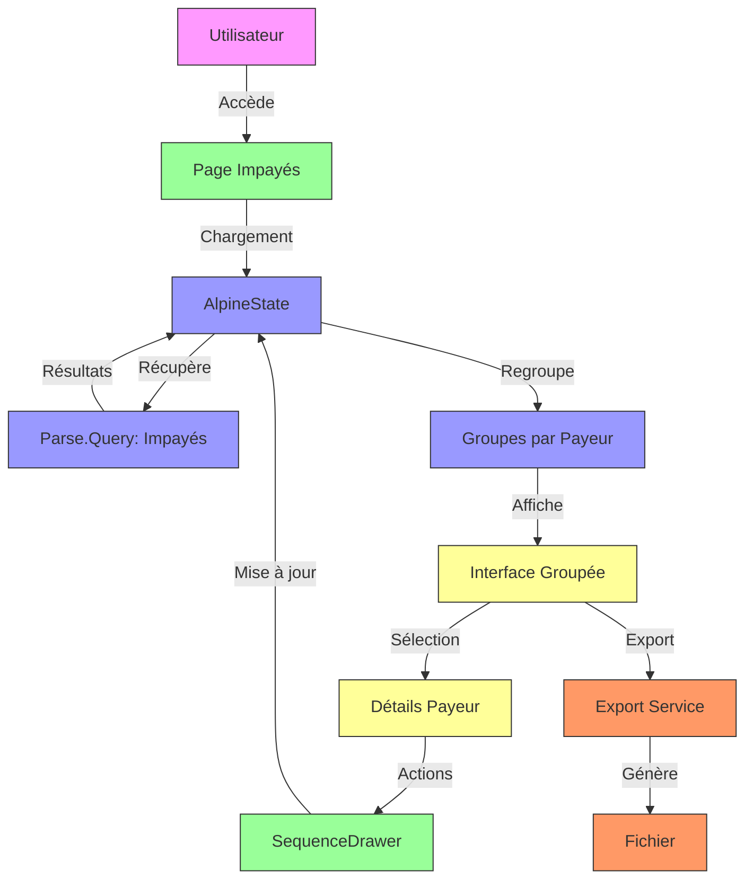
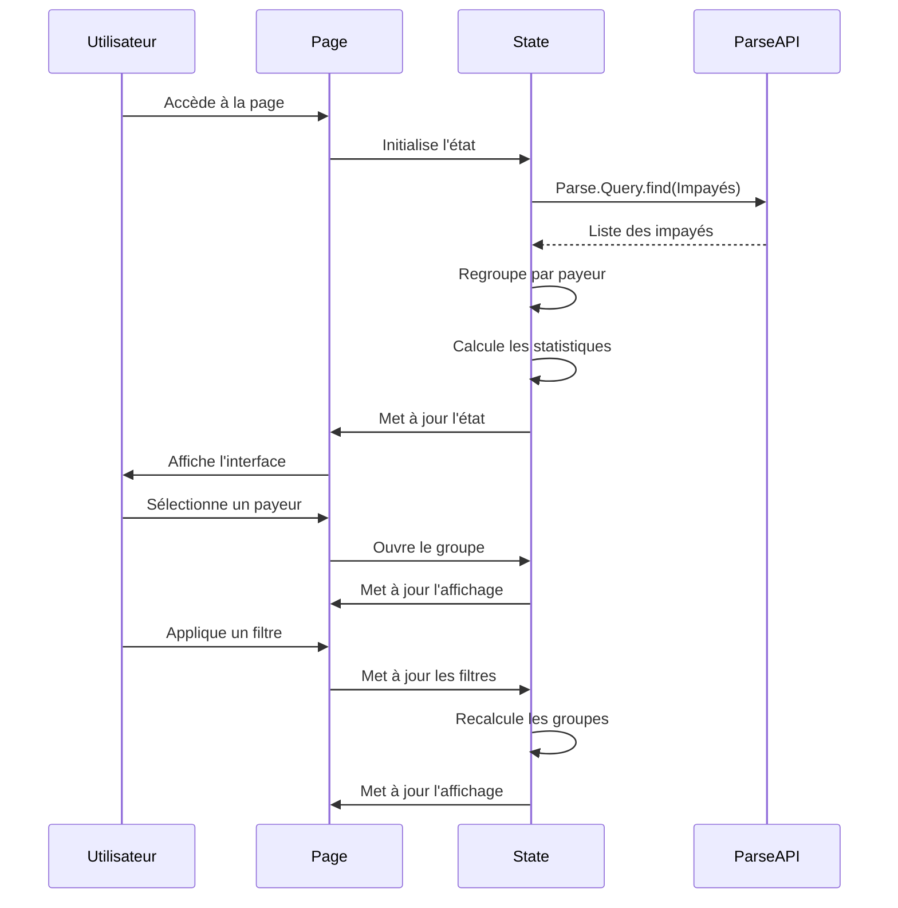
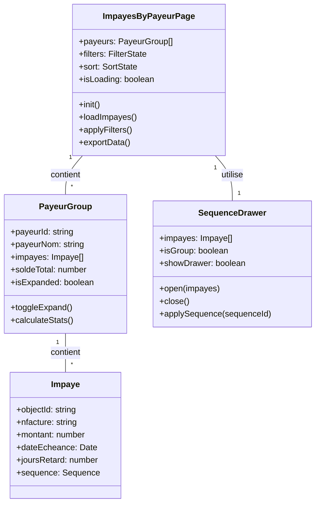
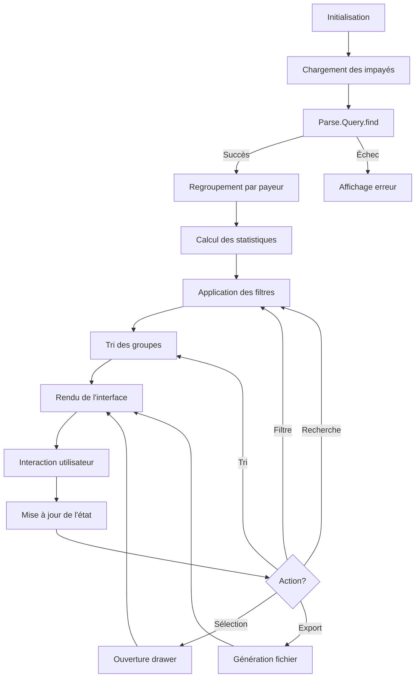

# F09 : Spécifications Techniques - Affichage des Impayés par Payeur

## Diagrammes Mermaid

### Architecture Globale


### Flux de Chargement et Affichage


### Structure des Composants


## Architecture Technique

### Couches et Technologies

| Couche          | Technologie      | Responsabilités                          | Fichiers Clés                     |
|-----------------|------------------|-----------------------------------------|-----------------------------------|
| **Présentation** | Astro            | Structure HTML, layout                   | `src/pages/impayes/index.astro`   |
| **État**        | Alpine.js        | Gestion de l'état réactif                | `public/js/pages/impayesIndexState.js`|
| **Store**       | Alpine.js        | Gestion des données partagées           | `public/js/stores/impayesBaseStore.js`|
| **Style**       | Tailwind CSS     | Design et responsive                     | Fichiers Astro (style)            |
| **Icônes**      | Lucide Astro     | Icônes vectorielles                      | Import Lucide                     |
| **Backend**     | Parse SDK        | Récupération des données                 | Parse.Query                       |
| **Export**      | JavaScript       | Génération de fichiers                   | Fonctions d'export                |
| **Notifications**| Alpine.js       | Feedback utilisateur                     | Notifications inline              |

### Structure des Fichiers

```bash
src/
└── pages/
    └── impayes/
        └── index.astro              # Page principale
        
public/
└── js/
    ├── pages/
    │   └── impayesIndexState.js    # État de la page
    ├── stores/
    │   └── impayesBaseStore.js      # Store partagé
    └── components/
        └── PayeurGroup.js           # Composant de groupe
        
components/
└── sequences/
    └── SequenceManagementDrawer.astro # Drawer de séquence
```

### Props et État

#### Props de la Page
```typescript
interface ImpayesByPayeurProps {
    // Aucune prop - page autonome
}
```

#### État Principal
```typescript
interface ImpayesByPayeurState {
    // Données
    impayesByPayeur: Record<string, Impaye[]>;
    sortedImpayesByPayeur: Record<string, Impaye[]>;
    isLoading: boolean;
    
    // Filtres
    searchQuery: string;
    payerTypeFilter: string;
    delayFilter: number;
    amountFilter: number;
    
    // Tri
    sortBy: 'amount' | 'delay' | 'date';
    sortDirection: 'asc' | 'desc';
    
    // Drawer
    showSequenceDrawer: boolean;
    selectedGroupInvoices: Impaye[] | null;
    selectedImpaye: Impaye | null;
    
    // Méthodes
    loadImpayes(): Promise<void>;
    applyFilters(): void;
    sortImpayes(): void;
    calculateGroupStats(payerName: string): GroupStats;
    exportData(format: 'csv' | 'excel'): void;
}
```

#### Groupe de Payeur
```typescript
interface PayeurGroup {
    payerName: string;
    payerId: string;
    impayes: Impaye[];
    isExpanded: boolean;
    totalAmount: number;
    maxDelay: number;
}
```

#### Impayé
```typescript
interface Impaye {
    objectId: string;
    nfacture: string;
    payeur_nom: string;
    payeur_email: string;
    payeur_type: string;
    resteapayer: number;
    totalttcnet: number;
    totalhtnet: number;
    datepiece: string;
    reference: string;
    sequence_id: string;
    sequence_name: string;
    sequence_is_automatic: boolean;
    dateDebutMission: string;
    apporteur_nom: string;
    adresse: string;
}
```

## Implémentation Détaillée

### Cycle de Vie



### Chargement et Regroupement

#### Chargement Initial
```javascript
// Dans impayesIndexState.js
async function loadImpayes() {
    try {
        this.isLoading = true;
        
        // Charger depuis Parse
        const Impaye = Parse.Object.extend('Impayes');
        const query = new Parse.Query(Impaye);
        
        // Appliquer les filtres de base
        query.descending('datepiece');
        query.limit(1000);
        
        const results = await query.find();
        
        // Convertir en objets simples
        this.impayes = results.map(i => i.toJSON());
        
        // Regrouper par payeur
        this.groupImpayesByPayeur();
        
        // Appliquer les filtres et tris
        this.applyFilters();
        this.sortImpayes();
        
    } catch (error) {
        console.error('Erreur chargement:', error);
        this.showNotification('Erreur', 'Impossible de charger les impayés', 'error');
    } finally {
        this.isLoading = false;
    }
}
```

#### Regroupement par Payeur
```javascript
function groupImpayesByPayeur() {
    const groups = {};
    
    this.impayes.forEach(impaye => {
        const payerName = impaye.payeur_nom;
        
        if (!groups[payerName]) {
            groups[payerName] = [];
        }
        
        groups[payerName].push(impaye);
    });
    
    this.impayesByPayeur = groups;
}
```

### Filtres et Tris

#### Application des Filtres
```javascript
function applyFilters() {
    const filtered = {};
    
    Object.entries(this.impayesByPayeur).forEach(([payerName, impayes]) => {
        // Filtrer les impayés
        const filteredImpayes = impayes.filter(impaye => {
            // Filtre de recherche
            if (this.searchQuery && 
                !impaye.nfacture.toLowerCase().includes(this.searchQuery.toLowerCase()) &&
                !impaye.payeur_nom.toLowerCase().includes(this.searchQuery.toLowerCase())) {
                return false;
            }
            
            // Filtre de type de payeur
            if (this.payerTypeFilter && impaye.payeur_type !== this.payerTypeFilter) {
                return false;
            }
            
            // Filtre de délai
            if (this.delayFilter && this.calculateDaysOverdue(impaye.datepiece) < this.delayFilter) {
                return false;
            }
            
            // Filtre de montant
            if (this.amountFilter && impaye.resteapayer < this.amountFilter) {
                return false;
            }
            
            return true;
        });
        
        if (filteredImpayes.length > 0) {
            filtered[payerName] = filteredImpayes;
        }
    });
    
    this.filteredImpayesByPayeur = filtered;
}
```

#### Tri des Groupes
```javascript
function sortImpayes() {
    const sorted = {};
    
    // Convertir en tableau pour le tri
    const entries = Object.entries(this.filteredImpayesByPayeur);
    
    // Tri selon le critère
    entries.sort((a, b) => {
        const [aName, aImpayes] = a;
        const [bName, bImpayes] = b;
        
        switch (this.sortBy) {
            case 'amount':
                const aTotal = this.calculateGroupTotal(aImpayes);
                const bTotal = this.calculateGroupTotal(bImpayes);
                return this.sortDirection === 'asc' ? aTotal - bTotal : bTotal - aTotal;
            
            case 'delay':
                const aDelay = this.findMaxDelay(aImpayes);
                const bDelay = this.findMaxDelay(bImpayes);
                return this.sortDirection === 'asc' ? aDelay - bDelay : bDelay - aDelay;
            
            case 'date':
            default:
                const aDate = new Date(aImpayes[0].datepiece);
                const bDate = new Date(bImpayes[0].datepiece);
                return this.sortDirection === 'asc' ? aDate - bDate : bDate - aDate;
        }
    });
    
    // Reconvertir en objet
    entries.forEach(([name, impayes]) => {
        sorted[name] = impayes;
    });
    
    this.sortedImpayesByPayeur = sorted;
}
```

### Calculs et Utilitaires

#### Calcul des Statistiques
```javascript
function calculateGroupTotal(impayes) {
    return impayes.reduce((sum, impaye) => sum + (parseFloat(impaye.resteapayer) || 0), 0);
}

function findMaxDelay(impayes) {
    const delays = impayes.map(i => this.calculateDaysOverdue(i.datepiece));
    return Math.max(...delays);
}

function calculateDaysOverdue(dateString) {
    const today = new Date();
    const dueDate = new Date(dateString);
    const diffTime = Math.abs(today - dueDate);
    return Math.ceil(diffTime / (1000 * 60 * 60 * 24));
}
```

### Export des Données

#### Génération CSV
```javascript
function exportToCSV() {
    try {
        // Préparer les données
        const rows = [];
        
        // Header
        rows.push(['Payeur', 'Facture', 'Montant', 'Date', 'Retard', 'Séquence']);
        
        // Données
        Object.entries(this.sortedImpayesByPayeur).forEach(([payerName, impayes]) => {
            impayes.forEach(impaye => {
                rows.push([
                    payerName,
                    impaye.nfacture,
                    impaye.resteapayer,
                    impaye.datepiece,
                    this.calculateDaysOverdue(impaye.datepiece),
                    impaye.sequence_name
                ]);
            });
        });
        
        // Générer le CSV
        let csvContent = "data:text/csv;charset=utf-8,";
        rows.forEach(row => {
            csvContent += row.join(",") + "\r\n";
        });
        
        // Créer le lien de téléchargement
        const encodedUri = encodeURI(csvContent);
        const link = document.createElement("a");
        link.setAttribute("href", encodedUri);
        link.setAttribute("download", `impayes_${new Date().toISOString().slice(0, 10)}.csv`);
        document.body.appendChild(link);
        link.click();
        document.body.removeChild(link);
        
        this.showNotification('Succès', 'Export CSV terminé', 'success');
        
    } catch (error) {
        console.error('Erreur export:', error);
        this.showNotification('Erreur', 'Impossible d\'exporter les données', 'error');
    }
}
```

### Intégration avec le Drawer de Séquences

#### Ouverture du Drawer
```javascript
function openSequenceDrawer(impaye, groupImpayes = null) {
    // Définir les impayés sélectionnés
    this.selectedImpaye = impaye;
    this.selectedGroupInvoices = groupImpayes || [impaye];
    
    // Ouvrir le drawer
    this.showSequenceDrawer = true;
    
    // Charger les séquences si nécessaire
    if (this.sequences.length === 0) {
        this.loadSequences();
    }
}

function closeSequenceDrawer() {
    this.showSequenceDrawer = false;
    this.selectedImpaye = null;
    this.selectedGroupInvoices = null;
}
```

#### Application de Séquence
```javascript
async function assignSequenceToGroup(impayes, sequenceId) {
    try {
        this.isLoadingSequences = true;
        
        // Mettre à jour chaque impayé
        const updates = impayes.map(impaye => {
            const Impaye = Parse.Object.extend('Impayes');
            const impayeToUpdate = new Impaye();
            impayeToUpdate.id = impaye.objectId;
            
            if (sequenceId) {
                // Appliquer la séquence
                const Sequence = Parse.Object.extend('Sequences');
                const sequencePointer = Parse.Object.fromJSON({
                    __type: 'Pointer',
                    className: 'Sequences',
                    objectId: sequenceId
                });
                
                impayeToUpdate.set('sequence', sequencePointer);
                impayeToUpdate.set('sequence_id', sequenceId);
                impayeToUpdate.set('sequence_name', this.sequences.find(s => s.id === sequenceId)?.name || '');
                impayeToUpdate.set('sequence_is_automatic', this.sequences.find(s => s.id === sequenceId)?.is_automatic || false);
            } else {
                // Retirer la séquence
                impayeToUpdate.unset('sequence');
                impayeToUpdate.unset('sequence_id');
                impayeToUpdate.unset('sequence_name');
                impayeToUpdate.unset('sequence_is_automatic');
            }
            
            return impayeToUpdate.save();
        });
        
        // Exécuter les mises à jour
        await Promise.all(updates);
        
        // Recharger les données
        await this.loadImpayes();
        
        this.showNotification('Succès', 'Séquence appliquée avec succès', 'success');
        
    } catch (error) {
        console.error('Erreur application séquence:', error);
        this.showNotification('Erreur', 'Impossible d\'appliquer la séquence', 'error');
    } finally {
        this.isLoadingSequences = false;
    }
}
```

### Accessibilité

#### Navigation Clavier
```html
<!-- Groupe de payeur accessible -->
<div
    class="border border-gray-200 rounded-lg shadow-sm overflow-hidden"
    x-data="{
        isExpanded: false,
        toggle() { this.isExpanded = !this.isExpanded; }
    }"
    @keydown.enter="isExpanded = !isExpanded"
    @keydown.space="isExpanded = !isExpanded"
    role="region"
    aria-labelledby="payer-header-{{payerName}}"
    tabindex="0">
    
    <!-- En-tête accessible -->
    <div
        id="payer-header-{{payerName}}"
        class="p-4 border-b border-gray-100 bg-gray-50 hover:bg-gray-100 cursor-pointer"
        @click="toggle()"
        role="button"
        aria-expanded="isExpanded"
        aria-controls="payer-content-{{payerName}}">
        <div class="flex items-center justify-between">
            <div class="flex items-center space-x-3">
                <span class="text-[#007ACE] font-semibold" x-text="payerName"></span>
            </div>
            <div class="flex items-center space-x-4">
                <span class="text-sm text-gray-500">
                    <span x-text="impayes.length"></span> facture(s) • 
                    <span x-text="formatCurrency(calculateGroupTotal(impayes))"></span>
                </span>
                <button class="text-gray-400 hover:text-gray-600">
                    <ChevronDown class="w-5 h-5" :class="{ 'rotate-180': isExpanded }" />
                </button>
            </div>
        </div>
    </div>
    
    <!-- Contenu accessible -->
    <div
        id="payer-content-{{payerName}}"
        x-show="isExpanded"
        x-transition
        role="region"
        aria-labelledby="payer-header-{{payerName}}">
        <!-- Liste des impayés -->
    </div>
</div>
```

#### ARIA Attributes
```html
<!-- Notification accessible -->
<div
    x-show="notification.show"
    x-transition
    class="fixed bottom-4 right-4 z-50"
    role="alert"
    aria-live="assertive"
    :aria-label="notification.title">
    <div class="p-4 rounded-md shadow-lg" :class="getNotificationClass(notification.type)">
        <div class="flex items-start">
            <div class="flex-shrink-0">
                <!-- Icône -->
            </div>
            <div class="ml-3">
                <p class="text-sm font-medium" x-text="notification.title"></p>
                <p class="text-sm mt-1" x-text="notification.message"></p>
            </div>
            <button @click="notification.show = false" class="ml-auto" aria-label="Fermer">
                <X class="w-5 h-5" />
            </button>
        </div>
    </div>
</div>
```

## Tests et Validation

### Stratégie de Test

| Type           | Outil      | Couverture                     | Exemples                          |
|----------------|------------|-------------------------------|-----------------------------------|
| **Unitaire**   | Jest       | Fonctions de calcul            | calculateGroupTotal()             |
| **Intégration**| Playwright | Interaction avec Parse         | Chargement et affichage           |
| **E2E**        | Playwright | Flux utilisateur complet       | Filtre → Tri → Export             |
| **Performance**| Lighthouse| Metrics de performance         | Temps de chargement               |
| **Accessibilité**| Axe      | Conformité WCAG                | Navigation clavier                |

### Scénarios Critiques

1. **Chargement et affichage**
   - Chargement initial réussi
   - Regroupement correct
   - Affichage des statistiques
   - Gestion des erreurs

2. **Filtres et tris**
   - Application des filtres
   - Tri par montant
   - Tri par délai
   - Combinaison de filtres

3. **Actions groupées**
   - Application de séquence
   - Communication groupée
   - Export des données
   - Validation des résultats

4. **Accessibilité**
   - Navigation clavier
   - ARIA attributes
   - Contraste des couleurs
   - Lecteurs d'écran

### Métriques Cibles

| Métrique                | Objectif       |
|-------------------------|---------------|
| Temps de chargement      | < 2s          |
| Temps de filtrage       | < 300ms       |
| Temps d'export          | < 3s          |
| Score Lighthouse        | > 90          |
| Score Accessibilité     | > 95          |

## Documentation et Maintenance

### Fichiers de Documentation

```bash
docs/
├── specs/
│   ├── fonctionnelles/
│   │   └── F09-invoices-display.md  # Spécifications fonctionnelles
│   └── techniques/
│       └── F09-invoices-display.md  # Ce fichier
└── scenarios/
    └── F09/
        ├── description.md            # Micro-étapes
        ├── console/
        │   ├── loading.log            # Logs de chargement
        │   ├── filtering.log          # Logs de filtrage
        │   └── export.log             # Logs d'export
        └── tests/
            ├── loading.test.js        # Tests chargement
            ├── filtering.test.js      # Tests filtrage
            └── actions.test.js        # Tests actions
```

### Journal des Changements

```markdown
## [1.0.0] - 2024-02-20
### Ajouté
- Vue groupée par payeur
- Filtres et tris avancés
- Actions groupées
- Export des données

### Amélioré
- Performances de chargement
- Accessibilité complète
- Gestion des erreurs

### Corrigé
- Bugs d'affichage
- Problèmes de synchronisation
```

### Guide de Dépannage

#### Problème: Données non chargées
1. Vérifier la connexion Parse
2. Vérifier les logs de chargement
3. Tester avec des données mock
4. Vérifier les permissions

#### Problème: Filtres non appliqués
1. Vérifier la logique de filtrage
2. Tester chaque filtre individuellement
3. Vérifier les logs
4. Tester avec des données connues

#### Problème: Export échoué
1. Vérifier les permissions
2. Tester avec un petit jeu de données
3. Vérifier le format
4. Tester le téléchargement

## Points d'Extension

1. **Visualisation Avancée**
   - Graphiques interactifs
   - Tableaux de bord personnalisés

2. **Intégrations**
   - CRM et ERP
   - Outils d'analyse externe

3. **Automatisation**
   - Actions automatisées
   - Workflows complexes

4. **Collaboration**
   - Partage des vues
   - Commentaires et annotations

## Priorité et Planification

- **Priorité**: Moyenne à Élevée
- **Complexité**: Moyenne
- **Effort estimé**: 12-16 heures
- **Dépendances**: Parse SDK, Alpine.js, Tailwind CSS
- **Risques**: Complexité des filtres, performance avec grands volumes

## Prochaines Étapes

1. Implémenter les micro-étapes
2. Tester l'intégration complète
3. Valider les performances
4. Documenter les workflows
5. Préparer le déploiement
