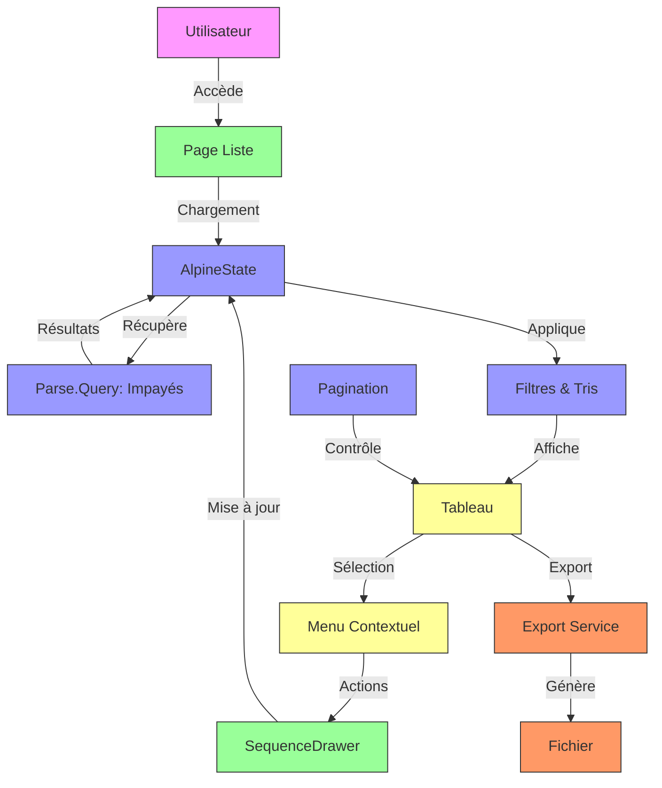
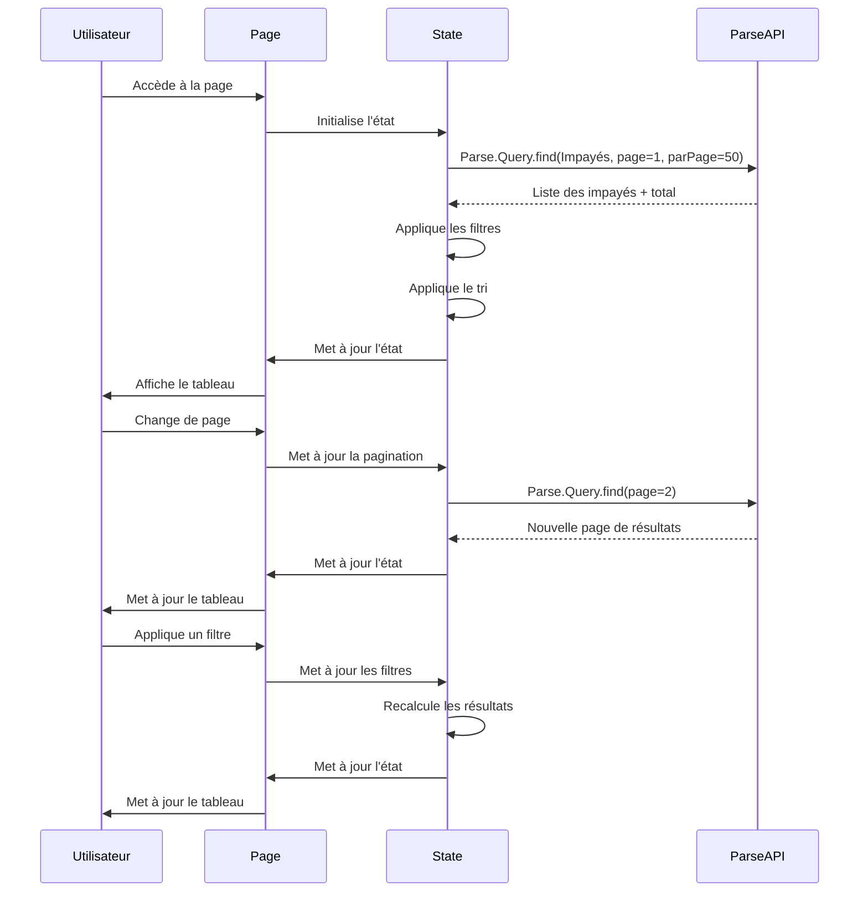
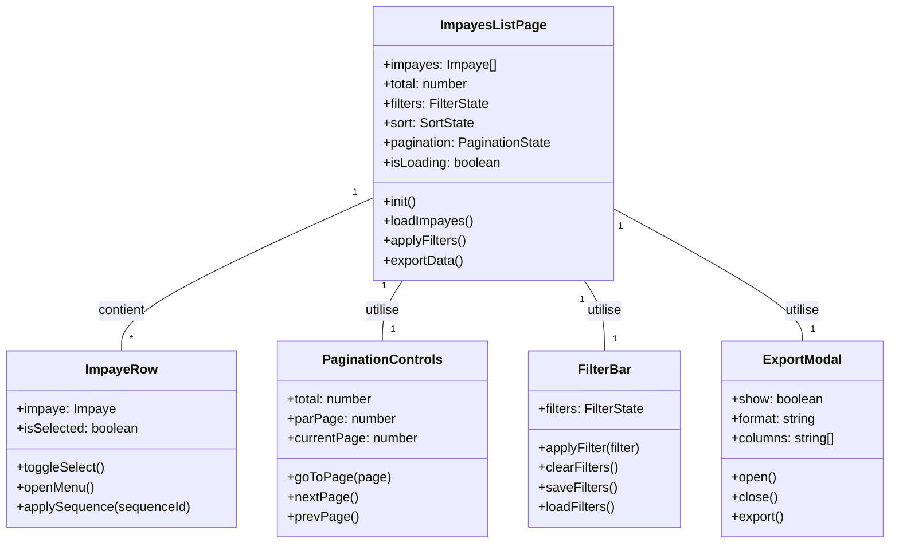
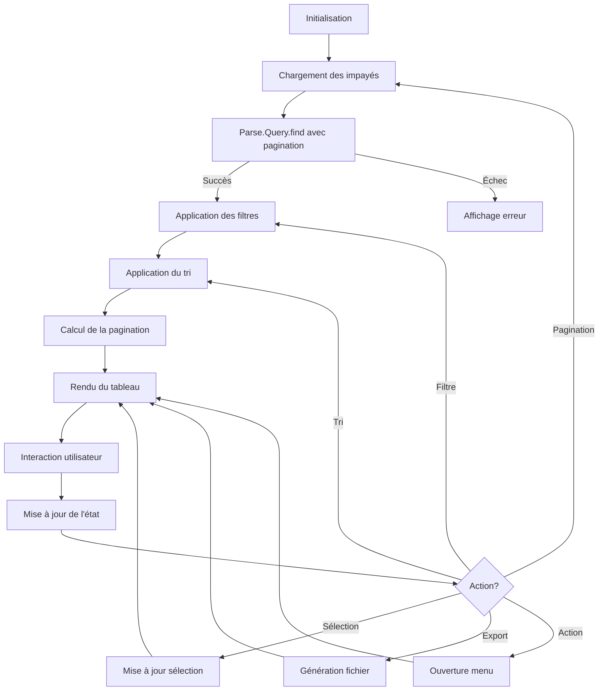

# F10 : Spécifications Techniques - Affichage des Impayés en Liste

## Diagrammes Mermaid

### Architecture Globale


### Flux de Chargement et Affichage


### Structure des Composants


## Architecture Technique

### Couches et Technologies

| Couche          | Technologie      | Responsabilités                          | Fichiers Clés                     |
|-----------------|------------------|-----------------------------------------|-----------------------------------|
| **Présentation** | Astro            | Structure HTML, layout                   | `src/pages/impayes/list.astro`    |
| **État**        | Alpine.js        | Gestion de l'état réactif                | `public/js/pages/impayesListState.js`|
| **Store**       | Alpine.js        | Gestion des données partagées           | `public/js/stores/impayesBaseStore.js`|
| **Style**       | Tailwind CSS     | Design et responsive                     | Fichiers Astro (style)            |
| **Icônes**      | Lucide Astro     | Icônes vectorielles                      | Import Lucide                     |
| **Backend**     | Parse SDK        | Récupération des données                 | Parse.Query                       |
| **Export**      | JavaScript       | Génération de fichiers                   | Fonctions d'export                |
| **Notifications**| Alpine.js       | Feedback utilisateur                     | Notifications inline              |

### Structure des Fichiers

```bash
src/
└── pages/
    └── impayes/
        └── list.astro               # Page de liste
        
public/
└── js/
    ├── pages/
    │   └── impayesListState.js     # État de la page
    ├── stores/
    │   └── impayesBaseStore.js      # Store partagé
    └── components/
        └── ImpayeRow.js             # Ligne du tableau
        
components/
└── sequences/
    └── SequenceManagementDrawer.astro # Drawer de séquence
```

### Props et État

#### Props de la Page
```typescript
interface ImpayesListProps {
    // Aucune prop - page autonome
}
```

#### État Principal
```typescript
interface ImpayesListState {
    // Données
    impayes: Impaye[];
    total: number;
    isLoading: boolean;
    
    // Filtres
    searchQuery: string;
    amountFilter: { min?: number; max?: number };
    dateFilter: { start?: string; end?: string };
    delayFilter: { min?: number; max?: number };
    statusFilter: string[];
    sequenceFilter: string;
    
    // Tri
    sortBy: string;
    sortDirection: 'asc' | 'desc';
    
    // Pagination
    currentPage: number;
    itemsPerPage: number;
    
    // Sélection
    selectedImpayes: string[];
    
    // Export
    showExportModal: boolean;
    exportFormat: 'csv' | 'excel' | 'pdf';
    exportColumns: string[];
    
    // Méthodes
    loadImpayes(): Promise<void>;
    applyFilters(): void;
    sortImpayes(column: string): void;
    goToPage(page: number): void;
    toggleSelectAll(): void;
    exportData(): void;
}
```

#### Ligne d'Impayé
```typescript
interface ImpayeRow {
    objectId: string;
    nfacture: string;
    payeur_nom: string;
    resteapayer: number;
    datepiece: string;
    joursRetard: number;
    sequence_name: string;
    statut: string;
    isSelected: boolean;
}
```

## Implémentation Détaillée

### Cycle de Vie



### Chargement et Pagination

#### Chargement Initial
```javascript
// Dans impayesListState.js
async function loadImpayes() {
    try {
        this.isLoading = true;
        
        // Construire la requête
        const Impaye = Parse.Object.extend('Impayes');
        const query = new Parse.Query(Impaye);
        
        // Appliquer les filtres
        this.applyQueryFilters(query);
        
        // Appliquer le tri
        this.applyQuerySort(query);
        
        // Appliquer la pagination
        query.skip((this.currentPage - 1) * this.itemsPerPage);
        query.limit(this.itemsPerPage);
        
        // Compter le total
        const totalQuery = new Parse.Query(Impaye);
        this.applyQueryFilters(totalQuery);
        const total = await totalQuery.count();
        
        // Exécuter la requête
        const results = await query.find();
        
        // Convertir en objets simples
        this.impayes = results.map(i => this.convertToSimpleObject(i));
        this.total = total;
        
    } catch (error) {
        console.error('Erreur chargement:', error);
        this.showNotification('Erreur', 'Impossible de charger les impayés', 'error');
    } finally {
        this.isLoading = false;
    }
}

function applyQueryFilters(query) {
    // Filtre de recherche
    if (this.searchQuery) {
        const searchRegex = new RegExp(this.searchQuery, 'i');
        query.matches('nfacture', searchRegex);
        query.matches('payeur_nom', searchRegex);
    }
    
    // Filtre de montant
    if (this.amountFilter.min) {
        query.greaterThanOrEqualTo('resteapayer', this.amountFilter.min);
    }
    if (this.amountFilter.max) {
        query.lessThanOrEqualTo('resteapayer', this.amountFilter.max);
    }
    
    // Filtre de date
    if (this.dateFilter.start) {
        query.greaterThanOrEqualTo('datepiece', new Date(this.dateFilter.start));
    }
    if (this.dateFilter.end) {
        query.lessThanOrEqualTo('datepiece', new Date(this.dateFilter.end));
    }
    
    // Filtre de statut
    if (this.statusFilter.length > 0) {
        query.containedIn('statut', this.statusFilter);
    }
    
    // Filtre de séquence
    if (this.sequenceFilter) {
        query.equalTo('sequence_id', this.sequenceFilter);
    }
}

function applyQuerySort(query) {
    if (this.sortBy) {
        const direction = this.sortDirection === 'asc' ? '' : '-';
        query.addAscending(direction + this.sortBy);
    } else {
        query.descending('datepiece');
    }
}
```

### Filtres et Tris

#### Application des Filtres
```javascript
function applyFilters() {
    // Réinitialiser la pagination
    this.currentPage = 1;
    
    // Recharger les données
    this.loadImpayes();
}

function clearFilters() {
    this.searchQuery = '';
    this.amountFilter = { min: null, max: null };
    this.dateFilter = { start: null, end: null };
    this.delayFilter = { min: null, max: null };
    this.statusFilter = [];
    this.sequenceFilter = '';
    
    this.applyFilters();
}

function saveFilters() {
    const filters = {
        searchQuery: this.searchQuery,
        amountFilter: this.amountFilter,
        dateFilter: this.dateFilter,
        delayFilter: this.delayFilter,
        statusFilter: this.statusFilter,
        sequenceFilter: this.sequenceFilter,
        sortBy: this.sortBy,
        sortDirection: this.sortDirection
    };
    
    localStorage.setItem('impayesListFilters', JSON.stringify(filters));
}

function loadFilters() {
    const saved = localStorage.getItem('impayesListFilters');
    if (saved) {
        const filters = JSON.parse(saved);
        Object.assign(this, filters);
    }
}
```

#### Tri des Colonnes
```javascript
function sortImpayes(column) {
    // Si même colonne, inverser la direction
    if (this.sortBy === column) {
        this.sortDirection = this.sortDirection === 'asc' ? 'desc' : 'asc';
    } else {
        this.sortBy = column;
        this.sortDirection = 'asc';
    }
    
    // Recharger les données
    this.loadImpayes();
}

function getSortIcon(column) {
    if (this.sortBy !== column) return '';
    return this.sortDirection === 'asc' ? '↑' : '↓';
}
```

### Pagination

#### Contrôles de Pagination
```javascript
function goToPage(page) {
    if (page < 1 || page > this.totalPages) return;
    this.currentPage = page;
    this.loadImpayes();
}

function nextPage() {
    if (this.currentPage < this.totalPages) {
        this.currentPage++;
        this.loadImpayes();
    }
}

function prevPage() {
    if (this.currentPage > 1) {
        this.currentPage--;
        this.loadImpayes();
    }
}

function get totalPages() {
    return Math.ceil(this.total / this.itemsPerPage);
}

function get paginationRange() {
    const start = Math.max(1, this.currentPage - 2);
    const end = Math.min(this.totalPages, this.currentPage + 2);
    
    const range = [];
    for (let i = start; i <= end; i++) {
        range.push(i);
    }
    
    return range;
}
```

### Sélection et Actions

#### Gestion de la Sélection
```javascript
function toggleSelectAll() {
    if (this.selectedImpayes.length === this.impayes.length) {
        this.selectedImpayes = [];
    } else {
        this.selectedImpayes = this.impayes.map(i => i.objectId);
    }
}

function toggleSelect(impayeId) {
    const index = this.selectedImpayes.indexOf(impayeId);
    if (index > -1) {
        this.selectedImpayes.splice(index, 1);
    } else {
        this.selectedImpayes.push(impayeId);
    }
}

function isSelected(impayeId) {
    return this.selectedImpayes.includes(impayeId);
}
```

#### Application de Séquence
```javascript
async function applySequenceToSelected(sequenceId) {
    try {
        if (this.selectedImpayes.length === 0) {
            this.showNotification('Info', 'Aucun impayé sélectionné', 'info');
            return;
        }
        
        this.isLoading = true;
        
        // Mettre à jour chaque impayé sélectionné
        const updates = this.selectedImpayes.map(impayeId => {
            const Impaye = Parse.Object.extend('Impayes');
            const impayeToUpdate = new Impaye();
            impayeToUpdate.id = impayeId;
            
            if (sequenceId) {
                // Appliquer la séquence
                const Sequence = Parse.Object.extend('Sequences');
                const sequencePointer = Parse.Object.fromJSON({
                    __type: 'Pointer',
                    className: 'Sequences',
                    objectId: sequenceId
                });
                
                impayeToUpdate.set('sequence', sequencePointer);
                impayeToUpdate.set('sequence_id', sequenceId);
                impayeToUpdate.set('sequence_name', this.sequences.find(s => s.id === sequenceId)?.name || '');
                impayeToUpdate.set('sequence_is_automatic', this.sequences.find(s => s.id === sequenceId)?.is_automatic || false);
            } else {
                // Retirer la séquence
                impayeToUpdate.unset('sequence');
                impayeToUpdate.unset('sequence_id');
                impayeToUpdate.unset('sequence_name');
                impayeToUpdate.unset('sequence_is_automatic');
            }
            
            return impayeToUpdate.save();
        });
        
        // Exécuter les mises à jour
        await Promise.all(updates);
        
        // Recharger les données
        await this.loadImpayes();
        
        // Réinitialiser la sélection
        this.selectedImpayes = [];
        
        this.showNotification('Succès', 'Séquence appliquée avec succès', 'success');
        
    } catch (error) {
        console.error('Erreur application séquence:', error);
        this.showNotification('Erreur', 'Impossible d\'appliquer la séquence', 'error');
    } finally {
        this.isLoading = false;
    }
}
```

### Export des Données

#### Génération de Fichiers
```javascript
function exportToCSV() {
    try {
        // Préparer les données
        const rows = [];
        
        // Header
        rows.push(this.exportColumns.map(c => {
            const labels = {
                nfacture: 'Facture',
                payeur_nom: 'Payeur',
                resteapayer: 'Montant',
                datepiece: 'Date',
                joursRetard: 'Retard',
                sequence_name: 'Séquence',
                statut: 'Statut'
            };
            return labels[c] || c;
        }));
        
        // Données
        this.impayes.forEach(impaye => {
            const row = this.exportColumns.map(column => {
                switch (column) {
                    case 'resteapayer':
                        return formatCurrency(impaye[column]);
                    case 'datepiece':
                        return formatDate(impaye[column]);
                    case 'joursRetard':
                        return this.calculateDaysOverdue(impaye.datepiece);
                    default:
                        return impaye[column] || '';
                }
            });
            rows.push(row);
        });
        
        // Générer le CSV
        let csvContent = "data:text/csv;charset=utf-8,";
        rows.forEach(row => {
            csvContent += row.map(v => `"${v}"`).join(",") + "\r\n";
        });
        
        // Créer le lien de téléchargement
        const encodedUri = encodeURI(csvContent);
        const link = document.createElement("a");
        link.setAttribute("href", encodedUri);
        link.setAttribute("download", `impayes_${new Date().toISOString().slice(0, 10)}.csv`);
        document.body.appendChild(link);
        link.click();
        document.body.removeChild(link);
        
        this.showNotification('Succès', 'Export CSV terminé', 'success');
        this.showExportModal = false;
        
    } catch (error) {
        console.error('Erreur export:', error);
        this.showNotification('Erreur', 'Impossible d\'exporter les données', 'error');
    }
}

function exportToExcel() {
    // Implémentation similaire avec une bibliothèque Excel
    // ou utilisation d'un service backend
}
```

### Accessibilité

#### Navigation Clavier
```html
<!-- Tableau accessible -->
<div class="overflow-x-auto">
    <table
        class="min-w-full divide-y divide-gray-200"
        role="table"
        aria-label="Liste des impayés"
        tabindex="0">
        <thead class="bg-gray-50">
            <tr role="row">
                <th scope="col" class="px-6 py-3 text-left text-xs font-medium text-gray-500 uppercase tracking-wider">
                    <div class="flex items-center">
                        Facture
                        <button @click="sortImpayes('nfacture')" class="ml-1">
                            <span x-text="getSortIcon('nfacture')"></span>
                        </button>
                    </div>
                </th>
                <!-- Autres colonnes -->
            </tr>
        </thead>
        <tbody class="bg-white divide-y divide-gray-200" role="rowgroup">
            <template x-for="impaye in impayes" :key="impaye.objectId">
                <tr
                    role="row"
                    class="hover:bg-gray-50"
                    :class="{ 'bg-blue-50': isSelected(impaye.objectId) }"
                    @click="toggleSelect(impaye.objectId)"
                    @keydown.enter="toggleSelect(impaye.objectId)"
                    tabindex="0">
                    <td class="px-6 py-4 whitespace-nowrap" role="cell">
                        <span x-text="impaye.nfacture"></span>
                    </td>
                    <!-- Autres cellules -->
                </tr>
            </template>
        </tbody>
    </table>
</div>
```

#### ARIA Attributes
```html
<!-- Menu contextuel accessible -->
<div
    x-show="contextMenu.show"
    x-transition
    class="fixed z-50"
    :style="`top: ${contextMenu.y}px; left: ${contextMenu.x}px;`"
    role="menu"
    aria-label="Actions pour l'impayé"
    @click.away="contextMenu.show = false"
    @keydown.escape="contextMenu.show = false"
    tabindex="0">
    <div class="bg-white rounded-md shadow-lg ring-1 ring-black ring-opacity-5">
        <div class="py-1" role="none">
            <button
                @click="openSequenceDrawer(contextMenu.impaye)"
                class="block px-4 py-2 text-sm text-gray-700 hover:bg-gray-100 w-full text-left"
                role="menuitem"
                tabindex="0">
                Appliquer une séquence
            </button>
            <button
                @click="generateRelance(contextMenu.impaye)"
                class="block px-4 py-2 text-sm text-gray-700 hover:bg-gray-100 w-full text-left"
                role="menuitem"
                tabindex="0">
                Générer une relance
            </button>
        </div>
    </div>
</div>
```

## Tests et Validation

### Stratégie de Test

| Type           | Outil      | Couverture                     | Exemples                          |
|----------------|------------|-------------------------------|-----------------------------------|
| **Unitaire**   | Jest       | Fonctions de pagination        | goToPage(), calculateDaysOverdue()|
| **Intégration**| Playwright | Interaction avec Parse         | Chargement et filtrage            |
| **E2E**        | Playwright | Flux utilisateur complet       | Sélection → Action → Vérification |
| **Performance**| Lighthouse| Metrics de performance         | Temps de chargement               |
| **Accessibilité**| Axe      | Conformité WCAG                | Navigation clavier                |

### Scénarios Critiques

1. **Chargement et pagination**
   - Chargement initial réussi
   - Pagination fluide
   - Maintien des filtres
   - Gestion des erreurs

2. **Filtres et tris**
   - Application des filtres
   - Tri par colonne
   - Combinaison de filtres
   - Persistance des filtres

3. **Actions groupées**
   - Sélection multiple
   - Application de séquence
   - Export des données
   - Validation des résultats

4. **Accessibilité**
   - Navigation clavier
   - ARIA attributes
   - Contraste des couleurs
   - Lecteurs d'écran

### Métriques Cibles

| Métrique                | Objectif       |
|-------------------------|---------------|
| Temps de chargement      | < 1.5s        |
| Temps de pagination     | < 300ms       |
| Temps d'export          | < 2s          |
| Score Lighthouse        | > 90          |
| Score Accessibilité     | > 95          |

## Documentation et Maintenance

### Fichiers de Documentation

```bash
docs/
├── specs/
│   ├── fonctionnelles/
│   │   └── F10-invoices-list.md    # Spécifications fonctionnelles
│   └── techniques/
│       └── F10-invoices-list.md    # Ce fichier
└── scenarios/
    └── F10/
        ├── description.md            # Micro-étapes
        ├── console/
        │   ├── loading.log            # Logs de chargement
        │   ├── filtering.log          # Logs de filtrage
        │   └── export.log             # Logs d'export
        └── tests/
            ├── loading.test.js        # Tests chargement
            ├── filtering.test.js      # Tests filtrage
            └── actions.test.js        # Tests actions
```

### Journal des Changements

```markdown
## [1.0.0] - 2024-02-20
### Ajouté
- Vue en liste des impayés
- Pagination et filtrage
- Actions groupées
- Export flexible

### Amélioré
- Performances de chargement
- Accessibilité complète
- Gestion des erreurs

### Corrigé
- Bugs de pagination
- Problèmes de synchronisation
```

### Guide de Dépannage

#### Problème: Pagination ne fonctionne pas
1. Vérifier le calcul du total
2. Vérifier les logs de chargement
3. Tester avec un petit jeu de données
4. Vérifier les paramètres de requête

#### Problème: Filtres non appliqués
1. Vérifier la logique de filtrage
2. Tester chaque filtre individuellement
3. Vérifier les logs
4. Tester avec des données connues

#### Problème: Export échoué
1. Vérifier les permissions
2. Tester avec un petit jeu de données
3. Vérifier le format
4. Tester le téléchargement

## Points d'Extension

1. **Visualisation Avancée**
   - Graphiques interactifs
   - Tableaux de bord personnalisés

2. **Intégrations**
   - CRM et ERP
   - Outils d'analyse externe

3. **Automatisation**
   - Actions automatisées
   - Workflows complexes

4. **Collaboration**
   - Partage des vues
   - Commentaires et annotations

## Priorité et Planification

- **Priorité**: Moyenne
- **Complexité**: Moyenne
- **Effort estimé**: 10-14 heures
- **Dépendances**: Parse SDK, Alpine.js, Tailwind CSS
- **Risques**: Complexité de la pagination, performance avec grands volumes

## Prochaines Étapes

1. Implémenter les micro-étapes
2. Tester l'intégration complète
3. Valider les performances
4. Documenter les workflows
5. Préparer le déploiement
