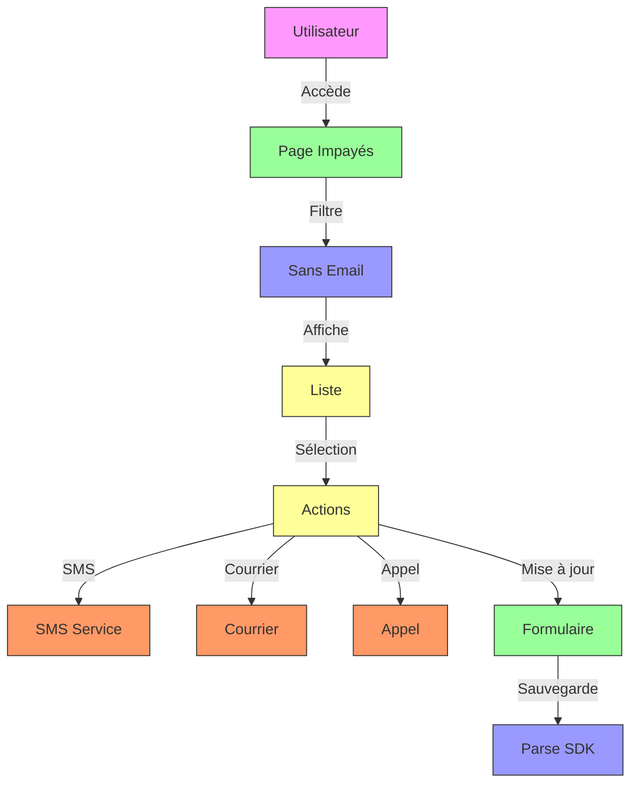
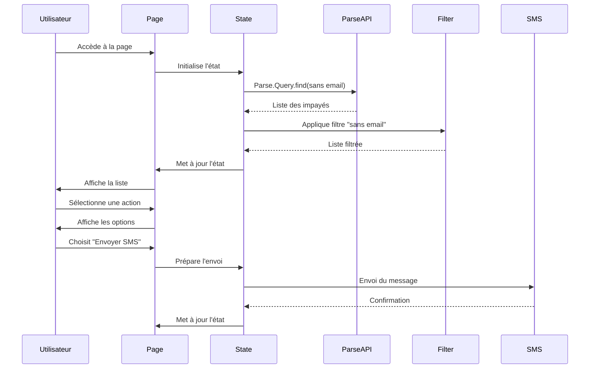
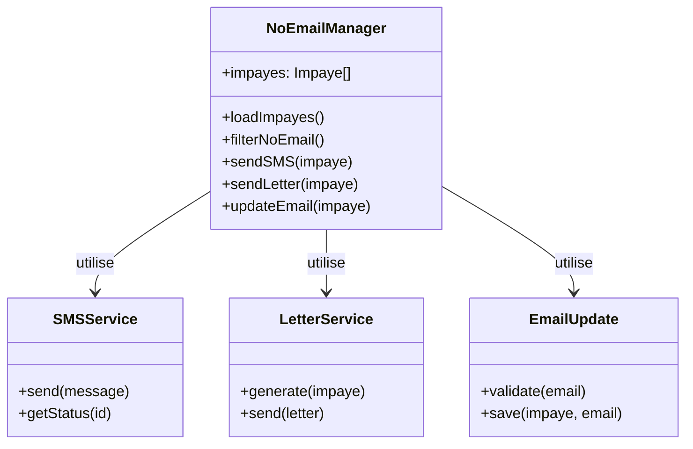

# UC01 : Spécifications Techniques - Gestion des Impayés sans Email

## Diagrammes Mermaid

### Architecture Globale


### Flux Principal


### Structure des Composants


## Architecture Technique

### Couches et Technologies

| Couche          | Technologie      | Responsabilités                          | Fichiers Clés                     |
|-----------------|------------------|-----------------------------------------|-----------------------------------|
| **Présentation** | Astro            | Structure HTML, interface                | `src/pages/impayes/to-fix.astro`  |
| **État**        | Alpine.js        | Gestion de l'état réactif                | `public/js/pages/noEmailState.js` |
| **Backend**     | Parse SDK        | Récupération et mise à jour             | Parse.Query, Parse.Object         |
| **SMS**         | Service Externe  | Envoi de messages texte                  | API externe                      |
| **Courrier**    | Service Externe  | Génération et envoi de lettres           | API externe                      |

### Structure des Fichiers

```bash
src/
└── pages/
    └── impayes/
        └── to-fix.astro          # Page principale
        
public/
└── js/
    └── pages/
        └── noEmailState.js      # État de la page
        
components/
└── no-email/
    ├── SMSForm.astro           # Formulaire SMS
    └── EmailUpdate.astro        # Mise à jour email
```

### Props et État

#### Props de la Page
```typescript
interface NoEmailPageProps {
    // Aucune prop - page autonome
}
```

#### État Principal
```typescript
interface NoEmailState {
    impayes: Impaye[];
    isLoading: boolean;
    selectedImpaye: Impaye | null;
    showSMSForm: boolean;
    showEmailUpdate: boolean;
    smsContent: string;
    newEmail: string;
}
```

#### Impayé sans Email
```typescript
interface ImpayeNoEmail {
    objectId: string;
    nfacture: string;
    payeur_nom: string;
    payeur_email: null;
    payeur_telephone: string;
    resteapayer: number;
    actions: Action[];
}
```

## Implémentation Détaillée

### Chargement et Filtres

#### Chargement Initial
```javascript
async function loadImpayes() {
    try {
        this.isLoading = true;
        
        const Impaye = Parse.Object.extend('Impayes');
        const query = new Parse.Query(Impaye);
        
        // Filtre : uniquement les impayés sans email
        query.doesNotExist('payeur_email');
        
        const results = await query.find();
        this.impayes = results.map(i => this.convertToSimpleObject(i));
        
    } catch (error) {
        console.error('Erreur chargement:', error);
        this.showNotification('Erreur', 'Impossible de charger les impayés', 'error');
    } finally {
        this.isLoading = false;
    }
}
```

### Actions Alternatives

#### Envoi de SMS
```javascript
async function sendSMS(impaye) {
    try {
        this.isLoading = true;
        
        // Préparer le message
        const message = {
            to: impaye.payeur_telephone,
            body: `Bonjour ${impaye.payeur_nom}, votre facture ${impaye.nfacture} est impayée. Montant: ${impaye.resteapayer}€. Merci de régulariser.`
        };
        
        // Envoyer via le service SMS
        const result = await SMSService.send(message);
        
        if (result.success) {
            // Mettre à jour l'historique
            await this.addActionToImpaye(impaye.objectId, {
                type: 'sms',
                statut: 'envoyé',
                date: new Date().toISOString()
            });
            
            this.showNotification('Succès', 'SMS envoyé avec succès', 'success');
        } else {
            this.showNotification('Erreur', 'Échec de l\'envoi du SMS', 'error');
        }
        
    } catch (error) {
        console.error('Erreur SMS:', error);
        this.showNotification('Erreur', 'Impossible d\'envoyer le SMS', 'error');
    } finally {
        this.isLoading = false;
    }
}
```

### Mise à Jour de l'Email
```javascript
async function updateEmail(impaye) {
    try {
        // Validation de l'email
        if (!this.newEmail || !this.validateEmail(this.newEmail)) {
            this.showNotification('Erreur', 'Email invalide', 'error');
            return;
        }
        
        this.isLoading = true;
        
        // Mettre à jour l'impayé
        const Impaye = Parse.Object.extend('Impayes');
        const impayeToUpdate = new Impaye();
        impayeToUpdate.id = impaye.objectId;
        impayeToUpdate.set('payeur_email', this.newEmail);
        
        await impayeToUpdate.save();
        
        // Recharger les données
        await this.loadImpayes();
        
        this.showNotification('Succès', 'Email mis à jour avec succès', 'success');
        this.showEmailUpdate = false;
        this.newEmail = '';
        
    } catch (error) {
        console.error('Erreur mise à jour:', error);
        this.showNotification('Erreur', 'Impossible de mettre à jour l\'email', 'error');
    } finally {
        this.isLoading = false;
    }
}
```

## Tests et Validation

### Stratégie de Test

| Type           | Outil      | Couverture                     | Exemples                          |
|----------------|------------|-------------------------------|-----------------------------------|
| **Unitaire**   | Jest       | Fonctions d'envoi              | sendSMS(), updateEmail()          |
| **Intégration**| Playwright | Interaction avec les services  | Envoi SMS, mise à jour email      |
| **E2E**        | Playwright | Flux utilisateur complet       | Identification → Action → Résultat |
| **Performance**| Lighthouse| Metrics de performance         | Temps de chargement               |

### Scénarios Critiques

1. **Envoi de SMS réussi**
   - Validation du numéro
   - Envoi réussi
   - Mise à jour de l'historique

2. **Mise à jour de l'email**
   - Validation de l'email
   - Sauvegarde réussie
   - Rechargement des données

3. **Échec de l'envoi**
   - Gestion de l'erreur
   - Notification utilisateur
   - Pas de blocage

### Métriques Cibles

| Métrique                | Objectif       |
|-------------------------|---------------|
| Temps de chargement      | < 2s          |
| Temps d'envoi SMS       | < 1s          |
| Temps de mise à jour    | < 500ms       |
| Score Lighthouse        | > 90          |

## Documentation et Maintenance

### Fichiers de Documentation

```bash
docs/
├── specs/
│   ├── fonctionnelles/
│   │   └── UC01-no-email.md      # Spécifications fonctionnelles
│   └── techniques/
│       └── UC01-no-email.md      # Ce fichier
└── scenarios/
    └── UC01/
        ├── description.md        # Micro-étapes
        ├── console/
        │   ├── sms.log             # Logs SMS
        │   └── update.log          # Logs mise à jour
        └── tests/
            ├── sms.test.js       # Tests SMS
            └── update.test.js    # Tests mise à jour
```

### Journal des Changements

```markdown
## [1.0.0] - 2024-02-20
### Ajouté
- Gestion des impayés sans email
- Actions alternatives (SMS, courrier)
- Mise à jour des informations

### Amélioré
- Performances de chargement
- Gestion des erreurs

### Corrigé
- Bugs d'envoi SMS
- Problèmes de validation
```

### Guide de Dépannage

#### Problème: Envoi SMS échoué
1. Vérifier le numéro de téléphone
2. Vérifier le service SMS
3. Tester avec un numéro connu
4. Vérifier les logs

#### Problème: Mise à jour échouée
1. Vérifier le format de l'email
2. Vérifier les permissions
3. Tester avec un email connu
4. Vérifier les logs

## Priorité et Planification

- **Priorité** : Moyenne
- **Complexité** : Moyenne
- **Effort estimé** : 8-12 heures
- **Dépendances** : Parse SDK, SMS Service, Email Service

## Prochaines Étapes

1. Implémenter les micro-étapes
2. Tester l'intégration complète
3. Valider les performances
4. Documenter les workflows
