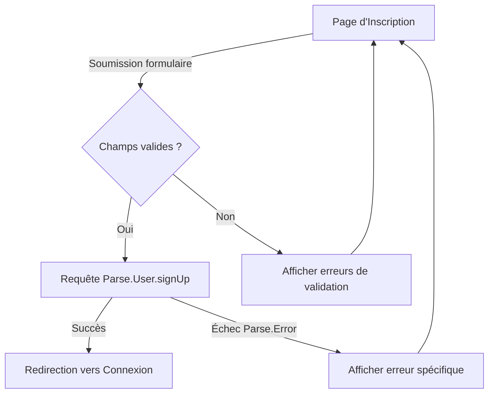

 - **preparation**: 
   - [] lancer le script: getParseData.sh et ensuite lire le fichier data-model.md.
   - [] lire le contenu du dossier guides/. Tous les fichiers.
  - **action  à faire en RESPECTANT les guides** : # **📌 Feature : Gestion des Profils Utilisateurs (Création/Édition/Visualisation)**
---

## **📋 User Story (US)**
**Titre** : US001 - Création d'un profil utilisateur avec validation des champs
**En tant que** [Utilisateur non enregistré]
**Je veux** créer un profil avec un email, un pseudo, un mot de passe et une confirmation de mot de passe
**Afin de** pouvoir accéder aux fonctionnalités réservées aux membres.

### **Critères d'acceptation** (Gherkin)
```gherkin
Scénario 1 : Création réussie avec tous les champs valides
  Étant donné que je suis sur la page d'inscription
  Quand je saisis un email valide, un pseudo unique, un mot de passe conforme (8+ caractères, 1 majuscule, 1 chiffre)
    Et que je confirme le mot de passe identique
    Et que je clique sur "S'inscrire"
  Alors une requête Parse.User.signUp est envoyée
    Et mon compte est créé dans Parse Server
    Et je suis redirigé vers la page de connexion
    Et un email de confirmation est envoyé (si activé)

Scénario 2 : Échec - Email déjà utilisé
  Étant donné que je suis sur la page d'inscription
  Quand je saisis un email déjà enregistré
    Et que je complète les autres champs valides
    Et que je clique sur "S'inscrire"
  Alors je vois un message d'erreur "Cet email est déjà utilisé"
    Et je reste sur la page d'inscription

Scénario 3 : Échec - Mot de passe non conforme
  Étant donné que je suis sur la page d'inscription
  Quand je saisis un mot de passe ne respectant pas les critères (ex: "password")
    Et que je clique sur "S'inscrire"
  Alors je vois un message d'erreur "Le mot de passe doit contenir au moins 8 caractères, une majuscule et un chiffre"
    Et le champ mot de passe est mis en surbrillance rouge (Tailwind: border-red-500)
```

---
## **🎨 Écrans ASCII**
### **Écran 1 : Page d'Inscription**
```plaintext
+-------------------------------------+
|          INSCRIPTION                |
+-------------------------------------+
|                                     |
| [Champ: Email] (type="email")       |
| [Champ: Pseudo] (minlength="3")     |
| [Champ: Mot de passe] (type="password") |
| [Champ: Confirmer mot de passe]     |
|                                     |
| [✅] J'accepte les CGU              |
|                                     |
| [Bouton: S'inscrire] (Alpine.js: @click="register()") |
| [Lien: Déjà un compte ? Se connecter] |
|                                     |
+-------------------------------------+
```
**Notes** :
- Le bouton "S'inscrire" est désactivé si les champs sont invalides ou vides (Alpine.js : `x-bind:disabled`).
- Style Tailwind : `bg-green-500 hover:bg-green-700` pour le bouton, `border-red-500` pour les erreurs.

---
## **🔄 Diagramme Mermaid - Flux Complet**


---
## **📝 Fonctions à Développer**
### **validateEmail**
**Params** :
- `email` (string) : Adresse email à valider.

**Description** :
- Vérifie que l'email est au format valide (regex standard).
- Vérifie que l'email n'est pas déjà utilisé via une requête Parse (Parse.Cloud.run ou Parse.Query).

**Retour** :
- `{ isValid: boolean, message: string }` (ex: `{ isValid: false, message: "Email déjà utilisé" }`).

---

### **validatePassword**
**Params** :
- `password` (string) : Mot de passe à valider.

**Description** :
- Vérifie que le mot de passe contient :
  - Au moins 8 caractères.
  - Au moins 1 majuscule.
  - Au moins 1 chiffre.
- Compare avec le champ "Confirmer mot de passe" si fourni.

**Retour** :
- `{ isValid: boolean, message: string }` (ex: `{ isValid: false, message: "Le mot de passe doit contenir une majuscule" }`).

---

### **registerUser**
**Params** :
- `userData` (object) : `{ email: string, username: string, password: string }`.

**Description** :
- Envoie une requête `Parse.User.signUp` avec les données utilisateur.
- Gère les erreurs Parse (ex: email déjà utilisé, pseudo trop court).
- Stocke le token Parse dans `localStorage` si "Se souvenir de moi" est coché.

**Retour** :
- `{ success: boolean, user: Parse.User | null, error: string | null }`.

---

### **sendConfirmationEmail**
**Params** :
- `userId` (string) : ID de l'utilisateur Parse.

**Description** :
- Envoie un email de confirmation via Parse Cloud Code (si configuré).
- Utilise un template d'email personnalisé (ex: lien de validation avec token JWT).

**Retour** :
- `{ success: boolean, error: string | null }`.
