 - **preparation**: 
   - [] lancer le script: getParseData.sh et ensuite lire le fichier data-model.md.
   - [] lire le contenu du dossier guides/. Tous les fichiers.
  - **action  à faire en RESPECTANT les guides** : ## **📋 User Story (US)**
**Titre** : US003 - Intégration des liens de facture dans les emails avec gestion des erreurs
**En tant que** [Utilisateur final]
**Je veux** recevoir un email avec un lien de téléchargement valide pour ma facture
**Afin de** consulter ou télécharger ma facture facilement.

### **Critères d'acceptation** (Gherkin)
```gherkin
Scénario 1 : Envoi réussi avec lien valide
  Étant donné qu'une facture "INV-2023-001.pdf" existe sur le serveur FTP
    Et que la configuration FTP est valide
  Quand le système envoie un email pour cette facture
  Alors l'email contient :
    - Un lien de téléchargement cliquable
    - Le nom du fichier ("INV-2023-001.pdf")
    - Une date d'expiration du lien (24h)
    Et l'email est marqué comme "envoyé" dans Parse Server

Scénario 2 : Envoi bloqué (fichier inexistant)
  Étant donné qu'une facture "INV-2023-999.pdf" n'existe pas sur le serveur FTP
  Quand le système tente d'envoyer un email pour cette facture
  Alors l'envoi est bloqué
    Et une erreur est journalisée dans Parse Server
    Et l'utilisateur reçoit un email de notification "Votre facture n'est pas encore disponible"

Scénario 3 : Échec de téléchargement après envoi
  Étant donné qu'un email a été envoyé avec un lien de téléchargement valide
  Quand l'utilisateur clique sur le lien après expiration (24h)
  Alors il voit une page "Lien expiré ou invalide"
    Et une erreur est journalisée dans Parse Server
```

---

## **🎨 Écrans ASCII**
### **Écran 1 : Email envoyé (template HTML)**
```plaintext
+-------------------------------------+
|          VOTRE FACTURE              |
+-------------------------------------+
|                                     |
| Bonjour [Prénom],                   |
|                                     |
| Votre facture est disponible :      |
|                                     |
| [📄 INV-2023-001.pdf]               |
|                                     |
| [Bouton: Télécharger la facture]    |
| (Lien: /api/download?token=XYZ)     |
|                                     |
| Ce lien expire le [date d'expiration]. |
|                                     |
| Cordialement,                       |
| L'équipe [Nom de l'entreprise]      |
+-------------------------------------+
```
**Notes** :
- Style Tailwind pour le bouton : `bg-blue-500 text-white px-4 py-2 rounded`.
- Le lien est généré dynamiquement via `generateDownloadLink`.

---

## **🔄 Diagramme Mermaid - Flux complet d'envoi d'email**

```mermaid
flowchart TD
    A[Déclenchement envoi email] --> B{Vérifier existence fichier}
    B -->|Existe| C[Générer lien téléchargement]
    C --> D[Préparer template email]
    D --> E[Envoyer email via Parse Server]
    E --> F[Marquer email comme envoyé]
    B -->|Inexistant| G[Journaliser erreur]
    G --> H[Envoyer email de notification]
    H --> I[Marquer email comme bloqué]
    E -->|Échec envoi| J[Journaliser erreur email]
    J --> K[Planifier nouvelle tentative]
```


---

## **📝 Fonctions à Développer**
### **1. `sendInvoiceEmail` (Parse Cloud Function)**
**Params** :
- `invoiceId` (String) : Identifiant de la facture.
- `recipientEmail` (String) : Email du destinataire.
- `recipientName` (String) : Nom du destinataire.

**Description** :
1. Appelle `checkInvoiceFileExists` pour vérifier l'existence du fichier.
2. Si le fichier existe :
   - Génère un lien de téléchargement via `generateDownloadLink`.
   - Prépare le template email avec Alpine.js (ex: `emailTemplate.html`).
   - Envoie l'email via Parse Server (utilisation de `Parse.Cloud.sendEmail` ou un service tiers comme SendGrid).
   - Marque l'email comme "envoyé" dans Parse Server (classe `SentEmails`).
3. Si le fichier n'existe pas :
   - Journalise l'erreur via `logEmailError`.
   - Envoie un email de notification "Facture non disponible".

**Retour** :
```typescript
{
  success: boolean,
  emailId?: string, // ID de l'email envoyé (Parse Server)
  error?: string    // Détails de l'erreur si applicable
}
```

### **2. `handleDownloadRequest` (Astro API Endpoint)**
**Params** :
- `token` (String) : Token de signature du lien.
- `file` (String) : Nom du fichier (ex: "INV-2023-001.pdf").

**Description** :
1. Vérifie la validité du token dans `DownloadTokens` (Parse Server).
2. Si le token est valide et non expiré :
   - Récupère la configuration FTP via `getFtpConfig`.
   - Télécharge le fichier depuis le serveur FTP et le stream vers le client.
3. Si le token est invalide ou expiré :
   - Affiche une page d'erreur "Lien expiré ou invalide".
   - Journalise l'erreur via `logEmailError`.

**Retour** :
- **Succès** : Stream du fichier (HTTP 200 avec `Content-Disposition: attachment`).
- **Échec** : Page HTML d'erreur (HTTP 403 ou 404).

### **3. `prepareEmailTemplate` (Frontend Alpine.js)**
**Params** :
- `downloadLink` (String) : Lien de téléchargement généré.
- `invoiceId` (String) : Identifiant de la facture.
- `expiresAt` (Date) : Date d'expiration du lien.
- `recipientName` (String) : Nom du destinataire.

**Description** :
1. Utilise Alpine.js pour injecter les données dynamiques dans un template HTML.
2. Applique les styles Tailwind pour le bouton et la mise en page.
3. Retourne le HTML prêt à être envoyé.

**Retour** :
```html
<div class="max-w-md mx-auto p-6 bg-white rounded-lg shadow-md">
  <h1 class="text-xl font-bold mb-4">Votre facture</h1>
  <p class="mb-4">Bonjour ${recipientName},</p>
  <p class="mb-4">Votre facture est disponible :</p>
  <div class="mb-4">
    <a href="${downloadLink}" class="bg-blue-500 text-white px-4 py-2 rounded hover:bg-blue-700">
      Télécharger ${invoiceId}.pdf
    </a>
  </div>
  <p class="text-sm text-gray-500">Ce lien expire le ${expiresAt.toLocaleDateString()}.</p>
</div>
```
