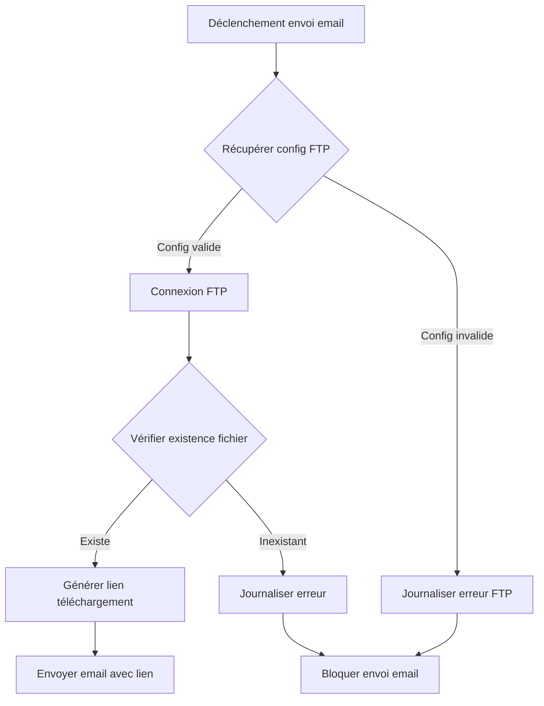

 - **preparation**: 
   - [] lancer le script: getParseData.sh et ensuite lire le fichier data-model.md.
   - [] lire le contenu du dossier guides/. Tous les fichiers.
  - **action  à faire en RESPECTANT les guides** : ## **📋 User Story (US)**
**Titre** : US002 - Vérification de l'existence des fichiers de facture avant envoi email
**En tant que** [Système d'envoi d'emails]
**Je veux** vérifier que les fichiers de facture existent sur le serveur FTP avant de générer un lien de téléchargement
**Afin de** éviter d'envoyer des emails avec des liens invalides.

### **Critères d'acceptation** (Gherkin)
```gherkin
Scénario 1 : Fichier existant
  Étant donné que la configuration FTP est valide
    Et qu'un fichier de facture "INV-2023-001.pdf" existe dans le dossier racine FTP
  Quand le système vérifie l'existence du fichier avant envoi
  Alors il retourne un statut "existe"
    Et génère un lien de téléchargement valide

Scénario 2 : Fichier inexistant
  Étant donné que la configuration FTP est valide
    Et qu'un fichier "INV-2023-999.pdf" n'existe pas dans le dossier racine FTP
  Quand le système vérifie l'existence du fichier avant envoi
  Alors il retourne un statut "inexistant"
    Et bloque l'envoi de l'email
    Et journalise l'erreur dans Parse Server (classe `EmailErrors`)
```

---

## **🎨 Écrans ASCII**
*(Aucun écran utilisateur pour cette US, flux backend uniquement.)*

---

## **🔄 Diagramme Mermaid - Flux de vérification FTP**


---

## **📝 Fonctions à Développer**
### **1. `checkInvoiceFileExists` (Parse Cloud Function)**
**Params** :
- `invoiceId` (String) : Identifiant de la facture (ex: "INV-2023-001").
- `fileExtension` (String) : Extension du fichier (ex: "pdf").

**Description** :
1. Récupère la configuration FTP via `getFtpConfig`.
2. Établit une connexion FTP avec `basic-ftp`.
3. Vérifie l'existence du fichier dans le dossier racine (ex: `/invoices/INV-2023-001.pdf`).
4. Retourne un statut et un chemin complet si le fichier existe.

**Retour** :
```typescript
{
  exists: boolean,
  filePath?: string, // Chemin complet si existe (ex: "/invoices/INV-2023-001.pdf")
  error?: string     // Détails de l'erreur si applicable
}
```

### **2. `generateDownloadLink` (Parse Cloud Function)**
**Params** :
- `filePath` (String) : Chemin complet du fichier sur le serveur FTP (ex: "/invoices/INV-2023-001.pdf").

**Description** :
1. Génère un lien de téléchargement signé (ex: `/api/download?token=XYZ&file=INV-2023-001.pdf`).
2. Stocke le token de signature dans Parse Server (classe `DownloadTokens`) avec une durée de validité (ex: 24h).
3. Retourne le lien généré.

**Retour** :
```typescript
{
  downloadLink: string, // URL complète du lien de téléchargement
  expiresAt: Date       // Date d'expiration du lien
}
```

### **3. `logEmailError` (Parse Cloud Function)**
**Params** :
- `invoiceId` (String) : Identifiant de la facture.
- `errorType` (String) : Type d'erreur (ex: "FILE_NOT_FOUND", "FTP_CONNECTION_FAILED").
- `details` (String) : Détails de l'erreur.

**Description** :
1. Crée une entrée dans la classe `EmailErrors` de Parse Server avec :
   - `invoiceId`
   - `errorType`
   - `details`
   - `timestamp`
   - `status` ("BLOCKED" ou "RETRY_PENDING").

**Retour** :
```typescript
{
  success: boolean,
  error?: string
}
```

---
