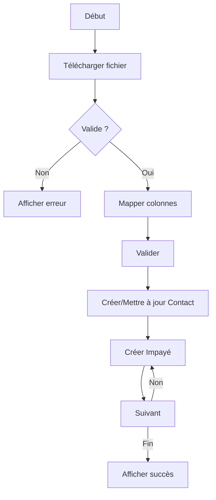
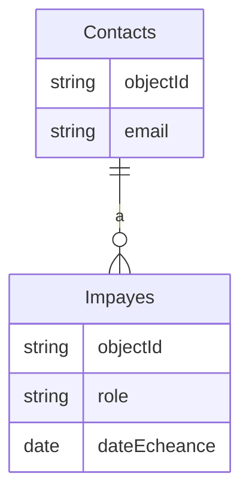

 - **preparation**: 
   - [] lancer le script: getParseData.sh et ensuite lire le fichier data-model.md.
   - [] lire le contenu du dossier guides/. Tous les fichiers.
  - **action  à faire en RESPECTANT les guides** : 

# **1. Contexte et Objectifs**
**Feature** : Permettre aux utilisateurs d'importer manuellement des impayés depuis un fichier CSV/Excel, avec gestion des rôles par impayé.
**Acteurs** : Utilisateurs avec rôle "admin" ou "comptable".
**Prérequis** :
- Connexion active (token Parse valide en `sessionStorage`/`localStorage`).
- Fichier CSV/Excel respectant le format défini.

---

# **2. Spécifications Fonctionnelles**
## **2.1. Description Gherkin**
```
Scénario principal : Import réussi avec rôles par impayé
  Étant donné que je suis connecté(e) en tant qu'admin
  Et que je suis sur la page "/import/manual"
  Quand je télécharge un fichier "impayes.csv" avec :
    | email_contact       | montant | date_echeance | role_contact   | url_facture          |
    | oswald@steriods.com | 1200.50 | 2026-01-15    | payeur         | ftp://files/INV-01.pdf |
    | oswald@steriods.com | 850.00  | 2026-02-01    | apporteur      | ftp://files/INV-02.pdf |
  Et que je mappe les colonnes :
    - email_contact → Email
    - montant → Montant
    - date_echeance → Échéance
    - role_contact → Rôle
    - url_facture → URL Facture
  Quand je clique sur "Valider"
  Alors le système :
    1. Crée un contact unique pour "oswald@steriods.com" (si inexistant)
    2. Crée 2 impayés avec les rôles respectifs
    3. Affiche "2 impayés importés avec succès"

Scénario d'erreur : Fichier invalide
  Étant donné un fichier sans colonne "email_contact"
  Quand je tente de valider
  Alors un message "Colonne Email obligatoire" s'affiche
```

## **2.2. Format du Fichier CSV**
```csv
email_contact,montant,date_echeance,role_contact,url_facture,num_facture
oswald@steriods.com,1200.50,2026-01-15,payeur,ftp://files/INV-01.pdf,INV-01
oswald@steriods.com,850.00,2026-02-01,apport. affaires,ftp://files/INV-02.pdf,INV-02
```
**Colonnes obligatoires** : `email_contact`, `montant`, `date_echeance`, `role_contact`.
**Colonnes optionnelles** : `url_facture`, `num_facture`.

---

# **3. Interface Utilisateur**
## **3.1. Maquette ASCII**
```
+-----------------------------------------------------+
| IMPORT MANUEL (CSV/EXCEL)                           |
|                                                     |
| [Sélectionner un fichier] [Télécharger modèle]      |
|                                                     |
| Aperçu (5 premières lignes) :                       |
| +----------------+--------+-------------+-----------+
| | Email          | Montant| Échéance    | Rôle      |
| +----------------+--------+-------------+-----------+
| | o.bernard@...  | 1200.50| 15/01/2026  | payeur    |
| | o.bernard@...  | 850.00 | 01/02/2026  | apporteur |
| +----------------+--------+-------------+-----------+
|                                                     |
| Mapping des colonnes :                              |
| [Email]          ▼ [email_contact]                  |
| [Montant]        ▼ [montant]                        |
| [Échéance]       ▼ [date_echeance]                  |
| [Rôle]           ▼ [role_contact]                   |
| [URL Facture]    ▼ [url_facture]                    |
|                                                     |
| [Valider] [Annuler]                                 |
|                                                     |
| [✓] Ignorer la première ligne (en-têtes)            |
+-----------------------------------------------------+
```

## **3.2. Messages Utilisateur**
| Situation                     | Message                                                                 |
|-------------------------------|-------------------------------------------------------------------------|
| Import réussi                 | "{X} impayés importés avec succès."                                    |
| Fichier vide                  | "Le fichier est vide ou corrompu."                                      |
| Email manquant                | "La colonne Email est obligatoire."                                     |
| Rôle invalide                 | "Le rôle doit être 'payeur' ou 'apport. affaires'."                     |
| Date invalide                 | "Format de date incorrect (attendu: JJ/MM/AAAA)."                      |
| Erreur réseau                 | "Erreur de connexion. Vérifiez votre réseau et réessayez."              |
| Token expiré                  | "Votre session a expiré. Veuillez vous reconnecter." (redirection vers login) |

---

# **4. Implémentation Technique**
## **4.1. Stack Utilisée**
- **Frontend** : Alpine.js + Axios
- **Backend** : Parse Server (API REST)
- **Stockage** : Parse Classes (`Contacts`, `Impayes`)

## **4.2. Classes Parse**
### **`Contacts`**
```javascript
{
  objectId: String,       // Généré par Parse
  email: String,          // Unique, indexé
  nom: String,            // Optionnel (ex: "Oswald")
  createdAt: Date,        // Automatique
  updatedAt: Date         // Automatique
}
```

### **`Impayes`**
```javascript
{
  objectId: String,
  contactId: Pointer<Contacts>,  // Lié au contact
  montant: Number,               // Montant de l'impayé
  dateEcheance: Date,            // Date d'échéance
  role: String,                  // "payeur" ou "apport. affaires"
  statut: String,                // "non_payé" (par défaut)
  urlFacture: String,            // URL vers la facture (FTP)
  numFacture: String,            // Numéro de facture
  source: String,                // "import_manuel"
  metadata: {
    importedBy: Pointer<_User>,  // Utilisateur ayant importé
    importedAt: Date,            // Date d'import
    fileName: String             // Nom du fichier source
  }
}
```

---

## **4.3. Code Frontend (Alpine.js + Axios)**
### **4.3.1. Composant d'Import**
```html
<div x-data="csvImporter()" class="p-4">
  <input type="file" @change="handleFile" accept=".csv,.xlsx" />

  <div x-show="preview.length > 0">
    <table>
      <!-- Aperçu des données (voir maquette ASCII) -->
    </table>

    <div class="mt-4">
      <select x-model="mapping.email">
        <option value="email_contact">Email</option>
      </select>
      <!-- Autres mappings -->
    </div>

    <button @click="validateImport" :disabled="loading">
      <span x-text="loading ? 'Import en cours...' : 'Valider'"></span>
    </button>
  </div>

  <div x-show="error" class="text-red-500" x-text="error"></div>
</div>

<script>
document.addEventListener('alpine:init', () => {
  Alpine.data('csvImporter', () => ({
    file: null,
    preview: [],
    mapping: {
      email: 'email_contact',
      amount: 'montant',
      dueDate: 'date_echeance',
      role: 'role_contact',
      url: 'url_facture',
      num: 'num_facture'
    },
    loading: false,
    error: null,

    async handleFile(e) {
      this.file = e.target.files[0];
      this.preview = await this.parseCSV(this.file);
    },

    async validateImport() {
      this.loading = true;
      this.error = null;
      try {
        const results = await this.importCSV();
        alert(`${results.length} impayés importés!`);
      } catch (err) {
        this.error = err.message;
      } finally {
        this.loading = false;
      }
    },

    async parseCSV(file) {
      return new Promise((resolve) => {
        Papa.parse(file, {
          header: true,
          complete: (results) => resolve(results.data.slice(0, 5)), // Aperçu 5 lignes
          error: (err) => { throw new Error("Fichier invalide"); }
        });
      });
    },

    async importCSV() {
      const data = await this.parseFullCSV(this.file);
      const results = [];
      for (const row of data) {
        if (!row[this.mapping.email]) {
          throw new Error("Email manquant sur une ligne");
        }
        const contact = await this.findOrCreateContact(row[this.mapping.email]);
        const impaye = await this.createImpaye(contact.objectId, row);
        results.push(impaye);
      }
      return results;
    },

    async findOrCreateContact(email) {
      // Voir section 4.4.1
    },

    async createImpaye(contactId, row) {
      // Voir section 4.4.2
    }
  }));
});
</script>
```

### **4.3.2. Gestion des Erreurs**
```javascript
// Dans importCSV()
if (!['payeur', 'apport. affaires'].includes(row[this.mapping.role])) {
  throw new Error(`Rôle invalide: ${row[this.mapping.role]}`);
}

const date = new Date(row[this.mapping.dueDate]);
if (isNaN(date.getTime())) {
  throw new Error(`Date invalide: ${row[this.mapping.dueDate]}`);
}
```

---

## **4.4. Requêtes Axios**
### **4.4.1. Recherche/Création d'un Contact**
```javascript
async findOrCreateContact(email) {
  // 1. Recherche
  const response = await axios.get('/parse/classes/Contacts', {
    params: { where: JSON.stringify({ email }) },
    headers: this.parseHeaders()
  });

  let contact = response.data.results[0];
  if (!contact) {
    // 2. Création si inexistant
    contact = await axios.post('/parse/classes/Contacts', {
      email: email,
      nom: email.split('@')[0]
    }, { headers: this.parseHeaders() });
  }
  return contact.data;
}
```

### **4.4.2. Création d'un Impayé**
```javascript
async createImpaye(contactId, row) {
  const response = await axios.post('/parse/classes/Impayes', {
    contactId: { __type: 'Pointer', className: 'Contacts', objectId: contactId },
    montant: parseFloat(row[this.mapping.amount]),
    dateEcheance: { __type: 'Date', iso: new Date(row[this.mapping.dueDate]).toISOString() },
    role: row[this.mapping.role],
    statut: 'non_payé',
    urlFacture: row[this.mapping.url],
    numFacture: row[this.mapping.num],
    source: 'import_manuel',
    metadata: {
      importedBy: { __type: 'Pointer', className: '_User', objectId: currentUserId },
      fileName: this.file.name
    }
  }, { headers: this.parseHeaders() });
  return response.data;
}
```

### **4.4.3. Headers Communs**
```javascript
parseHeaders() {
  return {
    'X-Parse-Application-Id': 'TON_APP_ID',
    'X-Parse-REST-API-Key': 'TON_REST_KEY',
    'X-Parse-Session-Token': localStorage.getItem('parseToken'),
    'Content-Type': 'application/json'
  };
}
```

---

## **4.5. Optimisations**
### **4.5.1. Batch Requests**
Pour les fichiers > 10 lignes, utilise `/parse/batch` :
```javascript
async importCSV() {
  const data = await this.parseFullCSV(this.file);
  const requests = data.map(row => ({
    method: "POST",
    path: "/classes/Impayes",
    body: this.buildImpayeBody(row)
  }));

  const response = await axios.post('/parse/batch', { requests }, {
    headers: this.parseHeaders()
  });
  return response.data;
}
```

### **4.5.2. Téléchargement du Modèle**
```javascript
downloadTemplate() {
  const csv = "email_contact,montant,date_echeance,role_contact,url_facture,num_facture\noswald@steriods.com,1200.50,2026-01-15,payeur,,INV-01";
  const blob = new Blob([csv], { type: 'text/csv' });
  const url = URL.createObjectURL(blob);
  const a = document.createElement('a');
  a.href = url;
  a.download = 'modele_impayes.csv';
  a.click();
}
```

---

# **5. Validation et Tests**
## **5.1. Cas de Test**
| Scénario                          | Résultat Attendu                          |
|-----------------------------------|-------------------------------------------|
| Fichier CSV valide                | 2 impayés créés avec rôles distincts      |
| Email dupliqué                    | 1 contact créé, 2 impayés liés           |
| Rôle invalide ("client")          | Erreur "Rôle invalide"                    |
| Date invalide ("32/01/2026")      | Erreur "Format de date incorrect"         |
| Token expiré                      | Redirection vers `/login?expired=true`    |

## **5.2. Tests Axios (Exemple avec Jest)**
```javascript
test('createImpaye devrait retourner un objectId', async () => {
  const response = await createImpaye('contact123', {
    montant: 100,
    date_echeance: '2026-01-01',
    role_contact: 'payeur'
  });
  expect(response.objectId).toBeDefined();
});
```

---

# **6. Diagrammes**
## **6.1. Flux d'Import**


## **6.2. Structure des Données**


---

# **7. Annexes**
## **7.1. Exemple de Fichier CSV Valide**
```csv
email_contact,montant,date_echeance,role_contact,url_facture,num_facture
oswald@steriods.com,1200.50,15/01/2026,payeur,ftp://files/INV-01.pdf,INV-01
jane.doe@example.com,850.00,01/02/2026,apport. affaires,ftp://files/INV-02.pdf,INV-02
```

## **7.2. Journal des Changements**
| Version | Date       | Modifications                                  |
|---------|------------|------------------------------------------------|
| 1.0     | 16/02/2026 | Version initiale avec Axios et rôles par impayé |
| 1.1     | 17/02/2026 | Ajout du batch processing                      |

## **7.3. Points d'Attention**
- **Performances** : Pour les fichiers > 100 lignes, envisager un traitement côté serveur (fastify).
- **Sécurité** : Valider les URLs des factures (format `ftp://...` autorisé).
- **Compatibilité** : Tester avec Excel (.xlsx) via `SheetJS` en plus de `PapaParse`.

---
