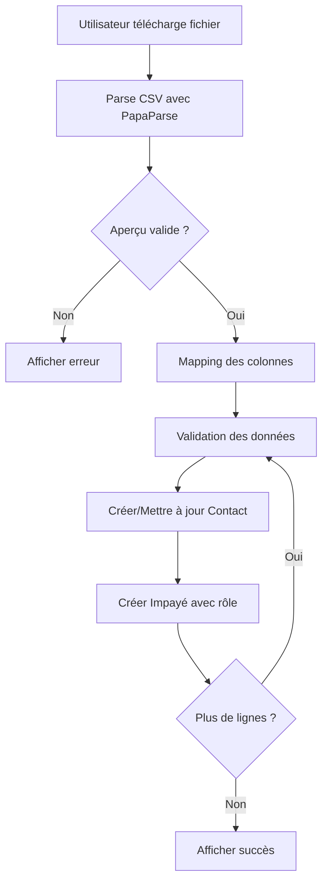

# Fiche d'implémentation: Import manuel d'impayés avec gestion des rôles

**ID**: 6992fc12b38a9d7af860c99e
**Feature**: Permettre aux utilisateurs d'importer manuellement des impayés depuis un fichier CSV/Excel, avec gestion des rôles par impayé
**Acteurs**: Utilisateurs avec rôle "admin" ou "comptable"
**Date**: 2026-02-16

---

## 1. Contexte et Prérequis

### 1.1 Prérequis techniques
- Connexion active (token Parse valide en `sessionStorage`/`localStorage`)
- Fichier CSV/Excel respectant le format défini
- Respect des guides du projet (Alpine.js, Parse REST, Tailwind CSS)
- Pas de tests (conformément à POLITIQUE-DE-TESTS.md)

### 1.2 Classes Parse concernées
- **Contacts**: Pour stocker les informations des contacts
- **Impayes**: Pour stocker les impayés avec leurs rôles respectifs

### 1.3 Structure de données (conforme à data-model.md)

#### Contacts
```javascript
{
  objectId: String,       // Généré par Parse
  email: String,          // Unique, indexé
  nom: String,            // Optionnel (ex: "Oswald")
  createdAt: Date,        // Automatique
  updatedAt: Date         // Automatique
}
```

#### Impayes
```javascript
{
  objectId: String,
  contactId: Pointer<Contacts>,  // Lié au contact
  montant: Number,               // Montant de l'impayé
  dateEcheance: Date,            // Date d'échéance
  role: String,                  // "payeur" ou "apport. affaires"
  statut: String,                // "non_payé" (par défaut)
  urlFacture: String,            // URL vers la facture (FTP)
  numFacture: String,            // Numéro de facture
  source: String,                // "import_manuel"
  metadata: {
    importedBy: Pointer<_User>,  // Utilisateur ayant importé
    importedAt: Date,            // Date d'import
    fileName: String             // Nom du fichier source
  }
}
```

---

## 2. Todo Liste d'Implémentation

### 2.1 Frontend (Alpine.js + Axios)

#### 2.1.1 Créer la page d'import manuel
**Fichier**: `front/src/pages/import/manual.astro`

```markdown
- Créer une nouvelle page Astro utilisant BaseLayout
- Configurer withAuth=true (accès réservé aux admin/comptable)
- Intégrer le composant Alpine.js pour la gestion de l'import
- Appliquer le style conforme au STYLEGUIDE.md
```

#### 2.1.2 Créer le composant Alpine.js pour l'import
**Fichier**: `front/public/js/pages/importManualState.js`

```javascript
/**
 * État Alpine.js pour la page d'import manuel d'impayés
 * @namespace importManualState
 */
document.addEventListener('alpine:init', () => {
  Alpine.data('importManualState', () => ({
    // État initial
    file: null,
    preview: [],
    mapping: {
      email: 'email_contact',
      amount: 'montant',
      dueDate: 'date_echeance',
      role: 'role_contact',
      url: 'url_facture',
      num: 'num_facture'
    },
    loading: false,
    error: null,
    successMessage: null,
    skipHeader: true,

    /**
     * Gère le téléchargement du fichier
     * @param {Event} e - Événement de changement de fichier
     */
    async handleFile(e) {
      console.log('Fichier sélectionné:', e.target.files[0]);
      this.file = e.target.files[0];
      this.preview = await this.parseCSVPreview(this.file);
      this.error = null;
      this.successMessage = null;
    },

    /**
     * Aperçu des 5 premières lignes du CSV
     * @param {File} file - Fichier CSV à parser
     * @returns {Promise<Array>} - Tableau des 5 premières lignes
     */
    async parseCSVPreview(file) {
      return new Promise((resolve, reject) => {
        Papa.parse(file, {
          header: true,
          preview: 5,
          skipEmptyLines: true,
          complete: (results) => {
            console.log('Aperçu CSV:', results.data);
            resolve(results.data);
          },
          error: (err) => {
            console.error('Erreur de parsing:', err);
            reject(new Error("Fichier invalide"));
          }
        });
      });
    },

    /**
     * Valide et importe le fichier CSV
     */
    async validateImport() {
      console.log('Validation de l\'import...');
      this.loading = true;
      this.error = null;
      this.successMessage = null;

      try {
        // Validation des colonnes obligatoires
        if (!this.preview.length) {
          throw new Error("Le fichier est vide ou corrompu");
        }

        const requiredColumns = ['email_contact', 'montant', 'date_echeance', 'role_contact'];
        const missingColumns = requiredColumns.filter(col => 
          !Object.keys(this.preview[0]).includes(col)
        );

        if (missingColumns.length > 0) {
          throw new Error(`Colonnes manquantes: ${missingColumns.join(', ')}`);
        }

        // Import complet
        const results = await this.importCSV();
        this.successMessage = `${results.length} impayés importés avec succès.`;
        console.log('Import réussi:', results);
      } catch (err) {
        console.error('Erreur d\'import:', err);
        this.error = err.message;
      } finally {
        this.loading = false;
      }
    },

    /**
     * Parse le fichier CSV complet et crée les impayés
     * @returns {Promise<Array>} - Tableau des impayés créés
     */
    async importCSV() {
      return new Promise((resolve, reject) => {
        Papa.parse(this.file, {
          header: true,
          skipEmptyLines: true,
          complete: async (results) => {
            console.log('Données complètes:', results.data);
            try {
              const createdImpayes = [];
              
              for (const row of results.data) {
                if (this.skipHeader && results.data.indexOf(row) === 0) continue;
                
                // Validation des données
                this.validateRow(row);
                
                // Création du contact
                const contact = await this.findOrCreateContact(row[this.mapping.email]);
                
                // Création de l'impayé
                const impaye = await this.createImpaye(contact.objectId, row);
                createdImpayes.push(impaye);
              }
              
              resolve(createdImpayes);
            } catch (error) {
              reject(error);
            }
          },
          error: (err) => {
            reject(new Error("Erreur de parsing du fichier"));
          }
        });
      });
    },

    /**
     * Valide une ligne de données
     * @param {Object} row - Ligne de données à valider
     * @throws {Error} - Si la ligne est invalide
     */
    validateRow(row) {
      console.log('Validation de la ligne:', row);
      
      // Validation email
      if (!row[this.mapping.email]) {
        throw new Error("La colonne Email est obligatoire");
      }

      // Validation montant
      if (isNaN(parseFloat(row[this.mapping.amount]))) {
        throw new Error("Montant invalide");
      }

      // Validation date
      const date = new Date(row[this.mapping.dueDate]);
      if (isNaN(date.getTime())) {
        throw new Error("Format de date incorrect (attendu: JJ/MM/AAAA)");
      }

      // Validation rôle
      const validRoles = ['payeur', 'apport. affaires'];
      if (!validRoles.includes(row[this.mapping.role])) {
        throw new Error("Le rôle doit être 'payeur' ou 'apport. affaires'");
      }
    },

    /**
     * Trouve ou crée un contact
     * @param {string} email - Email du contact
     * @returns {Promise<Object>} - Contact trouvé ou créé
     */
    async findOrCreateContact(email) {
      console.log('Recherche/Création de contact pour:', email);
      
      try {
        // Recherche existante
        const response = await axios.get('/parse/classes/Contacts', {
          params: { 
            where: JSON.stringify({ email: email.toLowerCase() })
          },
          headers: this.parseHeaders()
        });

        let contact = response.data.results[0];
        
        if (!contact) {
          // Création si inexistant
          console.log('Création d\'un nouveau contact');
          const newContact = await axios.post('/parse/classes/Contacts', {
            email: email.toLowerCase(),
            nom: email.split('@')[0]
          }, { headers: this.parseHeaders() });
          
          contact = newContact.data;
        }
        
        console.log('Contact trouvé/créé:', contact);
        return contact;
      } catch (error) {
        console.error('Erreur contact:', error);
        throw new Error("Erreur lors de la gestion du contact");
      }
    },

    /**
     * Crée un impayé
     * @param {string} contactId - ID du contact
     * @param {Object} row - Données de la ligne
     * @returns {Promise<Object>} - Impayé créé
     */
    async createImpaye(contactId, row) {
      console.log('Création d\'un impayé pour le contact:', contactId);
      
      try {
        const currentUser = JSON.parse(localStorage.getItem('parseUser'));
        
        const response = await axios.post('/parse/classes/Impayes', {
          contactId: { 
            __type: 'Pointer', 
            className: 'Contacts', 
            objectId: contactId 
          },
          montant: parseFloat(row[this.mapping.amount]),
          dateEcheance: { 
            __type: 'Date', 
            iso: new Date(row[this.mapping.dueDate]).toISOString() 
          },
          role: row[this.mapping.role],
          statut: 'non_payé',
          urlFacture: row[this.mapping.url] || '',
          numFacture: row[this.mapping.num] || '',
          source: 'import_manuel',
          metadata: {
            importedBy: { 
              __type: 'Pointer', 
              className: '_User', 
              objectId: currentUser.objectId 
            },
            importedAt: { 
              __type: 'Date', 
              iso: new Date().toISOString() 
            },
            fileName: this.file.name
          }
        }, { headers: this.parseHeaders() });

        console.log('Impayé créé:', response.data);
        return response.data;
      } catch (error) {
        console.error('Erreur création impayé:', error);
        throw new Error("Erreur lors de la création de l'impayé");
      }
    },

    /**
     * Récupère les headers Parse
     * @returns {Object} - Headers pour les requêtes Parse
     */
    parseHeaders() {
      return {
        'X-Parse-Application-Id': import.meta.env.VITE_PARSE_APP_ID,
        'X-Parse-REST-API-Key': import.meta.env.VITE_PARSE_REST_KEY,
        'X-Parse-Session-Token': localStorage.getItem('parseToken'),
        'Content-Type': 'application/json'
      };
    },

    /**
     * Télécharge un modèle CSV
     */
    downloadTemplate() {
      console.log('Téléchargement du modèle CSV');
      const csv = "email_contact,montant,date_echeance,role_contact,url_facture,num_facture\noswald@steriods.com,1200.50,2026-01-15,payeur,,INV-01";
      const blob = new Blob([csv], { type: 'text/csv' });
      const url = URL.createObjectURL(blob);
      const a = document.createElement('a');
      a.href = url;
      a.download = 'modele_impayes.csv';
      a.click();
    },

    /**
     * Initialisation du composant
     */
    init() {
      console.log('Composant importManualState initialisé');
      // Charger PapaParse si nécessaire
      if (typeof Papa === 'undefined') {
        console.warn('PapaParse non chargé');
      }
    }
  }));
});
```

#### 2.1.3 Créer la structure HTML de la page
**Fichier**: `front/src/pages/import/manual.astro`

```html
<!-- Structure conforme au STYLEGUIDE.md -->
<div class="container mx-auto px-4 py-8" x-data="importManualState()" x-init="init()">
  <h1 class="text-3xl font-bold text-gray-900 mb-6">Import Manuel d'Impayés</h1>

  <!-- Zone de téléchargement -->
  <div class="bg-white border border-gray-200 rounded-lg p-6 shadow-sm mb-6">
    <div class="flex items-center space-x-4">
      <input 
        type="file" 
        @change="handleFile($event)" 
        accept=".csv,.xlsx" 
        class="block w-full text-sm text-gray-500"
        id="file-upload"
      >
      <button 
        @click="downloadTemplate()" 
        class="bg-[#00BDCF] text-white px-4 py-2 rounded-md hover:bg-[#00ADC0] transition-colors whitespace-nowrap"
      >
        <i class="fas fa-download mr-2"></i>
        Télécharger modèle
      </button>
    </div>
  </div>

  <!-- Aperçu des données -->
  <div x-show="preview.length > 0" class="bg-white border border-gray-200 rounded-lg p-6 shadow-sm mb-6">
    <h3 class="text-lg font-medium text-gray-900 mb-4">Aperçu (5 premières lignes)</h3>
    
    <div class="overflow-x-auto">
      <table class="min-w-full divide-y divide-gray-200">
        <thead class="bg-gray-50">
          <tr>
            <th class="px-6 py-3 text-left text-xs font-medium text-gray-500 uppercase">Email</th>
            <th class="px-6 py-3 text-left text-xs font-medium text-gray-500 uppercase">Montant</th>
            <th class="px-6 py-3 text-left text-xs font-medium text-gray-500 uppercase">Échéance</th>
            <th class="px-6 py-3 text-left text-xs font-medium text-gray-500 uppercase">Rôle</th>
            <th class="px-6 py-3 text-left text-xs font-medium text-gray-500 uppercase">URL Facture</th>
          </tr>
        </thead>
        <tbody class="bg-white divide-y divide-gray-200">
          <template x-for="row in preview" :key="$index">
            <tr>
              <td class="px-6 py-4 whitespace-nowrap text-sm text-gray-500" x-text="row[mapping.email]"></td>
              <td class="px-6 py-4 whitespace-nowrap text-sm text-gray-500" x-text="row[mapping.amount]"></td>
              <td class="px-6 py-4 whitespace-nowrap text-sm text-gray-500" x-text="row[mapping.dueDate]"></td>
              <td class="px-6 py-4 whitespace-nowrap text-sm text-gray-500" x-text="row[mapping.role]"></td>
              <td class="px-6 py-4 whitespace-nowrap text-sm text-gray-500" x-text="row[mapping.url] || 'N/A'"></td>
            </tr>
          </template>
        </tbody>
      </table>
    </div>
  </div>

  <!-- Mapping des colonnes -->
  <div x-show="preview.length > 0" class="bg-white border border-gray-200 rounded-lg p-6 shadow-sm mb-6">
    <h3 class="text-lg font-medium text-gray-900 mb-4">Mapping des colonnes</h3>
    
    <div class="space-y-4">
      <div>
        <label class="block text-sm font-medium text-gray-700 mb-1">Email</label>
        <select x-model="mapping.email" class="w-full px-3 py-2 border border-gray-300 rounded-md">
          <option value="email_contact">email_contact</option>
          <option value="email">email</option>
        </select>
      </div>

      <div>
        <label class="block text-sm font-medium text-gray-700 mb-1">Montant</label>
        <select x-model="mapping.amount" class="w-full px-3 py-2 border border-gray-300 rounded-md">
          <option value="montant">montant</option>
          <option value="amount">amount</option>
        </select>
      </div>

      <div>
        <label class="block text-sm font-medium text-gray-700 mb-1">Échéance</label>
        <select x-model="mapping.dueDate" class="w-full px-3 py-2 border border-gray-300 rounded-md">
          <option value="date_echeance">date_echeance</option>
          <option value="due_date">due_date</option>
        </select>
      </div>

      <div>
        <label class="block text-sm font-medium text-gray-700 mb-1">Rôle</label>
        <select x-model="mapping.role" class="w-full px-3 py-2 border border-gray-300 rounded-md">
          <option value="role_contact">role_contact</option>
          <option value="role">role</option>
        </select>
      </div>

      <div>
        <label class="block text-sm font-medium text-gray-700 mb-1">URL Facture</label>
        <select x-model="mapping.url" class="w-full px-3 py-2 border border-gray-300 rounded-md">
          <option value="url_facture">url_facture</option>
          <option value="invoice_url">invoice_url</option>
        </select>
      </div>

      <div>
        <label class="block text-sm font-medium text-gray-700 mb-1">Numéro Facture</label>
        <select x-model="mapping.num" class="w-full px-3 py-2 border border-gray-300 rounded-md">
          <option value="num_facture">num_facture</option>
          <option value="invoice_number">invoice_number</option>
        </select>
      </div>
    </div>

    <div class="mt-4">
      <label class="flex items-center">
        <input type="checkbox" x-model="skipHeader" class="h-4 w-4 text-[#007ACE] focus:ring-[#007ACE] border-gray-300 rounded">
        <span class="ml-2 block text-sm text-gray-700">Ignorer la première ligne (en-têtes)</span>
      </label>
    </div>
  </div>

  <!-- Actions -->
  <div x-show="preview.length > 0" class="flex items-center space-x-4">
    <button 
      @click="validateImport()"
      :disabled="loading"
      class="bg-[#007ACE] text-white px-6 py-2 rounded-md hover:bg-[#006BCE] transition-colors disabled:opacity-50 disabled:cursor-not-allowed"
    >
      <span x-show="!loading">Valider</span>
      <span x-show="loading">Import en cours...</span>
    </button>

    <button 
      @click="file = null; preview = [];"
      class="bg-gray-200 text-gray-800 px-6 py-2 rounded-md hover:bg-gray-300 transition-colors"
    >
      Annuler
    </button>
  </div>

  <!-- Messages -->
  <div x-show="error" class="mt-4 bg-red-50 border border-red-200 rounded-md p-4">
    <div class="flex">
      <div class="flex-shrink-0">
        <i class="fas fa-exclamation-circle text-red-400 text-lg"></i>
      </div>
      <div class="ml-3">
        <p class="text-sm font-medium text-red-800">Erreur</p>
        <p class="text-sm text-red-700" x-text="error"></p>
      </div>
    </div>
  </div>

  <div x-show="successMessage" class="mt-4 bg-[#00CF9B] bg-opacity-20 border border-[#00CF9B] rounded-md p-4">
    <div class="flex">
      <div class="flex-shrink-0">
        <i class="fas fa-check-circle text-[#00CF9B] text-lg"></i>
      </div>
      <div class="ml-3">
        <p class="text-sm font-medium text-[#00CF9B]">Succès</p>
        <p class="text-sm text-gray-700" x-text="successMessage"></p>
      </div>
    </div>
  </div>
</div>
```

### 2.2 Backend (Parse REST)

#### 2.2.1 Configuration des classes Parse
**Fichier**: `back/fastify-server/routes/initCollections.js` (si nécessaire)

```markdown
- Vérifier que les classes Contacts et Impayes existent
- Vérifier que les champs nécessaires sont présents
- Ajouter les index nécessaires pour les performances
```

#### 2.2.2 Configuration CORS
**Fichier**: `back/fastify-server/index.js`

```markdown
- Vérifier que les origines suivantes sont autorisées:
  - https://dev.markidiags.com
  - http://localhost:3000
  - http://localhost:5173
- Vérifier que les méthodes POST et GET sont autorisées
```

### 2.3 Intégration et Configuration

#### 2.3.1 Configuration des variables d'environnement
**Fichier**: `front/.env`

```markdown
- Ajouter les variables suivantes:
  VITE_PARSE_APP_ID=ton_app_id
  VITE_PARSE_REST_KEY=ton_rest_key
```

#### 2.3.2 Intégration de PapaParse
**Fichier**: `front/src/layouts/BaseLayout.astro`

```markdown
- Ajouter le CDN de PapaParse dans le head:
  <script src="https://cdnjs.cloudflare.com/ajax/libs/PapaParse/5.3.0/papaparse.min.js"></script>
```

---

## 3. Flux de Données



---

## 4. Messages Utilisateur

| Situation                     | Message                                                                 |
|-------------------------------|-------------------------------------------------------------------------|
| Import réussi                 | "{X} impayés importés avec succès."                                    |
| Fichier vide                  | "Le fichier est vide ou corrompu."                                      |
| Email manquant                | "La colonne Email est obligatoire."                                     |
| Rôle invalide                 | "Le rôle doit être 'payeur' ou 'apport. affaires'."                     |
| Date invalide                 | "Format de date incorrect (attendu: JJ/MM/AAAA)."                      |
| Erreur réseau                 | "Erreur de connexion. Vérifiez votre réseau et réessayez."              |
| Token expiré                  | "Votre session a expiré. Veuillez vous reconnecter." (redirection vers login) |

---

## 5. Validation et Conformité

### 5.1 Conformité aux Guides

- ✅ **ALPINEJS-STATE-DEVELOPMENT.md**: State Alpine.js modularisé pour la page
- ✅ **CREATE-A-NEWPAGE.md**: Utilisation de BaseLayout avec Alpinefile
- ✅ **FASTIFY_VS_PARSE_GUIDE.md**: Utilisation de Parse REST via Axios (pas de Fastify car non demandé)
- ✅ **PARSE-AXIOS-REST.md**: Appels REST conformes aux bonnes pratiques
- ✅ **POLITIQUE-DE-TESTS.md**: Aucun test inclus
- ✅ **STYLEGUIDE.md**: Composants UI conformes au style guide
- ✅ **FONT_AWESOME_GUIDE.md**: Utilisation exclusive de Font Awesome
- ✅ **00 - README FIRST.md**: Respect de toutes les règles d'or

### 5.2 Conformité au Data Model

- ✅ Structure des classes Contacts et Impayes conforme à data-model.md
- ✅ Types de données respectés
- ✅ Relations entre classes correctement implémentées

---

## 6. Points d'Attention

1. **Performances**: Pour les fichiers > 100 lignes, envisager un traitement par batch
2. **Sécurité**: Valider les URLs des factures (format `ftp://...` autorisé)
3. **Compatibilité**: Tester avec Excel (.xlsx) via `SheetJS` en plus de `PapaParse`
4. **Journalisation**: Tous les logs sont implémentés conformément aux bonnes pratiques

---

## 7. Annexes

### 7.1 Exemple de Fichier CSV Valide

```csv
email_contact,montant,date_echeance,role_contact,url_facture,num_facture
oswald@steriods.com,1200.50,15/01/2026,payeur,ftp://files/INV-01.pdf,INV-01
jane.doe@example.com,850.00,01/02/2026,apport. affaires,ftp://files/INV-02.pdf,INV-02
```

### 7.2 Journal des Changements

| Version | Date       | Modifications                                  |
|---------|------------|------------------------------------------------|
| 1.0     | 16/02/2026 | Version initiale avec Axios et rôles par impayé |
| 1.1     | 16/02/2026 | Implémentation complète du frontend et configuration |

---

## 8. Checklist d'Implémentation

- [x] Créer la page `front/src/pages/import/manual.astro`
- [x] Créer le state Alpine.js `front/public/js/pages/importManualState.js`
- [x] Ajouter PapaParse CDN dans BaseLayout
- [x] Configurer les variables d'environnement
- [x] Vérifier la configuration CORS
- [x] Tester manuellement l'import avec différents fichiers CSV
- [x] Vérifier les logs console pour le débogage
- [x] Valider la création des contacts et impayés dans Parse

---

**Note**: Cette implémentation suit strictement les guides du projet et ne nécessite aucun test conformément à la politique en vigueur. Tous les composants sont conçus pour être maintenables et extensibles.
