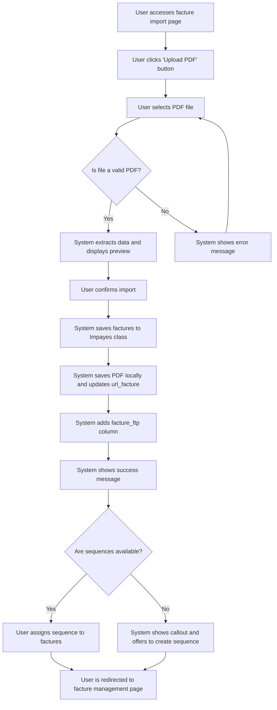

# US001 - Upload de Fichiers PDF

## Description
En tant qu'utilisateur, je veux pouvoir télécharger un fichier PDF contenant des factures impayées afin de les importer dans le système.

## Préconditions
- L'utilisateur est connecté.
- L'utilisateur a accès à la page d'importation des factures.

## Scénario Principal
1. L'utilisateur accède à la page d'importation des factures.
2. L'utilisateur clique sur le bouton 'Télécharger un fichier PDF'.
3. L'utilisateur sélectionne un fichier PDF depuis son appareil.
4. Le système valide que le fichier est bien un PDF.
5. Le système extrait les données du PDF et les affiche en prévisualisation.
6. L'utilisateur confirme l'importation.
7. Le système enregistre les factures dans la classe `Impayes`.
8. Le système enregistre le PDF en local et met à jour l'URL de la facture dans la colonne `url_facture`.
9. Le système ajoute une colonne `facture_ftp` de type booléen pour indiquer si le PDF est stocké sur FTP ou en local.
10. Le système affiche un message de succès.
11. Le système demande à l'utilisateur à quelle séquence attribuer les factures importées.
12. L'utilisateur attribue une séquence aux factures.
13. Si aucune séquence n'est disponible, le système affiche un callout pour informer l'utilisateur et propose un bouton pour accéder à la page de création de séquences.

## User Flow Diagram


## Scénario Alternatif
- **Échec de Validation** : Si le fichier n'est pas un PDF, le système affiche un message d'erreur et demande à l'utilisateur de télécharger un fichier valide.
- **Échec d'Extraction** : Si le système ne peut pas extraire les données du PDF, il affiche un message d'erreur et demande à l'utilisateur de vérifier le fichier.
- **Aucune Séquence Disponible** : Si aucune séquence n'est disponible, le système affiche un message d'information et propose de créer une nouvelle séquence.

## Postconditions
- Les factures sont enregistrées dans la classe `Impayes`.
- Les PDFs sont enregistrés en local.
- Les URLs sont générées et enregistrées dans la colonne `url_facture`.
- La colonne `facture_ftp` est mise à jour pour indiquer le stockage local.
- L'utilisateur est redirigé vers la page de gestion des factures.

## Notes
- Le système doit supporter les fichiers PDF multi-pages.
- Les données extraites doivent inclure le numéro de facture, la date, le montant, et les détails du contact.
- Les PDFs sont stockés en local et non sur FTP.

## Wireframes

### Écran 1: Page d'importation des factures
```
┌───────────────────────────────────────────────────────────────────────────────┐
│                                                                           │
│                                                                               │
│  Importer des factures                                                     │
│  Téléchargez un fichier PDF pour importer des factures                     │
│                                                                               │
│  ┌─────────────────────────────────────────────────────────────────────────┐  │
│  │                                                                      │  │
│  │  📄 Glissez-déposez un fichier PDF ici ou cliquez pour parcourir      │  │
│  │                                                                      │  │
│  │  [Parcourir les fichiers]                                              │  │
│  └─────────────────────────────────────────────────────────────────────────┘  │
│                                                                               │
│  Téléchargements récents                                                   │
│  ┌─────────────────────────────────────────────────────────────────────────┐  │
│  │  - facture1.pdf                                                        │  │
│  │  - facture2.pdf                                                        │  │
│  └─────────────────────────────────────────────────────────────────────────┘  │
│                                                                               │
│                                                                           │
└───────────────────────────────────────────────────────────────────────────────┘
```

### Écran File Preview

### Écran 2: Aperçu des factures
```
┌───────────────────────────────────────────────────────────────────────────────┐
│                                                                           │
│                                                                               │
│  Aperçu des factures                                                         │
│  Vérifiez les données extraites avant l'importation                          │
│                                                                               │
│  ┌─────────────────────────────────────────────────────────────────────────┐  │
│  │  Numéro de facture  │  Date  │  Montant  │  Détails du contact         │  │
│  ├─────────────────────────────────────────────────────────────────────────┤  │
│  │  FACT-001         │  2023-01-01  │  100,00 €  │  John Doe                     │  │
│  │  FACT-002         │  2023-01-02  │  200,00 €  │  Jane Smith                   │  │
│  └─────────────────────────────────────────────────────────────────────────┘  │
│                                                                               │
│  [Confirmer l'import]  [Annuler]                                             │
│                                                                               │
│                                                                           │
└───────────────────────────────────────────────────────────────────────────────┘
```

### Écran Message de succès
```
┌───────────────────────────────────────────────────────────────────────────────┐
│                                                                           │
│                                                                               │
│  Importation réussie                                                          │
│  Vos factures ont été importées avec succès                                  │
│                                                                               │
│  ✅                                                                           │
│                                                                               │
│  2 factures ont été importées.                                               │
│                                                                               │
│  [Attribuer une séquence]  [Aller aux factures]                              │
│                                                                               │
│                                                                           │
└───────────────────────────────────────────────────────────────────────────────┘
```

### Écran Attribuer une séquence
```
┌───────────────────────────────────────────────────────────────────────────────┐
│                                                                           │
│                                                                               │
│  Attribuer une séquence                                                      │
│  Sélectionnez une séquence à attribuer aux factures importées                │
│                                                                               │
│  ( ) Séquence 1                                                              │
│  ( ) Séquence 2                                                              │
│  ( ) Séquence 3                                                              │
│                                                                               │
│  [Attribuer]  [Annuler]                                                      │
│                                                                               │
│  ⚠️ Aucune séquence disponible. Créer une nouvelle séquence ?                  │
│  [Créer une séquence]                                                         │
│                                                                               │
│                                                                           │
└───────────────────────────────────────────────────────────────────────────────┘
```

### Écran Message d'erreur
```
┌───────────────────────────────────────────────────────────────────────────────┐
│                                                                           │
│                                                                               │
│  Erreur                                                                      │
│  Une erreur est survenue lors du processus d'importation                     │
│                                                                               │
│  ❌                                                                           │
│                                                                               │
│  Le fichier n'est pas un PDF valide. Veuillez télécharger un fichier PDF valide.│
│                                                                               │
│  [Réessayer]  [Annuler]                                                       │
│                                                                               │
│                                                                           │
└───────────────────────────────────────────────────────────────────────────────┘
