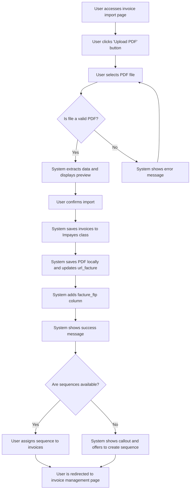

# Design: Upload PDF Files

## Technical Approach
The upload feature will allow users to upload PDF files containing unpaid invoices. The system will validate the file, extract data, and save it to the Parse database. The frontend will use Alpine.js for reactivity and state management, while the backend will handle file processing and database operations via Flask.

## Architecture Decisions

### Decision: Use Alpine.js for Frontend Reactivity
- **Description**: Alpine.js will manage the state and reactivity of the upload form and preview.
- **Rationale**: Alpine.js is lightweight and integrates seamlessly with HTML, making it ideal for this use case.
- **Impact**: Simplifies frontend logic and improves user experience.

### Decision: Use Flask for Backend Processing
- **Description**: Flask will handle file uploads, validation, and database operations.
- **Rationale**: Flask is lightweight and well-suited for handling HTTP requests and integrating with Parse.
- **Impact**: Ensures robust backend processing and easy integration with the database.

### Decision: Store PDFs Locally
- **Description**: PDF files will be stored locally on the server, and their URLs will be saved in the `Impayes` class.
- **Rationale**: Local storage is simpler and more cost-effective for this use case.
- **Impact**: Reduces complexity and avoids dependency on external storage solutions.

### Decision: Use Parse for Data Storage
- **Description**: Invoice data will be stored in the `Impayes` class in Parse.
- **Rationale**: Parse provides a scalable and managed database solution.
- **Impact**: Ensures data consistency and scalability.

### Decision: Add `facture_ftp` Column
- **Description**: A boolean column `facture_ftp` will be added to indicate whether the PDF is stored on FTP or locally.
- **Rationale**: Provides flexibility for future storage options.
- **Impact**: Ensures backward compatibility and future scalability.

## Data Flow


## Data Mapping

### Parse Class: `Impayes`
- **Fields**:
  - `numero_facture`: String (invoice number).
  - `date`: Date (invoice date).
  - `montant`: Number (invoice amount).
  - `details_contact`: String (contact details).
  - `url_facture`: String (URL to the stored PDF).
  - `facture_ftp`: Boolean (indicates if PDF is stored on FTP or locally).

### Alpine.js Store: `invoiceUpload`
- **Fields**:
  - `selectedFile`: File (the selected PDF file).
  - `previewData`: Array (extracted invoice data for preview).
  - `isValidPDF`: Boolean (indicates if the file is a valid PDF).
  - `errorMessage`: String (error message to display).
  - `successMessage`: String (success message to display).
  - `availableSequences`: Array (list of available sequences).
  - `selectedSequence`: String (selected sequence for assignment).

### Data Flow
1. **Input Data**:
   - The user selects a PDF file, which is captured in the `selectedFile` field.
   - The file is validated to ensure it is a PDF.

2. **Data Extraction**:
   - The backend extracts invoice data (invoice number, date, amount, contact details) from the PDF.
   - Extracted data is sent back to the frontend for preview.

3. **Data Storage**:
   - Upon confirmation, the invoice data is saved to the `Impayes` class in Parse.
   - The PDF is stored locally, and its URL is saved in the `url_facture` field.
   - The `facture_ftp` field is set to `false` to indicate local storage.

4. **Sequence Assignment**:
   - The system checks for available sequences.
   - If sequences are available, the user assigns one to the invoices.
   - If no sequences are available, the user is prompted to create one.

## Screen ASCII

### Screen 1: Invoice Import Page
```
┌───────────────────────────────────────────────────────────────────────────────┐
│                                                                           │
│                                                                               │
│  Import Invoices                                                             │
│  Upload a PDF file to import invoices                                      │
│                                                                               │
│  ┌─────────────────────────────────────────────────────────────────────────┐  │
│  │                                                                      │  │
│  │  📄 Drag and drop a PDF file here or click to browse                   │  │
│  │                                                                      │  │
│  │  [Browse Files]                                                         │  │
│  └─────────────────────────────────────────────────────────────────────────┘  │
│                                                                               │
│  Recent Uploads                                                             │
│  ┌─────────────────────────────────────────────────────────────────────────┐  │
│  │  - invoice1.pdf                                                         │  │
│  │  - invoice2.pdf                                                         │  │
│  └─────────────────────────────────────────────────────────────────────────┘  │
│                                                                               │
│                                                                           │
└───────────────────────────────────────────────────────────────────────────────┘
```

### Screen 2: Invoice Preview
```
┌───────────────────────────────────────────────────────────────────────────────┐
│                                                                           │
│                                                                               │
│  Invoice Preview                                                             │
│  Verify the extracted data before importing                                │
│                                                                               │
│  ┌─────────────────────────────────────────────────────────────────────────┐  │
│  │  Invoice Number  │  Date  │  Amount  │  Contact Details              │  │
│  ├─────────────────────────────────────────────────────────────────────────┤  │
│  │  INV-001         │  2023-01-01  │  100.00 €  │  John Doe                     │  │
│  │  INV-002         │  2023-01-02  │  200.00 €  │  Jane Smith                   │  │
│  └─────────────────────────────────────────────────────────────────────────┘  │
│                                                                               │
│  [Confirm Import]  [Cancel]                                                 │
│                                                                               │
│                                                                           │
└───────────────────────────────────────────────────────────────────────────────┘
```

### Screen 3: Success Message
```
┌───────────────────────────────────────────────────────────────────────────────┐
│                                                                           │
│                                                                               │
│  Import Successful                                                           │
│  Your invoices have been successfully imported                              │
│                                                                               │
│  ✅                                                                           │
│                                                                               │
│  2 invoices have been imported.                                             │
│                                                                               │
│  [Assign Sequence]  [Go to Invoices]                                        │
│                                                                               │
│                                                                           │
└───────────────────────────────────────────────────────────────────────────────┘
```

### Screen 4: Assign Sequence
```
┌───────────────────────────────────────────────────────────────────────────────┐
│                                                                           │
│                                                                               │
│  Assign Sequence                                                             │
│  Select a sequence to assign to the imported invoices                       │
│                                                                               │
│  ( ) Sequence 1                                                              │
│  ( ) Sequence 2                                                              │
│  ( ) Sequence 3                                                              │
│                                                                               │
│  [Assign]  [Cancel]                                                          │
│                                                                               │
│  ⚠️ No sequences available. Create a new sequence?                          │
│  [Create Sequence]                                                           │
│                                                                               │
│                                                                           │
└───────────────────────────────────────────────────────────────────────────────┘
```

### Screen 5: Error Message
```
┌───────────────────────────────────────────────────────────────────────────────┐
│                                                                           │
│                                                                               │
│  Error                                                                       │
│  An error occurred during the import process                                │
│                                                                               │
│  ❌                                                                           │
│                                                                               │
│  The file is not a valid PDF. Please upload a valid PDF file.               │
│                                                                               │
│  [Retry]  [Cancel]                                                           │
│                                                                               │
│                                                                           │
└───────────────────────────────────────────────────────────────────────────────┘
```

## Components and Layouts

### Components/Partials Usage

#### Upload Component
- **File**: `/templates/partials/upload_component.html`
- **Role**: Handles file upload, validation, and preview.
- **Dependencies**:
  - `invoiceUpload` store for managing state.
  - `axiosParse` for API calls to Parse.

#### Sequence Assignment Component
- **File**: `/templates/partials/sequence_assignment_component.html`
- **Role**: Handles sequence assignment to imported invoices.
- **Dependencies**:
  - `invoiceUpload` store for managing state.
  - `axiosParse` for API calls to Parse.

### Layouts

#### Base Layout
- **File**: `/templates/layouts/base_layout.html`
- **Role**: Provides the basic structure for all pages, including the header, footer, and main content area.

#### Dashboard Layout
- **File**: `/templates/layouts/dashboard_layout.html`
- **Role**: Provides the structure for dashboard pages, including the header, sidebar, and main content area.
- **Components Used**:
  - `sidebarComponent`

## Data Parse Changes

### Class: `Impayes`
- **New Fields**:
  - `facture_ftp`: Boolean (indicates if the PDF is stored on FTP or locally).

## File Changes

### New Files
- `/templates/partials/upload_component.html`: Component for handling file upload and preview.
- `/templates/partials/sequence_assignment_component.html`: Component for handling sequence assignment.
- `/static/js/stores/invoiceUploadStore.js`: Alpine.js store for managing invoice upload state.

### Modified Files
- `/templates/layouts/base_layout.html`: Include the upload component.
- `/templates/layouts/dashboard_layout.html`: Include the sequence assignment component.

## Verification
Ensure the output file is created in the correct folder with the specified structure.