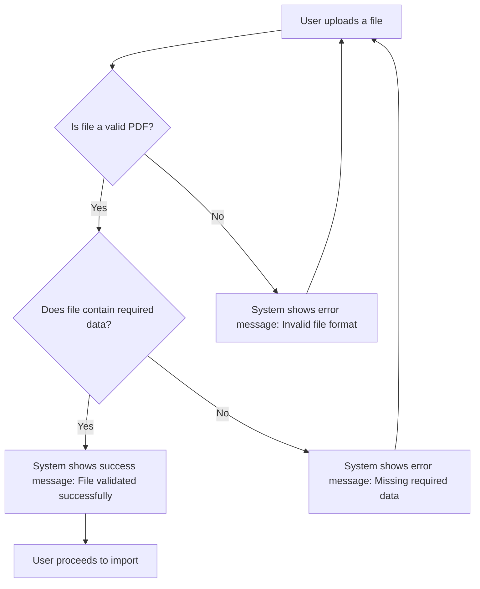

# US002 - Validation des Fichiers

## Description
En tant qu'utilisateur, je veux que le système valide les fichiers téléchargés pour m'assurer qu'ils sont corrects.

## Préconditions
- L'utilisateur a téléchargé un fichier PDF.

## Scénario Principal
1. Le système vérifie que le fichier téléchargé est au format PDF.
2. Le système vérifie que le fichier contient des données valides (numéro de facture, date, montant, etc.).
3. Le système affiche un message de validation réussie.

## Scénario Alternatif
- **Fichier Invalide** : Si le fichier n'est pas un PDF ou ne contient pas les données requises, le système affiche un message d'erreur et demande à l'utilisateur de télécharger un fichier valide.

## Postconditions
- Le fichier est validé et prêt pour l'importation.
- L'utilisateur peut procéder à l'importation des données.

## Notes
- Les données requises incluent le numéro de facture, la date, le montant, et les détails du contact.
- Le système doit fournir des messages d'erreur clairs pour aider l'utilisateur à corriger les problèmes.

## User Flow Diagram


## Wireframes

### Écran Validation de Fichier
```
┌───────────────────────────────────────────────────────────────────────────────┐
│                                                                           │
│                                                                               │
│  Validation de Fichier                                                     │
│  Validation de votre fichier téléchargé                                     │
│                                                                               │
│  🔄                                                                           │
│  Validation du fichier...                                                   │
│                                                                               │
│  ✅                                                                           │
│  Fichier validé avec succès !                                               │
│  [Poursuivre l'import]                                                      │
│                                                                               │
│  ❌                                                                           │
│  Format de fichier invalide. Veuillez télécharger un PDF valide.            │
│  [Réessayer]  [Annuler]                                                     │
│                                                                               │
│                                                                           │
└───────────────────────────────────────────────────────────────────────────────┘
```

### Écran Erreur de Données Manquantes
```
┌───────────────────────────────────────────────────────────────────────────────┐
│                                                                           │
│                                                                               │
│  Erreur de Validation                                                       │
│  Le fichier ne contient pas les données requises                           │
│                                                                               │
│  ❌                                                                           │
│                                                                               │
│  Les données suivantes sont manquantes :                                     │
│  - Numéro de facture                                                         │
│  - Date                                                                       │
│  - Montant                                                                   │
│  - Détails du contact                                                        │
│                                                                               │
│  [Réessayer]  [Annuler]                                                     │
│                                                                               │
│                                                                           │
└───────────────────────────────────────────────────────────────────────────────┘
