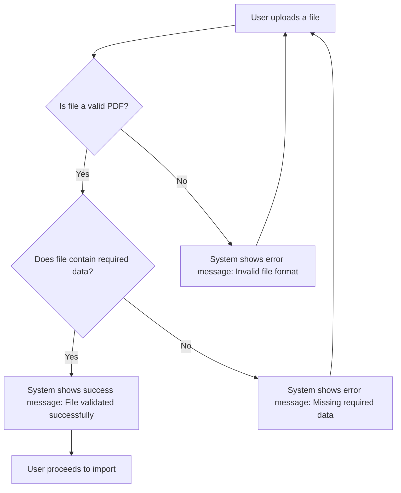

# Design: File Validation

## Technical Approach
The file validation feature ensures that uploaded PDF files are valid and contain the required data before proceeding with the import. The frontend will use Alpine.js for reactivity and state management, while the backend will handle file validation and data extraction via Flask.

## Architecture Decisions

### Decision: Use Alpine.js for Frontend Reactivity
- **Description**: Alpine.js will manage the state and reactivity of the validation process.
- **Rationale**: Alpine.js is lightweight and integrates seamlessly with HTML, making it ideal for this use case.
- **Impact**: Simplifies frontend logic and improves user experience.

### Decision: Use Flask for Backend Validation
- **Description**: Flask will handle file validation and data extraction.
- **Rationale**: Flask is lightweight and well-suited for handling HTTP requests and integrating with Parse.
- **Impact**: Ensures robust backend processing and easy integration with the database.

### Decision: Validate PDF Format
- **Description**: The system will validate that the uploaded file is a PDF.
- **Rationale**: Ensures that only valid PDF files are processed.
- **Impact**: Reduces errors and improves data integrity.

### Decision: Validate Required Data
- **Description**: The system will validate that the PDF contains the required data (invoice number, date, amount, contact details).
- **Rationale**: Ensures that all necessary data is present for import.
- **Impact**: Improves data quality and reduces import errors.

## Data Flow


## Data Mapping

### Parse Class: `Impayes`
- **Fields**:
  - `numero_facture`: String (invoice number).
  - `date`: Date (invoice date).
  - `montant`: Number (invoice amount).
  - `details_contact`: String (contact details).

### Alpine.js Store: `fileValidation`
- **Fields**:
  - `selectedFile`: File (the selected PDF file).
  - `isValidPDF`: Boolean (indicates if the file is a valid PDF).
  - `hasRequiredData`: Boolean (indicates if the file contains required data).
  - `errorMessage`: String (error message to display).
  - `successMessage`: String (success message to display).
  - `missingData`: Array (list of missing data fields).

### Data Flow
1. **Input Data**:
   - The user uploads a file, which is captured in the `selectedFile` field.
   - The file is validated to ensure it is a PDF.

2. **Data Validation**:
   - The backend validates that the file is a PDF and contains the required data (invoice number, date, amount, contact details).
   - Validation results are sent back to the frontend.

3. **Error Handling**:
   - If the file is not a valid PDF, an error message is displayed.
   - If the file is missing required data, an error message listing the missing fields is displayed.

4. **Success Handling**:
   - If the file is valid and contains all required data, a success message is displayed, and the user can proceed to import.

## Screen ASCII

### Screen 1: File Validation
```
┌───────────────────────────────────────────────────────────────────────────────┐
│                                                                           │
│                                                                               │
│  File Validation                                                             │
│  Validating your uploaded file                                             │
│                                                                               │
│  🔄                                                                           │
│  Validating file...                                                         │
│                                                                               │
│  ✅                                                                           │
│  File validated successfully!                                               │
│  [Proceed to Import]                                                        │
│                                                                               │
│  ❌                                                                           │
│  Invalid file format. Please upload a valid PDF.                            │
│  [Retry]  [Cancel]                                                           │
│                                                                               │
│                                                                           │
└───────────────────────────────────────────────────────────────────────────────┘
```

### Screen 2: Missing Data Error
```
┌───────────────────────────────────────────────────────────────────────────────┐
│                                                                           │
│                                                                               │
│  Validation Error                                                           │
│  The file does not contain the required data                               │
│                                                                               │
│  ❌                                                                           │
│                                                                               │
│  The following data is missing:                                             │
│  - Invoice Number                                                           │
│  - Date                                                                       │
│  - Amount                                                                     │
│  - Contact Details                                                          │
│                                                                               │
│  [Retry]  [Cancel]                                                           │
│                                                                               │
│                                                                           │
└───────────────────────────────────────────────────────────────────────────────┘
```

## Components and Layouts

### Components/Partials Usage

#### File Validation Component
- **File**: `/templates/partials/file_validation_component.html`
- **Role**: Handles file validation and displays validation results.
- **Dependencies**:
  - `fileValidation` store for managing state.
  - `axiosParse` for API calls to Parse.

### Layouts

#### Base Layout
- **File**: `/templates/layouts/base_layout.html`
- **Role**: Provides the basic structure for all pages, including the header, footer, and main content area.

#### Dashboard Layout
- **File**: `/templates/layouts/dashboard_layout.html`
- **Role**: Provides the structure for dashboard pages, including the header, sidebar, and main content area.
- **Components Used**:
  - `sidebarComponent`

## Data Parse Changes

### Class: `Impayes`
- **Changes**: No changes required.

## File Changes

### New Files
- `/templates/partials/file_validation_component.html`: Component for handling file validation.
- `/static/js/stores/fileValidationStore.js`: Alpine.js store for managing file validation state.

### Modified Files
- `/templates/layouts/base_layout.html`: Include the file validation component.
- `/templates/layouts/dashboard_layout.html`: Include the file validation component.

## Verification
Ensure the output file is created in the correct folder with the specified structure.