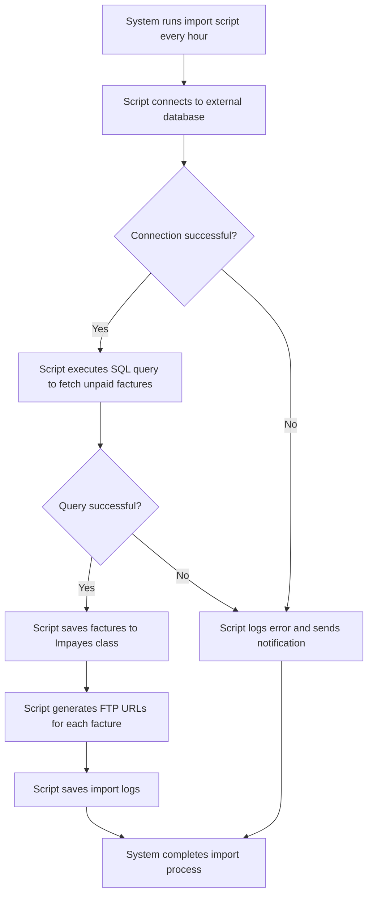

# US003 - Script d'Importation Automatique

## Description
En tant qu'utilisateur, je veux que le système exécute un script d'importation automatique toutes les heures pour importer les factures impayées depuis une base de données externe.

## Préconditions
- Le script d'importation est configuré.
- La base de données externe est accessible.

## Scénario Principal
1. Le système exécute le script d'importation toutes les heures.
2. Le script se connecte à la base de données externe.
3. Le script exécute la requête SQL pour récupérer les factures impayées.
4. Le script enregistre les factures dans la classe `Impayes`.
5. Le script génère les URLs FTP pour chaque facture.
6. Le script enregistre les logs d'importation.

## Scénario Alternatif
- **Échec de Connexion** : Si le script ne peut pas se connecter à la base de données externe, il enregistre une erreur et envoie une notification.
- **Échec d'Importation** : Si le script ne peut pas importer les factures, il enregistre une erreur et envoie une notification.

## Postconditions
- Les factures sont importées et enregistrées dans la classe `Impayes`.
- Les URLs FTP sont générées et enregistrées.
- Les logs d'importation sont enregistrés.

## Notes
- Le script doit utiliser la requête SQL définie dans le dossier `elements_importants`.
- Les logs doivent inclure les erreurs et les succès d'importation.
- La requête SQL pour récupérer les factures impayées est disponible dans le fichier `./specs/briefs/001_elements_important/requete_sql_impayes.md`.

## User Flow Diagram


## Wireframes

### Écran Configuration du Script
```
┌───────────────────────────────────────────────────────────────────────────────┐
│                                                                           │
│                                                                               │
│  Script d'Importation Automatique                                            │
│  Configurer le script d'importation automatique                               │
│                                                                               │
│  Chaîne de Connexion à la Base de Données: [______________________________]  │
│                                                                               │
│  Requête SQL:                                                                 │
│  [_________________________________________________________________]          │
│  [_________________________________________________________________]          │
│  [_________________________________________________________________]          │
│                                                                               │
│  Fréquence d'Importation: [Toutes les heures ▼]                              │
│                                                                               │
│  Email de Notification: [_____________________________________]               │
│                                                                               │
│  [Sauvegarder la Configuration]  [Annuler]                                   │
│                                                                               │
│                                                                           │
└───────────────────────────────────────────────────────────────────────────────┘
```

### Écran Logs d'Importation
```
┌───────────────────────────────────────────────────────────────────────────────┐
│                                                                           │
│                                                                               │
│  Logs d'Importation                                                          │
│  Voir les logs des opérations d'importation automatique                      │
│                                                                               │
│  ┌─────────────────────────────────────────────────────────────────────────┐  │
│  │  Horodatage  │  Statut  │  Factures Importées  │  Erreurs              │  │
│  ├─────────────────────────────────────────────────────────────────────────┤  │
│  │  2023-01-01 10:00  │  Succès  │  10  │  0                            │  │
│  │  2023-01-02 10:00  │  Erreur  │  0  │  5                            │  │
│  └─────────────────────────────────────────────────────────────────────────┘  │
│                                                                               │
│  [Rafraîchir]  [Exporter les Logs]                                           │
│                                                                               │
│                                                                           │
└───────────────────────────────────────────────────────────────────────────────┘
```

### Écran Notification
```
┌───────────────────────────────────────────────────────────────────────────────┐
│                                                                           │
│                                                                               │
│  Notification d'Importation                                                  │
│  Une opération d'importation a été complétée                                  │
│                                                                               │
│  🔔                                                                           │
│                                                                               │
│  Le script d'importation automatique a été complété avec les résultats suivants :│
│  - Statut: Succès                                                             │
│  - Factures Importées: 10                                                    │
│  - Erreurs: 0                                                                │
│                                                                               │
│  [Voir les Logs]  [Ignorer]                                                   │
│                                                                               │
│                                                                           │
└───────────────────────────────────────────────────────────────────────────────┘
