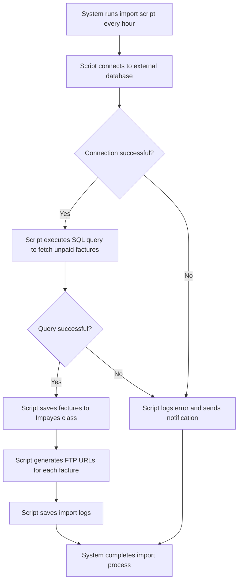

# Design: Automatic Import Script

## Technical Approach
The automatic import script will run every hour to fetch unpaid invoices from an external database and import them into the Parse database. The script will handle database connections, SQL queries, data import, FTP URL generation, and logging. The frontend will display configuration options and logs for monitoring the import process.

## Architecture Decisions

### Decision: Use Flask for Backend Scripting
- **Description**: Flask will handle the execution of the import script and database operations.
- **Rationale**: Flask is lightweight and well-suited for handling scheduled tasks and integrating with Parse.
- **Impact**: Ensures robust backend processing and easy integration with the database.

### Decision: Use SQL Query for Data Fetching
- **Description**: The script will use a predefined SQL query to fetch unpaid invoices from the external database.
- **Rationale**: SQL queries are efficient and reliable for data retrieval.
- **Impact**: Ensures accurate and efficient data fetching.

### Decision: Store Logs in Parse
- **Description**: Import logs will be stored in a Parse class for monitoring and debugging.
- **Rationale**: Parse provides a scalable and managed database solution.
- **Impact**: Ensures logs are easily accessible and manageable.

### Decision: Generate FTP URLs
- **Description**: The script will generate FTP URLs for each imported invoice.
- **Rationale**: FTP URLs provide a standardized way to access invoice PDFs.
- **Impact**: Ensures consistent and reliable access to invoice PDFs.

### Decision: Use Alpine.js for Frontend Reactivity
- **Description**: Alpine.js will manage the state and reactivity of the configuration and logs pages.
- **Rationale**: Alpine.js is lightweight and integrates seamlessly with HTML, making it ideal for this use case.
- **Impact**: Simplifies frontend logic and improves user experience.

## Data Flow


## Data Mapping

### Parse Class: `Impayes`
- **Fields**:
  - `numero_facture`: String (invoice number).
  - `date`: Date (invoice date).
  - `montant`: Number (invoice amount).
  - `details_contact`: String (contact details).
  - `url_facture`: String (URL to the stored PDF).
  - `facture_ftp`: Boolean (indicates if the PDF is stored on FTP or locally).

### Parse Class: `ImportLogs`
- **Fields**:
  - `timestamp`: DateTime (timestamp of the import operation).
  - `status`: String (status of the import operation: success or error).
  - `factures_imported`: Number (number of invoices imported).
  - `errors`: Number (number of errors encountered).
  - `error_details`: String (details of errors encountered).

### Alpine.js Store: `importScript`
- **Fields**:
  - `databaseConnectionString`: String (connection string for the external database).
  - `sqlQuery`: String (SQL query to fetch unpaid invoices).
  - `importFrequency`: String (frequency of the import script execution).
  - `notificationEmail`: String (email address for notifications).
  - `importLogs`: Array (list of import logs).
  - `errorMessage`: String (error message to display).
  - `successMessage`: String (success message to display).

### Data Flow
1. **Input Data**:
   - The system retrieves the database connection string, SQL query, import frequency, and notification email from the `importScript` store.
   - The script connects to the external database using the connection string.

2. **Data Fetching**:
   - The script executes the SQL query to fetch unpaid invoices from the external database.
   - Fetched data is processed and prepared for import.

3. **Data Import**:
   - The script saves the fetched invoices to the `Impayes` class in Parse.
   - The script generates FTP URLs for each invoice and updates the `url_facture` field.

4. **Logging**:
   - The script logs the import operation details (timestamp, status, number of invoices imported, errors) in the `ImportLogs` class.
   - If errors occur, the script logs the error details and sends a notification to the specified email address.

5. **Notification**:
   - The system sends a notification to the user with the import operation results.

## Screen ASCII

### Screen 1: Script Configuration
```
┌───────────────────────────────────────────────────────────────────────────────┐
│                                                                           │
│                                                                               │
│  Automatic Import Script                                                     │
│  Configure the automatic import script                                       │
│                                                                               │
│  Database Connection String: [________________________________________]       │
│                                                                               │
│  SQL Query:                                                                   │
│  [_________________________________________________________________]          │
│  [_________________________________________________________________]          │
│  [_________________________________________________________________]          │
│                                                                               │
│  Import Frequency: [Every hour ▼]                                           │
│                                                                               │
│  Notification Email: [_____________________________________]                 │
│                                                                               │
│  [Save Configuration]  [Cancel]                                             │
│                                                                               │
│                                                                           │
└───────────────────────────────────────────────────────────────────────────────┘
```

### Screen 2: Import Logs
```
┌───────────────────────────────────────────────────────────────────────────────┐
│                                                                           │
│                                                                               │
│  Import Logs                                                                 │
│  View logs of automatic import operations                                    │
│                                                                               │
│  ┌─────────────────────────────────────────────────────────────────────────┐  │
│  │  Timestamp  │  Status  │  Invoices Imported  │  Errors                  │  │
│  ├─────────────────────────────────────────────────────────────────────────┤  │
│  │  2023-01-01 10:00  │  Success  │  10  │  0                            │  │
│  │  2023-01-02 10:00  │  Error  │  0  │  5                            │  │
│  └─────────────────────────────────────────────────────────────────────────┘  │
│                                                                               │
│  [Refresh]  [Export Logs]                                                   │
│                                                                               │
│                                                                           │
└───────────────────────────────────────────────────────────────────────────────┘
```

### Screen 3: Import Notification
```
┌───────────────────────────────────────────────────────────────────────────────┐
│                                                                           │
│                                                                               │
│  Import Notification                                                         │
│  An import operation has been completed                                      │
│                                                                               │
│  🔔                                                                           │
│                                                                               │
│  The automatic import script has completed with the following results:      │
│  - Status: Success                                                           │
│  - Invoices Imported: 10                                                    │
│  - Errors: 0                                                                │
│                                                                               │
│  [View Logs]  [Dismiss]                                                      │
│                                                                               │
│                                                                           │
└───────────────────────────────────────────────────────────────────────────────┘
```

## Components and Layouts

### Components/Partials Usage

#### Script Configuration Component
- **File**: `/templates/partials/script_configuration_component.html`
- **Role**: Handles script configuration, including database connection, SQL query, import frequency, and notification email.
- **Dependencies**:
  - `importScript` store for managing state.
  - `axiosParse` for API calls to Parse.

#### Import Logs Component
- **File**: `/templates/partials/import_logs_component.html`
- **Role**: Displays import logs and allows users to refresh or export logs.
- **Dependencies**:
  - `importScript` store for managing state.
  - `axiosParse` for API calls to Parse.

#### Import Notification Component
- **File**: `/templates/partials/import_notification_component.html`
- **Role**: Displays import notifications to the user.
- **Dependencies**:
  - `importScript` store for managing state.

### Layouts

#### Base Layout
- **File**: `/templates/layouts/base_layout.html`
- **Role**: Provides the basic structure for all pages, including the header, footer, and main content area.

#### Dashboard Layout
- **File**: `/templates/layouts/dashboard_layout.html`
- **Role**: Provides the structure for dashboard pages, including the header, sidebar, and main content area.
- **Components Used**:
  - `sidebarComponent`

## Data Parse Changes

### Class: `ImportLogs`
- **New Class**:
  - `ImportLogs` will store logs of import operations, including timestamp, status, number of invoices imported, and errors.

## File Changes

### New Files
- `/templates/partials/script_configuration_component.html`: Component for handling script configuration.
- `/templates/partials/import_logs_component.html`: Component for displaying import logs.
- `/templates/partials/import_notification_component.html`: Component for displaying import notifications.
- `/static/js/stores/importScriptStore.js`: Alpine.js store for managing import script state.

### Modified Files
- `/templates/layouts/base_layout.html`: Include the script configuration and import logs components.
- `/templates/layouts/dashboard_layout.html`: Include the import notification component.

## Verification
Ensure the output file is created in the correct folder with the specified structure.