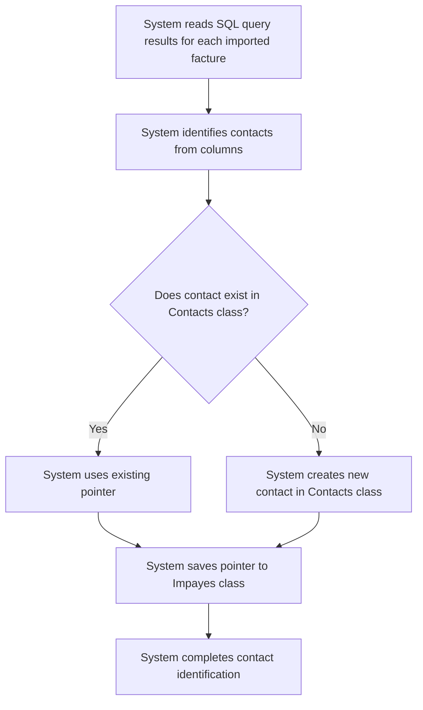

# US001 - Identification des Contacts

## Description
En tant qu'utilisateur, je veux que les contacts soient automatiquement identifiés à partir des résultats de la requête SQL lors de l'import.

## Préconditions
- Les factures ont été importées dans la classe `Impayes`.
- Les résultats de la requête SQL incluent les colonnes nécessaires pour identifier les contacts.

## Scénario Principal
1. Le système lit les résultats de la requête SQL pour chaque facture importée.
2. Le système identifie les contacts à partir des colonnes suivantes :
   - `acquéreur_nom`, `acquéreur_email`, `acquéreur_telephone`
   - `apporteur_affaire_nom`, `apporteur_affaire_email`, `apporteur_affaire_telephone`
   - `payeur_nom`, `payeur_email`, `payeur_telephone`
   - `proprietaire_nom`, `proprietaire_email`, `proprietaire_telephone`
   - `notaire_nom`, `notaire_email`, `notaire_telephone`
3. Le système vérifie si chaque contact existe déjà dans la classe `Contacts`.
4. Si un contact n'existe pas, le système le crée dans la classe `Contacts`.
5. Le système enregistre les pointeurs vers les contacts dans la classe `Impayes` dans la bonne colonne en fonction du type de relation avec l'Impayes.

## Scénario Alternatif
- **Contact Existant** : Si un contact existe déjà, le système utilise le pointeur existant. Si le champ email est différent, le système demande à l'utilisateur de faire le nécessaire.
- **Données Manquantes** : Si des données sont manquantes pour un contact, le système enregistre une erreur et continue le traitement.

## Postconditions
- Les contacts sont identifiés et enregistrés dans la classe `Contacts`.
- Les pointeurs vers les contacts sont enregistrés dans la classe `Impayes` dans les colonnes appropriées.

## Notes
- Les contacts doivent être classés selon leur type (payeur, propriétaire, apporteur, notaire).
- Les contacts doivent être liés aux factures correspondantes dans les colonnes appropriées.

## User Flow Diagram


## Wireframes

### Écran Identification des Contacts
```
┌───────────────────────────────────────────────────────────────────────────────┐
│                                                                           │
│                                                                               │
│  Identification des Contacts                                                 │
│  Identification des contacts à partir des factures importées                 │
│                                                                               │
│  🔄                                                                           │
│  Identification des contacts...                                               │
│                                                                               │
│  ✅                                                                           │
│  Contacts identifiés avec succès !                                           │
│  [Voir les Contacts]                                                          │
│                                                                               │
│  ❌                                                                           │
│  Certains contacts n'ont pas pu être identifiés.                              │
│  [Revoir les Erreurs]  [Annuler]                                              │
│                                                                               │
│                                                                           │
└───────────────────────────────────────────────────────────────────────────────┘
```

### Écran Liste des Contacts
```
┌───────────────────────────────────────────────────────────────────────────────┐
│                                                                           │
│                                                                               │
│  Contacts Identifiés                                                         │
│  Liste des contacts identifiés à partir des factures                         │
│                                                                               │
│  ┌─────────────────────────────────────────────────────────────────────────┐  │
│  │  Nom  │  Email  │  Téléphone  │  Type  │  Factures Liées              │  │
│  ├─────────────────────────────────────────────────────────────────────────┤  │
│  │  John Doe  │  john@example.com  │  123456789  │  Payeur  │  FACT-001          │  │
│  │  Jane Smith  │  jane@example.com  │  987654321  │  Propriétaire  │  FACT-002          │  │
│  └─────────────────────────────────────────────────────────────────────────┘  │
│                                                                               │
│  [Exporter les Contacts]  [Retour aux Factures]                               │
│                                                                               │
│                                                                           │
└───────────────────────────────────────────────────────────────────────────────┘
```

### Écran Révision des Erreurs
```
┌───────────────────────────────────────────────────────────────────────────────┐
│                                                                           │
│                                                                               │
│  Erreurs d'Identification des Contacts                                     │
│  Passer en revue et résoudre les erreurs d'identification des contacts      │
│                                                                               │
│  ❌ Erreur 1: Email manquant pour le contact John Doe                        │
│  ❌ Erreur 2: Numéro de téléphone invalide pour le contact Jane Smith       │
│                                                                               │
│  [Réessayer l'Identification]  [Annuler]                                    │
│                                                                               │
│                                                                           │
└───────────────────────────────────────────────────────────────────────────────┘
