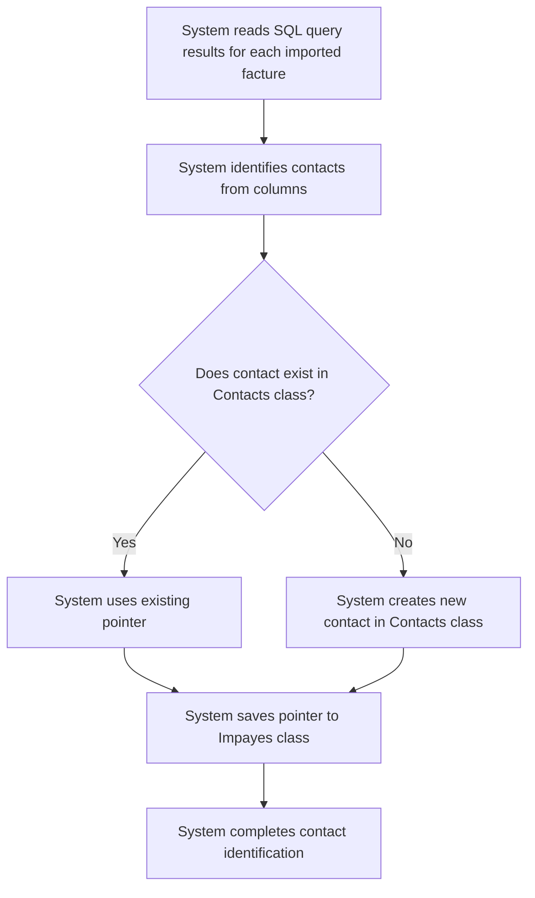

# Design: Identify Contacts

## Technical Approach
The contact identification feature will automatically identify contacts from the SQL query results during the import process. The system will read the SQL query results for each imported invoice, identify contacts from specific columns, and save pointers to these contacts in the `Impayes` class. The frontend will display the identified contacts and any errors encountered during the process.

## Architecture Decisions

### Decision: Use Alpine.js for Frontend Reactivity
- **Description**: Alpine.js will manage the state and reactivity of the contact identification process.
- **Rationale**: Alpine.js is lightweight and integrates seamlessly with HTML, making it ideal for this use case.
- **Impact**: Simplifies frontend logic and improves user experience.

### Decision: Use Flask for Backend Processing
- **Description**: Flask will handle the contact identification logic and database operations.
- **Rationale**: Flask is lightweight and well-suited for handling HTTP requests and integrating with Parse.
- **Impact**: Ensures robust backend processing and easy integration with the database.

### Decision: Store Contacts in Parse
- **Description**: Contacts will be stored in the `Contacts` class in Parse.
- **Rationale**: Parse provides a scalable and managed database solution.
- **Impact**: Ensures data consistency and scalability.

### Decision: Use Pointers for Contact Relationships
- **Description**: The system will use pointers to link contacts to invoices in the `Impayes` class.
- **Rationale**: Pointers provide a flexible and efficient way to manage relationships between contacts and invoices.
- **Impact**: Ensures data integrity and simplifies relationship management.

## Data Flow


## Data Mapping

### Parse Class: `Contacts`
- **Fields**:
  - `nom`: String (contact name).
  - `email`: String (contact email).
  - `telephone`: String (contact phone number).
  - `type`: String (contact type: payeur, propriétaire, apporteur, notaire).

### Parse Class: `Impayes`
- **Fields**:
  - `acquéreur`: Pointer (pointer to the `Contacts` class for the acquéreur).
  - `apporteur_affaire`: Pointer (pointer to the `Contacts` class for the apporteur d'affaire).
  - `payeur`: Pointer (pointer to the `Contacts` class for the payeur).
  - `proprietaire`: Pointer (pointer to the `Contacts` class for the propriétaire).
  - `notaire`: Pointer (pointer to the `Contacts` class for the notaire).

### Alpine.js Store: `contactIdentification`
- **Fields**:
  - `importedInvoices`: Array (list of imported invoices).
  - `identifiedContacts`: Array (list of identified contacts).
  - `errors`: Array (list of errors encountered during identification).
  - `errorMessage`: String (error message to display).
  - `successMessage`: String (success message to display).

### Data Flow
1. **Input Data**:
   - The system retrieves the imported invoices from the `Impayes` class.
   - The system reads the SQL query results for each invoice to identify contacts.

2. **Contact Identification**:
   - The system identifies contacts from the following columns:
     - `acquéreur_nom`, `acquéreur_email`, `acquéreur_telephone`
     - `apporteur_affaire_nom`, `apporteur_affaire_email`, `apporteur_affaire_telephone`
     - `payeur_nom`, `payeur_email`, `payeur_telephone`
     - `proprietaire_nom`, `proprietaire_email`, `proprietaire_telephone`
     - `notaire_nom`, `notaire_email`, `notaire_telephone`

3. **Contact Creation**:
   - The system checks if each contact exists in the `Contacts` class.
   - If a contact does not exist, the system creates a new contact in the `Contacts` class.

4. **Pointer Saving**:
   - The system saves pointers to the contacts in the `Impayes` class in the appropriate columns based on the contact type.

5. **Error Handling**:
   - If a contact's email is different from an existing contact, the system prompts the user to resolve the issue.
   - If data is missing for a contact, the system logs an error and continues processing.

## Screen ASCII

### Screen 1: Contact Identification
```
┌───────────────────────────────────────────────────────────────────────────────┐
│                                                                           │
│                                                                               │
│  Contact Identification                                                       │
│  Identifying contacts from imported invoices                                 │
│                                                                               │
│  🔄                                                                           │
│  Identifying contacts...                                                     │
│                                                                               │
│  ✅                                                                           │
│  Contacts identified successfully!                                            │
│  [View Contacts]                                                              │
│                                                                               │
│  ❌                                                                           │
│  Some contacts could not be identified.                                      │
│  [Review Errors]  [Cancel]                                                   │
│                                                                               │
│                                                                           │
└───────────────────────────────────────────────────────────────────────────────┘
```

### Screen 2: Identified Contacts List
```
┌───────────────────────────────────────────────────────────────────────────────┐
│                                                                           │
│                                                                               │
│  Identified Contacts                                                         │
│  List of contacts identified from invoices                                   │
│                                                                               │
│  ┌─────────────────────────────────────────────────────────────────────────┐  │
│  │  Name  │  Email  │  Phone  │  Type  │  Linked Invoices              │  │
│  ├─────────────────────────────────────────────────────────────────────────┤  │
│  │  John Doe  │  john@example.com  │  123456789  │  Payeur  │  INV-001          │  │
│  │  Jane Smith  │  jane@example.com  │  987654321  │  Propriétaire  │  INV-002          │  │
│  └─────────────────────────────────────────────────────────────────────────┘  │
│                                                                               │
│  [Export Contacts]  [Back to Invoices]                                       │
│                                                                               │
│                                                                           │
└───────────────────────────────────────────────────────────────────────────────┘
```

### Screen 3: Error Review
```
┌───────────────────────────────────────────────────────────────────────────────┐
│                                                                           │
│                                                                               │
│  Contact Identification Errors                                              │
│  Review and resolve contact identification errors                            │
│                                                                               │
│  ❌ Error 1: Missing email for contact John Doe                               │
│  ❌ Error 2: Invalid phone number for contact Jane Smith                      │
│                                                                               │
│  [Retry Identification]  [Cancel]                                             │
│                                                                               │
│                                                                           │
└───────────────────────────────────────────────────────────────────────────────┘
```

## Components and Layouts

### Components/Partials Usage

#### Contact Identification Component
- **File**: `/templates/partials/contact_identification_component.html`
- **Role**: Handles contact identification and displays identified contacts.
- **Dependencies**:
  - `contactIdentification` store for managing state.
  - `axiosParse` for API calls to Parse.

#### Error Review Component
- **File**: `/templates/partials/error_review_component.html`
- **Role**: Displays errors encountered during contact identification.
- **Dependencies**:
  - `contactIdentification` store for managing state.

### Layouts

#### Base Layout
- **File**: `/templates/layouts/base_layout.html`
- **Role**: Provides the basic structure for all pages, including the header, footer, and main content area.

#### Dashboard Layout
- **File**: `/templates/layouts/dashboard_layout.html`
- **Role**: Provides the structure for dashboard pages, including the header, sidebar, and main content area.
- **Components Used**:
  - `sidebarComponent`

## Data Parse Changes

### Class: `Contacts`
- **New Class**:
  - `Contacts` will store contact information, including name, email, phone number, and type.

### Class: `Impayes`
- **New Fields**:
  - `acquéreur`: Pointer (pointer to the `Contacts` class for the acquéreur).
  - `apporteur_affaire`: Pointer (pointer to the `Contacts` class for the apporteur d'affaire).
  - `payeur`: Pointer (pointer to the `Contacts` class for the payeur).
  - `proprietaire`: Pointer (pointer to the `Contacts` class for the propriétaire).
  - `notaire`: Pointer (pointer to the `Contacts` class for the notaire).

## File Changes

### New Files
- `/templates/partials/contact_identification_component.html`: Component for handling contact identification.
- `/templates/partials/error_review_component.html`: Component for displaying errors.
- `/static/js/stores/contactIdentificationStore.js`: Alpine.js store for managing contact identification state.

### Modified Files
- `/templates/layouts/base_layout.html`: Include the contact identification component.
- `/templates/layouts/dashboard_layout.html`: Include the error review component.

## Verification
Ensure the output file is created in the correct folder with the specified structure.