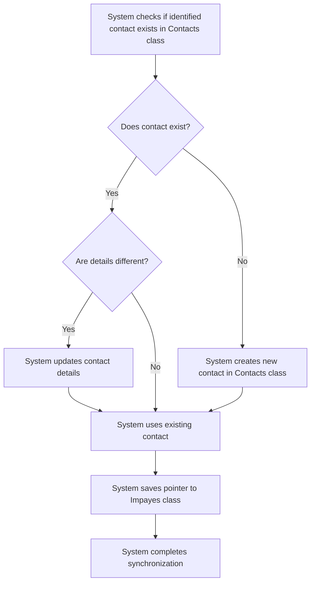

# US002 - Synchronisation des Contacts

## Description
En tant qu'utilisateur, je veux que les contacts soient synchronisés avec la classe `Contacts` de Parse.

## Préconditions
- Les contacts ont été identifiés à partir des résultats de la requête SQL.
- La classe `Contacts` est accessible.

## Scénario Principal
1. Le système vérifie si chaque contact identifié existe déjà dans la classe `Contacts`.
2. Si un contact n'existe pas, le système le crée dans la classe `Contacts` avec les informations suivantes :
   - Nom
   - Email
   - Téléphone
3. Si un contact existe déjà, le système vérifie si les informations sont différentes.
4. Si les informations sont différentes, le système met à jour les informations du contact.
5. Le système gère les relations entre contacts, par exemple, les employés d'une entreprise.
6. Le système enregistre les pointeurs vers les contacts dans la classe `Impayes`.

## Scénario Alternatif
- **Conflit de Données** : Si un contact existe avec des informations différentes, le système enregistre un avertissement et demande à l'utilisateur de résoudre le conflit.
- **Contact Lié** : Si un contact est lié à d'autres contacts (par exemple, un employé d'une entreprise), le système conserve les liens existants et met à jour uniquement les informations nécessaires.

## Postconditions
- Les contacts sont synchronisés avec la classe `Contacts`.
- Les relations entre contacts sont conservées.
- Les pointeurs vers les contacts sont enregistrés dans la classe `Impayes`.

## Notes
- Les contacts doivent être uniques dans la classe `Contacts`.
- Les mises à jour doivent être effectuées avec précaution pour éviter les conflits.
- Les relations entre contacts doivent être gérées pour éviter les pertes de données.

## User Flow Diagram


## Wireframes

### Écran Synchronisation des Contacts
```
┌───────────────────────────────────────────────────────────────────────────────┐
│                                                                           │
│                                                                               │
│  Synchronisation des Contacts                                                │
│  Synchronisation des contacts avec la classe Contacts de Parse              │
│                                                                               │
│  🔄                                                                           │
│  Synchronisation des contacts...                                             │
│                                                                               │
│  ✅                                                                           │
│  Contacts synchronisés avec succès !                                         │
│  [Voir les Contacts]                                                          │
│                                                                               │
│  ❌                                                                           │
│  Certains contacts n'ont pas pu être synchronisés.                            │
│  [Revoir les Conflits]  [Annuler]                                             │
│                                                                               │
│                                                                           │
└───────────────────────────────────────────────────────────────────────────────┘
```

### Écran Résolution des Conflits
```
┌───────────────────────────────────────────────────────────────────────────────┐
│                                                                           │
│                                                                               │
│  Résolution des Conflits de Contacts                                        │
│  Passer en revue et résoudre les conflits de synchronisation des contacts    │
│                                                                               │
│  Conflit 1:                                                                  │
│  Existant: John Doe, john@example.com, 123456789                            │
│  Nouveau: John Doe, john.doe@example.com, 123456789                          │
│  [Utiliser l'Existant]  [Utiliser le Nouveau]                                 │
│                                                                               │
│  Conflit 2:                                                                  │
│  Existant: Jane Smith, jane@example.com, 987654321                          │
│  Nouveau: Jane Smith, jane.smith@example.com, 987654321                     │
│  [Utiliser l'Existant]  [Utiliser le Nouveau]                                 │
│                                                                               │
│  [Sauvegarder les Changements]  [Annuler]                                    │
│                                                                               │
│                                                                           │
└───────────────────────────────────────────────────────────────────────────────┘
```

### Écran Contacts Synchronisés
```
┌───────────────────────────────────────────────────────────────────────────────┐
│                                                                           │
│                                                                               │
│  Contacts Synchronisés                                                       │
│  Liste des contacts synchronisés                                             │
│                                                                               │
│  ┌─────────────────────────────────────────────────────────────────────────┐  │
│  │  Nom  │  Email  │  Téléphone  │  Type  │  Statut                        │  │
│  ├─────────────────────────────────────────────────────────────────────────┤  │
│  │  John Doe  │  john@example.com  │  123456789  │  Payeur  │  Synchronisé     │  │
│  │  Jane Smith  │  jane@example.com  │  987654321  │  Propriétaire  │  Synchronisé     │  │
│  └─────────────────────────────────────────────────────────────────────────┘  │
│                                                                               │
│  [Exporter les Contacts]  [Retour aux Factures]                               │
│                                                                               │
│                                                                           │
└───────────────────────────────────────────────────────────────────────────────┘
