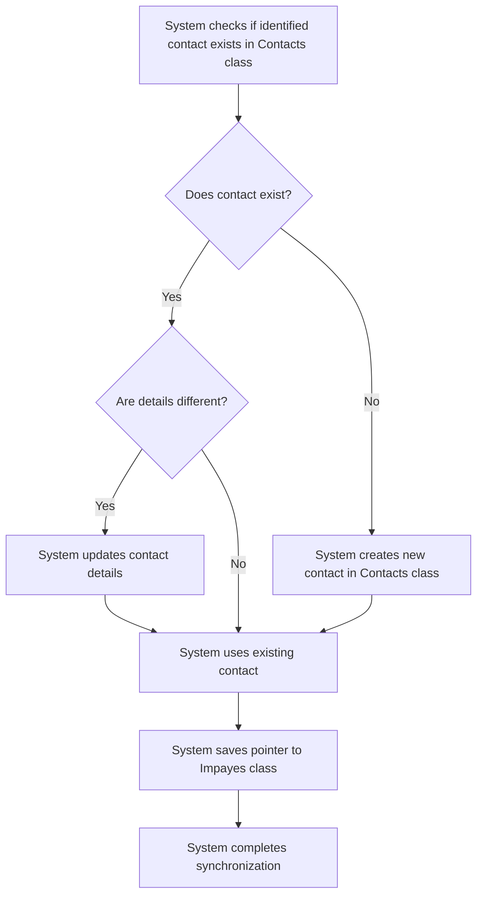

# Design: Synchronize Contacts

## Technical Approach
The contact synchronization feature will ensure that contacts are synchronized with the `Contacts` class in Parse. The system will check if each identified contact exists in the `Contacts` class, create new contacts if they do not exist, update existing contacts if their details are different, and save pointers to the contacts in the `Impayes` class. The frontend will display the synchronization status and any conflicts encountered during the process.

## Architecture Decisions

### Decision: Use Alpine.js for Frontend Reactivity
- **Description**: Alpine.js will manage the state and reactivity of the contact synchronization process.
- **Rationale**: Alpine.js is lightweight and integrates seamlessly with HTML, making it ideal for this use case.
- **Impact**: Simplifies frontend logic and improves user experience.

### Decision: Use Flask for Backend Processing
- **Description**: Flask will handle the contact synchronization logic and database operations.
- **Rationale**: Flask is lightweight and well-suited for handling HTTP requests and integrating with Parse.
- **Impact**: Ensures robust backend processing and easy integration with the database.

### Decision: Store Contacts in Parse
- **Description**: Contacts will be stored in the `Contacts` class in Parse.
- **Rationale**: Parse provides a scalable and managed database solution.
- **Impact**: Ensures data consistency and scalability.

### Decision: Use Pointers for Contact Relationships
- **Description**: The system will use pointers to link contacts to invoices in the `Impayes` class.
- **Rationale**: Pointers provide a flexible and efficient way to manage relationships between contacts and invoices.
- **Impact**: Ensures data integrity and simplifies relationship management.

## Data Flow


## Data Mapping

### Parse Class: `Contacts`
- **Fields**:
  - `nom`: String (contact name).
  - `email`: String (contact email).
  - `telephone`: String (contact phone number).
  - `type`: String (contact type: payeur, propriétaire, apporteur, notaire).

### Parse Class: `Impayes`
- **Fields**:
  - `acquéreur`: Pointer (pointer to the `Contacts` class for the acquéreur).
  - `apporteur_affaire`: Pointer (pointer to the `Contacts` class for the apporteur d'affaire).
  - `payeur`: Pointer (pointer to the `Contacts` class for the payeur).
  - `proprietaire`: Pointer (pointer to the `Contacts` class for the propriétaire).
  - `notaire`: Pointer (pointer to the `Contacts` class for the notaire).

### Alpine.js Store: `contactSynchronization`
- **Fields**:
  - `identifiedContacts`: Array (list of identified contacts).
  - `synchronizedContacts`: Array (list of synchronized contacts).
  - `conflicts`: Array (list of conflicts encountered during synchronization).
  - `errorMessage`: String (error message to display).
  - `successMessage`: String (success message to display).

### Data Flow
1. **Input Data**:
   - The system retrieves the identified contacts from the contact identification process.
   - The system checks if each contact exists in the `Contacts` class.

2. **Contact Creation**:
   - If a contact does not exist, the system creates a new contact in the `Contacts` class with the following details:
     - Name
     - Email
     - Phone number
     - Type

3. **Contact Update**:
   - If a contact exists and its details are different, the system updates the contact details in the `Contacts` class.

4. **Pointer Saving**:
   - The system saves pointers to the contacts in the `Impayes` class in the appropriate columns based on the contact type.

5. **Conflict Handling**:
   - If a contact exists with different details, the system logs a conflict and prompts the user to resolve it.
   - The user can choose to use the existing contact details or the new contact details.

6. **Relationship Management**:
   - The system manages relationships between contacts, such as employees of a company, and preserves existing links.

## Screen ASCII

### Screen 1: Contact Synchronization
```
┌───────────────────────────────────────────────────────────────────────────────┐
│                                                                           │
│                                                                               │
│  Contact Synchronization                                                     │
│  Synchronizing contacts with the Contacts class                             │
│                                                                               │
│  🔄                                                                           │
│  Synchronizing contacts...                                                  │
│                                                                               │
│  ✅                                                                           │
│  Contacts synchronized successfully!                                        │
│  [View Contacts]                                                              │
│                                                                               │
│  ❌                                                                           │
│  Some contacts could not be synchronized.                                   │
│  [Review Conflicts]  [Cancel]                                                │
│                                                                               │
│                                                                           │
└───────────────────────────────────────────────────────────────────────────────┘
```

### Screen 2: Conflict Resolution
```
┌───────────────────────────────────────────────────────────────────────────────┐
│                                                                           │
│                                                                               │
│  Contact Conflict Resolution                                                │
│  Review and resolve contact synchronization conflicts                        │
│                                                                               │
│  Conflict 1:                                                                  │
│  Existing: John Doe, john@example.com, 123456789                            │
│  New: John Doe, john.doe@example.com, 123456789                             │
│  [Use Existing]  [Use New]                                                   │
│                                                                               │
│  Conflict 2:                                                                  │
│  Existing: Jane Smith, jane@example.com, 987654321                          │
│  New: Jane Smith, jane.smith@example.com, 987654321                         │
│  [Use Existing]  [Use New]                                                   │
│                                                                               │
│  [Save Changes]  [Cancel]                                                   │
│                                                                               │
│                                                                           │
└───────────────────────────────────────────────────────────────────────────────┘
```

### Screen 3: Synchronized Contacts List
```
┌───────────────────────────────────────────────────────────────────────────────┐
│                                                                           │
│                                                                               │
│  Synchronized Contacts                                                      │
│  List of synchronized contacts                                               │
│                                                                               │
│  ┌─────────────────────────────────────────────────────────────────────────┐  │
│  │  Name  │  Email  │  Phone  │  Type  │  Status                          │  │
│  ├─────────────────────────────────────────────────────────────────────────┤  │
│  │  John Doe  │  john@example.com  │  123456789  │  Payeur  │  Synchronized     │  │
│  │  Jane Smith  │  jane@example.com  │  987654321  │  Propriétaire  │  Synchronized     │  │
│  └─────────────────────────────────────────────────────────────────────────┘  │
│                                                                               │
│  [Export Contacts]  [Back to Invoices]                                       │
│                                                                               │
│                                                                           │
└───────────────────────────────────────────────────────────────────────────────┘
```

## Components and Layouts

### Components/Partials Usage

#### Contact Synchronization Component
- **File**: `/templates/partials/contact_synchronization_component.html`
- **Role**: Handles contact synchronization and displays synchronization status.
- **Dependencies**:
  - `contactSynchronization` store for managing state.
  - `axiosParse` for API calls to Parse.

#### Conflict Resolution Component
- **File**: `/templates/partials/conflict_resolution_component.html`
- **Role**: Displays conflicts encountered during contact synchronization.
- **Dependencies**:
  - `contactSynchronization` store for managing state.

### Layouts

#### Base Layout
- **File**: `/templates/layouts/base_layout.html`
- **Role**: Provides the basic structure for all pages, including the header, footer, and main content area.

#### Dashboard Layout
- **File**: `/templates/layouts/dashboard_layout.html`
- **Role**: Provides the structure for dashboard pages, including the header, sidebar, and main content area.
- **Components Used**:
  - `sidebarComponent`

## Data Parse Changes

### Class: `Contacts`
- **Changes**: No changes required.

### Class: `Impayes`
- **Changes**: No changes required.

## File Changes

### New Files
- `/templates/partials/contact_synchronization_component.html`: Component for handling contact synchronization.
- `/templates/partials/conflict_resolution_component.html`: Component for displaying conflicts.
- `/static/js/stores/contactSynchronizationStore.js`: Alpine.js store for managing contact synchronization state.

### Modified Files
- `/templates/layouts/base_layout.html`: Include the contact synchronization component.
- `/templates/layouts/dashboard_layout.html`: Include the conflict resolution component.

## Verification
Ensure the output file is created in the correct folder with the specified structure.