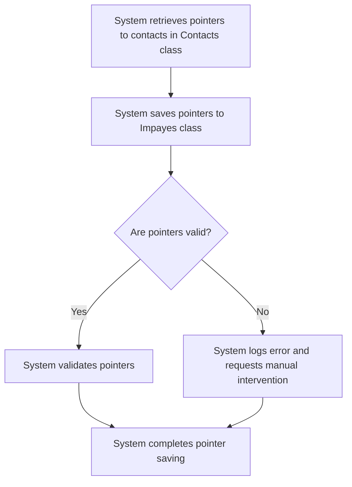

# US003 - Enregistrement des Pointeurs

## Description
En tant qu'utilisateur, je veux que les contacts soient enregistrés dans la classe `Impayes` avec les bons pointeurs vers `Contacts`.

## Préconditions
- Les contacts ont été identifiés et synchronisés avec la classe `Contacts`.
- La classe `Impayes` est accessible.

## Scénario Principal
1. Le système récupère les pointeurs vers les contacts dans la classe `Contacts`.
2. Le système enregistre les pointeurs dans les colonnes correspondantes de la classe `Impayes` :
   - `payeur` (pointeur vers le contact payeur)
   - `proprietaire` (pointeur vers le contact propriétaire)
   - `apporteur` (pointeur vers le contact apporteur)
   - `notaire` (pointeur vers le contact notaire)
3. Le système valide que les pointeurs sont correctement enregistrés.

## Scénario Alternatif
- **Pointeur Invalide** : Si un pointeur est invalide, le système enregistre une erreur et demande une intervention manuelle.

## Postconditions
- Les pointeurs vers les contacts sont enregistrés dans la classe `Impayes`.
- Les factures sont liées aux contacts correspondants.

## Notes
- Les pointeurs doivent être validés avant d'être enregistrés.
- Les erreurs doivent être enregistrées pour une résolution ultérieure.

## User Flow Diagram


## Wireframes

### Écran Enregistrement des Pointeurs
```
┌───────────────────────────────────────────────────────────────────────────────┐
│                                                                           │
│                                                                               │
│  Enregistrement des Pointeurs                                                │
│  Enregistrement des pointeurs de contacts vers les factures                 │
│                                                                               │
│  🔄                                                                           │
│  Enregistrement des pointeurs...                                            │
│                                                                               │
│  ✅                                                                           │
│  Pointeurs enregistrés avec succès !                                        │
│  [Voir les Factures]                                                         │
│                                                                               │
│  ❌                                                                           │
│  Certains pointeurs n'ont pas pu être enregistrés.                          │
│  [Revoir les Erreurs]  [Annuler]                                             │
│                                                                               │
│                                                                           │
└───────────────────────────────────────────────────────────────────────────────┘
```

### Écran Révision des Erreurs
```
┌───────────────────────────────────────────────────────────────────────────────┐
│                                                                           │
│                                                                               │
│  Erreurs d'Enregistrement des Pointeurs                                     │
│  Passer en revue et résoudre les erreurs d'enregistrement des pointeurs     │
│                                                                               │
│  Erreur 1:                                                                    │
│  Numéro de Facture: FACT-001                                                  │
│  Type de Contact: Payeur                                                      │
│  Message d'Erreur: ID de contact invalide                                   │
│  [Résoudre]                                                                  │
│                                                                               │
│  Erreur 2:                                                                    │
│  Numéro de Facture: FACT-002                                                  │
│  Type de Contact: Propriétaire                                                │
│  Message d'Erreur: Détails du contact manquants                             │
│  [Résoudre]                                                                  │
│                                                                               │
│  [Réessayer l'Enregistrement]  [Annuler]                                     │
│                                                                               │
│                                                                           │
└───────────────────────────────────────────────────────────────────────────────┘
```

### Écran Liste des Factures
```
┌───────────────────────────────────────────────────────────────────────────────┐
│                                                                           │
│                                                                               │
│  Factures avec Pointeurs                                                      │
│  Liste des factures avec pointeurs de contacts enregistrés                   │
│                                                                               │
│  ┌─────────────────────────────────────────────────────────────────────────┐  │
│  │  Numéro de Facture  │  Date  │  Montant  │  Payeur  │  Propriétaire  │  Apporteur  │  │
│  ├─────────────────────────────────────────────────────────────────────────┤  │
│  │  FACT-001         │  2023-01-01  │  100,00 €  │  John Doe  │  Jane Smith  │  Bob  │  │
│  │  FACT-002         │  2023-01-02  │  200,00 €  │  Jane Smith  │  John Doe  │  Alice  │  │
│  └─────────────────────────────────────────────────────────────────────────┘  │
│                                                                               │
│  [Exporter les Factures]  [Retour aux Contacts]                               │
│                                                                               │
│                                                                           │
└───────────────────────────────────────────────────────────────────────────────┘
