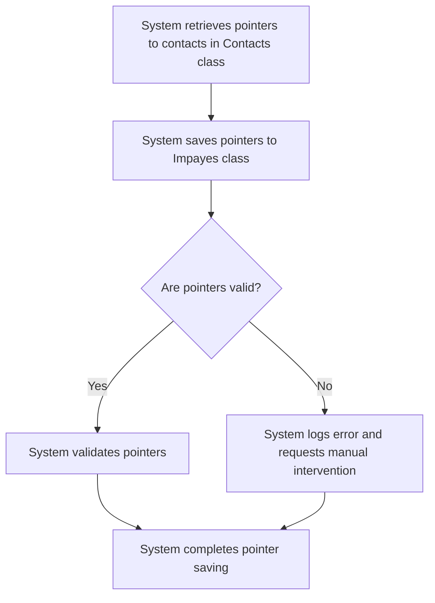

# Design: Save Pointers

## Technical Approach
The save pointers feature will ensure that pointers to contacts are saved in the `Impayes` class with the correct references to the `Contacts` class. The system will retrieve pointers to contacts, save them in the appropriate columns of the `Impayes` class, and validate that the pointers are correctly saved. The frontend will display the saving status and any errors encountered during the process.

## Architecture Decisions

### Decision: Use Alpine.js for Frontend Reactivity
- **Description**: Alpine.js will manage the state and reactivity of the pointer saving process.
- **Rationale**: Alpine.js is lightweight and integrates seamlessly with HTML, making it ideal for this use case.
- **Impact**: Simplifies frontend logic and improves user experience.

### Decision: Use Flask for Backend Processing
- **Description**: Flask will handle the pointer saving logic and database operations.
- **Rationale**: Flask is lightweight and well-suited for handling HTTP requests and integrating with Parse.
- **Impact**: Ensures robust backend processing and easy integration with the database.

### Decision: Store Pointers in Parse
- **Description**: Pointers to contacts will be stored in the `Impayes` class in Parse.
- **Rationale**: Parse provides a scalable and managed database solution.
- **Impact**: Ensures data consistency and scalability.

### Decision: Validate Pointers
- **Description**: The system will validate pointers before saving them to ensure they are correct.
- **Rationale**: Validation ensures data integrity and reduces errors.
- **Impact**: Improves data quality and reduces pointer saving errors.

## Data Flow


## Data Mapping

### Parse Class: `Contacts`
- **Fields**:
  - `nom`: String (contact name).
  - `email`: String (contact email).
  - `telephone`: String (contact phone number).
  - `type`: String (contact type: payeur, propriétaire, apporteur, notaire).

### Parse Class: `Impayes`
- **Fields**:
  - `payeur`: Pointer (pointer to the `Contacts` class for the payeur).
  - `proprietaire`: Pointer (pointer to the `Contacts` class for the propriétaire).
  - `apporteur`: Pointer (pointer to the `Contacts` class for the apporteur).
  - `notaire`: Pointer (pointer to the `Contacts` class for the notaire).

### Alpine.js Store: `pointerSaving`
- **Fields**:
  - `importedInvoices`: Array (list of imported invoices).
  - `contactPointers`: Array (list of contact pointers).
  - `errors`: Array (list of errors encountered during pointer saving).
  - `errorMessage`: String (error message to display).
  - `successMessage`: String (success message to display).

### Data Flow
1. **Input Data**:
   - The system retrieves the imported invoices from the `Impayes` class.
   - The system retrieves the contact pointers from the `Contacts` class.

2. **Pointer Saving**:
   - The system saves the pointers to the contacts in the appropriate columns of the `Impayes` class:
     - `payeur` (pointer to the payeur contact)
     - `proprietaire` (pointer to the propriétaire contact)
     - `apporteur` (pointer to the apporteur contact)
     - `notaire` (pointer to the notaire contact)

3. **Pointer Validation**:
   - The system validates that the pointers are correctly saved.

4. **Error Handling**:
   - If a pointer is invalid, the system logs an error and requests manual intervention.

## Screen ASCII

### Screen 1: Save Pointers
```
┌───────────────────────────────────────────────────────────────────────────────┐
│                                                                           │
│                                                                               │
│  Save Pointers                                                               │
│  Saving contact pointers to invoices                                        │
│                                                                               │
│  🔄                                                                           │
│  Saving pointers...                                                         │
│                                                                               │
│  ✅                                                                           │
│  Pointers saved successfully!                                                │
│  [View Invoices]                                                             │
│                                                                               │
│  ❌                                                                           │
│  Some pointers could not be saved.                                          │
│  [Review Errors]  [Cancel]                                                   │
│                                                                               │
│                                                                           │
└───────────────────────────────────────────────────────────────────────────────┘
```

### Screen 2: Error Review
```
┌───────────────────────────────────────────────────────────────────────────────┐
│                                                                           │
│                                                                               │
│  Pointer Saving Errors                                                       │
│  Review and resolve pointer saving errors                                    │
│                                                                               │
│  Error 1:                                                                    │
│  Invoice Number: INV-001                                                     │
│  Contact Type: Payeur                                                        │
│  Error Message: Invalid contact ID                                           │
│  [Resolve]                                                                    │
│                                                                               │
│  Error 2:                                                                    │
│  Invoice Number: INV-002                                                     │
│  Contact Type: Propriétaire                                                  │
│  Error Message: Missing contact details                                       │
│  [Resolve]                                                                    │
│                                                                               │
│  [Retry Saving]  [Cancel]                                                     │
│                                                                               │
│                                                                           │
└───────────────────────────────────────────────────────────────────────────────┘
```

### Screen 3: Invoices List
```
┌───────────────────────────────────────────────────────────────────────────────┐
│                                                                           │
│                                                                               │
│  Invoices with Pointers                                                     │
│  List of invoices with saved contact pointers                                │
│                                                                               │
│  ┌─────────────────────────────────────────────────────────────────────────┐  │
│  │  Invoice Number  │  Date  │  Amount  │  Payeur  │  Propriétaire  │  Apporteur  │  │
│  ├─────────────────────────────────────────────────────────────────────────┤  │
│  │  INV-001         │  2023-01-01  │  100.00 €  │  John Doe  │  Jane Smith  │  Bob  │  │
│  │  INV-002         │  2023-01-02  │  200.00 €  │  Jane Smith  │  John Doe  │  Alice  │  │
│  └─────────────────────────────────────────────────────────────────────────┘  │
│                                                                               │
│  [Export Invoices]  [Back to Contacts]                                       │
│                                                                               │
│                                                                           │
└───────────────────────────────────────────────────────────────────────────────┘
```

## Components and Layouts

### Components/Partials Usage

#### Save Pointers Component
- **File**: `/templates/partials/save_pointers_component.html`
- **Role**: Handles pointer saving and displays saving status.
- **Dependencies**:
  - `pointerSaving` store for managing state.
  - `axiosParse` for API calls to Parse.

#### Error Review Component
- **File**: `/templates/partials/error_review_component.html`
- **Role**: Displays errors encountered during pointer saving.
- **Dependencies**:
  - `pointerSaving` store for managing state.

### Layouts

#### Base Layout
- **File**: `/templates/layouts/base_layout.html`
- **Role**: Provides the basic structure for all pages, including the header, footer, and main content area.

#### Dashboard Layout
- **File**: `/templates/layouts/dashboard_layout.html`
- **Role**: Provides the structure for dashboard pages, including the header, sidebar, and main content area.
- **Components Used**:
  - `sidebarComponent`

## Data Parse Changes

### Class: `Contacts`
- **Changes**: No changes required.

### Class: `Impayes`
- **Changes**: No changes required.

## File Changes

### New Files
- `/templates/partials/save_pointers_component.html`: Component for handling pointer saving.
- `/templates/partials/error_review_component.html`: Component for displaying errors.
- `/static/js/stores/pointerSavingStore.js`: Alpine.js store for managing pointer saving state.

### Modified Files
- `/templates/layouts/base_layout.html`: Include the save pointers component.
- `/templates/layouts/dashboard_layout.html`: Include the error review component.

## Verification
Ensure the output file is created in the correct folder with the specified structure.