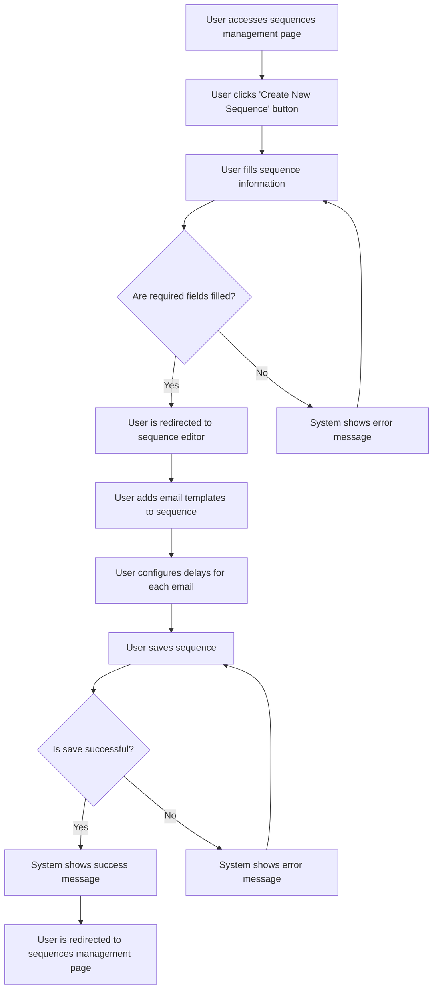

# US001 - Créer une Séquence d'Emails

## Description
En tant qu'utilisateur, je veux créer une séquence d'emails pour automatiser les relances.

## Préconditions
- L'utilisateur est connecté.
- L'utilisateur a accès à la page de gestion des séquences.

## Scénario Principal
1. L'utilisateur accède à la page de gestion des séquences.
2. L'utilisateur clique sur le bouton 'Créer une nouvelle séquence'.
3. L'utilisateur remplit les informations de la séquence :
   - Nom de la séquence
   - Description
4. L'utilisateur est redirigé vers la page d'édition de la séquence.
5. L'utilisateur ajoute des templates d'emails à la séquence en utilisant AlpineFlow, il peut aussi ajouter un nœud filtre.
6. L'utilisateur configure les délais pour chaque email de la séquence.
7. L'utilisateur enregistre la séquence.
8. Le système affiche un message de succès.

## Scénario Alternatif
- **Champs Manquants** : Si des champs obligatoires sont manquants, le système affiche un message d'erreur et demande à l'utilisateur de les remplir.
- **Échec de Sauvegarde** : Si le système ne peut pas sauvegarder la séquence, il affiche un message d'erreur et demande à l'utilisateur de réessayer.

## Postconditions
- La séquence est créée et enregistrée dans la base de données.
- L'utilisateur est redirigé vers la page de gestion des séquences.

## Notes
- Les séquences doivent inclure au moins un template d'email.
- Les délais doivent être configurables pour chaque email de la séquence.
- Les nœuds filtres doivent être configurables via AlpineFlow.

## User Flow Diagram


## Wireframes

### Écran Gestion des Séquences
```
┌───────────────────────────────────────────────────────────────────────────────┐
│                                                                           │
│                                                                               │
│  Séquences d'Emails                                                          │
│  Gérer vos séquences d'emails                                                │
│                                                                               │
│  [Créer une Nouvelle Séquence]                                              │
│                                                                               │
│  ┌─────────────────────────────────────────────────────────────────────────┐  │
│  │  Nom  │  Description  │  Statut  │  Actions                              │  │
│  ├─────────────────────────────────────────────────────────────────────────┤  │
│  │  Séquence 1  │  Description 1  │  Brouillon  │  [Modifier] [Supprimer]      │  │
│  │  Séquence 2  │  Description 2  │  Publiée  │  [Modifier] [Supprimer]      │  │
│  └─────────────────────────────────────────────────────────────────────────┘  │
│                                                                               │
│  [Précédent]  1  2  3  [Suivant]                                              │
│                                                                               │
│                                                                           │
└───────────────────────────────────────────────────────────────────────────────┘
```

### Écran Formulaire de Création de Séquence
```
┌───────────────────────────────────────────────────────────────────────────────┐
│                                                                           │
│                                                                               │
│  Créer une Nouvelle Séquence                                                 │
│  Remplissez les détails de la séquence                                       │
│                                                                               │
│  Nom de la Séquence: [_____________________________________]                 │
│                                                                               │
│  Description:                                                                │
│  [_________________________________________________________________]          │
│  [_________________________________________________________________]          │
│  [_________________________________________________________________]          │
│                                                                               │
│  [Suivant]  [Annuler]                                                         │
│                                                                               │
│                                                                           │
└───────────────────────────────────────────────────────────────────────────────┘
```

### Écran Éditeur de Séquence
```
┌───────────────────────────────────────────────────────────────────────────────┐
│                                                                           │
│                                                                               │
│  Modifier la Séquence                                                        │
│  Ajouter des templates d'emails et configurer les délais                     │
│                                                                               │
│  ┌─────────────────────────────────────────────────────────────────────────┐  │
│  │  Canvas: Zone de glisser-déposer pour les templates d'emails et les nœuds filtres │  │
│  └─────────────────────────────────────────────────────────────────────────┘  │
│                                                                               │
│  Barre latérale: Liste des templates d'emails et des nœuds filtres disponibles │
│                                                                               │
│  [Sauvegarder la Séquence]  [Annuler]                                         │
│                                                                               │
│                                                                           │
└───────────────────────────────────────────────────────────────────────────────┘
```

### Écran Message de Succès
```
┌───────────────────────────────────────────────────────────────────────────────┐
│                                                                           │
│                                                                               │
│  Séquence Créée                                                              │
│  Votre séquence d'emails a été créée avec succès                             │
│                                                                               │
│  ✅                                                                           │
│                                                                               │
│  La séquence 'Nom de la Séquence' a été créée.                               │
│                                                                               │
│  [Voir les Séquences]  [Créer une Autre]                                      │
│                                                                               │
│                                                                           │
└───────────────────────────────────────────────────────────────────────────────┘
```

### Écran Message d'Erreur
```
┌───────────────────────────────────────────────────────────────────────────────┐
│                                                                           │
│                                                                               │
│  Erreur                                                                      │
│  Une erreur est survenue lors de la création de la séquence                │
│                                                                               │
│  ❌                                                                           │
│                                                                               │
│  Veuillez remplir tous les champs obligatoires.                              │
│                                                                               │
│  [Réessayer]  [Annuler]                                                       │
│                                                                               │
│                                                                           │
└───────────────────────────────────────────────────────────────────────────────┘
