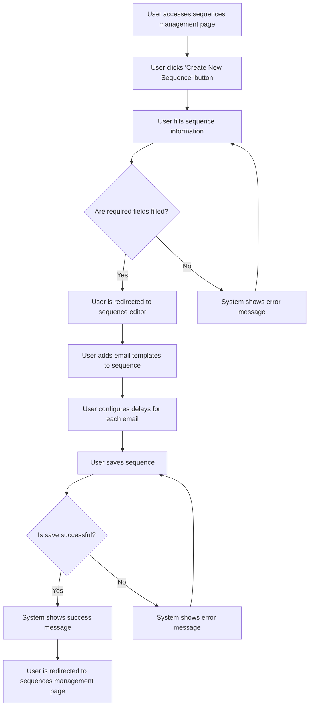

# Design: Create Email Sequence

## Technical Approach
The create email sequence feature will allow users to create and configure email sequences for automated follow-ups. The system will provide a form to capture sequence details, an editor to add email templates and configure delays, and a mechanism to save the sequence. The frontend will use Alpine.js for reactivity and state management, while the backend will handle data storage via Flask.

## Architecture Decisions

### Decision: Use Alpine.js for Frontend Reactivity
- **Description**: Alpine.js will manage the state and reactivity of the sequence creation and editing process.
- **Rationale**: Alpine.js is lightweight and integrates seamlessly with HTML, making it ideal for this use case.
- **Impact**: Simplifies frontend logic and improves user experience.

### Decision: Use Flask for Backend Processing
- **Description**: Flask will handle the sequence creation and data storage operations.
- **Rationale**: Flask is lightweight and well-suited for handling HTTP requests and integrating with Parse.
- **Impact**: Ensures robust backend processing and easy integration with the database.

### Decision: Use AlpineFlow for Sequence Editing
- **Description**: AlpineFlow will be used to create and configure email sequences with drag-and-drop functionality.
- **Rationale**: AlpineFlow provides a user-friendly interface for creating and managing sequences.
- **Impact**: Improves user experience and simplifies sequence configuration.

### Decision: Store Sequences in Parse
- **Description**: Email sequences will be stored in the `Sequences` class in Parse.
- **Rationale**: Parse provides a scalable and managed database solution.
- **Impact**: Ensures data consistency and scalability.

## Data Flow


## Data Mapping

### Parse Class: `Sequences`
- **Fields**:
  - `nom`: String (sequence name).
  - `description`: String (sequence description).
  - `statut`: String (sequence status: draft or published).
  - `templates`: Array (list of email templates in the sequence).
  - `delais`: Array (list of delays for each email in the sequence).

### Alpine.js Store: `sequenceCreation`
- **Fields**:
  - `sequenceName`: String (name of the sequence).
  - `sequenceDescription`: String (description of the sequence).
  - `emailTemplates`: Array (list of email templates in the sequence).
  - `delays`: Array (list of delays for each email in the sequence).
  - `errorMessage`: String (error message to display).
  - `successMessage`: String (success message to display).

### Data Flow
1. **Input Data**:
   - The user fills in the sequence name and description, which are captured in the `sequenceName` and `sequenceDescription` fields.
   - The user adds email templates and configures delays, which are captured in the `emailTemplates` and `delays` fields.

2. **Validation**:
   - The system validates that all required fields are filled.
   - If any required fields are missing, the system displays an error message.

3. **Sequence Saving**:
   - The system saves the sequence details, email templates, and delays to the `Sequences` class in Parse.

4. **Success Handling**:
   - If the sequence is saved successfully, the system displays a success message and redirects the user to the sequences management page.

5. **Error Handling**:
   - If the sequence cannot be saved, the system displays an error message and prompts the user to retry.

## Screen ASCII

### Screen 1: Sequences Management
```
┌───────────────────────────────────────────────────────────────────────────────┐
│                                                                           │
│                                                                               │
│  Email Sequences                                                             │
│  Manage your email sequences                                                │
│                                                                               │
│  [Create New Sequence]                                                      │
│                                                                               │
│  ┌─────────────────────────────────────────────────────────────────────────┐  │
│  │  Name  │  Description  │  Status  │  Actions                              │  │
│  ├─────────────────────────────────────────────────────────────────────────┤  │
│  │  Sequence 1  │  Description 1  │  Draft  │  [Edit] [Delete]                      │  │
│  │  Sequence 2  │  Description 2  │  Published  │  [Edit] [Delete]                      │  │
│  └─────────────────────────────────────────────────────────────────────────┘  │
│                                                                               │
│  [Previous]  1  2  3  [Next]                                                  │
│                                                                               │
│                                                                           │
└───────────────────────────────────────────────────────────────────────────────┘
```

### Screen 2: Create Sequence Form
```
┌───────────────────────────────────────────────────────────────────────────────┐
│                                                                           │
│                                                                               │
│  Create New Sequence                                                         │
│  Fill in the sequence details                                               │
│                                                                               │
│  Sequence Name: [_____________________________________]                     │
│                                                                               │
│  Description:                                                                │
│  [_________________________________________________________________]          │
│  [_________________________________________________________________]          │
│  [_________________________________________________________________]          │
│                                                                               │
│  [Next]  [Cancel]                                                             │
│                                                                               │
│                                                                           │
└───────────────────────────────────────────────────────────────────────────────┘
```

### Screen 3: Sequence Editor
```
┌───────────────────────────────────────────────────────────────────────────────┐
│                                                                           │
│                                                                               │
│  Edit Sequence                                                                │
│  Add email templates and configure delays                                     │
│                                                                               │
│  ┌─────────────────────────────────────────────────────────────────────────┐  │
│  │  Canvas: Drag-and-drop area for email templates and filter nodes        │  │
│  └─────────────────────────────────────────────────────────────────────────┘  │
│                                                                               │
│  Sidebar: List of available email templates and filter nodes                 │
│                                                                               │
│  [Save Sequence]  [Cancel]                                                   │
│                                                                               │
│                                                                           │
└───────────────────────────────────────────────────────────────────────────────┘
```

### Screen 4: Success Message
```
┌───────────────────────────────────────────────────────────────────────────────┐
│                                                                           │
│                                                                               │
│  Sequence Created                                                            │
│  Your email sequence has been created successfully                            │
│                                                                               │
│  ✅                                                                           │
│                                                                               │
│  The sequence 'Sequence Name' has been created.                                │
│                                                                               │
│  [View Sequences]  [Create Another]                                          │
│                                                                               │
│                                                                           │
└───────────────────────────────────────────────────────────────────────────────┘
```

### Screen 5: Error Message
```
┌───────────────────────────────────────────────────────────────────────────────┐
│                                                                           │
│                                                                               │
│  Error                                                                        │
│  An error occurred while creating the sequence                               │
│                                                                               │
│  ❌                                                                           │
│                                                                               │
│  Please fill in all required fields.                                         │
│                                                                               │
│  [Retry]  [Cancel]                                                            │
│                                                                               │
│                                                                           │
└───────────────────────────────────────────────────────────────────────────────┘
```

## Components and Layouts

### Components/Partials Usage

#### Sequences Management Component
- **File**: `/templates/partials/sequences_management_component.html`
- **Role**: Displays the list of sequences and provides options to create, edit, and delete sequences.
- **Dependencies**:
  - `sequenceCreation` store for managing state.
  - `axiosParse` for API calls to Parse.

#### Create Sequence Form Component
- **File**: `/templates/partials/create_sequence_form_component.html`
- **Role**: Handles the creation of a new sequence, including capturing sequence details.
- **Dependencies**:
  - `sequenceCreation` store for managing state.

#### Sequence Editor Component
- **File**: `/templates/partials/sequence_editor_component.html`
- **Role**: Handles the editing of a sequence, including adding email templates and configuring delays.
- **Dependencies**:
  - `sequenceCreation` store for managing state.
  - `AlpineFlow` for drag-and-drop functionality.

#### Success Message Component
- **File**: `/templates/partials/success_message_component.html`
- **Role**: Displays a success message after a sequence is created.
- **Dependencies**:
  - `sequenceCreation` store for managing state.

#### Error Message Component
- **File**: `/templates/partials/error_message_component.html`
- **Role**: Displays error messages during the sequence creation process.
- **Dependencies**:
  - `sequenceCreation` store for managing state.

### Layouts

#### Base Layout
- **File**: `/templates/layouts/base_layout.html`
- **Role**: Provides the basic structure for all pages, including the header, footer, and main content area.

#### Dashboard Layout
- **File**: `/templates/layouts/dashboard_layout.html`
- **Role**: Provides the structure for dashboard pages, including the header, sidebar, and main content area.
- **Components Used**:
  - `sidebarComponent`

## Data Parse Changes

### Class: `Sequences`
- **New Class**:
  - `Sequences` will store email sequence information, including name, description, status, email templates, and delays.

## File Changes

### New Files
- `/templates/partials/sequences_management_component.html`: Component for managing sequences.
- `/templates/partials/create_sequence_form_component.html`: Component for creating a new sequence.
- `/templates/partials/sequence_editor_component.html`: Component for editing a sequence.
- `/templates/partials/success_message_component.html`: Component for displaying success messages.
- `/templates/partials/error_message_component.html`: Component for displaying error messages.
- `/static/js/stores/sequenceCreationStore.js`: Alpine.js store for managing sequence creation state.

### Modified Files
- `/templates/layouts/base_layout.html`: Include the sequences management component.
- `/templates/layouts/dashboard_layout.html`: Include the sequence editor component.

## Verification
Ensure the output file is created in the correct folder with the specified structure.