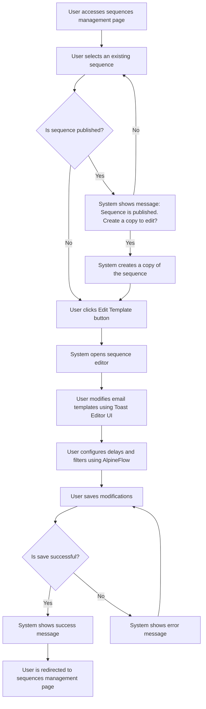

# US002 - Modifier les Templates d'Emails

## Description
En tant qu'utilisateur, je veux modifier les templates d'emails via Toast Editor UI et AlpineFlow.

## Préconditions
- L'utilisateur est connecté.
- Une séquence d'emails existe.

## Scénario Principal
1. L'utilisateur accède à la page de gestion des séquences.
2. L'utilisateur sélectionne une séquence existante.
3. Le système vérifie si la séquence est publiée.
4. Si la séquence est publiée, le système affiche un message indiquant que la séquence ne peut pas être modifiée directement et propose de créer une copie.
5. Si la séquence n'est pas publiée, l'utilisateur clique sur le bouton 'Modifier le template'.
6. Le système ouvre la page d'édition de la séquence où l'utilisateur peut voir le flow et modifier le contenu des nœuds : emails, délais et filtres.
7. Dans le nœud emails, l'utilisateur peut voir et copier les variables dynamiques, gérer les liens de paiement, et utiliser les boutons pour éditer avec l'IA.
8. Le nœud filtre doit être le premier nœud et permet de créer des filtres. Il existe un filtre par défaut qui est le filtre si dans tel sequence qui est la séquence en question.
9. L'utilisateur modifie le template en utilisant les outils de Toast Editor UI pour le message. L'objet et l'expéditeur ne sont pas modifiables via Toast Editor UI.
10. L'utilisateur enregistre les modifications.
11. Le système affiche un message de succès.

## Scénario Alternatif
- **Séquence Publiée** : Si la séquence est publiée, le système propose de créer une copie pour permettre les modifications.
- **Échec de Sauvegarde** : Si le système ne peut pas sauvegarder les modifications, il affiche un message d'erreur et demande à l'utilisateur de réessayer.

## Postconditions
- Le template est modifié et enregistré dans la base de données.
- L'utilisateur est redirigé vers la page de gestion des séquences.

## Notes
- Les templates doivent inclure des variables dynamiques pour personnaliser les emails.
- Les modifications doivent être validées avant d'être enregistrées.
- Les séquences publiées ne peuvent pas être modifiées directement ; il faut créer une copie.

## User Flow Diagram


## Wireframes

### Écran Gestion des Séquences
```
┌───────────────────────────────────────────────────────────────────────────────┐
│                                                                           │
│                                                                               │
│  Séquences d'Emails                                                          │
│  Gérer vos séquences d'emails                                                │
│                                                                               │
│  ┌─────────────────────────────────────────────────────────────────────────┐  │
│  │  Nom  │  Description  │  Statut  │  Actions                              │  │
│  ├─────────────────────────────────────────────────────────────────────────┤  │
│  │  Séquence 1  │  Description 1  │  Brouillon  │  [Modifier] [Supprimer]      │  │
│  │  Séquence 2  │  Description 2  │  Publiée  │  [Modifier] [Supprimer]      │  │
│  └─────────────────────────────────────────────────────────────────────────┘  │
│                                                                               │
│  [Précédent]  1  2  3  [Suivant]                                              │
│                                                                               │
│                                                                           │
└───────────────────────────────────────────────────────────────────────────────┘
```

### Écran Message de Séquence Publiée
```
┌───────────────────────────────────────────────────────────────────────────────┐
│                                                                           │
│                                                                               │
│  Séquence Publiée                                                            │
│  Cette séquence est publiée et ne peut pas être modifiée directement          │
│                                                                               │
│  Souhaitez-vous créer une copie de cette séquence pour la modifier ?         │
│                                                                               │
│  [Créer une Copie]  [Annuler]                                                │
│                                                                               │
│                                                                           │
└───────────────────────────────────────────────────────────────────────────────┘
```

### Écran Éditeur de Séquence
```
┌───────────────────────────────────────────────────────────────────────────────┐
│                                                                           │
│                                                                               │
│  Modifier la Séquence                                                        │
│  Modifier les templates d'emails et configurer les délais                     │
│                                                                               │
│  ┌─────────────────────────────────────────────────────────────────────────┐  │
│  │  Canvas: Zone de glisser-déposer pour les templates d'emails et les nœuds filtres │  │
│  └─────────────────────────────────────────────────────────────────────────┘  │
│                                                                               │
│  Barre latérale: Liste des templates d'emails et des nœuds filtres disponibles │
│                                                                               │
│  [Sauvegarder les Changements]  [Annuler]                                     │
│                                                                               │
│                                                                           │
└───────────────────────────────────────────────────────────────────────────────┘
```

### Écran Éditeur Toast UI
```
┌───────────────────────────────────────────────────────────────────────────────┐
│                                                                           │
│                                                                               │
│  Modifier le Template d'Email                                                 │
│  Modifier le template d'email en utilisant l'éditeur Toast UI                │
│                                                                               │
│  Barre d'outils: Options de formatage (gras, italique, etc.)                 │
│  Zone d'édition: Éditeur de texte riche pour le contenu de l'email          │
│  Panneau des Variables: Liste des variables dynamiques (barre latérale droite)│
│                                                                               │
│  [Sauvegarder le Template]  [Annuler]                                         │
│                                                                               │
│                                                                           │
└───────────────────────────────────────────────────────────────────────────────┘
```

### Écran Message de Succès
```
┌───────────────────────────────────────────────────────────────────────────────┐
│                                                                           │
│                                                                               │
│  Template Mis à Jour                                                         │
│  Votre template d'email a été mis à jour avec succès                         │
│                                                                               │
│  ✅                                                                           │
│                                                                               │
│  Le template a été sauvegardé.                                                │
│                                                                               │
│  [Voir les Séquences]  [Continuer la Modification]                            │
│                                                                               │
│                                                                           │
└───────────────────────────────────────────────────────────────────────────────┘
```

### Écran Message d'Erreur
```
┌───────────────────────────────────────────────────────────────────────────────┐
│                                                                           │
│                                                                               │
│  Erreur                                                                      │
│  Une erreur est survenue lors de la sauvegarde du template                   │
│                                                                               │
│  ❌                                                                           │
│                                                                               │
│  Veuillez réessayer.                                                         │
│                                                                               │
│  [Réessayer]  [Annuler]                                                       │
│                                                                               │
│                                                                           │
└───────────────────────────────────────────────────────────────────────────────┘
