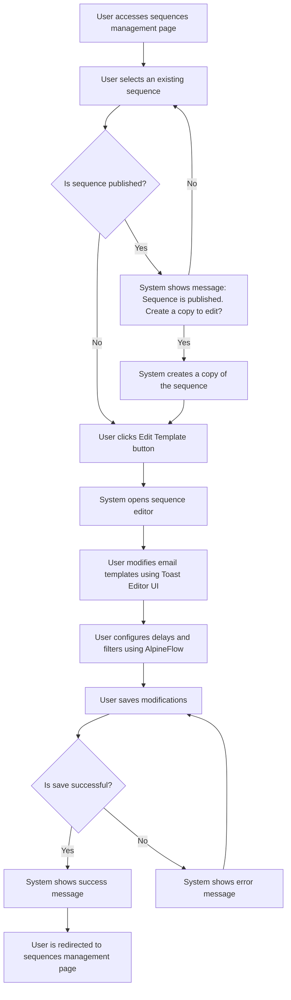

# Design: Edit Email Templates

## Technical Approach
The edit email templates feature will allow users to modify email templates within a sequence using Toast Editor UI and AlpineFlow. The system will provide an interface to edit templates, configure delays, and manage filters. The frontend will use Alpine.js for reactivity and state management, while the backend will handle data storage via Flask.

## Architecture Decisions

### Decision: Use Alpine.js for Frontend Reactivity
- **Description**: Alpine.js will manage the state and reactivity of the template editing process.
- **Rationale**: Alpine.js is lightweight and integrates seamlessly with HTML, making it ideal for this use case.
- **Impact**: Simplifies frontend logic and improves user experience.

### Decision: Use Flask for Backend Processing
- **Description**: Flask will handle the template editing and data storage operations.
- **Rationale**: Flask is lightweight and well-suited for handling HTTP requests and integrating with Parse.
- **Impact**: Ensures robust backend processing and easy integration with the database.

### Decision: Use Toast Editor UI for Template Editing
- **Description**: Toast Editor UI will be used to edit email templates with rich text formatting.
- **Rationale**: Toast Editor UI provides a user-friendly interface for editing email templates.
- **Impact**: Improves user experience and simplifies template editing.

### Decision: Use AlpineFlow for Sequence Configuration
- **Description**: AlpineFlow will be used to configure delays and filters in the sequence.
- **Rationale**: AlpineFlow provides a user-friendly interface for managing sequences.
- **Impact**: Improves user experience and simplifies sequence configuration.

### Decision: Store Templates in Parse
- **Description**: Email templates will be stored in the `Sequences` class in Parse.
- **Rationale**: Parse provides a scalable and managed database solution.
- **Impact**: Ensures data consistency and scalability.

## Data Flow


## Data Mapping

### Parse Class: `Sequences`
- **Fields**:
  - `nom`: String (sequence name).
  - `description`: String (sequence description).
  - `statut`: String (sequence status: draft or published).
  - `templates`: Array (list of email templates in the sequence).
  - `delais`: Array (list of delays for each email in the sequence).
  - `filtres`: Array (list of filters in the sequence).

### Alpine.js Store: `templateEditing`
- **Fields**:
  - `sequenceId`: String (ID of the sequence being edited).
  - `sequenceName`: String (name of the sequence).
  - `sequenceDescription`: String (description of the sequence).
  - `emailTemplates`: Array (list of email templates in the sequence).
  - `delays`: Array (list of delays for each email in the sequence).
  - `filters`: Array (list of filters in the sequence).
  - `errorMessage`: String (error message to display).
  - `successMessage`: String (success message to display).

### Data Flow
1. **Input Data**:
   - The user selects a sequence, and the system retrieves the sequence details from the `Sequences` class.
   - The system checks if the sequence is published.

2. **Sequence Copy**:
   - If the sequence is published, the system prompts the user to create a copy of the sequence for editing.

3. **Template Editing**:
   - The user modifies the email templates using Toast Editor UI.
   - The user configures delays and filters using AlpineFlow.

4. **Validation**:
   - The system validates that all required fields are filled and that the templates are correctly formatted.

5. **Template Saving**:
   - The system saves the modified templates, delays, and filters to the `Sequences` class in Parse.

6. **Success Handling**:
   - If the templates are saved successfully, the system displays a success message and redirects the user to the sequences management page.

7. **Error Handling**:
   - If the templates cannot be saved, the system displays an error message and prompts the user to retry.

## Screen ASCII

### Screen 1: Sequences Management
```
┌───────────────────────────────────────────────────────────────────────────────┐
│                                                                           │
│                                                                               │
│  Email Sequences                                                             │
│  Manage your email sequences                                                │
│                                                                               │
│  ┌─────────────────────────────────────────────────────────────────────────┐  │
│  │  Name  │  Description  │  Status  │  Actions                              │  │
│  ├─────────────────────────────────────────────────────────────────────────┤  │
│  │  Sequence 1  │  Description 1  │  Draft  │  [Edit] [Delete]                      │  │
│  │  Sequence 2  │  Description 2  │  Published  │  [Edit] [Delete]                      │  │
│  └─────────────────────────────────────────────────────────────────────────┘  │
│                                                                               │
│  [Previous]  1  2  3  [Next]                                                  │
│                                                                               │
│                                                                           │
└───────────────────────────────────────────────────────────────────────────────┘
```

### Screen 2: Published Sequence Message
```
┌───────────────────────────────────────────────────────────────────────────────┐
│                                                                           │
│                                                                               │
│  Published Sequence                                                          │
│  This sequence is published and cannot be edited directly                    │
│                                                                               │
│  Would you like to create a copy of this sequence to edit?                  │
│                                                                               │
│  [Create Copy]  [Cancel]                                                     │
│                                                                               │
│                                                                           │
└───────────────────────────────────────────────────────────────────────────────┘
```

### Screen 3: Sequence Editor
```
┌───────────────────────────────────────────────────────────────────────────────┐
│                                                                           │
│                                                                               │
│  Edit Sequence                                                                │
│  Edit email templates and configure delays                                   │
│                                                                               │
│  ┌─────────────────────────────────────────────────────────────────────────┐  │
│  │  Canvas: Drag-and-drop area for email templates and filter nodes        │  │
│  └─────────────────────────────────────────────────────────────────────────┘  │
│                                                                               │
│  Sidebar: List of available email templates and filter nodes                 │
│                                                                               │
│  [Save Changes]  [Cancel]                                                     │
│                                                                               │
│                                                                           │
└───────────────────────────────────────────────────────────────────────────────┘
```

### Screen 4: Toast Editor UI
```
┌───────────────────────────────────────────────────────────────────────────────┐
│                                                                           │
│                                                                               │
│  Edit Email Template                                                          │
│  Edit the email template using Toast Editor UI                                │
│                                                                               │
│  Toolbar: Formatting options (bold, italic, etc.)                             │
│  Editing Area: Rich text editor for email content                             │
│  Variables Panel: List of dynamic variables (right sidebar)                  │
│                                                                               │
│  [Save Template]  [Cancel]                                                   │
│                                                                               │
│                                                                           │
└───────────────────────────────────────────────────────────────────────────────┘
```

### Screen 5: Success Message
```
┌───────────────────────────────────────────────────────────────────────────────┐
│                                                                           │
│                                                                               │
│  Template Updated                                                             │
│  Your email template has been updated successfully                            │
│                                                                               │
│  ✅                                                                           │
│                                                                               │
│  The template has been saved.                                                │
│                                                                               │
│  [View Sequences]  [Continue Editing]                                        │
│                                                                               │
│                                                                           │
└───────────────────────────────────────────────────────────────────────────────┘
```

### Screen 6: Error Message
```
┌───────────────────────────────────────────────────────────────────────────────┐
│                                                                           │
│                                                                               │
│  Error                                                                        │
│  An error occurred while saving the template                                 │
│                                                                               │
│  ❌                                                                           │
│                                                                               │
│  Please try again.                                                            │
│                                                                               │
│  [Retry]  [Cancel]                                                            │
│                                                                               │
│                                                                           │
└───────────────────────────────────────────────────────────────────────────────┘
```

## Components and Layouts

### Components/Partials Usage

#### Sequences Management Component
- **File**: `/templates/partials/sequences_management_component.html`
- **Role**: Displays the list of sequences and provides options to edit and delete sequences.
- **Dependencies**:
  - `templateEditing` store for managing state.
  - `axiosParse` for API calls to Parse.

#### Published Sequence Message Component
- **File**: `/templates/partials/published_sequence_message_component.html`
- **Role**: Displays a message prompting the user to create a copy of a published sequence for editing.
- **Dependencies**:
  - `templateEditing` store for managing state.

#### Sequence Editor Component
- **File**: `/templates/partials/sequence_editor_component.html`
- **Role**: Handles the editing of a sequence, including modifying email templates and configuring delays.
- **Dependencies**:
  - `templateEditing` store for managing state.
  - `AlpineFlow` for drag-and-drop functionality.

#### Toast Editor UI Component
- **File**: `/templates/partials/toast_editor_ui_component.html`
- **Role**: Handles the editing of email templates using Toast Editor UI.
- **Dependencies**:
  - `templateEditing` store for managing state.
  - `Toast Editor UI` for rich text editing.

#### Success Message Component
- **File**: `/templates/partials/success_message_component.html`
- **Role**: Displays a success message after a template is updated.
- **Dependencies**:
  - `templateEditing` store for managing state.

#### Error Message Component
- **File**: `/templates/partials/error_message_component.html`
- **Role**: Displays error messages during the template editing process.
- **Dependencies**:
  - `templateEditing` store for managing state.

### Layouts

#### Base Layout
- **File**: `/templates/layouts/base_layout.html`
- **Role**: Provides the basic structure for all pages, including the header, footer, and main content area.

#### Dashboard Layout
- **File**: `/templates/layouts/dashboard_layout.html`
- **Role**: Provides the structure for dashboard pages, including the header, sidebar, and main content area.
- **Components Used**:
  - `sidebarComponent`

## Data Parse Changes

### Class: `Sequences`
- **Changes**: No changes required.

## File Changes

### New Files
- `/templates/partials/sequences_management_component.html`: Component for managing sequences.
- `/templates/partials/published_sequence_message_component.html`: Component for displaying published sequence messages.
- `/templates/partials/sequence_editor_component.html`: Component for editing sequences.
- `/templates/partials/toast_editor_ui_component.html`: Component for editing email templates.
- `/templates/partials/success_message_component.html`: Component for displaying success messages.
- `/templates/partials/error_message_component.html`: Component for displaying error messages.
- `/static/js/stores/templateEditingStore.js`: Alpine.js store for managing template editing state.

### Modified Files
- `/templates/layouts/base_layout.html`: Include the sequences management component.
- `/templates/layouts/dashboard_layout.html`: Include the sequence editor component.

## Verification
Ensure the output file is created in the correct folder with the specified structure.