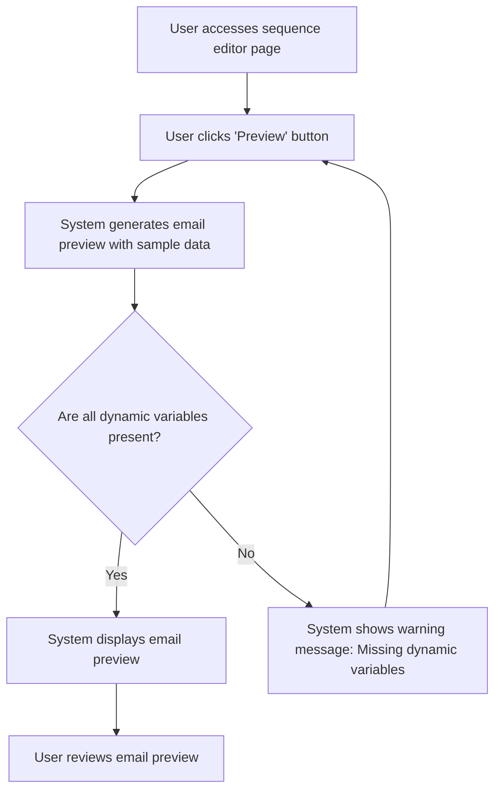

# US003 - Prévisualiser les Emails

## Description
En tant qu'utilisateur, je veux prévisualiser les emails avant de les envoyer.

## Préconditions
- L'utilisateur est connecté.
- Une séquence d'emails existe.

## Scénario Principal
1. L'utilisateur accède à la page editor de la séquence.
3. L'utilisateur clique sur le bouton 'Prévisualiser'.
4. Le système génère un aperçu de l'email avec les variables dynamiques remplacées par des valeurs d'exemple issue du premier Impayés récupérer dans la base.
5. Le système affiche l'aperçu de l'email.

## Scénario Alternatif
- **Variables Manquantes** : Si des variables dynamiques sont manquantes, le système affiche un message d'avertissement et demande à l'utilisateur de les ajouter.

## Postconditions
- L'utilisateur peut voir un aperçu de l'email avant l'envoi.

## Notes
- Les aperçus doivent inclure des valeurs d'exemple pour les variables dynamiques.
- Les aperçus doivent être générés en temps réel.

## User Flow Diagram


## Wireframes

### Écran Éditeur de Séquence
```
┌───────────────────────────────────────────────────────────────────────────────┐
│                                                                           │
│                                                                               │
│  Modifier la Séquence                                                        │
│  Modifier les templates d'emails et configurer les délais                     │
│                                                                               │
│  ┌─────────────────────────────────────────────────────────────────────────┐  │
│  │  Canvas: Zone de glisser-déposer pour les templates d'emails et les nœuds filtres │  │
│  └─────────────────────────────────────────────────────────────────────────┘  │
│                                                                               │
│  Barre latérale: Liste des templates d'emails et des nœuds filtres disponibles │
│                                                                               │
│  [Prévisualiser]  [Sauvegarder les Changements]  [Annuler]                    │
│                                                                               │
│                                                                           │
└───────────────────────────────────────────────────────────────────────────────┘
```

### Écran Aperçu de l'Email
```
┌───────────────────────────────────────────────────────────────────────────────┐
│                                                                           │
│                                                                               │
│  Aperçu de l'Email                                                           │
│  Aperçu de l'email avec des données d'exemple                                │
│                                                                               │
│  Objet: Rappel de Facture                                                    │
│  De: ne-pas-repondre@example.com                                            │
│                                                                               │
│  Cher [[nom_client]],                                                         │
│                                                                               │
│  Ceci est un rappel pour votre facture [[numero_facture]].                   │
│                                                                               │
│  Cordialement,                                                                │
│  L'Équipe Example                                                             │
│                                                                               │
│  [Retour à l'Éditeur]                                                         │
│                                                                               │
│                                                                           │
└───────────────────────────────────────────────────────────────────────────────┘
```

### Écran Avertissement de Variables Manquantes
```
┌───────────────────────────────────────────────────────────────────────────────┐
│                                                                           │
│                                                                               │
│  Avertissement                                                                │
│  Variables dynamiques manquantes                                              │
│                                                                               │
│  ⚠️                                                                           │
│                                                                               │
│  Les variables dynamiques suivantes sont manquantes :                        │
│  - Variable 1                                                                 │
│  - Variable 2                                                                 │
│  - Variable 3                                                                 │
│                                                                               │
│  [Ajouter des Variables]  [Annuler]                                           │
│                                                                               │
│                                                                           │
└───────────────────────────────────────────────────────────────────────────────┘
