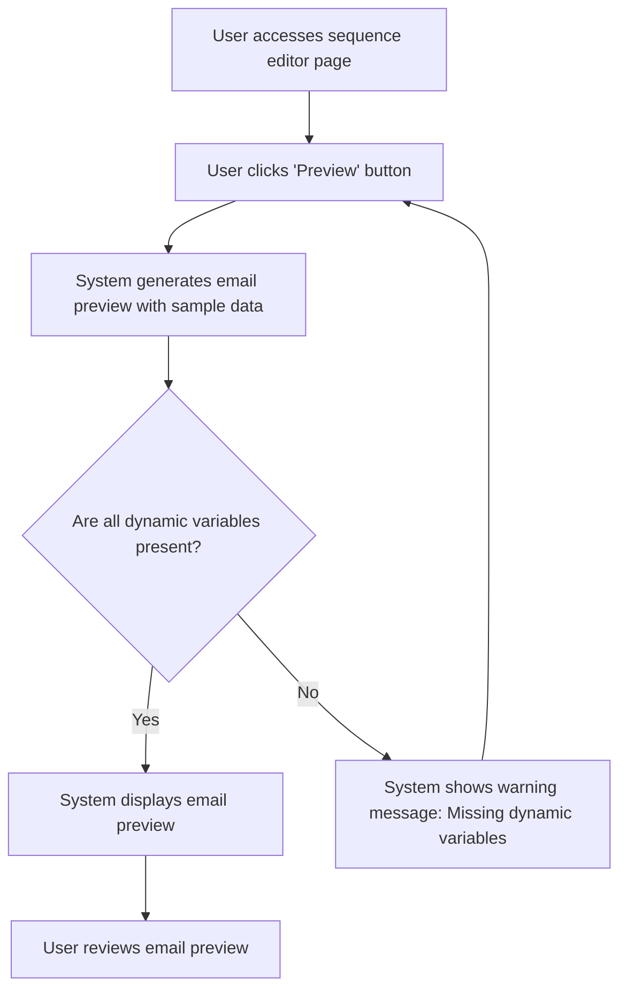

# Design: Preview Emails

## Technical Approach
The preview emails feature will allow users to preview emails before sending them. The system will generate a preview of the email with dynamic variables replaced by sample data from the first unpaid invoice in the database. The frontend will use Alpine.js for reactivity and state management, while the backend will handle data retrieval and preview generation via Flask.

## Architecture Decisions

### Decision: Use Alpine.js for Frontend Reactivity
- **Description**: Alpine.js will manage the state and reactivity of the email preview process.
- **Rationale**: Alpine.js is lightweight and integrates seamlessly with HTML, making it ideal for this use case.
- **Impact**: Simplifies frontend logic and improves user experience.

### Decision: Use Flask for Backend Processing
- **Description**: Flask will handle the email preview generation and data retrieval operations.
- **Rationale**: Flask is lightweight and well-suited for handling HTTP requests and integrating with Parse.
- **Impact**: Ensures robust backend processing and easy integration with the database.

### Decision: Use Sample Data for Preview
- **Description**: The system will use sample data from the first unpaid invoice in the database to replace dynamic variables in the email preview.
- **Rationale**: Sample data provides a realistic preview of the email content.
- **Impact**: Improves user experience by providing a clear preview of the email.

### Decision: Validate Dynamic Variables
- **Description**: The system will validate that all dynamic variables are present before generating the preview.
- **Rationale**: Validation ensures that the preview is accurate and complete.
- **Impact**: Improves data quality and reduces preview errors.

## Data Flow


## Data Mapping

### Parse Class: `Impayes`
- **Fields**:
  - `numero_facture`: String (invoice number).
  - `date`: Date (invoice date).
  - `montant`: Number (invoice amount).
  - `details_contact`: String (contact details).

### Parse Class: `Sequences`
- **Fields**:
  - `nom`: String (sequence name).
  - `description`: String (sequence description).
  - `templates`: Array (list of email templates in the sequence).

### Alpine.js Store: `emailPreview`
- **Fields**:
  - `sequenceId`: String (ID of the sequence being previewed).
  - `emailTemplate`: String (email template content).
  - `sampleData`: Object (sample data for dynamic variables).
  - `previewContent`: String (generated preview content).
  - `errorMessage`: String (error message to display).
  - `warningMessage`: String (warning message to display).

### Data Flow
1. **Input Data**:
   - The user selects a sequence and clicks the preview button.
   - The system retrieves the email template from the `Sequences` class.

2. **Sample Data Retrieval**:
   - The system retrieves sample data from the first unpaid invoice in the `Impayes` class.

3. **Preview Generation**:
   - The system replaces dynamic variables in the email template with sample data.
   - The system generates the preview content.

4. **Validation**:
   - The system validates that all dynamic variables are present in the template.
   - If any variables are missing, the system displays a warning message.

5. **Preview Display**:
   - The system displays the generated preview content to the user.

## Screen ASCII

### Screen 1: Sequence Editor
```
┌───────────────────────────────────────────────────────────────────────────────┐
│                                                                           │
│                                                                               │
│  Edit Sequence                                                                │
│  Edit email templates and configure delays                                   │
│                                                                               │
│  ┌─────────────────────────────────────────────────────────────────────────┐  │
│  │  Canvas: Drag-and-drop area for email templates and filter nodes        │  │
│  └─────────────────────────────────────────────────────────────────────────┘  │
│                                                                               │
│  Sidebar: List of available email templates and filter nodes                 │
│                                                                               │
│  [Preview]  [Save Changes]  [Cancel]                                          │
│                                                                               │
│                                                                           │
└───────────────────────────────────────────────────────────────────────────────┘
```

### Screen 2: Email Preview
```
┌───────────────────────────────────────────────────────────────────────────────┐
│                                                                           │
│                                                                               │
│  Email Preview                                                               │
│  Preview of the email with sample data                                       │
│                                                                               │
│  Subject: Invoice Reminder                                                   │
│  From: no-reply@example.com                                                  │
│                                                                               │
│  Dear [[client_name]],                                                        │
│                                                                               │
│  This is a reminder for your invoice [[invoice_number]].                    │
│                                                                               │
│  Best regards,                                                               │
│  The Example Team                                                            │
│                                                                               │
│  [Back to Editor]                                                            │
│                                                                               │
│                                                                           │
└───────────────────────────────────────────────────────────────────────────────┘
```

### Screen 3: Missing Variables Warning
```
┌───────────────────────────────────────────────────────────────────────────────┐
│                                                                           │
│                                                                               │
│  Warning                                                                      │
│  Missing dynamic variables                                                   │
│                                                                               │
│  ⚠️                                                                           │
│                                                                               │
│  The following dynamic variables are missing:                                │
│  - Variable 1                                                                 │
│  - Variable 2                                                                 │
│  - Variable 3                                                                 │
│                                                                               │
│  [Add Variables]  [Cancel]                                                   │
│                                                                               │
│                                                                           │
└───────────────────────────────────────────────────────────────────────────────┘
```

## Components and Layouts

### Components/Partials Usage

#### Sequence Editor Component
- **File**: `/templates/partials/sequence_editor_component.html`
- **Role**: Handles the editing of a sequence, including previewing emails.
- **Dependencies**:
  - `emailPreview` store for managing state.
  - `axiosParse` for API calls to Parse.

#### Email Preview Component
- **File**: `/templates/partials/email_preview_component.html`
- **Role**: Displays the preview of the email with sample data.
- **Dependencies**:
  - `emailPreview` store for managing state.

#### Missing Variables Warning Component
- **File**: `/templates/partials/missing_variables_warning_component.html`
- **Role**: Displays a warning message if dynamic variables are missing.
- **Dependencies**:
  - `emailPreview` store for managing state.

### Layouts

#### Base Layout
- **File**: `/templates/layouts/base_layout.html`
- **Role**: Provides the basic structure for all pages, including the header, footer, and main content area.

#### Dashboard Layout
- **File**: `/templates/layouts/dashboard_layout.html`
- **Role**: Provides the structure for dashboard pages, including the header, sidebar, and main content area.
- **Components Used**:
  - `sidebarComponent`

## Data Parse Changes

### Class: `Impayes`
- **Changes**: No changes required.

### Class: `Sequences`
- **Changes**: No changes required.

## File Changes

### New Files
- `/templates/partials/sequence_editor_component.html`: Component for editing sequences.
- `/templates/partials/email_preview_component.html`: Component for displaying email previews.
- `/templates/partials/missing_variables_warning_component.html`: Component for displaying missing variables warnings.
- `/static/js/stores/emailPreviewStore.js`: Alpine.js store for managing email preview state.

### Modified Files
- `/templates/layouts/base_layout.html`: Include the sequence editor component.
- `/templates/layouts/dashboard_layout.html`: Include the email preview component.

## Verification
Ensure the output file is created in the correct folder with the specified structure.