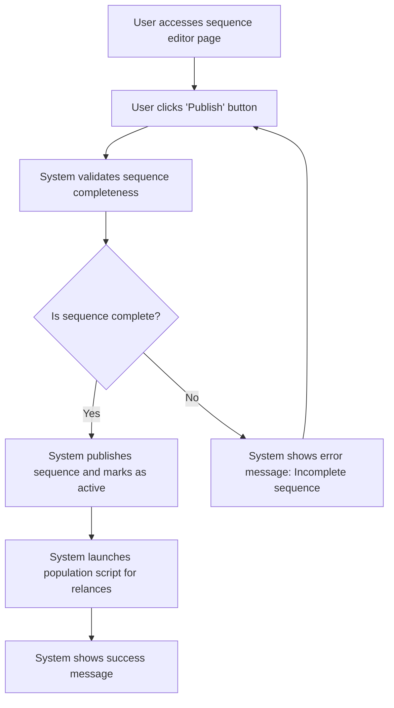

# US005 - Publier une Séquence

## Description
En tant qu'utilisateur, je veux publier une séquence pour la rendre active.

## Préconditions
- L'utilisateur est connecté.
- Une séquence d'emails existe et n'est pas encore publiée.

## Scénario Principal
1. L'utilisateur accède à la page editor de la sequence.
3. L'utilisateur clique sur le bouton "Publier".
4. Le système valide que la séquence est complète et prête à être publiée.
5. Le système publie la séquence et la marque comme active.
6. Le système lance un script de peuplement des relances pour cette requête.
7. Le système affiche un message de succès.

## Scénario Alternatif
- **Séquence Incomplète** : Si la séquence est incomplète (manque de templates ou de délais), le système affiche un message d'erreur et demande à l'utilisateur de la compléter.

## Postconditions
- La séquence est publiée et active.
- L'utilisateur ne peut plus modifier directement la séquence.

## Notes
- Une séquence publiée ne peut pas être modifiée directement.
- Pour modifier une séquence publiée, l'utilisateur doit créer un duplicata.

## User Flow Diagram


## Wireframes

### Écran Éditeur de Séquence
```markdown
Screen: Éditeur de Séquence

Layout:
- Header (fixed, 60px)

  - Navigation (right, 3 items: Accueil, Séquences, Paramètres)
- Main Content (centered, max-width: 1200px)
  - Title: "Modifier la Séquence" (H1, center-aligned)
  - Subtitle: "Modifier les templates d'emails et configurer les délais" (H2, center-aligned),
  - Sequence Builder (full-width)
    - Canvas: Zone de glisser-déposer pour les templates d'emails et les nœuds filtres
    - Sidebar: Liste des templates d'emails et des nœuds filtres disponibles
  - Action Buttons (below builder)
    - Button: "Publier" (primary, 160px × 48px)
    - Button: "Sauvegarder les Changements" (primary, 160px × 48px)
    - Button: "Annuler" (secondary, 160px × 48px)
- Footer (fixed, 40px)
  - 
```

### Écran Confirmation de Publication
```markdown
Screen: Confirmation de Publication

Layout:
- Header (fixed, 60px)

  - Navigation (right, 3 items: Accueil, Séquences, Paramètres)
- Main Content (centered, max-width: 1200px)
  - Title: "Publier la Séquence" (H1, center-aligned)
  - Subtitle: "Êtes-vous sûr de vouloir publier cette séquence ?" (H2, center-aligned)
  - Message: "La publication de cette séquence la rendra active et vous ne pourrez plus la modifier directement." (center-aligned)
  - Action Buttons (below message)
    - Button: "Confirmer" (primary, 160px × 48px)
    - Button: "Annuler" (secondary, 160px × 48px)
- Footer (fixed, 40px)
  - 
```

### Écran Message de Succès
```markdown
Screen: Message de Succès

Layout:
- Header (fixed, 60px)

  - Navigation (right, 3 items: Accueil, Séquences, Paramètres)
- Main Content (centered, max-width: 1200px)
  - Title: "Séquence Publiée" (H1, center-aligned)
  - Subtitle: "Votre séquence d'emails a été publiée avec succès" (H2, center-aligned)
  - Success Icon (center, 64px × 64px)
  - Message: "La séquence 'Nom de la Séquence' est maintenant active." (center-aligned)
  - Action Buttons (below message)
    - Button: "Voir les Séquences" (primary, 160px × 48px)
    - Button: "Créer un Duplicata" (secondary, 160px × 48px)
- Footer (fixed, 40px)
  - 
```

### Écran Message d'Erreur
```markdown
Screen: Message d'Erreur

Layout:
- Header (fixed, 60px)

  - Navigation (right, 3 items: Accueil, Séquences, Paramètres)
- Main Content (centered, max-width: 1200px)
  - Title: "Erreur" (H1, center-aligned)
  - Subtitle: "Séquence incomplète" (H2, center-aligned)
  - Error Icon (center, 64px × 64px)
  - Message: "Veuillez compléter la séquence en ajoutant des templates d'emails et en configurant les délais." (center-aligned)
  - Action Buttons (below message)
    - Button: "Compléter la Séquence" (primary, 160px × 48px)
    - Button: "Annuler" (secondary, 160px × 48px)
- Footer (fixed, 40px)
  - 
```
