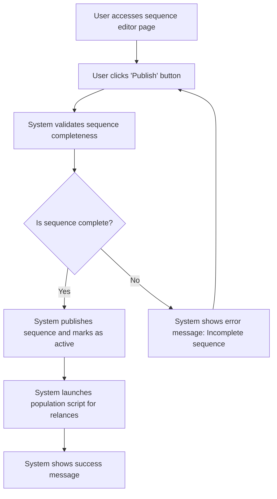

# Design: Publish Sequence

## Technical Approach
The publish sequence feature will allow users to publish an email sequence, making it active and ready for use. The system will validate that the sequence is complete, publish it, and launch a population script for relances. The frontend will use Alpine.js for reactivity and state management, while the backend will handle data storage and script execution via Flask.

## Architecture Decisions

### Decision: Use Alpine.js for Frontend Reactivity
- **Description**: Alpine.js will manage the state and reactivity of the sequence publishing process.
- **Rationale**: Alpine.js is lightweight and integrates seamlessly with HTML, making it ideal for this use case.
- **Impact**: Simplifies frontend logic and improves user experience.

### Decision: Use Flask for Backend Processing
- **Description**: Flask will handle the sequence publishing and script execution operations.
- **Rationale**: Flask is lightweight and well-suited for handling HTTP requests and integrating with Parse.
- **Impact**: Ensures robust backend processing and easy integration with the database.

### Decision: Validate Sequence Completeness
- **Description**: The system will validate that the sequence is complete before publishing.
- **Rationale**: Validation ensures that only complete sequences are published.
- **Impact**: Improves data quality and reduces publishing errors.

### Decision: Launch Population Script
- **Description**: The system will launch a population script for relances when a sequence is published.
- **Rationale**: The population script ensures that the sequence is ready for use.
- **Impact**: Ensures that the sequence is fully functional upon publication.

## Data Flow


## Data Mapping

### Parse Class: `Sequences`
- **Fields**:
  - `nom`: String (sequence name).
  - `description`: String (sequence description).
  - `statut`: String (sequence status: draft or published).
  - `templates`: Array (list of email templates in the sequence).
  - `delais`: Array (list of delays for each email in the sequence).

### Alpine.js Store: `sequencePublishing`
- **Fields**:
  - `sequenceId`: String (ID of the sequence being published).
  - `sequenceName`: String (name of the sequence).
  - `sequenceDescription`: String (description of the sequence).
  - `isComplete`: Boolean (indicates if the sequence is complete).
  - `errorMessage`: String (error message to display).
  - `successMessage`: String (success message to display).

### Data Flow
1. **Input Data**:
   - The user selects a sequence and clicks the publish button.
   - The system retrieves the sequence details from the `Sequences` class.

2. **Validation**:
   - The system validates that the sequence is complete (includes templates and delays).
   - If the sequence is incomplete, the system displays an error message.

3. **Publishing**:
   - The system publishes the sequence and marks it as active in the `Sequences` class.

4. **Script Execution**:
   - The system launches a population script for relances to prepare the sequence for use.

5. **Success Handling**:
   - If the sequence is published successfully, the system displays a success message.

## Screen ASCII

### Screen 1: Sequence Editor
```
┌───────────────────────────────────────────────────────────────────────────────┐
│                                                                           │
│                                                                               │
│  Edit Sequence                                                                │
│  Edit email templates and configure delays                                   │
│                                                                               │
│  ┌─────────────────────────────────────────────────────────────────────────┐  │
│  │  Canvas: Drag-and-drop area for email templates and filter nodes        │  │
│  └─────────────────────────────────────────────────────────────────────────┘  │
│                                                                               │
│  Sidebar: List of available email templates and filter nodes                 │
│                                                                               │
│  [Publish]  [Save Changes]  [Cancel]                                          │
│                                                                               │
│                                                                           │
└───────────────────────────────────────────────────────────────────────────────┘
```

### Screen 2: Publish Confirmation
```
┌───────────────────────────────────────────────────────────────────────────────┐
│                                                                           │
│                                                                               │
│  Publish Sequence                                                            │
│  Are you sure you want to publish this sequence?                             │
│                                                                               │
│  Publishing this sequence will make it active and you will not be able to   │
│  edit it directly.                                                           │
│                                                                               │
│  [Confirm]  [Cancel]                                                          │
│                                                                               │
│                                                                           │
└───────────────────────────────────────────────────────────────────────────────┘
```

### Screen 3: Success Message
```
┌───────────────────────────────────────────────────────────────────────────────┐
│                                                                           │
│                                                                               │
│  Sequence Published                                                          │
│  Your email sequence has been published successfully                         │
│                                                                               │
│  ✅                                                                           │
│                                                                               │
│  The sequence 'Sequence Name' is now active.                                 │
│                                                                               │
│  [View Sequences]  [Create Duplicate]                                        │
│                                                                               │
│                                                                           │
└───────────────────────────────────────────────────────────────────────────────┘
```

### Screen 4: Error Message
```
┌───────────────────────────────────────────────────────────────────────────────┐
│                                                                           │
│                                                                               │
│  Error                                                                        │
│  Incomplete Sequence                                                          │
│                                                                               │
│  ❌                                                                           │
│                                                                               │
│  Please complete the sequence by adding email templates and configuring      │
│  delays.                                                                      │
│                                                                               │
│  [Complete Sequence]  [Cancel]                                                │
│                                                                               │
│                                                                           │
└───────────────────────────────────────────────────────────────────────────────┘
```

## Components and Layouts

### Components/Partials Usage

#### Sequence Editor Component
- **File**: `/templates/partials/sequence_editor_component.html`
- **Role**: Handles the editing of a sequence, including publishing.
- **Dependencies**:
  - `sequencePublishing` store for managing state.
  - `axiosParse` for API calls to Parse.

#### Publish Confirmation Component
- **File**: `/templates/partials/publish_confirmation_component.html`
- **Role**: Displays a confirmation message before publishing a sequence.
- **Dependencies**:
  - `sequencePublishing` store for managing state.

#### Success Message Component
- **File**: `/templates/partials/success_message_component.html`
- **Role**: Displays a success message after a sequence is published.
- **Dependencies**:
  - `sequencePublishing` store for managing state.

#### Error Message Component
- **File**: `/templates/partials/error_message_component.html`
- **Role**: Displays error messages during the sequence publishing process.
- **Dependencies**:
  - `sequencePublishing` store for managing state.

### Layouts

#### Base Layout
- **File**: `/templates/layouts/base_layout.html`
- **Role**: Provides the basic structure for all pages, including the header, footer, and main content area.

#### Dashboard Layout
- **File**: `/templates/layouts/dashboard_layout.html`
- **Role**: Provides the structure for dashboard pages, including the header, sidebar, and main content area.
- **Components Used**:
  - `sidebarComponent`

## Data Parse Changes

### Class: `Sequences`
- **Changes**: No changes required.

## File Changes

### New Files
- `/templates/partials/sequence_editor_component.html`: Component for editing sequences.
- `/templates/partials/publish_confirmation_component.html`: Component for displaying publish confirmation messages.
- `/templates/partials/success_message_component.html`: Component for displaying success messages.
- `/templates/partials/error_message_component.html`: Component for displaying error messages.
- `/static/js/stores/sequencePublishingStore.js`: Alpine.js store for managing sequence publishing state.

### Modified Files
- `/templates/layouts/base_layout.html`: Include the sequence editor component.
- `/templates/layouts/dashboard_layout.html`: Include the publish confirmation component.

## Verification
Ensure the output file is created in the correct folder with the specified structure.