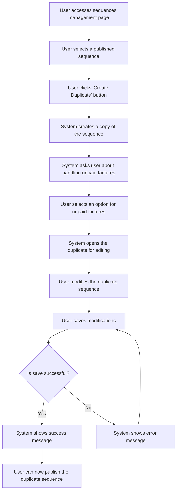

# US006 - Créer un Duplicata d'une Séquence

## Description
En tant qu'utilisateur, je veux créer un duplicata d'une séquence publiée pour la modifier.

## Préconditions
- L'utilisateur est connecté.
- Une séquence d'emails est publiée et active.

## Scénario Principal
1. L'utilisateur accède à la page de gestion des séquences.
2. L'utilisateur sélectionne une séquence publiée.
3. L'utilisateur clique sur le bouton 'Créer un duplicata'.
4. Le système crée une copie de la séquence avec un nouveau nom (par exemple, 'Copie de [Nom de la séquence]').
5. Le système demande à l'utilisateur ce qu'il veut faire des impayés dans l'actuelle séquence :
   - Les garder dans cette séquence.
   - Les déplacer ici et désactiver l'ancienne séquence.
   - Laisser l'autre séquence mais ne plus prendre de nouveaux impayés.
6. Le système ouvre la copie pour modification dans la page editor de la séquence.
7. L'utilisateur modifie la séquence selon ses besoins.
8. L'utilisateur enregistre les modifications.
9. Le système affiche un message de succès.

## Scénario Alternatif
- **Échec de Création** : Si le système ne peut pas créer le duplicata, il affiche un message d'erreur et demande à l'utilisateur de réessayer.

## Postconditions
- Un duplicata de la séquence est créé et enregistré dans la base de données.
- L'utilisateur peut modifier le duplicata.

## Notes
- Le duplicata doit être marqué comme non publié.
- Les modifications doivent être validées avant d'être enregistrées.

## User Flow Diagram


## Wireframes

### Écran Gestion des Séquences

```
┌───────────────────────────────────────────────────────────────────────────────┐
│                                                                           │
│                                                                               │
│  Séquences d'Emails                                                          │
│  Gérer vos séquences d'emails                                                │
│                                                                               │
│  ┌─────────────────────────────────────────────────────────────────────────┐  │
│  │  Nom  │  Description  │  Statut  │  Actions                              │  │
│  ├─────────────────────────────────────────────────────────────────────────┤  │
│  │  Séquence 1  │  Description 1  │  Publiée  │  [Créer un Duplicata]      │  │
│  │  Séquence 2  │  Description 2  │  Brouillon  │  [Créer un Duplicata]      │  │
│  └─────────────────────────────────────────────────────────────────────────┘  │
│                                                                               │
│  [Précédent]  1  2  3  [Suivant]                                              │
│                                                                               │
│                                                                           │
└───────────────────────────────────────────────────────────────────────────────┘
```

### Écran Gestion des Factures Impayées

```
┌───────────────────────────────────────────────────────────────────────────────┐
│                                                                           │
│                                                                               │
│  Gérer les Factures Impayées                                                │
│  Que souhaitez-vous faire des factures impayées dans la séquence actuelle ? │
│                                                                               │
│  ( ) Les garder dans la séquence actuelle                                   │
│  ( ) Les déplacer vers la nouvelle séquence et désactiver l'ancienne       │
│  ( ) Laisser la séquence actuelle mais ne plus prendre de nouvelles factures│
│                                                                               │
│  [Continuer]  [Annuler]                                                      │
│                                                                               │
│                                                                           │
└───────────────────────────────────────────────────────────────────────────────┘
```

### Écran Éditeur de Séquence Dupliquée

```
┌───────────────────────────────────────────────────────────────────────────────┐
│                                                                           │
│                                                                               │
│  Modifier la Séquence Dupliquée                                              │
│  Modifier la séquence dupliquée                                              │
│                                                                               │
│  ┌─────────────────────────────────────────────────────────────────────────┐  │
│  │  Canvas: Zone de glisser-déposer pour les templates d'emails et les nœuds │  │
│  │  filtres                                                                  │  │
│  └─────────────────────────────────────────────────────────────────────────┘  │
│                                                                               │
│  Barre latérale: Liste des templates d'emails et des nœuds filtres disponibles│
│                                                                               │
│  [Sauvegarder les Changements]  [Annuler]                                     │
│                                                                               │
│                                                                           │
└───────────────────────────────────────────────────────────────────────────────┘
```

### Écran Message de Succès

```
┌───────────────────────────────────────────────────────────────────────────────┐
│                                                                           │
│                                                                               │
│  Duplicata Créé                                                              │
│  Votre séquence dupliquée a été créée avec succès                           │
│                                                                               │
│  ✅                                                                           │
│                                                                               │
│  La séquence dupliquée 'Copie de Nom de la Séquence' a été créée.           │
│                                                                               │
│  [Modifier le Duplicata]  [Voir les Séquences]                               │
│                                                                               │
│                                                                           │
└───────────────────────────────────────────────────────────────────────────────┘
```

### Écran Message d'Erreur

```
┌───────────────────────────────────────────────────────────────────────────────┐
│                                                                           │
│                                                                               │
│  Erreur                                                                      │
│  Une erreur est survenue lors de la création du duplicata                   │
│                                                                               │
│  ❌                                                                           │
│                                                                               │
│  Veuillez réessayer.                                                         │
│                                                                               │
│  [Réessayer]  [Annuler]                                                       │
│                                                                               │
│                                                                           │
└───────────────────────────────────────────────────────────────────────────────┘
```

## Accessibilité

### Général
- Tous les éléments interactifs doivent être accessibles via le clavier.
- Assurer un contraste de couleur suffisant (WCAG 2.1 AA minimum).
- Fournir un texte alternatif pour toutes les images et icônes.
- Utiliser des labels ARIA lorsque nécessaire.

### Écran Gestion des Séquences
- Bouton Créer un Duplicata : Utiliser `aria-label='Créer un duplicata de la séquence'`.
- Tableau des Séquences : Utiliser `aria-label='Tableau des séquences d'emails'`.
- Bouton Précédent : Utiliser `aria-label='Aller à la page précédente'`.
- Bouton Suivant : Utiliser `aria-label='Aller à la page suivante'`.

### Écran Gestion des Factures Impayées
- Boutons Radio : Utiliser `aria-label='Option pour gérer les factures impayées'`.
- Bouton Continuer : Utiliser `aria-label='Continuer pour modifier la séquence dupliquée'`.
- Bouton Annuler : Utiliser `aria-label='Annuler et retourner à la gestion des séquences'`.

### Écran Éditeur de Séquence Dupliquée
- Canvas : Utiliser `aria-label='Zone de glisser-déposer pour le constructeur de séquence'`.
- Barre latérale : Utiliser `aria-label='Barre latérale avec les templates d'emails et les nœuds filtres disponibles'`.
- Bouton Sauvegarder les Changements : Utiliser `aria-label='Sauvegarder les changements de la séquence dupliquée'`.
- Bouton Annuler : Utiliser `aria-label='Annuler et retourner à la gestion des séquences'`.

### Écran Message de Succès
- Icône de Succès : Utiliser `aria-label='Icône de succès'`.
- Bouton Modifier le Duplicata : Utiliser `aria-label='Modifier la séquence dupliquée'`.
- Bouton Voir les Séquences : Utiliser `aria-label='Voir toutes les séquences d'emails'`.

### Écran Message d'Erreur
- Icône d'Erreur : Utiliser `aria-label='Icône d'erreur'`.
- Bouton Réessayer : Utiliser `aria-label='Réessayer de créer le duplicata'`.
- Bouton Annuler : Utiliser `aria-label='Annuler et retourner à la gestion des séquences'`.

## Styles

### Boutons
- Bouton Principal : Couleur de fond `#007BFF`, couleur de texte `#FFFFFF`, rayon de bordure `4px`.
- Bouton Secondaire : Couleur de fond `#6C757D`, couleur de texte `#FFFFFF`, rayon de bordure `4px`.
- Cible tactile minimale : `44px × 44px`.

### Boutons Radio
- Bordure : `1px solid #CED4DA`.
- Rayon de bordure : `50%`.
- Couleur de fond (sélectionné) : `#007BFF`.

### Icônes
- Icône de Succès : Cochet, couleur `#28A745`.
- Icône d'Erreur : Point d'exclamation, couleur `#DC3545`.

## Fonctionnalités

### Gestion des Séquences
- L'utilisateur peut voir une liste des séquences existantes.
- L'utilisateur peut créer un duplicata d'une séquence publiée.

### Gestion des Factures Impayées
- L'utilisateur peut choisir comment gérer les factures impayées dans la séquence actuelle.
- L'utilisateur peut continuer à modifier le duplicata ou annuler.

### Éditeur de Séquence Dupliquée
- L'utilisateur peut modifier la séquence dupliquée.
- L'utilisateur peut sauvegarder les changements ou annuler.

### Gestion des Erreurs
- Le système fournit des messages d'erreur clairs pour les échecs de création.
- L'utilisateur peut réessayer ou annuler le processus.

## Responsive Design

### Mobile (320-767px)
- Tableau des séquences : Défilable horizontalement.
- Options des factures impayées : Pleine largeur, empilées verticalement.
- Éditeur de séquence : Canvas pleine largeur, barre latérale repliée.
- Boutons : Pleine largeur, empilés verticalement.

### Tablette (768-1023px)
- Tableau des séquences : Défilable horizontalement si nécessaire.
- Options des factures impayées : Largeur `500px`, empilées verticalement.
- Éditeur de séquence : Canvas largeur `600px`, barre latérale largeur `240px`.
- Boutons : Côté à côté si l'espace le permet.

### Desktop (1024px+)
- Tableau des séquences : Pleine largeur, pas de défilement horizontal.
- Options des factures impayées : Largeur `600px`, empilées verticalement.
- Éditeur de séquence : Canvas largeur `800px`, barre latérale largeur `240px`.
- Boutons : Côté à côté.

## Tokens de Design

### Couleurs
- Couleur Principale : `#007BFF`
- Couleur Secondaire : `#6C757D`
- Couleur de Succès : `#28A745`
- Couleur d'Erreur : `#DC3545`
- Couleur d'Avertissement : `#FFC107`
- Couleurs Neutres : `#FFFFFF`, `#F8F9FA`, `#E9ECEF`, `#6C757D`, `#343A40`

### Typographie
- Famille de Police : `system-ui, -apple-system, BlinkMacSystemFont, 'Segoe UI', Roboto, 'Helvetica Neue', Arial, sans-serif`
- H1 : `2.5rem`, `700`, `1.2`
- H2 : `2rem`, `600`, `1.3`
- H3 : `1.75rem`, `600`, `1.4`
- Corps : `1rem`, `400`, `1.5`
- Petit : `0.875rem`, `400`, `1.6`

### Espacement
- Unité de Base : `8px`
- Échelle d'Espacement : `4px`, `8px`, `16px`, `24px`, `32px`, `48px`, `64px`

### Accessibilité
- Assurer que tous les éléments interactifs sont navigables via le clavier.
- Utiliser du HTML sémantique lorsque possible.
- Fournir des alternatives textuelles pour le contenu non textuel.
- Assurer un contraste de couleur suffisant pour la lisibilité.