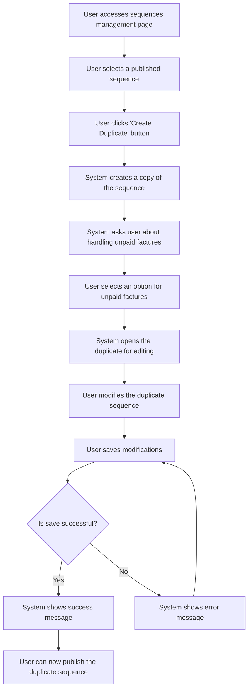

# Design: Duplicate Sequence

## Technical Approach
The duplicate sequence feature will allow users to create a duplicate of a published sequence for modification. The system will create a copy of the sequence, prompt the user to choose how to handle unpaid invoices in the original sequence, and open the duplicate for editing. The frontend will use Alpine.js for reactivity and state management, while the backend will handle data storage via Flask.

## Architecture Decisions

### Decision: Use Alpine.js for Frontend Reactivity
- **Description**: Alpine.js will manage the state and reactivity of the sequence duplication process.
- **Rationale**: Alpine.js is lightweight and integrates seamlessly with HTML, making it ideal for this use case.
- **Impact**: Simplifies frontend logic and improves user experience.

### Decision: Use Flask for Backend Processing
- **Description**: Flask will handle the sequence duplication and data storage operations.
- **Rationale**: Flask is lightweight and well-suited for handling HTTP requests and integrating with Parse.
- **Impact**: Ensures robust backend processing and easy integration with the database.

### Decision: Create Duplicate with New Name
- **Description**: The system will create a duplicate of the sequence with a new name (e.g., 'Copy of [Sequence Name]').
- **Rationale**: A new name ensures that the duplicate is easily identifiable.
- **Impact**: Improves user experience by providing clear naming conventions.

### Decision: Prompt for Unpaid Invoice Handling
- **Description**: The system will prompt the user to choose how to handle unpaid invoices in the original sequence.
- **Rationale**: This ensures that the user has control over the handling of unpaid invoices.
- **Impact**: Improves user experience by providing flexibility in managing unpaid invoices.

### Decision: Mark Duplicate as Unpublished
- **Description**: The duplicate sequence will be marked as unpublished.
- **Rationale**: This allows the user to modify the duplicate before publishing.
- **Impact**: Ensures that the duplicate is not active until the user is ready.

## Data Flow


## Data Mapping

### Parse Class: `Sequences`
- **Fields**:
  - `nom`: String (sequence name).
  - `description`: String (sequence description).
  - `statut`: String (sequence status: draft or published).
  - `templates`: Array (list of email templates in the sequence).
  - `delais`: Array (list of delays for each email in the sequence).

### Alpine.js Store: `sequenceDuplication`
- **Fields**:
  - `sequenceId`: String (ID of the sequence being duplicated).
  - `sequenceName`: String (name of the sequence).
  - `sequenceDescription`: String (description of the sequence).
  - `duplicateName`: String (name of the duplicate sequence).
  - `unpaidInvoiceOption`: String (option selected for handling unpaid invoices).
  - `errorMessage`: String (error message to display).
  - `successMessage`: String (success message to display).

### Data Flow
1. **Input Data**:
   - The user selects a published sequence and clicks the create duplicate button.
   - The system retrieves the sequence details from the `Sequences` class.

2. **Duplicate Creation**:
   - The system creates a duplicate of the sequence with a new name (e.g., 'Copy of [Sequence Name]').
   - The duplicate is marked as unpublished.

3. **Unpaid Invoice Handling**:
   - The system prompts the user to choose how to handle unpaid invoices in the original sequence:
     - Keep them in the current sequence.
     - Move them to the new sequence and deactivate the old sequence.
     - Leave the current sequence but stop taking new unpaid invoices.

4. **Editing**:
   - The system opens the duplicate sequence for editing.
   - The user modifies the duplicate sequence as needed.

5. **Saving**:
   - The user saves the modifications to the duplicate sequence.
   - The system saves the changes to the `Sequences` class in Parse.

6. **Success Handling**:
   - If the duplicate is saved successfully, the system displays a success message.

7. **Error Handling**:
   - If the duplicate cannot be saved, the system displays an error message and prompts the user to retry.

## Screen ASCII

### Screen 1: Sequences Management
```
┌───────────────────────────────────────────────────────────────────────────────┐
│                                                                           │
│                                                                               │
│  Email Sequences                                                             │
│  Manage your email sequences                                                │
│                                                                               │
│  ┌─────────────────────────────────────────────────────────────────────────┐  │
│  │  Name  │  Description  │  Status  │  Actions                              │  │
│  ├─────────────────────────────────────────────────────────────────────────┤  │
│  │  Sequence 1  │  Description 1  │  Published  │  [Create Duplicate]      │  │
│  │  Sequence 2  │  Description 2  │  Draft  │  [Create Duplicate]      │  │
│  └─────────────────────────────────────────────────────────────────────────┘  │
│                                                                               │
│  [Previous]  1  2  3  [Next]                                                  │
│                                                                               │
│                                                                           │
└───────────────────────────────────────────────────────────────────────────────┘
```

### Screen 2: Unpaid Invoices Management
```
┌───────────────────────────────────────────────────────────────────────────────┐
│                                                                           │
│                                                                               │
│  Manage Unpaid Invoices                                                     │
│  What would you like to do with the unpaid invoices in the current sequence? │
│                                                                               │
│  ( ) Keep them in the current sequence                                     │
│  ( ) Move them to the new sequence and deactivate the old one              │
│  ( ) Leave the current sequence but stop taking new unpaid invoices        │
│                                                                               │
│  [Continue]  [Cancel]                                                        │
│                                                                               │
│                                                                           │
└───────────────────────────────────────────────────────────────────────────────┘
```

### Screen 3: Duplicate Sequence Editor
```
┌───────────────────────────────────────────────────────────────────────────────┐
│                                                                           │
│                                                                               │
│  Edit Duplicate Sequence                                                     │
│  Edit the duplicated sequence                                                 │
│                                                                               │
│  ┌─────────────────────────────────────────────────────────────────────────┐  │
│  │  Canvas: Drag-and-drop area for email templates and filter nodes        │  │
│  └─────────────────────────────────────────────────────────────────────────┘  │
│                                                                               │
│  Sidebar: List of available email templates and filter nodes                 │
│                                                                               │
│  [Save Changes]  [Cancel]                                                     │
│                                                                               │
│                                                                           │
└───────────────────────────────────────────────────────────────────────────────┘
```

### Screen 4: Success Message
```
┌───────────────────────────────────────────────────────────────────────────────┐
│                                                                           │
│                                                                               │
│  Duplicate Created                                                           │
│  Your duplicated sequence has been created successfully                      │
│                                                                               │
│  ✅                                                                           │
│                                                                               │
│  The duplicated sequence 'Copy of Sequence Name' has been created.           │
│                                                                               │
│  [Edit Duplicate]  [View Sequences]                                           │
│                                                                               │
│                                                                           │
└───────────────────────────────────────────────────────────────────────────────┘
```

### Screen 5: Error Message
```
┌───────────────────────────────────────────────────────────────────────────────┐
│                                                                           │
│                                                                               │
│  Error                                                                        │
│  An error occurred while creating the duplicate                               │
│                                                                               │
│  ❌                                                                           │
│                                                                               │
│  Please try again.                                                            │
│                                                                               │
│  [Retry]  [Cancel]                                                            │
│                                                                               │
│                                                                           │
└───────────────────────────────────────────────────────────────────────────────┘
```

## Components and Layouts

### Components/Partials Usage

#### Sequences Management Component
- **File**: `/templates/partials/sequences_management_component.html`
- **Role**: Displays the list of sequences and provides options to create duplicates.
- **Dependencies**:
  - `sequenceDuplication` store for managing state.
  - `axiosParse` for API calls to Parse.

#### Unpaid Invoices Management Component
- **File**: `/templates/partials/unpaid_invoices_management_component.html`
- **Role**: Prompts the user to choose how to handle unpaid invoices in the original sequence.
- **Dependencies**:
  - `sequenceDuplication` store for managing state.

#### Duplicate Sequence Editor Component
- **File**: `/templates/partials/duplicate_sequence_editor_component.html`
- **Role**: Handles the editing of the duplicated sequence.
- **Dependencies**:
  - `sequenceDuplication` store for managing state.
  - `AlpineFlow` for drag-and-drop functionality.

#### Success Message Component
- **File**: `/templates/partials/success_message_component.html`
- **Role**: Displays a success message after a duplicate is created.
- **Dependencies**:
  - `sequenceDuplication` store for managing state.

#### Error Message Component
- **File**: `/templates/partials/error_message_component.html`
- **Role**: Displays error messages during the duplicate creation process.
- **Dependencies**:
  - `sequenceDuplication` store for managing state.

### Layouts

#### Base Layout
- **File**: `/templates/layouts/base_layout.html`
- **Role**: Provides the basic structure for all pages, including the header, footer, and main content area.

#### Dashboard Layout
- **File**: `/templates/layouts/dashboard_layout.html`
- **Role**: Provides the structure for dashboard pages, including the header, sidebar, and main content area.
- **Components Used**:
  - `sidebarComponent`

## Data Parse Changes

### Class: `Sequences`
- **Changes**: No changes required.

## File Changes

### New Files
- `/templates/partials/sequences_management_component.html`: Component for managing sequences.
- `/templates/partials/unpaid_invoices_management_component.html`: Component for managing unpaid invoices.
- `/templates/partials/duplicate_sequence_editor_component.html`: Component for editing duplicated sequences.
- `/templates/partials/success_message_component.html`: Component for displaying success messages.
- `/templates/partials/error_message_component.html`: Component for displaying error messages.
- `/static/js/stores/sequenceDuplicationStore.js`: Alpine.js store for managing sequence duplication state.

### Modified Files
- `/templates/layouts/base_layout.html`: Include the sequences management component.
- `/templates/layouts/dashboard_layout.html`: Include the unpaid invoices management component.

## Verification
Ensure the output file is created in the correct folder with the specified structure.