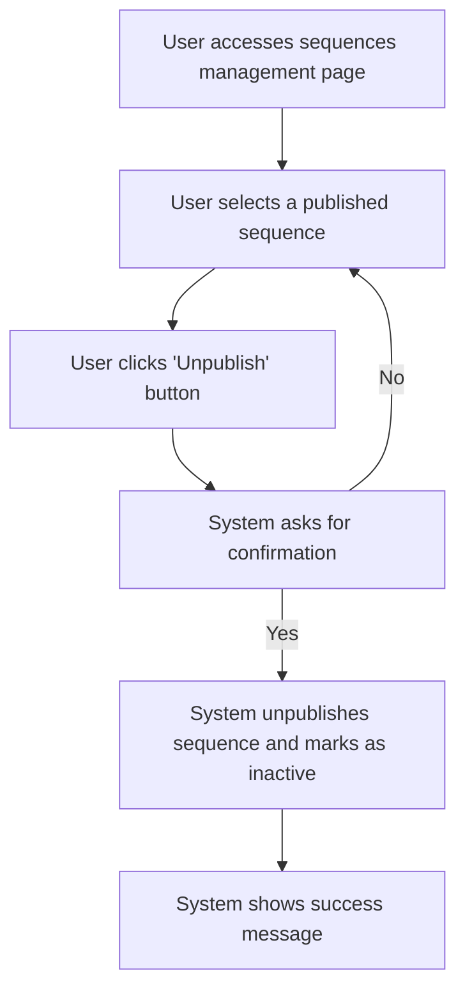

# US007 - Dépublier une Séquence

## Description
En tant qu'utilisateur, je veux dépublier une séquence pour la rendre inactive.

## Préconditions
- L'utilisateur est connecté.
- Une séquence d'emails est publiée et active.

## Scénario Principal
1. L'utilisateur accède à la page de gestion des séquences.
2. L'utilisateur sélectionne une séquence publiée.
3. L'utilisateur clique sur le bouton "Dépublier".
4. Le système demande une confirmation pour dépublier la séquence.
5. L'utilisateur confirme la dépublication.
6. Le système dépublie la séquence et la marque comme inactive.
7. Le système affiche un message de succès.

## Scénario Alternatif
- **Annulation de la Dépublication** : Si l'utilisateur annule la dépublication, le système retourne à la page de gestion des séquences sans apporter de modifications.

## Postconditions
- La séquence est dépubliée et inactive.
- L'utilisateur peut modifier la séquence directement.

## Notes
- Une séquence dépubliée peut être modifiée directement.
- Les relances associées à la séquence doivent être annulées ou réattribuées.
- Toutes les relances en attente de cette séquence seront supprimées lors de la dépublication.

## User Flow Diagram


## Wireframes

### Écran Gestion des Séquences

```
┌───────────────────────────────────────────────────────────────────────────────┐
│                                                                           │
│                                                                               │
│  Séquences d'Emails                                                          │
│  Gérer vos séquences d'emails                                                │
│                                                                               │
│  ┌─────────────────────────────────────────────────────────────────────────┐  │
│  │  Nom  │  Description  │  Statut  │  Actions                              │  │
│  ├─────────────────────────────────────────────────────────────────────────┤  │
│  │  Séquence 1  │  Description 1  │  Publiée  │  [Dépublier]              │  │
│  │  Séquence 2  │  Description 2  │  Brouillon  │  [Dépublier]              │  │
│  └─────────────────────────────────────────────────────────────────────────┘  │
│                                                                               │
│  [Précédent]  1  2  3  [Suivant]                                              │
│                                                                               │
│                                                                           │
└───────────────────────────────────────────────────────────────────────────────┘
```

### Écran Confirmation de Dépublication
```
┌───────────────────────────────────────────────────────────────────────────────┐
│                                                                           │
│                                                                               │
│  Dépublier la Séquence                                                       │
│  Êtes-vous sûr de vouloir dépublier cette séquence ?                        │
│                                                                               │
│  La dépublication de cette séquence la rendra inactive et vous pourrez la    │
│  modifier directement.                                                       │
│                                                                               │
│  [Confirmer]  [Annuler]                                                      │
│                                                                               │
│                                                                           │
└───────────────────────────────────────────────────────────────────────────────┘
```

### Écran Message de Succès

```
┌───────────────────────────────────────────────────────────────────────────────┐
│                                                                           │
│                                                                               │
│  Séquence Dépubliée                                                         │
│  Votre séquence d'emails a été dépubliée avec succès                         │
│                                                                               │
│  ✅                                                                           │
│                                                                               │
│  La séquence 'Nom de la Séquence' est maintenant inactive.                  │
│                                                                               │
│  [Voir les Séquences]  [Modifier la Séquence]                                │
│                                                                               │
│                                                                           │
└───────────────────────────────────────────────────────────────────────────────┘
```

### Écran Message d'Erreur

```
┌───────────────────────────────────────────────────────────────────────────────┐
│                                                                           │
│                                                                               │
│  Erreur                                                                      │
│  Une erreur est survenue lors de la dépublication de la séquence              │
│                                                                               │
│  ❌                                                                           │
│                                                                               │
│  Veuillez réessayer.                                                         │
│                                                                               │
│  [Réessayer]  [Annuler]                                                       │
│                                                                               │
│                                                                           │
└───────────────────────────────────────────────────────────────────────────────┘
```

