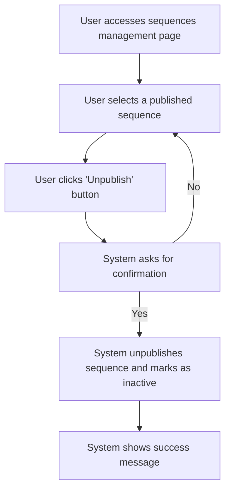

# Design: Unpublish Sequence

## Technical Approach
The unpublish sequence feature will allow users to unpublish an email sequence, making it inactive. The system will prompt the user for confirmation, unpublish the sequence, and display a success message. The frontend will use Alpine.js for reactivity and state management, while the backend will handle data storage via Flask.

## Architecture Decisions

### Decision: Use Alpine.js for Frontend Reactivity
- **Description**: Alpine.js will manage the state and reactivity of the sequence unpublishing process.
- **Rationale**: Alpine.js is lightweight and integrates seamlessly with HTML, making it ideal for this use case.
- **Impact**: Simplifies frontend logic and improves user experience.

### Decision: Use Flask for Backend Processing
- **Description**: Flask will handle the sequence unpublishing operations.
- **Rationale**: Flask is lightweight and well-suited for handling HTTP requests and integrating with Parse.
- **Impact**: Ensures robust backend processing and easy integration with the database.

### Decision: Confirm Unpublishing
- **Description**: The system will prompt the user for confirmation before unpublishing the sequence.
- **Rationale**: Confirmation ensures that the user intends to unpublish the sequence.
- **Impact**: Reduces the risk of accidental unpublishing.

### Decision: Mark Sequence as Inactive
- **Description**: The system will mark the sequence as inactive upon unpublishing.
- **Rationale**: This allows the user to modify the sequence directly.
- **Impact**: Ensures that the sequence is not active until the user republishes it.

## Data Flow


## Data Mapping

### Parse Class: `Sequences`
- **Fields**:
  - `nom`: String (sequence name).
  - `description`: String (sequence description).
  - `statut`: String (sequence status: draft or published).
  - `templates`: Array (list of email templates in the sequence).
  - `delais`: Array (list of delays for each email in the sequence).

### Alpine.js Store: `sequenceUnpublishing`
- **Fields**:
  - `sequenceId`: String (ID of the sequence being unpublished).
  - `sequenceName`: String (name of the sequence).
  - `sequenceDescription`: String (description of the sequence).
  - `errorMessage`: String (error message to display).
  - `successMessage`: String (success message to display).

### Data Flow
1. **Input Data**:
   - The user selects a published sequence and clicks the unpublish button.
   - The system retrieves the sequence details from the `Sequences` class.

2. **Confirmation**:
   - The system prompts the user for confirmation before unpublishing the sequence.

3. **Unpublishing**:
   - The system unpublishes the sequence and marks it as inactive in the `Sequences` class.

4. **Success Handling**:
   - If the sequence is unpublished successfully, the system displays a success message.

## Screen ASCII

### Screen 1: Sequences Management
```
┌───────────────────────────────────────────────────────────────────────────────┐
│                                                                           │
│                                                                               │
│  Email Sequences                                                             │
│  Manage your email sequences                                                │
│                                                                               │
│  ┌─────────────────────────────────────────────────────────────────────────┐  │
│  │  Name  │  Description  │  Status  │  Actions                              │  │
│  ├─────────────────────────────────────────────────────────────────────────┤  │
│  │  Sequence 1  │  Description 1  │  Published  │  [Unpublish]                      │  │
│  │  Sequence 2  │  Description 2  │  Draft  │  [Unpublish]                      │  │
│  └─────────────────────────────────────────────────────────────────────────┘  │
│                                                                               │
│  [Previous]  1  2  3  [Next]                                                  │
│                                                                               │
│                                                                           │
└───────────────────────────────────────────────────────────────────────────────┘
```

### Screen 2: Unpublish Confirmation
```
┌───────────────────────────────────────────────────────────────────────────────┐
│                                                                           │
│                                                                               │
│  Unpublish Sequence                                                          │
│  Are you sure you want to unpublish this sequence?                           │
│                                                                               │
│  Unpublishing this sequence will make it inactive and you will be able to    │
│  edit it directly.                                                           │
│                                                                               │
│  [Confirm]  [Cancel]                                                          │
│                                                                               │
│                                                                           │
└───────────────────────────────────────────────────────────────────────────────┘
```

### Screen 3: Success Message
```
┌───────────────────────────────────────────────────────────────────────────────┐
│                                                                           │
│                                                                               │
│  Sequence Unpublished                                                        │
│  Your email sequence has been unpublished successfully                       │
│                                                                               │
│  ✅                                                                           │
│                                                                               │
│  The sequence 'Sequence Name' is now inactive.                                │
│                                                                               │
│  [View Sequences]  [Edit Sequence]                                            │
│                                                                               │
│                                                                           │
└───────────────────────────────────────────────────────────────────────────────┘
```

### Screen 4: Error Message
```
┌───────────────────────────────────────────────────────────────────────────────┐
│                                                                           │
│                                                                               │
│  Error                                                                        │
│  An error occurred while unpublishing the sequence                          │
│                                                                               │
│  ❌                                                                           │
│                                                                               │
│  Please try again.                                                            │
│                                                                               │
│  [Retry]  [Cancel]                                                            │
│                                                                               │
│                                                                           │
└───────────────────────────────────────────────────────────────────────────────┘
```

## Components and Layouts

### Components/Partials Usage

#### Sequences Management Component
- **File**: `/templates/partials/sequences_management_component.html`
- **Role**: Displays the list of sequences and provides options to unpublish sequences.
- **Dependencies**:
  - `sequenceUnpublishing` store for managing state.
  - `axiosParse` for API calls to Parse.

#### Unpublish Confirmation Component
- **File**: `/templates/partials/unpublish_confirmation_component.html`
- **Role**: Displays a confirmation message before unpublishing a sequence.
- **Dependencies**:
  - `sequenceUnpublishing` store for managing state.

#### Success Message Component
- **File**: `/templates/partials/success_message_component.html`
- **Role**: Displays a success message after a sequence is unpublished.
- **Dependencies**:
  - `sequenceUnpublishing` store for managing state.

#### Error Message Component
- **File**: `/templates/partials/error_message_component.html`
- **Role**: Displays error messages during the sequence unpublishing process.
- **Dependencies**:
  - `sequenceUnpublishing` store for managing state.

### Layouts

#### Base Layout
- **File**: `/templates/layouts/base_layout.html`
- **Role**: Provides the basic structure for all pages, including the header, footer, and main content area.

#### Dashboard Layout
- **File**: `/templates/layouts/dashboard_layout.html`
- **Role**: Provides the structure for dashboard pages, including the header, sidebar, and main content area.
- **Components Used**:
  - `sidebarComponent`

## Data Parse Changes

### Class: `Sequences`
- **Changes**: No changes required.

## File Changes

### New Files
- `/templates/partials/sequences_management_component.html`: Component for managing sequences.
- `/templates/partials/unpublish_confirmation_component.html`: Component for displaying unpublish confirmation messages.
- `/templates/partials/success_message_component.html`: Component for displaying success messages.
- `/templates/partials/error_message_component.html`: Component for displaying error messages.
- `/static/js/stores/sequenceUnpublishingStore.js`: Alpine.js store for managing sequence unpublishing state.

### Modified Files
- `/templates/layouts/base_layout.html`: Include the sequences management component.
- `/templates/layouts/dashboard_layout.html`: Include the unpublish confirmation component.

## Verification
Ensure the output file is created in the correct folder with the specified structure.