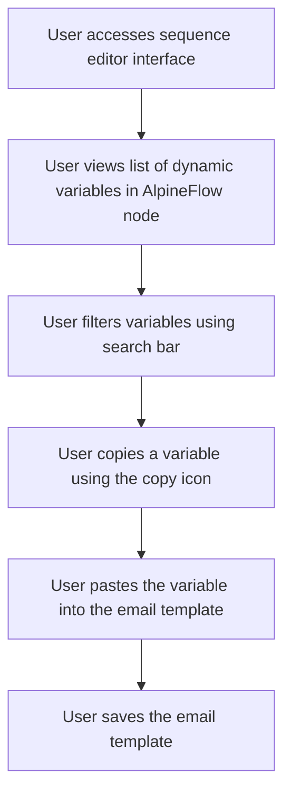

# US001 - Afficher et Utiliser des Variables Dynamiques

## Description
En tant qu'utilisateur, je veux afficher et utiliser des variables dynamiques pour personnaliser mes emails.

## Préconditions
- L'utilisateur est connecté.
- L'utilisateur a accès à l'interface editor de la séquence.

## Scénario Principal
1. L'utilisateur accède à l'interface editor de la séquence.
2. Dans le nœud AlpineFlow dédié aux emails, l'utilisateur voit une liste de toutes les variables dynamiques disponibles issues du fichier `variables.json`.
3. Chaque variable est accompagnée d'une icône de copie qui permet de copier la variable au format `[[variable]]`.
4. Une barre de filtre est disponible pour aider à la navigation et à la recherche de variables spécifiques.
5. L'utilisateur peut copier une variable et l'insérer dans le template d'email.

## Scénario Alternatif
- **Aucune Variable Disponible** : Si aucune variable n'est disponible, le système affiche un message informatif et propose de créer des variables.

## Postconditions
- Les variables sont accessibles et utilisables dans les templates d'emails.
- L'utilisateur peut facilement personnaliser ses emails avec les variables dynamiques.

## Notes
- Les variables doivent être bien documentées pour une utilisation facile.
- Les variables sont gérées via le fichier `variables.json`.

## User Flow Diagram


## Wireframes

### Écran Interface de l'Éditeur de Séquence
```
┌───────────────────────────────────────────────────────────────────────────────┐
│                                                                           │
│                                                                               │
│  Modifier la Séquence                                                        │
│  Modifier les templates d'emails et configurer les délais                     │
│                                                                               │
│  ┌─────────────────────────────────────────────────────────────────────────┐  │
│  │  Canvas: Zone de glisser-déposer pour les templates d'emails et les nœuds │  │
│  │  filtres                                                                  │  │
│  └─────────────────────────────────────────────────────────────────────────┘  │
│                                                                               │
│  Barre latérale: Liste des templates d'emails et des nœuds filtres disponibles │
│                                                                               │
│  [Sauvegarder les Changements]  [Annuler]                                     │
│                                                                               │
│                                                                           │
└───────────────────────────────────────────────────────────────────────────────┘
```

### Écran Panneau des Variables Dynamiques

```
┌───────────────────────────────────────────────────────────────────────────────┐
│                                                                           │
│                                                                               │
│  Variables Dynamiques                                                       │
│  Utilisez des variables dynamiques pour personnaliser vos emails              │
│                                                                               │
│  [Rechercher des variables...]                                               │
│                                                                               │
│  ┌─────────────────────────────────────────────────────────────────────────┐  │
│  │  Variable 1                                                               │  │
│  │  Description de la variable 1                                            │  │
│  │                                                                       [📋] │  │
│  ├─────────────────────────────────────────────────────────────────────────┤  │
│  │  Variable 2                                                               │  │
│  │  Description de la variable 2                                            │  │
│  │                                                                       [📋] │  │
│  └─────────────────────────────────────────────────────────────────────────┘  │
│                                                                               │
│  [Ajouter une Nouvelle Variable]  [Fermer]                                  │
│                                                                               │
│                                                                           │
└───────────────────────────────────────────────────────────────────────────────┘
```

### Écran Éditeur de Template d'Email
```
┌───────────────────────────────────────────────────────────────────────────────┐
│                                                                           │
│                                                                               │
│  Modifier le Template d'Email                                                 │
│  Modifier le template d'email en utilisant des variables dynamiques          │
│                                                                               │
│  Objet : [________________________________________________________________]   │
│  CC : [__________________________________________________________________]   │
│  Profil SMTP : [_______________________________________________________]   │
│  Délai : [____] jours                                                         │
│                                                                               │
│  Barre d'outils: Options de formatage (gras, italique, etc.)                 │
│  Zone d'édition: Éditeur de texte riche pour le contenu de l'email          │
│  Panneau des Variables: Liste des variables dynamiques (barre latérale droite)│
│                                                                               │
│  [Sauvegarder le Template]  [Annuler]                                         │
│                                                                               │
│                                                                           │
└───────────────────────────────────────────────────────────────────────────────┘
```


┌───────────────────────────────────────────────────────────────────────────────┐
│                                                                           │
│                                                                               │
│  Aucune Variable Disponible                                                   │
│  Il n'y a aucune variable dynamique disponible                                │
│                                                                               │
│  Souhaitez-vous créer de nouvelles variables ?                               │
│                                                                               │
│  [Créer des Variables]  [Annuler]                                             │
│                                                                               │
│                                                                           │
└───────────────────────────────────────────────────────────────────────────────┘
```
