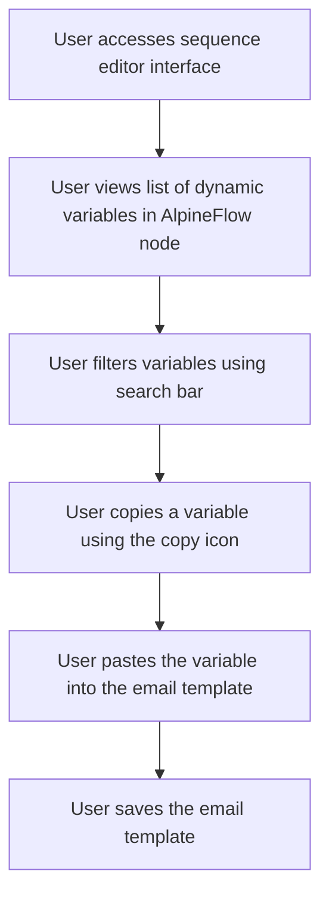

# Design: Display and Use Dynamic Variables

## Technical Approach
The display and use dynamic variables feature will allow users to view and utilize dynamic variables to personalize their emails. The system will provide a panel within the sequence editor interface to display all available dynamic variables from the `variables.json` file. Users can filter, copy, and insert these variables into their email templates. The frontend will use Alpine.js for reactivity and state management, while the backend will handle data retrieval via Flask.

## Architecture Decisions

### Decision: Use Alpine.js for Frontend Reactivity
- **Description**: Alpine.js will manage the state and reactivity of the dynamic variables panel and email template editor.
- **Rationale**: Alpine.js is lightweight and integrates seamlessly with HTML, making it ideal for this use case.
- **Impact**: Simplifies frontend logic and improves user experience.

### Decision: Use Flask for Backend Processing
- **Description**: Flask will handle the retrieval of dynamic variables from the `variables.json` file.
- **Rationale**: Flask is lightweight and well-suited for handling HTTP requests and integrating with Parse.
- **Impact**: Ensures robust backend processing and easy integration with the database.

### Decision: Use `variables.json` for Variable Management
- **Description**: Dynamic variables will be managed via the `variables.json` file.
- **Rationale**: A JSON file provides a structured and easily maintainable way to manage variables.
- **Impact**: Ensures consistency and ease of management for dynamic variables.

### Decision: Provide Copy Functionality
- **Description**: Each variable will have a copy icon to allow users to easily copy the variable in the format `[[variable]]`.
- **Rationale**: Copy functionality simplifies the process of inserting variables into email templates.
- **Impact**: Improves user experience by reducing manual errors.

### Decision: Include Filter Bar
- **Description**: A filter bar will be provided to help users search for specific variables.
- **Rationale**: A filter bar enhances usability by allowing quick navigation through a potentially large list of variables.
- **Impact**: Improves user experience by making it easier to find and use variables.

## Data Flow


## Data Mapping

### JSON File: `variables.json`
- **Fields**:
  - `variables`: Array (list of dynamic variables).
    - `name`: String (variable name).
    - `description`: String (variable description).
    - `format`: String (variable format, e.g., `[[variable]]`).

### Alpine.js Store: `dynamicVariables`
- **Fields**:
  - `variables`: Array (list of dynamic variables).
  - `filteredVariables`: Array (list of filtered variables based on search input).
  - `searchQuery`: String (search query for filtering variables).
  - `errorMessage`: String (error message to display).
  - `successMessage`: String (success message to display).

### Data Flow
1. **Input Data**:
   - The system retrieves the list of dynamic variables from the `variables.json` file.
   - The variables are displayed in the dynamic variables panel within the sequence editor.

2. **Filtering**:
   - The user inputs a search query to filter the list of variables.
   - The system updates the `filteredVariables` array based on the search query.

3. **Copying Variables**:
   - The user clicks the copy icon next to a variable to copy it in the format `[[variable]]`.
   - The variable is copied to the clipboard for pasting into the email template.

4. **Inserting Variables**:
   - The user pastes the copied variable into the email template.
   - The system validates that the variable is correctly formatted.

5. **Saving Template**:
   - The user saves the email template with the inserted variables.
   - The system saves the template to the `Sequences` class in Parse.

## Screen ASCII

### Screen 1: Sequence Editor Interface
```
┌───────────────────────────────────────────────────────────────────────────────┐
│                                                                           │
│                                                                               │
│  Edit Sequence                                                                │
│  Edit email templates and configure delays                                   │
│                                                                               │
│  ┌─────────────────────────────────────────────────────────────────────────┐  │
│  │  Canvas: Drag-and-drop area for email templates and filter nodes        │  │
│  └─────────────────────────────────────────────────────────────────────────┘  │
│                                                                               │
│  Sidebar: List of available email templates and filter nodes                 │
│                                                                               │
│  [Save Changes]  [Cancel]                                                     │
│                                                                               │
│                                                                           │
└───────────────────────────────────────────────────────────────────────────────┘
```

### Screen 2: Dynamic Variables Panel
```
┌───────────────────────────────────────────────────────────────────────────────┐
│                                                                           │
│                                                                               │
│  Dynamic Variables                                                           │
│  Use dynamic variables to personalize your emails                            │
│                                                                               │
│  [Search for variables...]                                                  │
│                                                                               │
│  ┌─────────────────────────────────────────────────────────────────────────┐  │
│  │  Variable 1                                                                 │  │
│  │  Description of variable 1                                                  │  │
│  │                                                                       [📋] │  │
│  ├─────────────────────────────────────────────────────────────────────────┤  │
│  │  Variable 2                                                                 │  │
│  │  Description of variable 2                                                  │  │
│  │                                                                       [📋] │  │
│  └─────────────────────────────────────────────────────────────────────────┘  │
│                                                                               │
│  [Add New Variable]  [Close]                                                  │
│                                                                               │
│                                                                           │
└───────────────────────────────────────────────────────────────────────────────┘
```

### Screen 3: Email Template Editor
```
┌───────────────────────────────────────────────────────────────────────────────┐
│                                                                           │
│                                                                               │
│  Edit Email Template                                                          │
│  Edit the email template using dynamic variables                              │
│                                                                               │
│  Subject: [________________________________________________________________]   │
│  CC: [__________________________________________________________________]       │
│  SMTP Profile: [_______________________________________________________]       │
│  Delay: [____] days                                                           │
│                                                                               │
│  Toolbar: Formatting options (bold, italic, etc.)                             │
│  Editing Area: Rich text editor for email content                             │
│  Variables Panel: List of dynamic variables (right sidebar)                  │
│                                                                               │
│  [Save Template]  [Cancel]                                                   │
│                                                                               │
│                                                                           │
└───────────────────────────────────────────────────────────────────────────────┘
```

### Screen 4: No Variables Available
```
┌───────────────────────────────────────────────────────────────────────────────┐
│                                                                           │
│                                                                               │
│  No Variables Available                                                      │
│  There are no dynamic variables available                                     │
│                                                                               │
│  Would you like to create new variables?                                     │
│                                                                               │
│  [Create Variables]  [Cancel]                                                 │
│                                                                               │
│                                                                           │
└───────────────────────────────────────────────────────────────────────────────┘
```

## Components and Layouts

### Components/Partials Usage

#### Sequence Editor Component
- **File**: `/templates/partials/sequence_editor_component.html`
- **Role**: Handles the editing of a sequence, including accessing the dynamic variables panel.
- **Dependencies**:
  - `dynamicVariables` store for managing state.
  - `axiosParse` for API calls to Parse.

#### Dynamic Variables Panel Component
- **File**: `/templates/partials/dynamic_variables_panel_component.html`
- **Role**: Displays the list of dynamic variables and provides filtering and copying functionality.
- **Dependencies**:
  - `dynamicVariables` store for managing state.

#### Email Template Editor Component
- **File**: `/templates/partials/email_template_editor_component.html`
- **Role**: Handles the editing of email templates, including inserting dynamic variables.
- **Dependencies**:
  - `dynamicVariables` store for managing state.
  - `Toast Editor UI` for rich text editing.

#### No Variables Available Component
- **File**: `/templates/partials/no_variables_available_component.html`
- **Role**: Displays a message when no dynamic variables are available and provides an option to create new variables.
- **Dependencies**:
  - `dynamicVariables` store for managing state.

### Layouts

#### Base Layout
- **File**: `/templates/layouts/base_layout.html`
- **Role**: Provides the basic structure for all pages, including the header, footer, and main content area.

#### Dashboard Layout
- **File**: `/templates/layouts/dashboard_layout.html`
- **Role**: Provides the structure for dashboard pages, including the header, sidebar, and main content area.
- **Components Used**:
  - `sidebarComponent`

## Data Parse Changes

### File: `variables.json`
- **Changes**: No changes required.

## File Changes

### New Files
- `/templates/partials/sequence_editor_component.html`: Component for editing sequences.
- `/templates/partials/dynamic_variables_panel_component.html`: Component for displaying dynamic variables.
- `/templates/partials/email_template_editor_component.html`: Component for editing email templates.
- `/templates/partials/no_variables_available_component.html`: Component for displaying messages when no variables are available.
- `/static/js/stores/dynamicVariablesStore.js`: Alpine.js store for managing dynamic variables state.

### Modified Files
- `/templates/layouts/base_layout.html`: Include the sequence editor component.
- `/templates/layouts/dashboard_layout.html`: Include the dynamic variables panel component.

## Verification
Ensure the output file is created in the correct folder with the specified structure.