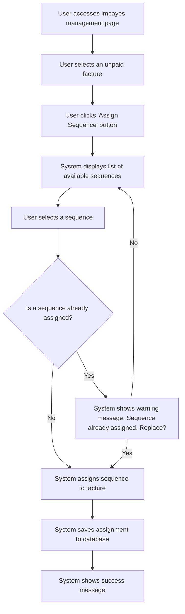

# US001 - Attribuer une Séquence à une Facture

## Description
En tant qu'utilisateur, je veux attribuer une séquence à une facture individuelle.

## Préconditions
- L'utilisateur est connecté.
- Une séquence d'emails existe.
- Une facture impayée existe.

## Scénario Principal
1. L'utilisateur accède à la page de gestion des impayés.
2. L'utilisateur sélectionne une facture impayée.
3. L'utilisateur clique sur le bouton 'Attribuer une séquence'.
4. Le système affiche une liste des séquences disponibles.
5. L'utilisateur sélectionne une séquence.
6. Le système attribue la séquence à la facture.
7. Le système enregistre l'attribution dans la base de données.
8. Le système affiche un message de succès.

## Scénario Alternatif
- **Séquence Déjà Attribuée** : Si la facture a déjà une séquence attribuée, le système affiche un message d'avertissement et demande à l'utilisateur de confirmer le remplacement.

## Postconditions
- La séquence est attribuée à la facture.
- L'attribution est enregistrée dans la base de données.

## Notes
- Les attributions doivent être enregistrées dans la classe `Impayes`.
- Les séquences attribuées doivent être visibles dans l'interface utilisateur.

## User Flow Diagram


## Wireframes

### Écran Impayes Management Page
```
+-----------------------------------------------------+
| Gestion des Impayés                                  |
+-----------------------------------------------------+
|                                                     |
| [Par Acteur] [Par Payeur] [Par Factures]            |
|                                                     |
| Factures Impayées                                   |
| Gérer vos factures impayées                         |
|                                                     |
| Numéro | Date | Montant | Statut | Actions         |
| FACT001 | 01/01 | 1000€   | ⚠️ Sans Séquence | [Attribuer]     |
| FACT002 | 02/01 | 1500€   | Impayé | [Attribuer]     |
|                                                     |
| [Précédent] [1] [2] [3] [Suivant]                  |
|                                                     |
+-----------------------------------------------------+
```

### Écran Assign Sequence
```
+-----------------------------------------------------+
| Attribuer une Séquence                              |
+-----------------------------------------------------+
|                                                     |
| Sélectionnez une séquence à attribuer à la facture  |
|                                                     |
| [ ] Séquence 1                                      |
| [ ] Séquence 2                                      |
| [ ] Séquence 3                                      |
|                                                     |
| [Attribuer] [Annuler]                                |
|                                                     |
+-----------------------------------------------------+
```

### Écran Warning Message
```
+-----------------------------------------------------+
| Avertissement                                        |
+-----------------------------------------------------+
|                                                     |
| Séquence déjà attribuée                             |
|                                                     |
| Cette facture a déjà une séquence attribuée.        |
| Souhaitez-vous la remplacer ?                      |
|                                                     |
| [Remplacer] [Annuler]                               |
|                                                     |
+-----------------------------------------------------+
```

### Écran Success Message
```
+-----------------------------------------------------+
| Séquence Attribuée                                   |
+-----------------------------------------------------+
|                                                     |
| La séquence a été attribuée avec succès             |
|                                                     |
| La séquence 'Nom de la Séquence' a été attribuée à  |
| la facture.                                          |
|                                                     |
| [Voir les Factures] [Attribuer une Autre]            |
|                                                     |
+-----------------------------------------------------+
```


