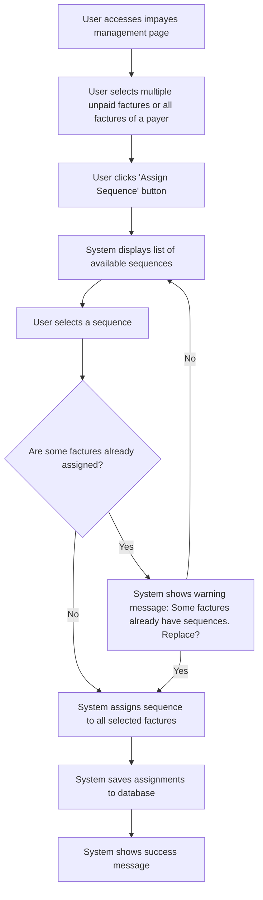

# US002 - Attribuer une Séquence à Plusieurs Factures

## Description
En tant qu'utilisateur, je veux attribuer une séquence à plusieurs factures en même temps.

## Préconditions
- L'utilisateur est conn@assecté.
- Une séquence d'emails existe.
- Plusieurs factures impayées existent.

## Scénario Principal
1. L'utilisateur accède à la page de gestion des impayés.
2. L'utilisateur sélectionne plusieurs factures impayées ou sélectionne tous les impayés d'un payeur.
3. L'utilisateur clique sur le bouton 'Attribuer une séquence'.
4. Le système affiche une liste des séquences disponibles.
5. L'utilisateur sélectionne une séquence.
6. Le système attribue la séquence à toutes les factures sélectionnées.
7. Le système enregistre les attributions dans la base de données.
8. Le système affiche un message de succès.

## Scénario Alternatif
- **Factures Sans Séquence** : Si certaines factures ont déjà une séquence attribuée, le système affiche un message d'avertissement et demande à l'utilisateur de confirmer le remplacement.

## Postconditions
- La séquence est attribuée à toutes les factures sélectionnées.
- Les attributions sont enregistrées dans la base de données.

## Notes
- Les attributions doivent être enregistrées dans la classe `Impayes`.
- Les séquences attribuées doivent être visibles dans l'interface utilisateur.
- Il faut rajouter le cas où l'on sélectionne tous les impayés d'un payeur.

## User Flow Diagram


## Wireframes

### Écran Impayes Management Page
```
+-----------------------------------------------------+
| Gestion des Impayés                                  |
+-----------------------------------------------------+
|                                                     |
| [Par Acteur] [Par Payeur] [Par Factures]            |
|                                                     |
| Factures Impayées                                   |
| Gérer vos factures impayées                         |
|                                                     |
| [Tout Sélectionner]                                 |
|                                                     |
| Payeur1                                             |
| [ ] FACT001 | 01/01 | 1000€ | Impayé            |
| [ ] FACT002 | 02/01 | 1500€ | Impayé            |
|                                                     |
| Payeur2                                             |
| [ ] FACT003 | 03/01 | 2000€ | Impayé            |
|                                                     |
| [Attribuer une Séquence]                            |
|                                                     |
| [Précédent] [1] [2] [3] [Suivant]                  |
|                                                     |
+-----------------------------------------------------+
```


### Écran Assign Sequence
```
+-----------------------------------------------------+
| Attribuer une Séquence                              |
+-----------------------------------------------------+
|                                                     |
| Sélectionnez une séquence à attribuer aux factures  |
| sélectionnées                                       |
|                                                     |
| [ ] Séquence 1                                      |
| [ ] Séquence 2                                      |
| [ ] Séquence 3                                      |
|                                                     |
| [Attribuer] [Annuler]                                |
|                                                     |
+-----------------------------------------------------+
```

### Écran Warning Message
```
+-----------------------------------------------------+
| Avertissement                                        |
+-----------------------------------------------------+
|                                                     |
| Certaines factures ont déjà des séquences           |
|                                                     |
| Factures concernées :                               |
| - FACT001                                            |
| - FACT002                                            |
|                                                     |
| Souhaitez-vous les remplacer ?                       |
|                                                     |
| [Remplacer] [Annuler]                               |
|                                                     |
+-----------------------------------------------------+
```

### Écran Success Message
```
+-----------------------------------------------------+
| Séquence Attribuée                                   |
+-----------------------------------------------------+
|                                                     |
| La séquence a été attribuée avec succès             |
|                                                     |
| La séquence 'Nom de la Séquence' a été attribuée à  |
| X factures.                                          |
|                                                     |
| [Voir les Factures] [Attribuer une Autre]            |
|                                                     |
+-----------------------------------------------------+
```