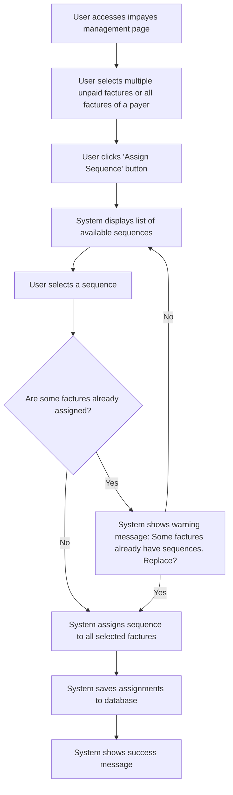

# Design: Assign Sequence to Multiple Invoices

## Technical Approach
The assign sequence to multiple invoices feature will allow users to assign an email sequence to multiple unpaid invoices simultaneously. The system will provide a list of available sequences, allow the user to select one, and save the assignments to the database. The frontend will use Alpine.js for reactivity and state management, while the backend will handle data storage via Flask.

## Architecture Decisions

### Decision: Use Alpine.js for Frontend Reactivity
- **Description**: Alpine.js will manage the state and reactivity of the sequence assignment process for multiple invoices.
- **Rationale**: Alpine.js is lightweight and integrates seamlessly with HTML, making it ideal for this use case.
- **Impact**: Simplifies frontend logic and improves user experience.

### Decision: Use Flask for Backend Processing
- **Description**: Flask will handle the sequence assignment and data storage operations for multiple invoices.
- **Rationale**: Flask is lightweight and well-suited for handling HTTP requests and integrating with Parse.
- **Impact**: Ensures robust backend processing and easy integration with the database.

### Decision: Store Assignments in Parse
- **Description**: Sequence assignments will be stored in the `Impayes` class in Parse.
- **Rationale**: Parse provides a scalable and managed database solution.
- **Impact**: Ensures data consistency and scalability.

### Decision: Warn on Existing Assignments
- **Description**: The system will warn the user if some invoices already have sequences assigned.
- **Rationale**: This prevents accidental overwrites and ensures user awareness.
- **Impact**: Improves user experience by providing clear feedback.

## Data Flow


## Data Mapping

### Parse Class: `Impayes`
- **Fields**:
  - `numero_facture`: String (invoice number).
  - `date`: Date (invoice date).
  - `montant`: Number (invoice amount).
  - `statut`: String (invoice status).
  - `sequence`: Pointer (pointer to the assigned sequence in the `Sequences` class).

### Parse Class: `Sequences`
- **Fields**:
  - `nom`: String (sequence name).
  - `description`: String (sequence description).
  - `statut`: String (sequence status: draft or published).

### Alpine.js Store: `sequenceGroupAssignment`
- **Fields**:
  - `selectedInvoices`: Array (list of selected unpaid invoices).
  - `availableSequences`: Array (list of available sequences).
  - `selectedSequence`: Object (selected sequence for assignment).
  - `warningMessage`: String (warning message to display).
  - `errorMessage`: String (error message to display).
  - `successMessage`: String (success message to display).

### Data Flow
1. **Input Data**:
   - The user selects multiple unpaid invoices from the `Impayes` class.
   - The system retrieves the list of available sequences from the `Sequences` class.

2. **Sequence Selection**:
   - The user selects a sequence from the list of available sequences.

3. **Assignment Check**:
   - The system checks if any of the selected invoices already have sequences assigned.
   - If some invoices already have sequences assigned, the system displays a warning message.

4. **Assignment**:
   - The system assigns the selected sequence to all selected invoices.
   - The system saves the assignments to the `Impayes` class in Parse.

5. **Success Handling**:
   - If the assignments are successful, the system displays a success message.

## Screen ASCII

### Screen 1: Unpaid Invoices Management Page
```
┌───────────────────────────────────────────────────────────────────────────────┐
│                                                                           │
│                                                                               │
│  Unpaid Invoices Management                                                  │
│  Manage your unpaid invoices                                                │
│                                                                               │
│  [By Actor] [By Payer] [By Invoices]                                        │
│                                                                               │
│  Unpaid Invoices                                                             │
│  Manage your unpaid invoices                                                │
│                                                                               │
│  [Select All]                                                               │
│                                                                               │
│  Payer1                                                                     │
│  [ ] INV001  │  01/01  │  1000€  │  Unpaid                                  │
│  [ ] INV002  │  02/01  │  1500€  │  Unpaid                                  │
│                                                                               │
│  Payer2                                                                     │
│  [ ] INV003  │  03/01  │  2000€  │  Unpaid                                  │
│                                                                               │
│  [Assign Sequence]                                                          │
│                                                                               │
│  [Previous]  [1]  [2]  [3]  [Next]                                          │
│                                                                               │
│                                                                           │
└───────────────────────────────────────────────────────────────────────────────┘
```

### Screen 2: Assign Sequence
```
┌───────────────────────────────────────────────────────────────────────────────┐
│                                                                           │
│                                                                               │
│  Assign Sequence                                                            │
│  Select a sequence to assign to the selected invoices                        │
│                                                                               │
│  ( ) Sequence 1                                                              │
│  ( ) Sequence 2                                                              │
│  ( ) Sequence 3                                                              │
│                                                                               │
│  [Assign]  [Cancel]                                                          │
│                                                                               │
│                                                                           │
└───────────────────────────────────────────────────────────────────────────────┘
```

### Screen 3: Warning Message
```
┌───────────────────────────────────────────────────────────────────────────────┐
│                                                                           │
│                                                                               │
│  Warning                                                                      │
│  Some Invoices Already Have Sequences                                        │
│                                                                               │
│  Affected Invoices:                                                          │
│  - INV001                                                                     │
│  - INV002                                                                     │
│                                                                               │
│  Would you like to replace them?                                              │
│                                                                               │
│  [Replace]  [Cancel]                                                          │
│                                                                               │
│                                                                           │
└───────────────────────────────────────────────────────────────────────────────┘
```

### Screen 4: Success Message
```
┌───────────────────────────────────────────────────────────────────────────────┐
│                                                                           │
│                                                                               │
│  Sequence Assigned                                                           │
│  The sequence has been assigned successfully                                 │
│                                                                               │
│  The sequence 'Sequence Name' has been assigned to X invoices.                │
│                                                                               │
│  [View Invoices]  [Assign Another]                                           │
│                                                                               │
│                                                                           │
└───────────────────────────────────────────────────────────────────────────────┘
```

## Components and Layouts

### Components/Partials Usage

#### Unpaid Invoices Management Component
- **File**: `/templates/partials/unpaid_invoices_management_component.html`
- **Role**: Displays the list of unpaid invoices and provides options to assign sequences to multiple invoices.
- **Dependencies**:
  - `sequenceGroupAssignment` store for managing state.
  - `axiosParse` for API calls to Parse.

#### Assign Sequence Component
- **File**: `/templates/partials/assign_sequence_component.html`
- **Role**: Handles the assignment of a sequence to multiple invoices.
- **Dependencies**:
  - `sequenceGroupAssignment` store for managing state.

#### Warning Message Component
- **File**: `/templates/partials/warning_message_component.html`
- **Role**: Displays a warning message if some invoices already have sequences assigned.
- **Dependencies**:
  - `sequenceGroupAssignment` store for managing state.

#### Success Message Component
- **File**: `/templates/partials/success_message_component.html`
- **Role**: Displays a success message after sequences are assigned to multiple invoices.
- **Dependencies**:
  - `sequenceGroupAssignment` store for managing state.

### Layouts

#### Base Layout
- **File**: `/templates/layouts/base_layout.html`
- **Role**: Provides the basic structure for all pages, including the header, footer, and main content area.

#### Dashboard Layout
- **File**: `/templates/layouts/dashboard_layout.html`
- **Role**: Provides the structure for dashboard pages, including the header, sidebar, and main content area.
- **Components Used**:
  - `sidebarComponent`

## Data Parse Changes

### Class: `Impayes`
- **New Field**:
  - `sequence`: Pointer (pointer to the assigned sequence in the `Sequences` class).

### Class: `Sequences`
- **Changes**: No changes required.

## File Changes

### New Files
- `/templates/partials/unpaid_invoices_management_component.html`: Component for managing unpaid invoices.
- `/templates/partials/assign_sequence_component.html`: Component for assigning sequences to multiple invoices.
- `/templates/partials/warning_message_component.html`: Component for displaying warning messages.
- `/templates/partials/success_message_component.html`: Component for displaying success messages.
- `/static/js/stores/sequenceGroupAssignmentStore.js`: Alpine.js store for managing sequence group assignment state.

### Modified Files
- `/templates/layouts/base_layout.html`: Include the unpaid invoices management component.
- `/templates/layouts/dashboard_layout.html`: Include the assign sequence component.

## Verification
Ensure the output file is created in the correct folder with the specified structure.