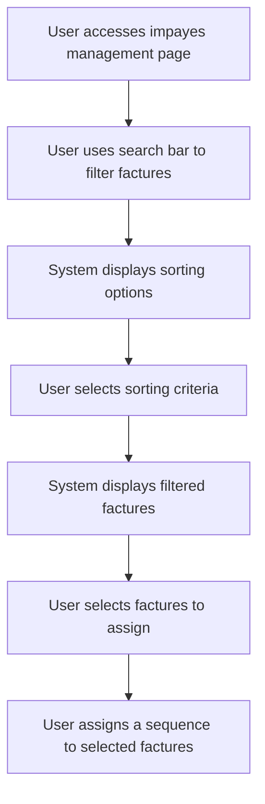

# US003 - Filtrer les Factures pour une Attribution Groupée

## Description
En tant qu'utilisateur, je veux filtrer les factures pour une attribution groupée.

## Préconditions
- L'utilisateur est connecté.
- Plusieurs factures impayées existent.

## Scénario Principal
1. L'utilisateur accède à la page de gestion des impayés.
2. L'utilisateur utilise la barre de recherche pour filtrer les factures.
3. Le système affiche les options de tri :
   - Par contact
   - Par montant
   - Par date
   - Par statut
4. L'utilisateur sélectionne les critères de tri (ascendant ou descendant).
5. Le système affiche les factures correspondant aux critères.
6. L'utilisateur sélectionne les factures à attribuer.
7. L'utilisateur attribue une séquence aux factures sélectionnées.

## Scénario Alternatif
- **Aucune Facture Trouvée** : Si aucune facture ne correspond aux critères, le système affiche un message d'information.

## Postconditions
- Les factures sont filtrées et affichées.
- L'utilisateur peut attribuer une séquence aux factures filtrées.

## Notes
- Les filtres doivent être configurables et flexibles.
- Les factures filtrées doivent être facilement sélectionnables pour une attribution groupée.

## User Flow Diagram


## Wireframes

### Écran Impayes Management Page
```
+-----------------------------------------------------+
| Gestion des Impayés                                  |
+-----------------------------------------------------+
|                                                     |
| [Par Acteur] [Par Payeur] [Par Factures]            |
|                                                     |
| Factures Impayées                                   |
| Gérer vos factures impayées                         |
|                                                     |
| [Rechercher des factures...]                        |
|                                                     |
| Trier par : [Contact] [Montant] [Date] [Statut]     |
| Ordre : [Ascendant] [Descendant]                    |
| [Appliquer les Filtres]                             |
|                                                     |
| Sélectionner | Numéro | Date | Montant | Statut | Contact |
| [ ] | FACT001 | 01/01 | 1000€ | Impayé | Contact1 |
| [ ] | FACT002 | 02/01 | 1500€ | Impayé | Contact2 |
|                                                     |
| [Attribuer une Séquence]                            |
|                                                     |
| [Précédent] [1] [2] [3] [Suivant]                  |
|                                                     |
+-----------------------------------------------------+
```

### Écran No Invoices Found
```
+-----------------------------------------------------+
| Aucune Facture Trouvée                              |
+-----------------------------------------------------+
|                                                     |
| Aucune facture ne correspond à vos critères de      |
| recherche                                           |
|                                                     |
| Essayez d'ajuster votre recherche ou vos filtres.   |
|                                                     |
| [Effacer les Filtres] [Retour aux Factures]         |
|                                                     |
+-----------------------------------------------------+
```

### Écran Assign Sequence
```
+-----------------------------------------------------+
| Attribuer une Séquence                              |
+-----------------------------------------------------+
|                                                     |
| Sélectionnez une séquence à attribuer aux factures  |
| sélectionnées                                       |
|                                                     |
| [ ] Séquence 1                                      |
| [ ] Séquence 2                                      |
| [ ] Séquence 3                                      |
|                                                     |
| [Attribuer] [Annuler]                                |
|                                                     |
+-----------------------------------------------------+
```

### Écran Success Message
```
+-----------------------------------------------------+
| Séquence Attribuée                                   |
+-----------------------------------------------------+
|                                                     |
| La séquence a été attribuée avec succès             |
|                                                     |
| La séquence 'Nom de la Séquence' a été attribuée à  |
| X factures.                                          |
|                                                     |
| [Voir les Factures] [Attribuer une Autre]            |
|                                                     |
+-----------------------------------------------------+
```
