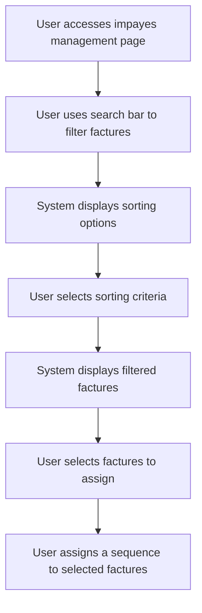

# Design: Filter Invoices for Group Assignment

## Technical Approach
The filter invoices for group assignment feature will allow users to filter and sort unpaid invoices for group sequence assignment. The system will provide search and sorting options, display the filtered invoices, and allow the user to select and assign a sequence to the filtered invoices. The frontend will use Alpine.js for reactivity and state management, while the backend will handle data retrieval and filtering via Flask.

## Architecture Decisions

### Decision: Use Alpine.js for Frontend Reactivity
- **Description**: Alpine.js will manage the state and reactivity of the invoice filtering and group assignment process.
- **Rationale**: Alpine.js is lightweight and integrates seamlessly with HTML, making it ideal for this use case.
- **Impact**: Simplifies frontend logic and improves user experience.

### Decision: Use Flask for Backend Processing
- **Description**: Flask will handle the invoice filtering and data retrieval operations.
- **Rationale**: Flask is lightweight and well-suited for handling HTTP requests and integrating with Parse.
- **Impact**: Ensures robust backend processing and easy integration with the database.

### Decision: Provide Search and Sorting Options
- **Description**: The system will provide search and sorting options to filter invoices.
- **Rationale**: Search and sorting options enhance usability by allowing users to quickly find and organize invoices.
- **Impact**: Improves user experience by making it easier to filter and select invoices.

### Decision: Display Filtered Invoices
- **Description**: The system will display the filtered invoices in a list with selection options.
- **Rationale**: A clear display of filtered invoices ensures that users can easily select and assign sequences.
- **Impact**: Improves user experience by providing a clear and organized view of invoices.

## Data Flow


## Data Mapping

### Parse Class: `Impayes`
- **Fields**:
  - `numero_facture`: String (invoice number).
  - `date`: Date (invoice date).
  - `montant`: Number (invoice amount).
  - `statut`: String (invoice status).
  - `contact`: Pointer (pointer to the contact in the `Contacts` class).

### Parse Class: `Contacts`
- **Fields**:
  - `nom`: String (contact name).
  - `email`: String (contact email).
  - `telephone`: String (contact phone number).

### Alpine.js Store: `invoiceFiltering`
- **Fields**:
  - `searchQuery`: String (search query for filtering invoices).
  - `sortCriteria`: String (selected sorting criteria: contact, amount, date, status).
  - `sortOrder`: String (selected sorting order: ascending or descending).
  - `filteredInvoices`: Array (list of filtered invoices).
  - `selectedInvoices`: Array (list of selected invoices for assignment).
  - `errorMessage`: String (error message to display).
  - `successMessage`: String (success message to display).

### Data Flow
1. **Input Data**:
   - The user inputs a search query to filter invoices.
   - The system retrieves the list of invoices from the `Impayes` class.

2. **Filtering**:
   - The system filters the invoices based on the search query and selected sorting criteria.
   - The system updates the `filteredInvoices` array with the filtered results.

3. **Sorting**:
   - The user selects sorting criteria (contact, amount, date, status) and order (ascending or descending).
   - The system sorts the filtered invoices based on the selected criteria and order.

4. **Selection**:
   - The user selects invoices from the filtered list for sequence assignment.
   - The system updates the `selectedInvoices` array with the selected invoices.

5. **Assignment**:
   - The user assigns a sequence to the selected invoices.
   - The system saves the assignments to the `Impayes` class in Parse.

## Screen ASCII

### Screen 1: Unpaid Invoices Management Page
```
┌───────────────────────────────────────────────────────────────────────────────┐
│                                                                           │
│                                                                               │
│  Unpaid Invoices Management                                                  │
│  Manage your unpaid invoices                                                │
│                                                                               │
│  [By Actor] [By Payer] [By Invoices]                                        │
│                                                                               │
│  Unpaid Invoices                                                             │
│  Manage your unpaid invoices                                                │
│                                                                               │
│  [Search for invoices...]                                                    │
│                                                                               │
│  Sort by: [Contact] [Amount] [Date] [Status]                                  │
│  Order: [Ascending] [Descending]                                             │
│  [Apply Filters]                                                             │
│                                                                               │
│  Select  │  Number  │  Date  │  Amount  │  Status  │  Contact              │
│  [ ]     │  INV001  │  01/01  │  1000€  │  Unpaid  │  Contact1             │
│  [ ]     │  INV002  │  02/01  │  1500€  │  Unpaid  │  Contact2             │
│                                                                               │
│  [Assign Sequence]                                                          │
│                                                                               │
│  [Previous]  [1]  [2]  [3]  [Next]                                          │
│                                                                               │
│                                                                           │
└───────────────────────────────────────────────────────────────────────────────┘
```

### Screen 2: No Invoices Found
```
┌───────────────────────────────────────────────────────────────────────────────┐
│                                                                           │
│                                                                               │
│  No Invoices Found                                                           │
│  No invoices match your search criteria                                      │
│                                                                               │
│  Try adjusting your search or filters.                                       │
│                                                                               │
│  [Clear Filters]  [Back to Invoices]                                         │
│                                                                               │
│                                                                           │
└───────────────────────────────────────────────────────────────────────────────┘
```

### Screen 3: Assign Sequence
```
┌───────────────────────────────────────────────────────────────────────────────┐
│                                                                           │
│                                                                               │
│  Assign Sequence                                                            │
│  Select a sequence to assign to the selected invoices                        │
│                                                                               │
│  ( ) Sequence 1                                                              │
│  ( ) Sequence 2                                                              │
│  ( ) Sequence 3                                                              │
│                                                                               │
│  [Assign]  [Cancel]                                                          │
│                                                                               │
│                                                                           │
└───────────────────────────────────────────────────────────────────────────────┘
```

### Screen 4: Success Message
```
┌───────────────────────────────────────────────────────────────────────────────┐
│                                                                           │
│                                                                               │
│  Sequence Assigned                                                           │
│  The sequence has been assigned successfully                                 │
│                                                                               │
│  The sequence 'Sequence Name' has been assigned to X invoices.                │
│                                                                               │
│  [View Invoices]  [Assign Another]                                           │
│                                                                               │
│                                                                           │
└───────────────────────────────────────────────────────────────────────────────┘
```

## Components and Layouts

### Components/Partials Usage

#### Unpaid Invoices Management Component
- **File**: `/templates/partials/unpaid_invoices_management_component.html`
- **Role**: Displays the list of unpaid invoices and provides options to filter and assign sequences.
- **Dependencies**:
  - `invoiceFiltering` store for managing state.
  - `axiosParse` for API calls to Parse.

#### No Invoices Found Component
- **File**: `/templates/partials/no_invoices_found_component.html`
- **Role**: Displays a message when no invoices match the search criteria.
- **Dependencies**:
  - `invoiceFiltering` store for managing state.

#### Assign Sequence Component
- **File**: `/templates/partials/assign_sequence_component.html`
- **Role**: Handles the assignment of a sequence to the filtered invoices.
- **Dependencies**:
  - `invoiceFiltering` store for managing state.

#### Success Message Component
- **File**: `/templates/partials/success_message_component.html`
- **Role**: Displays a success message after sequences are assigned to the filtered invoices.
- **Dependencies**:
  - `invoiceFiltering` store for managing state.

### Layouts

#### Base Layout
- **File**: `/templates/layouts/base_layout.html`
- **Role**: Provides the basic structure for all pages, including the header, footer, and main content area.

#### Dashboard Layout
- **File**: `/templates/layouts/dashboard_layout.html`
- **Role**: Provides the structure for dashboard pages, including the header, sidebar, and main content area.
- **Components Used**:
  - `sidebarComponent`

## Data Parse Changes

### Class: `Impayes`
- **Changes**: No changes required.

### Class: `Contacts`
- **Changes**: No changes required.

## File Changes

### New Files
- `/templates/partials/unpaid_invoices_management_component.html`: Component for managing unpaid invoices.
- `/templates/partials/no_invoices_found_component.html`: Component for displaying messages when no invoices are found.
- `/templates/partials/assign_sequence_component.html`: Component for assigning sequences to filtered invoices.
- `/templates/partials/success_message_component.html`: Component for displaying success messages.
- `/static/js/stores/invoiceFilteringStore.js`: Alpine.js store for managing invoice filtering state.

### Modified Files
- `/templates/layouts/base_layout.html`: Include the unpaid invoices management component.
- `/templates/layouts/dashboard_layout.html`: Include the assign sequence component.

## Verification
Ensure the output file is created in the correct folder with the specified structure.